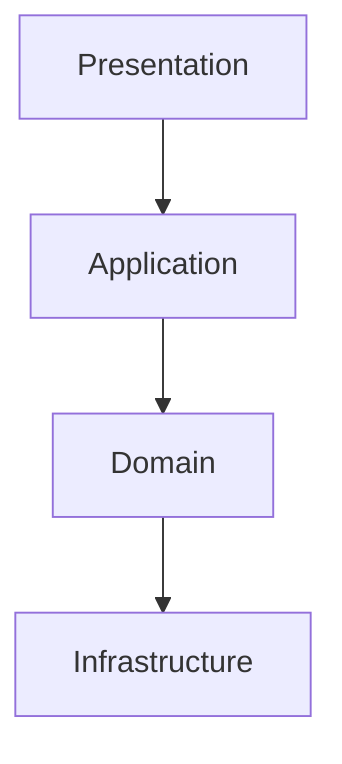
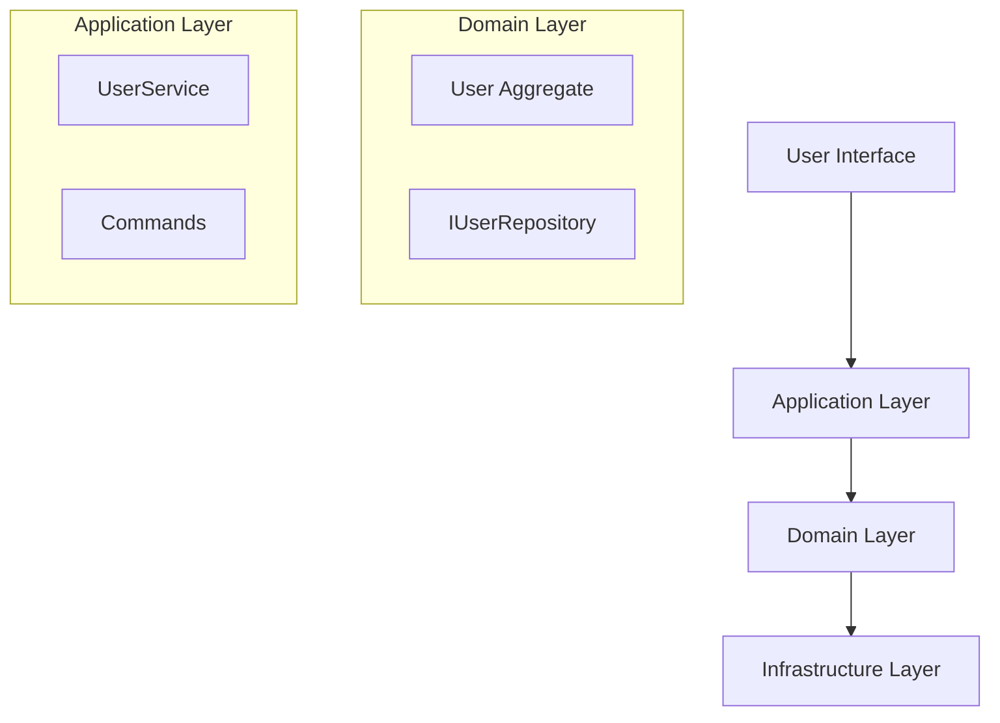

# #design Command

> Load this file when `#design` command is invoked.

---

## Purpose

Create system architecture design based on requirements analysis.

### Usage
- `#design` - Create architecture design
- `#design --plan` - Create design with implementation timeline

### Prerequisites
- Requirements analysis completed (`workspace/context/requirements.yaml` exists and is non-empty)
- Active pattern selected in `config.yaml`

## Prerequisites Check

| Check | Condition | On Failure |
|-------|-----------|------------|
| Requirements exist | `workspace/context/requirements.yaml` is non-empty | "No requirements found. Run `#analyze` first." |

---

## Execution Flow

**Step 1: Load Context**
- READ `workspace/context/requirements.yaml`
- READ `knowledge/patterns/{active}/overview.md`
- READ `workspace/context/project.yaml`

**Step 2: Identify Architectural Concerns**
- Scalability requirements
- Performance requirements
- Security requirements
- Integration requirements

**Step 3: Apply Architecture Pattern**
- Map requirements to pattern concepts
- Define module boundaries
- Identify key abstractions

**Step 4: Design Module Structure**
- Define modules and their responsibilities
- Define interfaces between modules
- Define dependency direction

**Step 5: Make Technical Decisions**
- Technology selection
- Data storage strategy
- Communication patterns
- Error handling strategy

**Step 6: Document Architecture**
- WRITE `workspace/context/architecture.yaml`
- WRITE `workspace/artifacts/{change-id}/design.md`
- UPDATE `session.yaml` history

**Step 7: Index Update**
- UPDATE `workspace/state/semantic-index.yaml` with new modules, decisions, keywords

---

## Output Structure

```markdown
## Architecture Design: {Feature/Module Name}

### Architecture Overview
{High-level description of the architecture approach}

### Architecture Diagram


### Module Structure
| Module | Purpose | Dependencies |
|--------|---------|--------------|
| {module} | {purpose} | {dependencies} |

### Key Components
| Component | Responsibility | Layer | File |
|-----------|---------------|-------|------|
| {component} | {responsibility} | {layer} | {file} |

### Interface Definitions
```typescript
interface I{InterfaceName} {
  // methods
}
```

### Technical Decisions (ADR)
| # | Decision | Choice | Rationale |
|---|----------|--------|-----------|
| 1 | {decision} | {choice} | {rationale} |

### Implementation Guidelines
- {guideline_1}
- {guideline_2}

### Implementation Plan (with --plan)
| Phase | Task | Dependencies | Complexity |
|-------|------|--------------|------------|
| 1 | {task} | - | {complexity} |

---
**Suggested Next Steps**:
- Review and confirm design
- `#implement` to start implementation
```

---

## Architecture Decision Record (ADR) Format

When documenting key decisions, use this format:

```markdown
## ADR-{number}: {Title}

### Status
Proposed | Accepted | Deprecated | Superseded

### Context
{Describe the context and problem statement}

### Decision
{Describe the decision made}

### Consequences
{Describe the consequences of the decision}

### Alternatives Considered
1. {Alternative 1}: {Why not chosen}
2. {Alternative 2}: {Why not chosen}
```

---

## Example 1: Designing a User Module

```
User: #design User Module

[Architect Mode]

## Architecture Design: User Module

### Architecture Overview
Design the user module using DDD tactical patterns. User serves as an aggregate root, containing two subdomains: authentication and profile.

### Architecture Diagram


### Module Structure
| Module | Purpose | Dependencies |
|--------|---------|--------------|
| domain/user | User aggregate and business rules | - |
| application/user | Use cases and application services | domain/user |
| infrastructure/persistence | Repository implementations | domain/user |

### Key Components
| Component | Responsibility | Layer |
|-----------|---------------|-------|
| User | Aggregate root, identity management | Domain |
| UserService | Application service, orchestration | Application |
| IUserRepository | Persistence interface | Domain |
| UserRepositoryImpl | Database operations | Infrastructure |

### Technical Decisions (ADR)
| # | Decision | Choice | Rationale |
|---|----------|--------|-----------|
| 1 | Authentication | JWT | Stateless, scalable |
| 2 | Password hashing | bcrypt | Industry standard |
| 3 | Validation | Domain validation in entity | DDD best practice |

### Interface Definitions
```typescript
// domain/user/IUserRepository.ts
interface IUserRepository {
  findById(id: UserId): Promise<User | null>;
  findByEmail(email: Email): Promise<User | null>;
  save(user: User): Promise<void>;
  delete(id: UserId): Promise<void>;
}
```

### Implementation Guidelines
- All business logic must be in the Domain layer
- Application layer only handles orchestration, no business rules
- Use Domain Events for inter-module communication

---
**Suggested Next Steps**:
- Confirm design decisions
- `#implement` to start coding
```

---

## Example 2: Design with Implementation Plan

```
User: #design --plan Order Module

[Architect Mode]

## Architecture Design: Order Module

### Architecture Overview
{... architecture details ...}

### Implementation Plan
| Phase | Task | Dependencies | Complexity | Est. Time |
|-------|------|--------------|------------|-----------|
| 1 | Create domain entities | - | Medium | 2h |
| 2 | Implement repository interfaces | Phase 1 | Low | 1h |
| 3 | Create application services | Phase 1 | Medium | 3h |
| 4 | Implement infrastructure | Phase 2-3 | Medium | 2h |
| 5 | Add API endpoints | Phase 3-4 | Low | 2h |

**Total Estimated: 10 hours**

### Risk Areas
- Order status state machine complexity
- Concurrent order processing
- Payment integration

---
**Suggested Next Steps**:
- Confirm plan
- `#implement` to start with Phase 1
```

---

## Example 3: Trade-off Documentation

```
User: #design Payment Module
Note: Need to support multiple payment methods

[Architect Mode]

## Architecture Design: Payment Module

### Trade-off Analysis

**Decision: Payment Gateway Abstraction**

| Option | Pros | Cons |
|--------|------|------|
| A: Direct Integration | Simple, fast | Vendor lock-in |
| B: Gateway Abstraction | Flexible, extensible | More complex |

**Recommendation**: Option B - Gateway Abstraction

**Rationale**:
- Business requirement to support multiple payment methods
- Future expansion to international markets
- Compliance requirements vary by region

### Gateway Interface Design
```typescript
interface IPaymentGateway {
  processPayment(order: Order, method: PaymentMethod): Promise<PaymentResult>;
  refund(transactionId: string): Promise<RefundResult>;
  getTransactionStatus(transactionId: string): Promise<TransactionStatus>;
}
```

---
**Suggested Next Steps**:
- Confirm architecture
- `#implement` to start implementation
```
