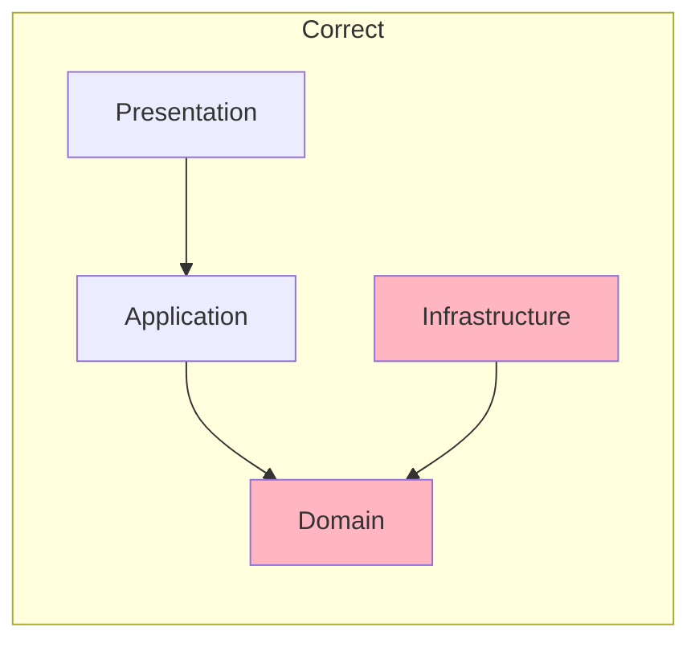

# #review Command

> Load this file when `#review` command is invoked.

---

## Purpose

Perform code review for quality, standards compliance, and best practices.

### Knowledge Dependencies

Before executing review, load the following (if they exist):

| Path | Description |
|------|-------------|
| `knowledge/core/review-principles.md` | Universal review principles |
| `knowledge/principle/coding-standards.md` | Project coding standards |
| `knowledge/patterns/{active}/review-checklist.md` | Pattern-specific checklist |

> `{active}` refers to `pattern.active` in `config.yaml`

### Usage
- `#review` - General code review
- `#review --aspect {type}` - Focused review on specific aspect

### Aspect Options

| Aspect | Focus Areas |
|--------|-------------|
| `architecture` | Pattern compliance, module boundaries, dependency direction |
| `security` | Input validation, injection prevention, authentication |
| `performance` | N+1 queries, memory leaks, caching |
| `style` | Naming conventions, formatting, documentation |

---

## Prerequisites Check

| Check | Condition | On Failure |
|-------|-----------|------------|
| Code to review | Recent implementation files exist or user specified files | "No code to review. Run `#implement` first or specify files." |

---

## Execution Flow

**Step 1: Identify Review Target**
- Latest implementation files
- Files specified by user
- Files in current change

**Step 2: Load Context**
- READ target files
- READ `workspace/project-context.yaml`
- READ `knowledge/patterns/{active}/review-checklist.md` (if exists)

**Step 3: Analyze Code**
- Check architecture compliance
- Check code quality issues
- Check error handling
- Check edge cases
- Check readability

**Step 4: Compile Report**
- Categorize issues by severity
- Provide specific suggestions
- Highlight positive patterns

**Step 5: Update Workspace**
- WRITE `workspace/artifacts/{change-id}/review.md`
- UPDATE `session.yaml` history

---

## Severity Levels

| Level | Description | Action Required |
|-------|-------------|-----------------|
| **Critical** | Bugs, security issues, breaks functionality | Must fix before merge |
| **Warning** | Code quality issues, potential bugs | Should fix |
| **Suggestion** | Improvements, best practices | Nice to have |

---

## Output Structure

```markdown
## Code Review Report

### Summary
- **Overall Assessment**: Good / Needs Work / Critical Issues
- **Files Reviewed**: {count}
- **Critical Issues**: {count}
- **Warnings**: {count}
- **Suggestions**: {count}

### Critical Issues

#### C{N}: {Issue Title}
**File**: `{file}:{line}`
**Issue**: {description}
**Suggestion**: {fix_suggestion}

```typescript
// Current code
{problematic_code}

// Suggested fix
{suggested_code}
```

### Warnings

#### W{N}: {Issue Title}
**File**: `{file}:{line}`
**Issue**: {description}
**Suggestion**: {fix_suggestion}

### Suggestions

#### S{N}: {Suggestion Title}
**File**: `{file}`
**Suggestion**: {improvement}

### Highlights
- {positive_finding_1}
- {positive_finding_2}

---
**Suggested Next Steps**:
- `#fix` to address critical issues
- `#test` to add missing tests
```

---

## Review Checklist

### Architecture Compliance
- [ ] Follows established architecture pattern
- [ ] Correct layer assignment
- [ ] Proper dependency direction
- [ ] Module boundaries respected

### Code Quality
- [ ] Functions are small and focused
- [ ] Naming is clear and consistent
- [ ] No code duplication
- [ ] Proper error handling

### Security (when --aspect security)
- [ ] Input validation present
- [ ] No SQL injection vulnerabilities
- [ ] No XSS vulnerabilities
- [ ] Authentication/authorization correct

### Performance (when --aspect performance)
- [ ] No N+1 queries
- [ ] Appropriate data structures
- [ ] Caching where needed
- [ ] No memory leaks

---

## Example 1: General Code Review

```
User: #review

[Reviewer Mode]

## Code Review Report

### Summary
- **Overall Assessment**: Needs Work
- **Files Reviewed**: 3
- **Critical Issues**: 1
- **Warnings**: 2
- **Suggestions**: 3

### Critical Issues

#### C1: Missing Null Check
**File**: `src/application/AuthService.ts:25`
**Issue**: User object can be null, accessing properties without check
**Suggestion**: Add null check before accessing user properties

```typescript
// Current code
const user = await this.userRepo.findByEmail(email);
return user.name;  // Potential null reference

// Suggested fix
const user = await this.userRepo.findByEmail(email);
if (!user) {
  throw new UserNotFoundError(email);
}
return user.name;
```

### Warnings

#### W1: Missing Error Handling
**File**: `src/domain/User.ts:42`
**Issue**: No try-catch for async operation
**Suggestion**: Wrap in try-catch or let caller handle

#### W2: Magic Number
**File**: `src/domain/User.ts:15`
**Issue**: Hard-coded number `5` for max attempts
**Suggestion**: Extract to constant `MAX_LOGIN_ATTEMPTS = 5`

### Suggestions

#### S1: Use Early Return
**File**: `src/application/AuthService.ts`
**Suggestion**: Use early returns to reduce nesting

#### S2: Extract Method
**File**: `src/domain/User.ts:login`
**Suggestion**: Consider extracting password verification to separate method

### Highlights
- Good use of dependency injection in AuthService
- Clean separation of domain logic

---
**Suggested Next Steps**:
- `#fix` to address C1
- Re-run `#review` after fixes
```

---

## Example 2: Security-Focused Review

```
User: #review --aspect security

[Reviewer Mode]

## Security Review Report

### Summary
- **Overall Assessment**: Needs Work
- **Security Issues Found**: 2

### Critical Security Issues

#### C1: SQL Injection Vulnerability
**File**: `src/infrastructure/UserRepository.ts:35`
**Issue**: Direct string concatenation in query
**Risk**: High - Allows SQL injection attacks

```typescript
// Current code (VULNERABLE)
const query = `SELECT * FROM users WHERE email = '${email}'`;

// Suggested fix (Parameterized)
const query = 'SELECT * FROM users WHERE email = ?';
db.query(query, [email]);
```

#### C2: Password Logged in Plain Text
**File**: `src/application/AuthService.ts:18`
**Issue**: Password being logged
**Risk**: Medium - Sensitive data exposure

```typescript
// Current code (VULNERABLE)
console.log(`Login attempt for ${email} with password ${password}`);

// Suggested fix
console.log(`Login attempt for ${email}`);
```

### Security Recommendations
1. Use parameterized queries for all database operations
2. Never log sensitive data (passwords, tokens, PII)
3. Add rate limiting for login attempts
4. Consider adding CSRF protection

---
**Suggested Next Steps**:
- `#fix` to address security issues immediately
```

---

## Example 3: Architecture Review

```
User: #review --aspect architecture

[Reviewer Mode]

## Architecture Review Report

### Summary
- **Pattern**: DDD (Domain-Driven Design)
- **Compliance**: 85%

### Architecture Compliance

#### [x] Correct
- User aggregate root in domain layer
- Repository interface in domain layer
- Application service orchestration

#### [ ] Violations

**V1: Domain Logic in Application Layer**
**File**: `src/application/UserService.ts:45`
**Issue**: Business rule implemented in application service instead of domain

```typescript
// Current (Wrong layer)
// UserService.ts (Application Layer)
if (user.failedAttempts >= 5) {
  user.lock();
}

// Should be in User aggregate (Domain Layer)
// User.ts
canLogin(): boolean {
  return this.failedAttempts < MAX_LOGIN_ATTEMPTS;
}
```

**V2: Infrastructure Dependency in Domain**
**File**: `src/domain/User.ts:10`
**Issue**: Domain entity imports infrastructure logger
**Suggestion**: Use dependency injection for logging interface

### Dependency Direction



**Note**: Violation found at Domain <-- Infrastructure connection.

---
**Suggested Next Steps**:
- `#refactor` to move business logic to domain layer
```
