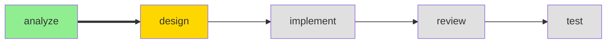

# #status Command

> Load this file when `#status` command is invoked.

---

## Purpose

Display current project and workflow status.

---

## Execution

1. READ `workspace/state/session.yaml`
2. READ `workspace/context/project.yaml`
3. READ `workspace/context/requirements.yaml` (if exists)
4. READ `workspace/state/active-change.yaml` (if exists)
5. COMPILE status report

---

## Output Format

```markdown
## Project Status

### Current: {phase} Phase ({agent})



### Project: {name}
- **Type**: {type}
- **Initialized**: {date}
- **Tech Stack**: {language} / {framework}

### Progress This Session
| Phase | Status | Completed |
|-------|--------|-----------|
| Analyze | [x] Complete | 10:15 |
| Design | [~] In Progress | - |
| Implement | [ ] Pending | - |
| Review | [ ] Pending | - |
| Test | [ ] Pending | - |

### Active Change
{If active change exists}
- **Change ID**: {change_id}
- **Title**: {title}
- **Started**: {date}

---
**Suggested Next Steps**:
- {relevant_next_step}
```

---

## Example

```
User: #status

[Conductor Mode]

## Project Status

### Current: Design Phase (Architect)


### Project: my-api
- **Type**: api
- **Pattern**: ddd
- **Tech Stack**: TypeScript / Express

### Session Progress
| Phase | Status | Time |
|-------|--------|------|
| Analyze | [x] Complete | 10:15 |
| Design | [~] In Progress | - |
| Implement | [ ] Pending | - |
| Review | [ ] Pending | - |
| Test | [ ] Pending | - |

---
**Suggested Next Steps**:
- Continue design with `#design`
- After design, use `#implement` to start coding
```

---

## Workspace Health Check

After displaying workflow status, also check:
- Count artifact files in `workspace/artifacts/changes/`
- If count > 5, append to output:

> **Workspace Notice**: {count} change artifacts found. Consider running `#cleanup` to reduce context size.
