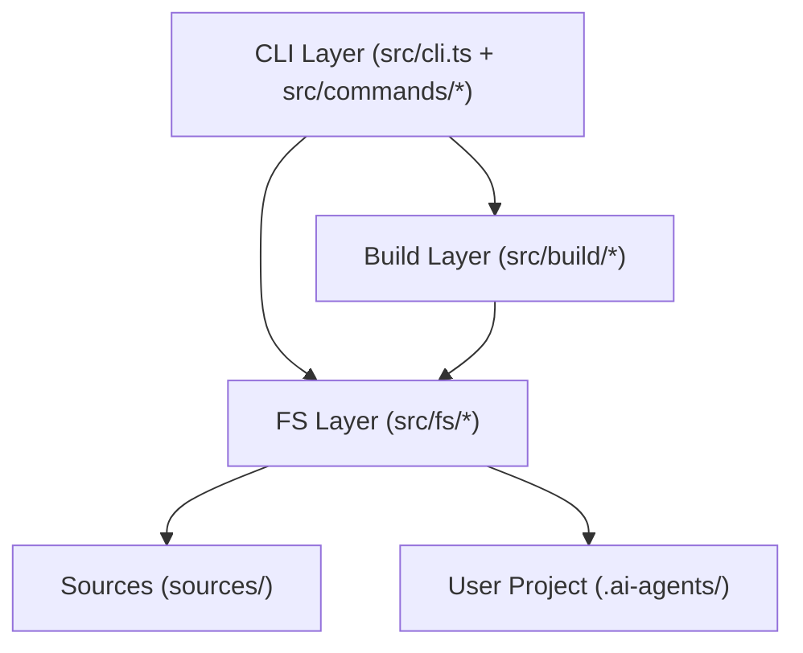

# Project: mvtt

## Overview

MVTT (`@uoyo/mvtt`) is a CLI tool that installs a curated virtual tech team (18 AI skills) into any Claude Code project. It ships structured Markdown skill files and YAML configuration into the user's project directory, then manages lifecycle operations (install, update, doctor, uninstall). The project has two halves: a TypeScript CLI (`src/`) compiled to `dist/`, and the skill content source (`sources/`) that the CLI assembles and materializes.

The most important invariant: every file the CLI writes is classified as `generated`, `create_once`, or `user_data`. Generated files are owned by the framework and overwritten on update. Create-once files are seeded on first install and never touched again. User-data directories are never written to by the CLI.

## Core Terms

| Term | Meaning |
|------|---------|
| Skill | An AI capability packaged as a `manifest.yaml` + `business.md` under `sources/skills/mvt-*/`. Assembled into a single `SKILL.md` at install time. |
| Section | A reusable Markdown fragment composed into one or more skills. Lives under `sources/sections/`. |
| Template | An output artifact scaffold (e.g., analysis report format). Lives under `sources/templates/`. Distinct from skill files. |
| Registry | `registry.yaml` — the index of all skills with metadata (agent, category, depends_on, template). Used at build time and by skills at runtime. |
| Install Manifest | `.ai-agents/.mvtt-manifest.json` — written into the user's project after install; records SHA-256 hashes and category of every managed file. Used by `update` and `doctor`. |
| Materialization | The process of reading assembled content from `sources/` and writing it into the user's target project. |
| Assembler | The build component (`src/build/assembler.ts`) that composes a skill from its `manifest.yaml` + sections into a final `SKILL.md`. |
| Section Loader | `src/build/section-loader.ts` — applies Mustache-like template expansion (`{{var}}`, `{{#block}}`, `{{^inverted}}`, `{{?optional}}`) to shared sections. |
| generated | File category: fully owned by MVTT, overwritten on every `mvtt update`. |
| create_once | File category: seeded on first install (`config.yaml`, `session.yaml`, `project-context.yaml`, `registry.yaml`, `core/manifest.yaml`), never overwritten. Reconciled via merge logic to preserve user additions. |
| user_data | Directory category: never touched by the CLI (workspace/artifacts, custom templates, user knowledge). |
| Registry Merge | `src/fs/registry-merge.ts` — reconciles framework `registry.yaml` with user's existing `registry.yaml` on `update`, preserving custom skills (`custom: true`) and user-added knowledge bindings. |
| Core Manifest | `knowledge/core/manifest.yaml` — lists which knowledge files are auto-loaded. Merged on update to preserve user-added entries (`origin: user`). |
| Pattern | A pre-built architecture template (DDD, Clean Architecture, Frontend-React) under `sources/knowledge/patterns/` that users can opt into at install time. |
| Project (sub-project) | One entry in `project-context.yaml > projects[]` (`name`/`path`/`type`/`tech_stack`); the unit of scoping for plan tasks and knowledge loading. |
| Current project set (PS) | The set of projects a skill invocation operates on; single-element for normal tasks, multi-element for cross-project tasks. Resolved by the activation protocol. |
| Scope matrix (2x2) | Orthogonal skill-axis × project-axis classification of knowledge into four quadrants: global shared, global per-skill, per-project shared, per-project × skill. |
| `_all` reserved key | Map key meaning "all projects" in registry knowledge declarations, following the underscore-reserved convention (`_framework`, `_generated`, `_archived`). |
| Deliverables | A task's downstream-facing contract; free-structured Markdown in `implementation.md` with a lightweight freshness flag in `plan.yaml`. |
| Freshness | Whether a downstream-consumed deliverable is still trustworthy after an upstream re-implementation. Valid values: `current`, `stale`. |
| Reverse-dependency lookup | Finding tasks whose `depends_on` includes a given task; drives deliverables interaction triggers and stale marking. |

## Module Structure

| Module | Path | Responsibility |
|--------|------|----------------|
| CLI entry | `src/index.ts` | Shebang, Node version check (>=18), top-level error handler, process.exit routing |
| CLI setup | `src/cli.ts` | Commander program definition; registers all commands |
| install | `src/commands/install.ts` | Interactive install: language selection, materialize, write `.mvtt-manifest.json` |
| update | `src/commands/update.ts` | Version bump: re-materialize generated files, remove stale files, preserve create_once |
| doctor | `src/commands/doctor.ts` | Integrity check: verify all tracked files exist and generated files match stored hashes |
| uninstall | `src/commands/uninstall.ts` | Remove all generated files, preserve user data, delete `.mvtt-manifest.json` |
| shared | `src/commands/shared.ts` | Locate package root (`getPackageRoot`) and read version (`getVersion`) |
| assembler | `src/build/assembler.ts` | Parse `manifest.yaml`, invoke section-loader per section, emit frontmatter + body |
| section-loader | `src/build/section-loader.ts` | Mustache-like template expansion; exported `applyParams` and `loadSection` |
| validator | `src/build/validator.ts` | Validate manifest YAML schema, verify section file references exist, check param completeness |
| materialize | `src/fs/materialize.ts` | Orchestrate full install: assemble skills/templates, copy knowledge, reconcile registry and core-manifest, seed create_once defaults, create user_data dirs |
| hash | `src/fs/hash.ts` | SHA-256 hash for files (`hashFile`) and strings (`hashString`); prefixed `sha256:` |
| install-manifest | `src/fs/install-manifest.ts` | Read/write `.ai-agents/.mvtt-manifest.json`; records version, timestamps, file hashes and categories |
| registry-merge | `src/fs/registry-merge.ts` | Diff-based merge of framework and user `registry.yaml`; preserves custom skills and user knowledge bindings |
| core-manifest | `src/fs/core-manifest.ts` | Merge framework and user `knowledge/core/manifest.yaml`; preserves `origin: user` entries |
| types | `src/types/` | TypeScript interfaces: `Manifest`, `Section`, `Registry`, `SkillEntry`, `CoreManifest`, `CoreManifestFile` |
| color | `src/util/color.ts` | ANSI color helpers (green, yellow, red, cyan, bold, gray) for CLI output |
| package | `src/util/package.ts` | Read `package.json` metadata at runtime |

## Layer Structure

- **CLI Layer**: Parses user input, drives interactive prompts, reports results. Calls Build and FS layers. Sole owner of `process.exit`.
- **Build Layer**: Stateless transforms — parses manifests, expands templates, validates. No filesystem side effects beyond reads.
- **FS Layer**: All filesystem writes. Reads assembled content from the Build layer and writes into the user project. Owns hash computation, manifest I/O, and merge logic.

## Key Business Rules

- A file classified as `generated` is overwritten on every `mvtt update` without confirmation; the user is warned if it was manually modified (hash mismatch) but the overwrite still proceeds.
- A file classified as `create_once` is never overwritten. On `update`, `registry.yaml` and `core/manifest.yaml` are reconciled via merge: framework entries replace old framework entries, user-authored entries are preserved.
- `user_data` directories are only created (mkdir) on install; the CLI never reads or writes their contents.
- A user-created skill in `registry.yaml` must have `custom: true` to survive `mvtt update`. Entries without this flag that are absent from the framework registry are silently dropped.
- User-added knowledge bindings on a framework skill entry are re-grafted onto the refreshed framework entry after update.
- `uninstall` removes only `generated` files plus the `.mvtt-manifest.json`; all `create_once` and `user_data` content is preserved.
- `doctor` exits with code 1 if any tracked file is missing; missing `generated` files are FAIL, hash mismatches on `generated` files are WARN.
- Section-loader `{{#block}}` with an array value iterates and renders each item; with a non-array truthy object renders the block once with that object as context.
- `{{^inverted}}` blocks render only when the key is falsy or an empty array.
- `{{?optional}}` renders the block body verbatim (no var substitution inside) when the key is defined and truthy.
- Tables whose header + separator have no data rows after conditional expansion are automatically stripped by `stripEmptyTables`.
- NodeNext module resolution requires `.js` extensions on all relative imports, even when source files are `.ts`.
- When `projects.length == 1`, all project-scoping logic collapses with zero new prompts; PS is set to the sole project. The trigger is the count, not the project name.
- Activation never silently loads all projects in a multi-project repo; on ambiguity it offers preselected options for the user to pick from.
- `plan.yaml` mutations (project validation, deliverables pointer, freshness, stale marking) are deterministic script logic in `plan-update.js`, never LLM judgment.
- `task.project` validation: when `--projects` count > 1, the array must be non-empty with every element in the valid names set; otherwise absent is allowed and defaulted to `["default"]`.
- Cross-project tasks load the **union** of all involved projects' knowledge.
- Registry restructure from flat lists to project-keyed maps is a breaking change; top-level `knowledge.shared` becomes `knowledge._all`, per-skill knowledge becomes `skills.<name>.knowledge._all`. Single-project repos use only `_all`.

## API Overview

| Command | Signature | Description |
|---------|-----------|-------------|
| `mvtt install` | `installCommand(): Promise<void>` | Interactive install: prompt language, materialize project, write manifest |
| `mvtt update` | `updateCommand(options?: { check?: boolean }): void` | Re-materialize generated files; `--check` reports version without writing |
| `mvtt doctor` | `doctorCommand(): void` | Verify file integrity against stored hashes; exit 1 on errors |
| `mvtt uninstall` | `uninstallCommand(): Promise<void>` | Remove generated files after confirmation; preserve user data |
| `mvtt build` | (build command in `src/commands/`) | Materialize sources into an arbitrary output directory without interactive install |
| `assembleFromManifest(manifestPath, options)` | `(string, AssembleOptions) => string` | Compose frontmatter + sections into final SKILL.md string |
| `loadSection(section, skillDir, sourcesDir)` | `(Section, string, string) => string` | Resolve and expand one section (inline / file / shared / template) |
| `applyParams(template, params)` | `(string, Record<string, unknown>) => string` | Apply full Mustache-like expansion to a template string |
| `validateManifest(manifestPath, sourcesDir)` | `(string, string) => ValidationError[]` | Return all schema and reference errors for a skill manifest |
| `materializeProject(options)` | `(MaterializeOptions) => MaterializedFile[]` | Full materialization pipeline; returns list of written files with hashes |
| `hashFile(filePath)` | `(string) => string` | SHA-256 hash of file content, prefixed `sha256:` |
| `hashString(content)` | `(string) => string` | SHA-256 hash of a string, prefixed `sha256:` |
| `updateRegistry(projectRoot, packageRoot)` | `(string, string) => RegistryMergeResult` | Diff-merge framework and user registry.yaml; backup old user copy |
| `updateCoreManifest(projectRoot, packageRoot)` | `(string, string) => { written, backup, frameworkCount, userCount }` | Merge framework + user core/manifest.yaml entries |

## Scripts

| Script | Path | Responsibility |
|--------|------|----------------|
| plan-update | `sources/scripts/plan-update.js` | Validate and mutate `plan.yaml`: project attribution via `--projects`, per-project DAG cycle detection, `current_tasks` advancement, deliverables pointer writing (`--deliverables-pointer`), stale marking (`--mark-deliverable-stale`). Full parse-mutate-stringify round-trip. |
| session-update | `sources/scripts/session-update.js` | Update session state: `--set-synced` (updates `last_synced_at`), `--set-active-project` (persists resolved project set). Full parse-mutate-stringify round-trip. |
