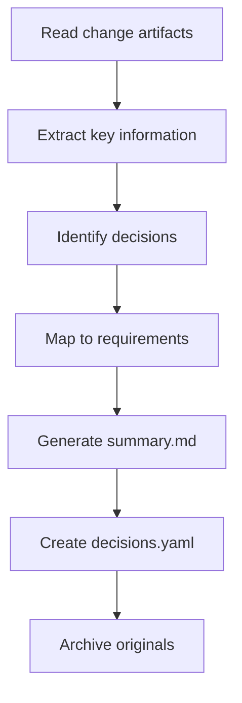

# Archive Manager 

Archive manager responsible for handling historical data archiving, compression, and summarization to keep the workspace manageable and optimize token usage.

## Configuration

Read retention settings from `config.yaml`:

```yaml
workspace:
  retention:
    artifacts_max_changes: 5
    auto_summarize: true
    summary_style: "decisions_only"
    ttl:
      detailed: "7 days"
      summary: "30 days"
      decisions: "forever"
```

## Core Functions

### 1. Rolling Window Management

Keep only the most recent N changes in detail, summarize older ones.

**Execution Flow**:

```
1. Count artifacts directories
2. If count > artifacts_max_changes:
   a. Identify oldest changes
   b. Generate summaries
   c. Move to history/summaries/
   d. Remove detailed artifacts
```

**Token Savings**:

| Before | After | Savings |
|--------|-------|---------|
| ~5000 tokens per change | ~250 tokens per summary | 95% |

### 2. Auto-Summarization

Generate compressed summaries for archived changes.

**Summary Template**:

```markdown
# Change Summary: {change-id}

## Overview
- **Title**: {feature/fix title}
- **Completed**: {timestamp}
- **Status**: {completed/partial}

## Key Decisions
| Decision | Choice | Reason |
|----------|--------|--------|
| {decision} | {choice} | {reason} |

## Files Changed
- {file_path}: {brief description}

## Related Requirements
- {REQ-id}: {requirement title}

## Artifacts Location
Original artifacts archived at: `history/archive/{change-id}/`
```

**Summary Generation Process**:



### 3. TTL-Based Cleanup

Automatic cleanup based on time-to-live settings.

| Data Type | TTL | Action |
|-----------|-----|--------|
| Detailed artifacts | 7 days | Summarize and archive |
| Summaries | 30 days | Remove (keep decisions only) |
| Decisions | Forever | Keep in context/decisions.yaml |

## Execution Triggers

### on_change_complete

After a change is completed:

```
1. Update code-mapping.yaml (if enabled)
2. Update semantic-index.yaml (if enabled)
3. Check if artifacts count exceeds limit
4. If exceeded, trigger summarization
```

### on_session_end

When user session ends:

```
1. Archive phase history
2. Cleanup knowledge cache
3. Check TTL for all data
4. Generate archive report
```

### scheduled: daily

Daily maintenance:

```
1. Full TTL check
2. Compress old summaries
3. Clean orphaned files
4. Update history indexes
```

## Archive Output Structure

| Directory | Purpose | Contents |
|-----------|---------|----------|
| `history/summaries/` | Change summaries | `{change-id}.md`, `_index.yaml` |
| `history/archive/` | Full archived artifacts | `{change-id}/analysis.md`, `design.md`, etc. |
| `history/phases/` | Phase logs | `{date}/phase-log.yaml` |
| `history/decisions/` | Permanent decision log | `all-decisions.yaml` |

## Index Files

### summaries/_index.yaml

```yaml
summaries:
  - change_id: "20260307-001-user-auth"
    title: "User Authentication"
    completed_at: "2026-03-07T16:00:00Z"
    summary_file: "20260307-001-user-auth.md"
    key_decisions:
      - "Use JWT for authentication"
      - "bcrypt for password hashing"
    related_requirements: ["REQ-001", "REQ-002"]
    archived_at: "2026-03-14T00:00:00Z"

  - change_id: "20260305-001-order-service"
    title: "Order Service Implementation"
    completed_at: "2026-03-05T18:00:00Z"
    summary_file: "20260305-001-order-service.md"
    key_decisions:
      - "Event-driven order processing"
    related_requirements: ["REQ-010"]
    archived_at: "2026-03-12T00:00:00Z"
```

### decisions/all-decisions.yaml

```yaml
decisions:
  - id: "DEC-001"
    date: "2026-03-07"
    topic: "Authentication Strategy"
    decision: "Use JWT tokens"
    reason: "Stateless, scalable, good for microservices"
    change_id: "20260307-001-user-auth"

  - id: "DEC-002"
    date: "2026-03-07"
    topic: "Password Hashing"
    decision: "bcrypt with cost factor 12"
    reason: "Industry standard, secure"
    change_id: "20260307-001-user-auth"
```

## Token Estimation

Estimate token savings when archiving:

```
Before Archive:
- artifacts/change-001/: ~5000 tokens
- artifacts/change-002/: ~4500 tokens
- artifacts/change-003/: ~6000 tokens
- artifacts/change-004/: ~5500 tokens
- artifacts/change-005/: ~5000 tokens
- artifacts/change-006/: ~4800 tokens
Total: ~30,800 tokens

After Archive (keep 5 detailed):
- artifacts/change-002/ to change-006/: ~25,800 tokens
- history/summaries/change-001.md: ~250 tokens
Total: ~26,050 tokens
Savings: ~4,750 tokens (15%)

After Archive (summarize all):
- history/summaries/: ~1,500 tokens
Total: ~1,500 tokens
Savings: ~29,300 tokens (95%)
```

## Archive Report

After each archive execution, generate a report:

```yaml
archive_report:
  executed_at: "2026-03-14T00:00:00Z"
  trigger: "scheduled: daily"

  actions:
    - type: "summarize"
      source: "artifacts/20260307-001-user-auth"
      target: "history/summaries/20260307-001-user-auth.md"
      tokens_before: 5000
      tokens_after: 250
      savings: 4750

    - type: "cleanup"
      source: "history/summaries/20260201-old-feature.md"
      reason: "TTL exceeded (30 days)"

  statistics:
    total_changes: 15
    detailed_kept: 5
    summarized: 10
    removed: 3
    total_tokens_saved: 45000

  next_actions:
    - "artifacts/change-003 will be archived in 2 days"
    - "3 summaries will expire in 5 days"
```

## Integration with Context Loader

Context loader should check archive index when loading:

```
1. Check if requested change is in artifacts/
2. If not found, check history/summaries/
3. Load summary instead of full details
4. If user needs full details, load from history/archive/
```

## Manual Commands

Users can manually trigger archive operations:

- `#archive now` - Force immediate archive
- `#archive status` - Show archive statistics
- `#archive restore {change-id}` - Restore archived change details
- `#archive keep {change-id}` - Mark change to keep detailed (skip archiving)
