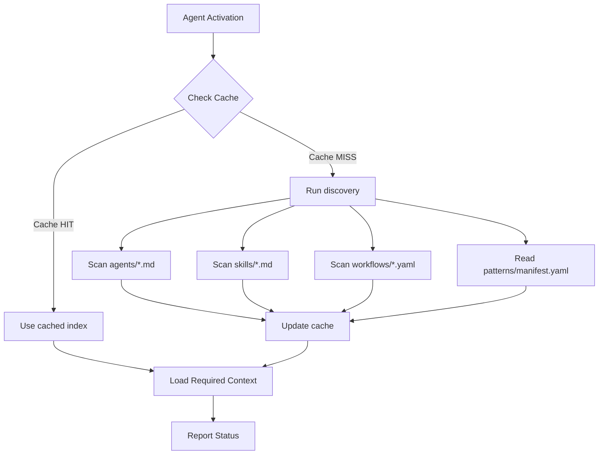
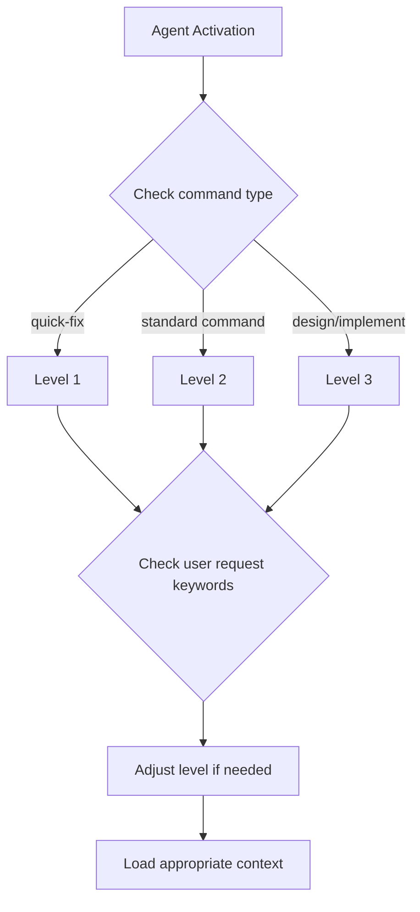

# Context Loader

Smart context loader with dynamic discovery and tiered loading for optimal token usage.

## Configuration

Read from `config.yaml`:

```yaml
workspace:
  smart_loading:
    enabled: true
    default_level: minimal

discovery:
  mode: dynamic
  cache:
    enabled: true
    ttl: session
```

## Dynamic Discovery Protocol

### Overview

Resources (agents, skills, patterns) are discovered dynamically from their directories instead of relying on a static index.

### Discovery Flow



### Discovery Functions

#### Discover Agents

```
FUNCTION discover_agents():
  1. LIST files in agents/ matching *.yaml
  2. FOR each file:
     - READ file
     - EXTRACT: id, name, commands, skills
  3. RETURN agent index
```

#### Discover Skills

```
FUNCTION discover_skills():
  1. LIST files in skills/ matching *.md
  2. FOR each file:
     - READ frontmatter
     - EXTRACT: id, name, triggers, invoked_by
  3. CATEGORIZE: core, system, custom
  4. RETURN skill index
```

#### Discover Patterns

```
FUNCTION discover_patterns():
  1. READ knowledge/patterns/manifest.yaml
  2. EXTRACT: available patterns, custom patterns
  3. RETURN pattern index
```

### Cache Management

```yaml
# workspace/state/knowledge-cache.yaml
cache:
  status: fresh | stale | empty
  last_updated: "2026-03-08T12:00:00Z"

discovered:
  agents: [...]
  skills: [...]
  workflows: [...]
  patterns: [...]

stats:
  cache_hits: 5
  cache_misses: 1
```

**Cache Invalidation**:
- File change in agents/, skills/, workflows/
- Config change (pattern.active)
- Session end (if ttl: session)

---

## Tiered Loading Strategy

### Level Overview

| Level | Token Budget | When to Use | Sources |
|-------|--------------|-------------|---------|
| 1 - Minimal | ~500 | Quick operations | session, project, code-mapping |
| 2 - Moderate | ~2000 | Standard tasks | + architecture, requirements |
| 3 - Full | ~5000+ | Complex tasks | + knowledge packs |
| 4 - Complete | varies | Rare cases | + all artifacts |

### Level 1: Minimal

**Load**:
- `workspace/state/session.yaml`
- `workspace/context/project.yaml`
- `workspace/state/code-mapping.yaml`

**Use When**:
- Bug fixes
- Quick operations
- Status checks

### Level 2: Moderate

**Load** (includes Level 1):
- `workspace/context/architecture.yaml`
- `workspace/context/requirements.yaml`
- `workspace/state/semantic-index.yaml`

**Use When**:
- Feature implementation
- Code review
- Design discussions

### Level 3: Full

**Load** (includes Level 2):
- `knowledge/core/` (based on knowledge_packs config)
- `knowledge/patterns/{active}/`
- `knowledge/principle/`

**Use When**:
- New feature design
- Complex refactoring
- Architecture decisions

### Level 4: Complete

**Load**:
- All Level 3 content
- `workspace/artifacts/{active}/`
- `workspace/history/summaries/`

**Use When**:
- Resuming interrupted work
- Complex multi-phase changes

---

## Smart Context Inference

### Keyword Detection

| Keywords Detected | Inferred Level | Additional Loading |
|-------------------|----------------|-------------------|
| fix, bug, error | Minimal | Related code files |
| feature, add, implement | Moderate | + Architecture |
| refactor | Full | + Pattern knowledge |
| architecture, design | Full | + All patterns |

### Context Decision Flow



---

## Execution Steps

### Step 1: Initialize

```
1. READ config.yaml
2. Check workspace.smart_loading.default_level
3. Check discovery.mode and discovery.cache
```

### Step 2: Run Discovery (if needed)

```
1. READ knowledge-cache.yaml
2. IF cache.status == "fresh":
     USE cached discovered index
   ELSE:
     RUN discovery functions
     UPDATE cache
```

### Step 3: Load Context by Level

```
1. Determine required sources by level
2. Check what's already in cache
3. Load missing sources
4. Update loaded context in cache
```

### Step 4: Update Cache

```
1. RECORD loaded sources with timestamps
2. UPDATE tokens_used count
3. MARK pending sources
```

### Step 5: Report Status

```markdown
## Context Loaded (Level 2 - Moderate)

### Discovered
- Agents: 6
- Skills: 8 (4 core, 3 system, 1 custom)
- Patterns: 4 available

### Loaded This Session
- [x] session.yaml (50 tokens)
- [x] project.yaml (100 tokens)
- [x] architecture.yaml (450 tokens)

### Cached
- [x] code-mapping.yaml (150 tokens)

### Skipped (not needed)
- [ ] requirements.yaml
- [ ] pattern knowledge

**Token Usage**: 750 / 2000
```

---

## On-Demand Loading

Users can request additional context:

```
#load-context minimal   → Reset to Level 1
#load-context moderate  → Upgrade to Level 2
#load-context full      → Upgrade to Level 3
```

---

## Code Mapping Integration

Use code-mapping.yaml for efficient file location:

```yaml
# workspace/state/code-mapping.yaml
entities:
  "User":
    files: [src/domain/User.ts]
    type: aggregate_root
```

**Process**:
1. User mentions "User"
2. Check code-mapping
3. Load only related files
4. Skip unrelated modules

---

## Semantic Index Integration

Use semantic-index for topic-based loading:

```yaml
# workspace/state/semantic-index.yaml
by_topic:
  "authentication":
    - file: workspace/context/architecture.yaml
      path: decisions.auth
```

**Process**:
1. Extract keywords from request
2. Match against semantic index
3. Load only matched sections

---

## Integration Points

### With Archive Manager
- Load summaries instead of full artifacts
- Access history when needed

### With Dynamic Discovery
- Cache stores discovered index
- Invalidate on file changes

### With Config Manager
- Respect discovery.cache settings
- Invalidate on config changes
