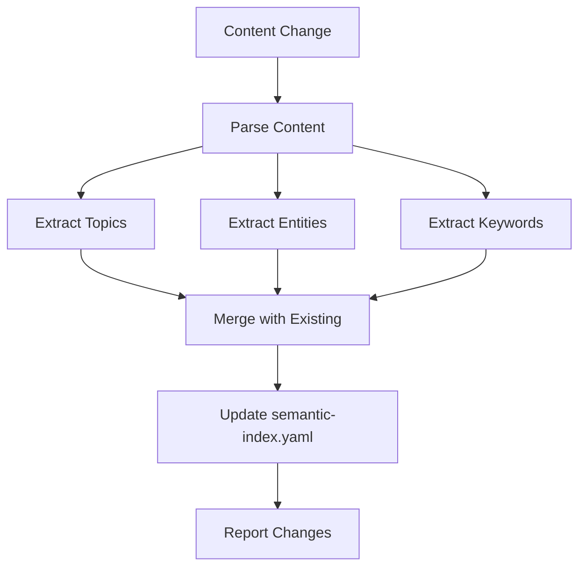

# Semantic Indexer

Automatically maintains the semantic index for efficient content lookup.

## Purpose

Build and maintain a semantic index that enables:
- Topic-based content lookup
- Entity-based file location
- Keyword-based section discovery

## Index Structure

```yaml
# workspace/state/semantic-index.yaml
index:
  by_topic:
    "authentication":
      - file: "workspace/context/architecture.yaml"
        path: "decisions.auth"

  by_entity:
    "User":
      definition:
        file: "workspace/context/requirements.yaml"
        path: "entities.user"

  by_keyword:
    "JWT":
      - file: "workspace/context/architecture.yaml"
        path: "decisions.auth"
```

## Indexing Rules

### By Topic

Extract topics from:

| Source | Extraction Method |
|--------|-------------------|
| Requirements | Feature names, domain areas |
| Architecture | Module names, design decisions |
| Artifacts | Section headers, topic tags |

**Topic Examples**:
- `authentication`, `authorization`
- `user-management`, `order-processing`
- `payment`, `notification`
- `logging`, `monitoring`

### By Entity

Extract entities from:

| Source | Entity Types |
|--------|--------------|
| Requirements | Domain entities, actors |
| Architecture | Modules, services |
| Code | Classes, interfaces |

**Entity Types**:
- `aggregate_root` - DDD aggregate roots
- `entity` - Domain entities
- `value_object` - Value objects
- `service` - Application/domain services
- `repository` - Repositories

### By Keyword

Extract keywords from:

| Source | Keywords |
|--------|----------|
| Architecture decisions | Technology names, patterns |
| Code | Class names, method names |
| Documentation | Technical terms |

**Keyword Categories**:
- Technologies: `JWT`, `Redis`, `PostgreSQL`
- Patterns: `Repository`, `Factory`, `Observer`
- Concepts: `caching`, `validation`, `serialization`

## Update Triggers

### on_phase_complete

After each workflow phase:

```
1. Read completed artifact
2. Extract topics, entities, keywords
3. Update semantic-index.yaml
4. Merge with existing entries
```

### on_code_change

When code changes detected:

```
1. Parse changed files
2. Extract class/function names
3. Map to requirements (via code-mapping)
4. Update relevant index sections
```

## Extraction Methods

### From Requirements Analysis

```markdown
## Requirements Analysis

### Key Features
1. User Authentication  → topic: authentication
2. Order Management      → topic: order-management

### Actors
- End User               → entity: User (type: actor)
- Administrator          → entity: Administrator (type: actor)

### Entities
- User                   → entity: User
- Order                  → entity: Order
```

### From Architecture Design

```markdown
## Technical Decisions
| Decision | Choice | Reason |
|----------|--------|--------|
| Authentication | JWT | Stateless | → keyword: JWT
| Database | PostgreSQL | ACID | → keyword: PostgreSQL
```

### From Code

```typescript
// Extract from code structure
class UserService {        → entity: UserService (type: service)
  async login() {}         → topic: authentication
  async register() {}      → topic: user-management
}
```

## Index Update Process



## Output

After index update:

```yaml
index_update:
  triggered_at: "2026-03-07T16:00:00Z"
  source: "workspace/artifacts/change-001/design.md"

  additions:
    topics:
      - "authentication"
      - "token-management"
    entities:
      - name: "AuthService"
        type: "service"
    keywords:
      - "JWT"
      - "bcrypt"

  statistics:
    total_topics: 5
    total_entities: 8
    total_keywords: 12
    index_size_tokens: 450
```

## Query Interface

### Topic Query

```
Query: "authentication"
Result:
  - workspace/context/architecture.yaml#decisions.auth
  - workspace/artifacts/change-001/design.md#Auth Module
  - workspace/artifacts/change-001/design.md#Token Strategy
```

### Entity Query

```
Query: "User"
Result:
  Definition: workspace/context/requirements.yaml#entities.user
  Implementations:
    - workspace/artifacts/change-001/design.md#domain.user-aggregate
  Code Files:
    - src/domain/User.ts
```

### Keyword Query

```
Query: "JWT"
Result:
  - workspace/context/architecture.yaml#decisions.auth
    snippet: "Use JWT tokens for stateless authentication"
  - workspace/artifacts/change-001/design.md#Security Decisions
```

## Maintenance

### Cleanup Rules

| Condition | Action |
|-----------|--------|
| File deleted | Remove from index |
| File moved | Update paths |
| Content changed | Re-extract and merge |
| Duplicate entry | Keep most recent |

### Index Size Management

Keep index under 1000 tokens:

```
IF index_size > 1000 tokens:
  1. Remove low-value keywords
  2. Consolidate similar topics
  3. Remove stale references
```
