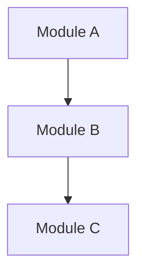

## Codebase Analysis Report

### Project: {name}
- **Root**: `{root_path}`
- **Primary Language**: {language}
- **Detected Framework**: {framework}

### Architecture Discovery

#### Module Structure
| Module | Path | Responsibility | Type |
|--------|------|----------------|------|
| {module} | `{path}` | {description} | {Domain/Application/Infrastructure/Interface} |

#### Entity Inventory
| Entity | Location | Relationships |
|--------|----------|---------------|
| {entity} | `{file}` | {related_entities} |

#### Service Inventory
| Service | Location | Dependencies | Methods |
|---------|----------|--------------|---------|
| {service} | `{file}` | {deps} | {methods} |

### Dependency Analysis

### Key Findings
| # | Finding | Type | Severity |
|---|---------|------|----------|
| 1 | {finding} | {architecture/code-quality/dependency} | {info/warning/concern} |

### Workspace Updated
- [x] project-context.yaml updated with discovered structure
- [x] session.yaml updated

---
**Suggested Next Steps**:
- `/mvt-analyze {requirements}` to add requirements on top of discovered structure
- `/mvt-design` to design new features for existing architecture
