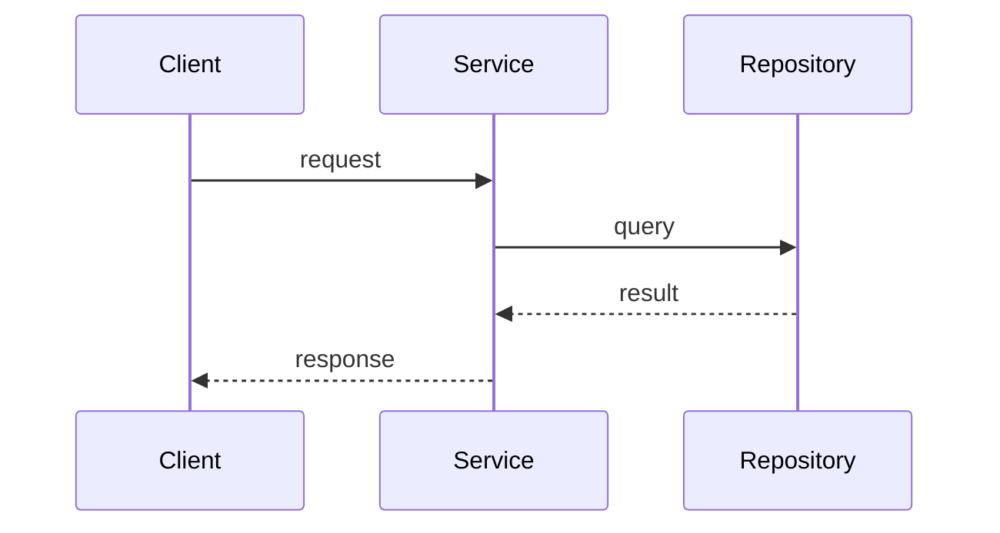

## Architecture Design: {Feature Name}

### Overview
{1-2 paragraph summary of the architecture}

### Architecture Decision Records
| ID | Decision | Rationale | Alternatives Considered |
|----|----------|-----------|------------------------|
| ADR-001 | {decision} | {rationale} | {alternatives} |

### Module Design
| Module | Responsibility | Layer | Dependencies |
|--------|---------------|-------|--------------|
| {module} | {responsibility} | {Domain/Application/Infrastructure/Interface} | {deps} |

### Key Interfaces
```{language}
// {InterfaceName}
{interface_definition}
```

### Data Flow


### File Structure
| File | Action | Description |
|------|--------|-------------|
| `{path}` | {Create/Modify} | {description} |

### Implementation Guidelines
- {guideline_1}
- {guideline_2}

### Change Tracking
- **Change ID**: {change-id}
- **Artifact**: `.ai-agents/workspace/artifacts/{change-id}/design.md`

---
**Suggested Next Steps**:
- `/mvt-implement` to start implementing this design
- Refine specific modules if needed
