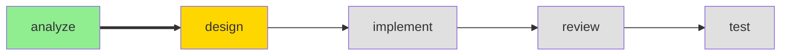

## Project Status

### Current: {phase} Phase ({agent})

### Project: {name}
- **Type**: {type}
- **Initialized**: {date}
- **Tech Stack**: {language} / {framework}

### Progress This Session
| Phase | Status | Completed |
|-------|--------|-----------|
| Analyze | {status} | {time} |
| Design | {status} | {time} |
| Implement | {status} | {time} |
| Review | {status} | {time} |
| Test | {status} | {time} |

### Active Change
- **Change ID**: {change_id}
- **Title**: {title}
- **Started**: {date}

---
**Suggested Next Steps**:
- {relevant_next_step}
