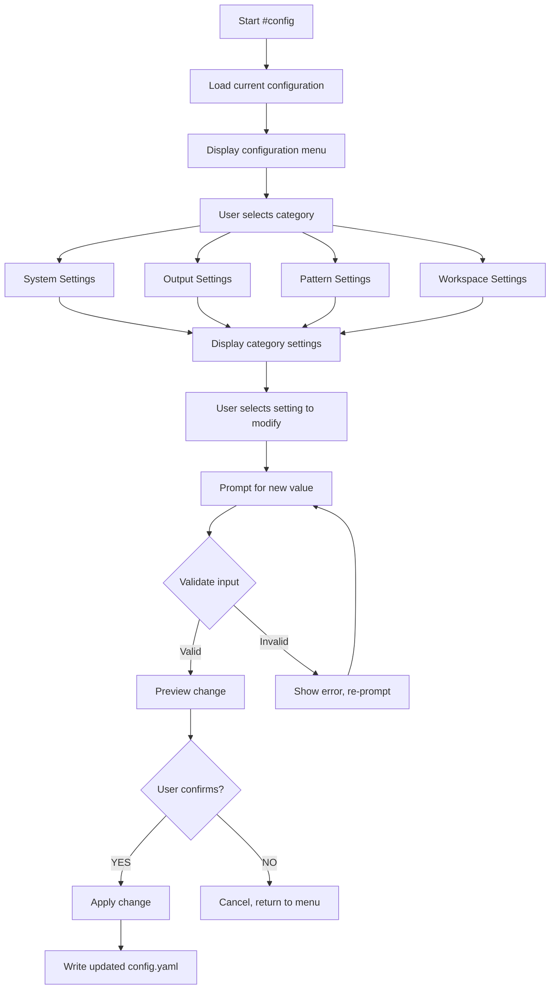
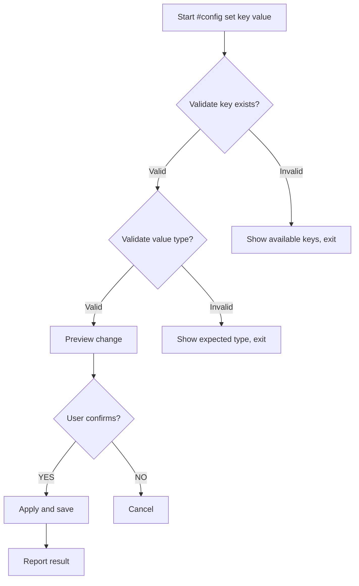
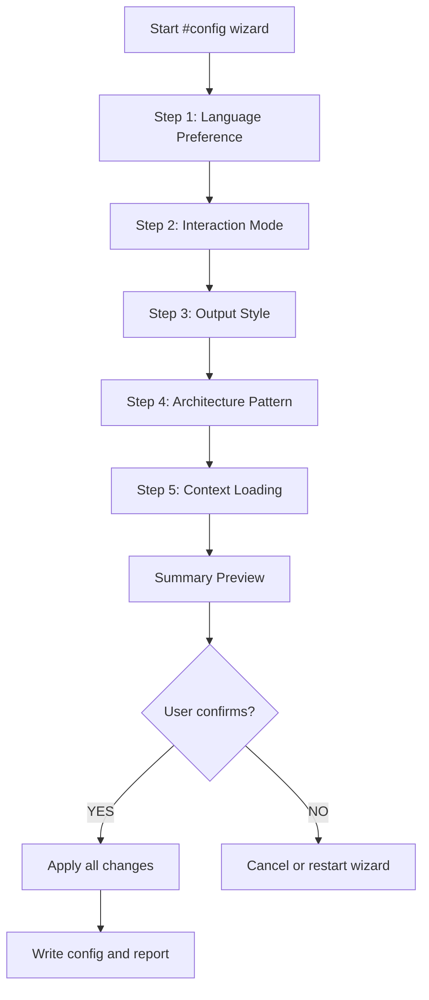

# Configuration Manager Skill

Interactive configuration management allowing users to modify framework settings through guided conversations.

## Overview

The `#config` command provides an interactive way to view and modify framework configuration without manually editing YAML files. It offers guided setup for common settings and validates changes before applying.

## Command Variants

| Variant | Description |
|---------|-------------|
| `#config` | Show current configuration and options |
| `#config show` | Display current configuration |
| `#config set {key} {value}` | Directly set a configuration value |
| `#config wizard` | Guided configuration wizard |
| `#config reset` | Reset to default configuration |

---

## Configuration Categories

### 1. System Settings

| Key | Type | Default | Description |
|-----|------|---------|-------------|
| `system.default_agent` | string | `conductor` | Default agent on startup |
| `system.language` | string | `zh-CN` | Output language preference |
| `system.interaction_mode` | string | `semi-auto` | Interaction mode (auto/semi-auto/manual) |
| `system.confirm_before_generate` | bool | `true` | Ask before generating code |
| `system.confirm_before_save` | bool | `true` | Ask before saving files |

### 2. Output Settings

| Key | Type | Default | Description |
|-----|------|---------|-------------|
| `output.no_emojis` | bool | `true` | Disable emojis in output |
| `output.flow_charts.use_mermaid` | bool | `true` | Use Mermaid for diagrams |
| `output.data_format` | string | `yaml` | Default data format (yaml/json) |
| `output.max_description` | int | `500` | Max description length |

### 3. Pattern Settings

| Key | Type | Default | Description |
|-----|------|---------|-------------|
| `pattern.active` | string | `ddd` | Active architecture pattern |

### 4. Workspace Settings

| Key | Type | Default | Description |
|-----|------|---------|-------------|
| `workspace.retention.artifacts_max_changes` | int | `5` | Max artifacts to keep |
| `workspace.retention.auto_summarize` | bool | `true` | Auto-summarize old artifacts |
| `workspace.smart_loading.enabled` | bool | `true` | Enable smart context loading |
| `workspace.smart_loading.default_level` | string | `minimal` | Default context level |

### 5. Discovery Settings

| Key | Type | Default | Description |
|-----|------|---------|-------------|
| `discovery.mode` | string | `dynamic` | Discovery mode (dynamic/cached) |
| `discovery.cache.enabled` | bool | `true` | Enable discovery cache |
| `discovery.cache.ttl` | string | `session` | Cache TTL (session/always) |
| `discovery.timeout` | int | `30000` | Discovery timeout (ms) |

---

## Execution Flow

### Mode 1: Interactive Menu (Default)

When user runs `#config` without arguments:



### Mode 2: Direct Set

When user runs `#config set {key} {value}`:



### Mode 3: Guided Wizard

When user runs `#config wizard`:



---

## Output Templates

### Main Menu

```markdown
## Configuration Manager

### Current Configuration

| Category | Key | Value |
|----------|-----|-------|
| System | Language | `{language}` |
| System | Interaction Mode | `{mode}` |
| Output | Data Format | `{format}` |
| Pattern | Active | `{pattern}` |
| Discovery | Cache | `{enabled}` |

### Available Actions

| # | Action | Description |
|---|--------|-------------|
| 1 | `System` | Language, interaction mode, confirmations |
| 2 | `Output` | Format, emojis, diagrams |
| 3 | `Pattern` | Architecture pattern settings |
| 4 | `Workspace` | Context loading, retention |
| 5 | `Discovery` | Discovery mode, cache settings |
| 6 | `Wizard` | Guided setup wizard |
| 7 | `Reset` | Reset to defaults |

**Usage**:
- Reply with a number (1-7) to select
- Or use `#config set {key} {value}` to set directly
```

### Category View

```markdown
## System Settings

| # | Setting | Current | Options |
|---|---------|---------|---------|
| 1 | Language | `{current}` | zh-CN, en-US |
| 2 | Interaction Mode | `{current}` | auto, semi-auto, manual |
| 3 | Confirm Before Generate | `{current}` | true, false |
| 4 | Confirm Before Save | `{current}` | true, false |
| 5 | Default Agent | `{current}` | conductor, analyst, ... |

**Select a setting to modify (1-5), or reply `back` to return:**
```

### Setting Edit Prompt

```markdown
## Edit: Language

**Current Value**: `{current_value}`

**Description**: Language preference for AI responses and generated content.

**Available Options**:
1. `zh-CN` - Chinese
2. `en-US` - English

**Enter your choice (1 or 2), or reply `cancel`:**
```

### Change Preview

```markdown
## Confirm Change

| Setting | Current | New |
|---------|---------|-----|
| Language | zh-CN | en-US |

**Apply this change?**
- Reply `yes` to confirm
- Reply `no` to cancel
```

### Direct Set Preview

```markdown
## Direct Configuration Change

| Key | Value |
|-----|-------|
| `system.language` | `en-US` |

**Before**: `zh-CN`
**After**: `en-US`

**Apply this change?** (yes/no)
```

### Wizard Step

```markdown
## Configuration Wizard (Step 1/5)

### Language Preference

Which language do you prefer for AI responses?

| # | Option | Description |
|---|--------|-------------|
| 1 | `zh-CN` | Chinese - Chinese responses |
| 2 | `en-US` | English - English responses |

**Enter your choice (1 or 2):**
```

### Wizard Summary

```markdown
## Configuration Wizard - Summary

The following changes will be applied:

| Setting | Current | New |
|---------|---------|-----|
| Language | zh-CN | en-US |
| Interaction Mode | semi-auto | auto |
| Use Emojis | false | true |
| Pattern | ddd | frontend-react |
| Context Level | minimal | moderate |

**Apply all changes?**
- Reply `yes` to confirm
- Reply `edit` to modify specific settings
- Reply `cancel` to discard all changes
```

### Success Message

```markdown
## Configuration Updated

Successfully updated configuration:

| Setting | New Value |
|---------|-----------|
| `system.language` | `en-US` |

Changes take effect immediately.
```

---

## Validation Rules

### Type Validation

| Type | Validation |
|------|------------|
| `string` | Any non-empty string |
| `bool` | Must be `true` or `false` |
| `int` | Must be valid integer |
| `enum` | Must be one of allowed values |

### Enum Values

```yaml
enums:
  system.language:
    - zh-CN
    - en-US

  system.interaction_mode:
    - auto
    - semi-auto
    - manual

  output.data_format:
    - yaml
    - json

  pattern.active:
    - ddd
    - clean-architecture
    - frontend-react
    - generic

  workspace.smart_loading.default_level:
    - minimal
    - moderate
    - full

  discovery.mode:
    - dynamic
    - cached

  discovery.cache.ttl:
    - session
    - always
```

---

## Error Handling

| Error | Cause | Resolution |
|-------|-------|------------|
| Invalid key | Key doesn't exist | Show available keys |
| Invalid value | Wrong type or enum value | Show expected format/options |
| Parse error | Config file corrupted | Offer to reset or restore backup |
| Permission denied | Cannot write config | Suggest checking file permissions |

---

## Backup & Reset

### Auto-backup

Before applying changes:
1. Create backup at `.ai-agents/.backup/config-{timestamp}.yaml`
2. Apply changes
3. If write fails, restore from backup

### Reset

When user runs `#config reset`:

```markdown
## Reset Configuration

This will reset ALL settings to default values.

**Warning**: This cannot be undone.

**Proceed?** (yes/no)
```

Default configuration:

```yaml
system:
  default_agent: conductor
  language: zh-CN
  interaction_mode: semi-auto
  confirm_before_generate: true
  confirm_before_save: true

output:
  no_emojis: true
  flow_charts:
    use_mermaid: true
  data_format: yaml
  max_description: 500

pattern:
  active: ddd

workspace:
  retention:
    artifacts_max_changes: 5
    auto_summarize: true
  smart_loading:
    enabled: true
    default_level: minimal

discovery:
  mode: dynamic
  cache:
    enabled: true
    ttl: session
```

---

## Quick Reference

### Common Commands

```bash
# View all settings
#config

# Set language to English
#config set system.language en-US

# Set interaction mode
#config set system.interaction_mode auto

# Change architecture pattern
#config set pattern.active frontend-react

# Run guided wizard
#config wizard

# Reset to defaults
#config reset
```

### Configuration Keys Quick Reference

| Key | Description |
|-----|-------------|
| `system.language` | AI response language |
| `system.interaction_mode` | Automation level |
| `system.confirm_before_generate` | Ask before generating |
| `system.confirm_before_save` | Ask before saving |
| `output.no_emojis` | Disable emojis |
| `output.data_format` | Data format preference |
| `pattern.active` | Active architecture pattern |
| `workspace.smart_loading.default_level` | Context loading level |
