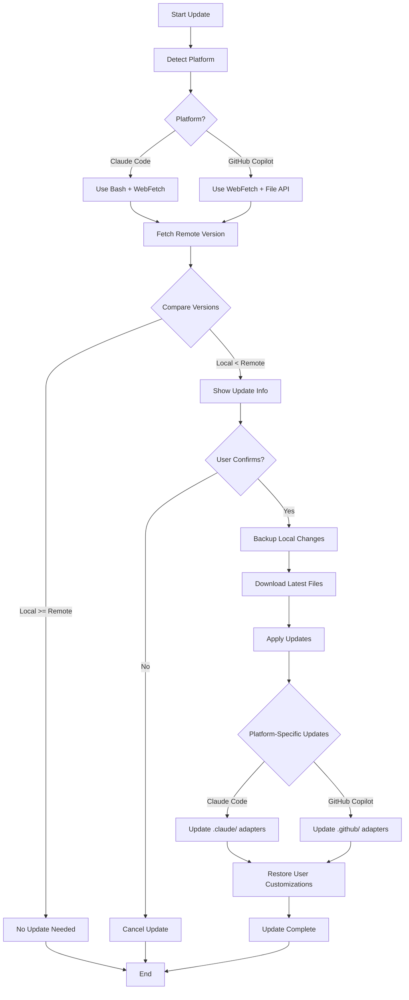

# Framework Auto-Update Skill

Automatically detect the current platform and update the AI agent framework from the GitHub repository.

## Usage

This skill is invoked by: **Conductor** (via `#update-framework` or `/update-framework` command)

## Overview

This skill provides a complete framework update workflow that:
1. Detects the current platform (GitHub Copilot or Claude Code)
2. Fetches the latest version information from GitHub
3. Downloads the latest framework files
4. Safely updates local files while preserving user customizations

## Configuration

```yaml
# Framework Update Configuration
repository:
  url: "https://github.com/uoyoCsharp/My-Virtual-TechTeam"
  branch: "main"

paths:
  framework: ".ai-agents/"
  claude_code_adapter: ".claude/"
  github_copilot_adapter: ".github/agents/"

version_file: ".ai-agents/registry.yaml"
version_field: "version"
```

## Execution Flow



## Step 1: Platform Detection

### Detection Logic

Check for platform-specific indicators:

```yaml
platform_detection:
  claude_code:
    indicators:
      - file_exists: "CLAUDE.md"
      - file_exists: ".claude/"
    tool_access: full
    command_prefix: "/"

  github_copilot:
    indicators:
      - file_exists: ".github/copilot-instructions.md"
      - file_exists: ".github/agents/"
    tool_access: limited
    command_prefix: "#"
```

### Detection Implementation

**For Claude Code:**
```bash
# Check if CLAUDE.md exists
if [ -f "CLAUDE.md" ]; then
  echo "PLATFORM=claude_code"
fi
```

**For GitHub Copilot:**
- Check if `.github/agents/` directory exists
- Check for copilot-instructions.md

## Step 2: Version Comparison

### Fetch Remote Version

Fetch the registry.yaml from GitHub raw URL:

```
https://raw.githubusercontent.com/uoyoCsharp/My-Virtual-TechTeam/main/.ai-agents/registry.yaml
```

Extract the `version` field and compare with local version.

### Version Comparison Logic

```yaml
version_comparison:
  remote_version: "2.2"  # Fetched from remote
  local_version: "2.1"   # Read from local registry.yaml

  comparison:
    - if: remote_version > local_version
      action: "update_available"
      message: "New version available: {remote_version}"

    - if: remote_version == local_version
      action: "no_update"
      message: "Already up to date"

    - if: remote_version < local_version
      action: "dev_version"
      message: "Local version is newer (development mode)"
```

## Step 3: User Confirmation

### Update Preview

Before updating, show the user:

```markdown
## Framework Update Available

### Version Information
- **Current Version**: {local_version}
- **Available Version**: {remote_version}
- **Repository**: https://github.com/uoyoCsharp/My-Virtual-TechTeam

### Files to Update
| Category | Files |
|----------|-------|
| Core Framework | .ai-agents/agents/*.yaml, .ai-agents/agents/*.prompt.md |
| Skills | .ai-agents/skills/*.md |
| System Skills | .ai-agents/skills/_system/*.md |
| Platform Adapter | .claude/agents/*.md (Claude Code) |

### What Will Be Preserved
- workspace/ directory (your working state)
- knowledge/principle/ (project-specific standards)
- knowledge/project/ (custom project knowledge)
- Any files you've added

### Backup
- A backup will be created at: .ai-agents/.backup/{timestamp}/

---

**Proceed with update?** (yes/no)
```

## Step 4: Backup Creation

### Backup Strategy

Create a timestamped backup before updating:

```yaml
backup:
  location: ".ai-agents/.backup/{timestamp}/"

  include:
    - ".ai-agents/agents/"
    - ".ai-agents/skills/"
    - ".ai-agents/knowledge/core/"
    - ".ai-agents/knowledge/patterns/"
    - ".claude/agents/"  # If exists
    - ".github/agents/"  # If exists

  exclude:
    - ".ai-agents/workspace/"  # Working state
    - ".ai-agents/knowledge/principle/"  # User customizations
    - ".ai-agents/knowledge/project/"  # User customizations
```

### Backup Command

```bash
# Create backup directory
BACKUP_DIR=".ai-agents/.backup/$(date +%Y%m%d_%H%M%S)"
mkdir -p "$BACKUP_DIR"

# Backup core framework files
cp -r .ai-agents/agents "$BACKUP_DIR/agents"
cp -r .ai-agents/skills "$BACKUP_DIR/skills"
cp -r .ai-agents/knowledge/core "$BACKUP_DIR/knowledge-core" 2>/dev/null || true
cp -r .ai-agents/knowledge/patterns "$BACKUP_DIR/knowledge-patterns" 2>/dev/null || true

# Backup platform adapters
if [ -d ".claude" ]; then
  cp -r .claude "$BACKUP_DIR/claude"
fi
if [ -d ".github/agents" ]; then
  cp -r .github/agents "$BACKUP_DIR/github-agents"
fi
```

## Step 5: Download and Update

### Download Methods

**For Claude Code (Recommended):**

Use git to fetch updates:

```bash
# Method 1: Git fetch and checkout (if repo is cloned)
git fetch origin main
git checkout origin/main -- .ai-agents/
git checkout origin/main -- .claude/ 2>/dev/null || true

# Method 2: Download and extract (if not a git repo)
curl -L "https://github.com/uoyoCsharp/My-Virtual-TechTeam/archive/refs/heads/main.tar.gz" -o /tmp/framework.tar.gz
tar -xzf /tmp/framework.tar.gz -C /tmp
cp -r /tmp/My-Virtual-TechTeam-main/.ai-agents/* .ai-agents/
cp -r /tmp/My-Virtual-TechTeam-main/.claude/* .claude/ 2>/dev/null || true
```

**For GitHub Copilot:**

Use WebFetch to download files:

```yaml
download_process:
  1. Fetch file list from GitHub API
  2. Download each file using WebFetch
  3. Apply updates using file edit tools
```

### Files to Update

```yaml
update_targets:
  core:
    - ".ai-agents/registry.yaml"
    - ".ai-agents/config.yaml"
    - ".ai-agents/agents/_base.md"
    - ".ai-agents/agents/*.yaml"
    - ".ai-agents/agents/*.prompt.md"
    - ".ai-agents/skills/*.md"
    - ".ai-agents/skills/_system/*.md"
    - ".ai-agents/knowledge/core/*.md"
    - ".ai-agents/knowledge/patterns/**/*.md"
    - ".ai-agents/workflows/*.yaml"

  claude_code:
    - "CLAUDE.md"
    - ".claude/agents/*.md"

  github_copilot:
    - ".github/copilot-instructions.md"
    - ".github/agents/*.md"
```

## Step 6: Preserve User Customizations

### Protected Files

These files should NOT be overwritten:

```yaml
protected_files:
  - ".ai-agents/workspace/**/*"          # Working state
  - ".ai-agents/knowledge/principle/**/*" # Project-specific standards
  - ".ai-agents/knowledge/project/**/*"   # Custom project knowledge
  - ".ai-agents/registry.local.yaml"      # Local overrides (if exists)
```

### Merge Strategy

For files that may have user modifications:

```yaml
merge_strategy:
  registry.yaml:
    method: "smart_merge"
    preserve:
      - "platform_adapters.local"  # Local platform config
      - "custom_agents"            # User-added agents

  config.yaml:
    method: "preserve_values"
    preserve:
      - "pattern.active"           # User's active pattern
      - "workspace.retention"      # User's retention settings
```

## Step 7: Post-Update

### Update Summary

```markdown
## Framework Update Complete

### Update Summary
- **Previous Version**: {old_version}
- **New Version**: {new_version}
- **Files Updated**: {count}
- **Backup Location**: {backup_path}

### Updated Components
| Component | Status |
|-----------|--------|
| Core Framework | ✅ Updated |
| Skills | ✅ Updated |
| Platform Adapter | ✅ Updated |
| Knowledge Base | ✅ Updated |

### Preserved Files
- workspace/ (working state)
- knowledge/principle/ (project standards)
- knowledge/project/ (custom knowledge)

### Next Steps
- Review any breaking changes in CHANGELOG
- Run `#init` or `/init` to reinitialize if needed
- Check for new commands with `#status` or `/status`

---
**Rollback**: If issues occur, restore from backup:
`cp -r {backup_path}/* .ai-agents/`
```

## Error Handling

### Common Errors

| Error | Cause | Recovery |
|-------|-------|----------|
| Network timeout | Cannot reach GitHub | Retry or check network |
| Permission denied | File lock or permissions | Close editors, check permissions |
| Merge conflict | User modifications conflict | Manual resolution required |
| Version parse error | Corrupted registry.yaml | Re-download framework |

### Rollback Procedure

```bash
# Find latest backup
LATEST_BACKUP=$(ls -dt .ai-agents/.backup/*/ | head -1)

# Restore from backup
if [ -n "$LATEST_BACKUP" ]; then
  cp -r "$LATEST_BACKUP/agents" .ai-agents/
  cp -r "$LATEST_BACKUP/skills" .ai-agents/
  echo "Restored from: $LATEST_BACKUP"
fi
```

## Platform-Specific Notes

### Claude Code

- Full Bash access available
- Can use git commands directly
- Can download and extract archives
- Memory system persists across updates

### GitHub Copilot

- Limited tool access
- Use WebFetch for downloads
- May require manual file updates
- User may need to restart VS Code

## Example Usage

### Check for Updates

```
User: "/update-framework check"
Conductor: Checks remote version
           Compares with local version
           Reports update availability
```

### Perform Update

```
User: "/update-framework"
Conductor: Detects platform (Claude Code)
           Fetches remote version (2.2)
           Compares with local (2.1)
           Shows update preview
           Asks for confirmation

User: "yes"
Conductor: Creates backup
           Downloads updates
           Applies updates
           Preserves customizations
           Reports completion
```

### Rollback

```
User: "/update-framework rollback"
Conductor: Lists available backups
           User selects backup
           Restores from backup
           Reports completion
```

## Notes

- Always create backup before updating
- Preserve user customizations in workspace/ and knowledge/principle/
- Check for breaking changes in version notes
- Recommend re-running initialization after major updates
