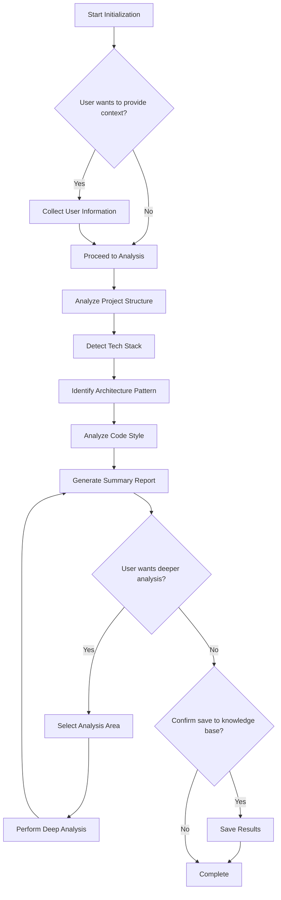

````markdown
# Project Initialization Skill

Initialize project context and perform comprehensive project analysis for AI-assisted development.

## Usage

This skill is invoked by: **Conductor** (via `#init` command)

## Overview

This skill provides a complete project initialization workflow that:
1. Gathers user-provided context about the project
2. Performs automated project structure analysis
3. Enables interactive deep-dive into specific modules
4. Persists analysis results to the AI framework knowledge base

## Capabilities

### 1. User Context Collection

Prompt user for optional project information to enhance AI understanding:

**Information to Request:**
- Project background and objectives
- Architecture design documents (links or content)
- Team coding conventions and standards
- API documentation or specifications
- Business domain glossary
- Development workflow preferences

**Collection Process:**
1. Ask user if they want to provide additional context
2. Present options as a checklist
3. For each selected option, request relevant information
4. Summarize collected information before proceeding

### 2. Automated Project Analysis

Perform comprehensive project structure analysis:

**Analysis Components:**

| Component | Analysis Focus |
|-----------|---------------|
| Tech Stack | Languages, frameworks, build tools, dependencies |
| Directory Structure | Project layout, module organization, entry points |
| Code Style | Naming conventions, formatting patterns, documentation style |
| Architecture Pattern | Detected patterns (Clean Architecture, DDD, Layered, etc.) |
| Configuration | Environment setup, config files, deployment configs |
| Testing | Test frameworks, test organization, coverage setup |

**Detection Methods:**

```yaml
# File-based detection
config_files:
  - package.json, tsconfig.json → Node.js/TypeScript
  - *.csproj, *.sln → .NET
  - pom.xml, build.gradle → Java
  - pyproject.toml, requirements.txt → Python
  - go.mod → Go
  - Cargo.toml → Rust

# Structure-based detection
directory_patterns:
  - src/Domain, src/Application, src/Infrastructure → Clean Architecture
  - Entities/, ValueObjects/, Aggregates/ → DDD
  - Controllers/, Services/, Repositories/ → Layered
  - cmd/, internal/, pkg/ → Go Standard Layout
```

### 3. Interactive Analysis

Enable user to request deeper analysis on specific areas:

**Deep-Dive Options:**
- Specific module or directory
- Dependency analysis
- API structure analysis
- Database schema detection
- Configuration analysis
- Test coverage analysis

**Interaction Flow:**
1. Present analysis summary
2. Ask if user wants deeper analysis on specific areas
3. For each selected area, perform focused analysis
4. Update results and ask again until user confirms completion

### 4. Knowledge Persistence

Save analysis results to AI framework knowledge base:

**Files to Create/Update:**

```
knowledge/principle/
├── coding-standards.md   # Auto-generated: Coding standards for detected stack
├── framework-conventions.md  # Auto-generated: Framework best practices (optional)
└── review-checklist.md  # Auto-generated: Review checklist for detected stack (optional)

knowledge/project/
├── tech-stack.md         # Technology stack details
├── architecture.md       # Architecture patterns and structure
└── glossary.md           # Domain-specific terminology

workspace/
├── context.yaml          # Updated with project info
└── changes/              # Initialization log
```

**Context.yaml Updates:**
```yaml
project:
  name: [Detected/Provided name]
  type: [Application type]
  initialized: [Timestamp]
  
tech_stack:
  language: [Primary language(s)]
  framework: [Framework(s)]
  
architecture:
  pattern: [Detected pattern]
```

## Execution Flow



## Output Format

```markdown
## Project Initialization Report

### Project Overview
- **Name**: [Project name]
- **Type**: [Application type]
- **Description**: [Brief description]

### Tech Stack Summary

| Category | Value |
|----------|-------|
| Language(s) | [e.g., TypeScript, Python] |
| Framework(s) | [e.g., Next.js, FastAPI] |
| Build Tool | [e.g., npm, poetry] |
| Test Framework | [e.g., Jest, pytest] |

### Directory Structure
\`\`\`
project/
├── [dir1]/    # [description]
├── [dir2]/    # [description]
└── ...
\`\`\`

### Architecture Analysis
- **Pattern**: [Detected pattern]
- **Modules**: [Module breakdown]
- **Dependencies**: [Key dependency relationships]

### Code Style & Conventions
- **Naming**: [Convention description]
- **Formatting**: [Tool/Style]
- **Documentation**: [Documentation approach]

### Recommendations
- [Recommendation 1]
- [Recommendation 2]

---
**Suggested Next Steps**:
- Enter `#start` to begin a development workflow
- Enter `#status` to check project status
```

## Notes

- Always confirm with user before saving to knowledge base
- Keep saved documentation concise and focused
- Update incrementally on subsequent initializations
- Preserve user-provided context across updates
````
