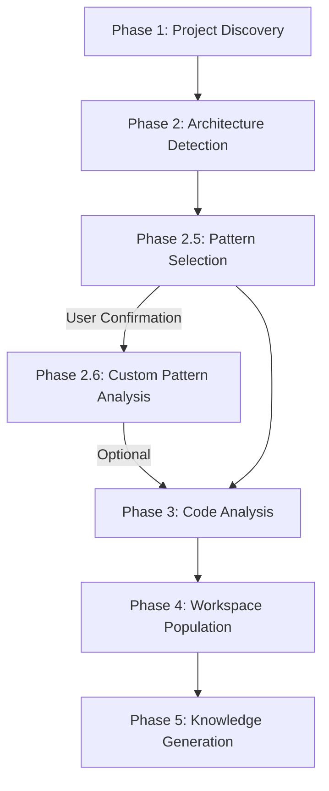
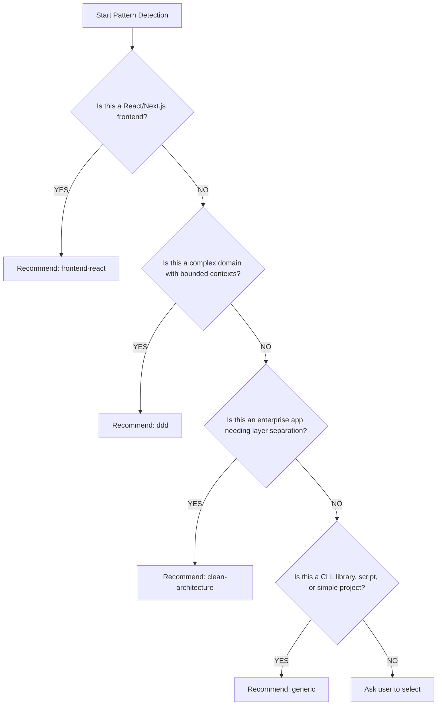
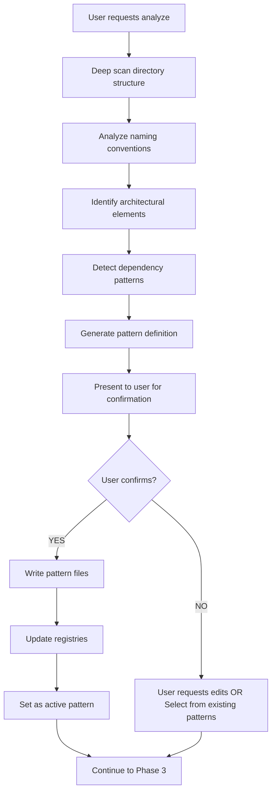
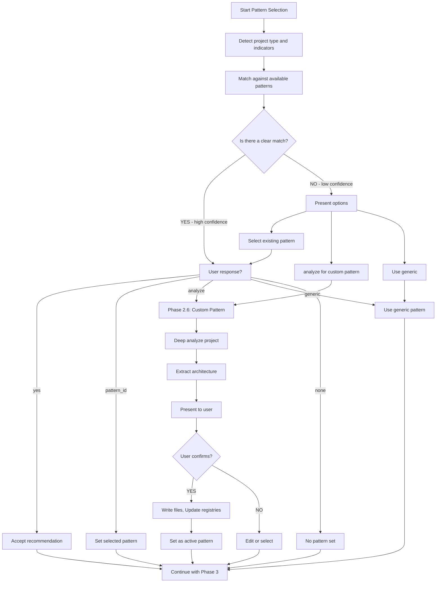

# Project Initialization Skill

Deep project analysis and workspace initialization for AI-assisted development.

## Overview

The `#init` command performs comprehensive project analysis to build a complete context for subsequent AI-assisted development. It goes beyond simple tech stack detection to extract meaningful information from the codebase.

## Command Variants

| Variant | Description | Use Case |
|---------|-------------|----------|
| `#init` | Full initialization | First time setup, major context refresh |
| `#init --light` | Quick initialization | Quick context check, minimal analysis |
| `#init --deep` | Deep code analysis | Extract entities, services, APIs from code |
| `#init --refresh` | Refresh stale context | After significant code changes |

---

## Execution Phases

Execute phases sequentially. Each phase produces outputs that feed into the next.


```mermaid
flowchart TD
    P1[Phase 1: Project Discovery] --> P2[Phase 2: Architecture Detection]
    P2 --> P2_5[Phase 2.5: Pattern Selection]
    P2_5 -->|User Confirmation| P2_6[Phase 2.6: Custom Pattern Analysis]
    P2_6 -->|Optional| P3[Phase 3: Code Analysis]
    P2_5 --> P3
    P3 --> P4[Phase 4: Workspace Population]
    P4 --> P5[Phase 5: Knowledge Generation]
```

### Phase 1: Project Discovery

**Goal**: Identify project type, tech stack, and structure.

#### Step 1.1: Detect Project Type

Check for configuration files in priority order:

```yaml
priority_1_package_managers:
  - package.json → Node.js/JavaScript/TypeScript
  - pom.xml → Maven/Java
  - build.gradle → Gradle/Java/Kotlin
  - Cargo.toml → Rust
  - go.mod → Go
  - requirements.txt → Python
  - pyproject.toml → Modern Python
  - "*.csproj" → .NET/C#
  - Gemfile → Ruby

priority_2_framework_indicators:
  - next.config.* → Next.js
  - nuxt.config.* → Nuxt.js
  - angular.json → Angular
  - vue.config.* → Vue CLI
  - vite.config.* → Vite
  - tailwind.config.* → Tailwind CSS
  - docker-compose.yml → Docker Compose

priority_3_language_indicators:
  - "*.ts, *.tsx" → TypeScript
  - "*.jsx" → React JSX
  - "*.vue" → Vue SFC
  - "*.java" → Java
  - "*.go" → Go
  - "*.rs" → Rust
  - "*.py" → Python
```

#### Step 1.2: Extract Tech Stack Details

For each detected technology, extract detailed information:

| Technology | Source File | Extract |
|------------|-------------|---------|
| Node.js | package.json | dependencies, devDependencies, scripts, engines |
| TypeScript | tsconfig.json | compilerOptions, strict, target |
| Java | pom.xml/build.gradle | dependencies, java version, plugins |
| Python | requirements.txt/pyproject.toml | dependencies, python version |
| Docker | Dockerfile, docker-compose.yml | services, ports, volumes |

**Tech Stack Detection Template:**

```markdown
## Tech Stack Detection

Reading: {config_file}
- Language: {detected}
- Framework: {detected}
- Runtime: {detected}
- Build Tool: {detected}
- Test Framework: {detected}
- ORM: {detected}
- Database: {detected}
```

#### Step 1.3: Analyze Directory Structure

Map project directory hierarchy:

```yaml
common_patterns:
  source_roots:
    - src/
    - src/main/
    - lib/
    - app/

  test_roots:
    - src/test/
    - tests/
    - __tests__/
    - test/

  layer_indicators:
    domain: ["domain/", "entities/", "models/"]
    application: ["application/", "services/", "usecases/"]
    infrastructure: ["infrastructure/", "persistence/", "data/"]
    presentation: ["presentation/", "controllers/", "api/", "routes/"]

  config_roots:
    - config/
    - configs/
    - settings/
```

**Output: Directory structure summary**

```markdown
### Directory Structure

| Directory | Purpose |
|-----------|---------|
| `{dir1}/` | {purpose} |
| `{dir2}/` | {purpose} |
| ... | ... |
```

---

### Phase 2: Architecture Detection

**Goal**: Identify architectural patterns and module organization.

#### Step 2.1: Detect Architecture Pattern

Check for known patterns by directory structure:

```yaml
ddd_indicators:
  directories: ["domain/", "application/", "infrastructure/"]
  files: ["*Repository*", "*Aggregate*", "*ValueObject*"]
  patterns: ["AggregateRoot", "DomainEvent", "Repository interface"]

clean_architecture_indicators:
  directories: ["entities/", "usecases/", "interface/", "infrastructure/"]
  principle: "Dependency inversion (outer → inner)"

mvc_indicators:
  directories: ["models/", "views/", "controllers/"]

hexagonal_indicators:
  directories: ["ports/", "adapters/", "application/"]
```

#### Step 2.2: Map Module Organization

Extract module structure from directories:

```
FOR each top-level source directory:
  1. Identify module name from directory
  2. List contained files
  3. Extract key exports (classes, functions)
  4. Identify dependencies (imports)
  5. Infer purpose from naming and contents
```

**Module Mapping Template:**

```yaml
modules:
  - name: {module_name}
    path: {directory_path}
    purpose: {inferred_purpose}
    layer: {domain|application|infrastructure|presentation}
    key_files:
      - {file1}: {brief_description}
    entities: [extracted_entity_names]
    services: [extracted_service_names]
```

---

### Phase 2.5: Pattern Selection (CRITICAL)

**Goal**: Determine the appropriate architecture pattern and confirm with user.

**IMPORTANT**: This phase MUST be executed after architecture detection and before code analysis.

#### Step 2.5.1: Pattern Detection Logic

Analyze the project to determine the most suitable pattern:

```yaml
detection_rules:

  # Frontend React Detection
  frontend_react:
    indicators:
      - "package.json contains 'react' or 'next' or 'remix'"
      - "Directory contains *.tsx, *.jsx files"
      - "next.config.* or vite.config.* present"
      - "components/, pages/, app/ directories"
    suggested_pattern: frontend-react
    confidence: high

  # DDD Detection
  ddd:
    indicators:
      - "domain/ directory with entities, value-objects"
      - "Files matching *Repository*, *Aggregate*, *DomainEvent*"
      - "application/ with services/use cases"
      - "infrastructure/ for persistence"
    suggested_pattern: ddd
    confidence: high

  # Clean Architecture Detection
  clean_architecture:
    indicators:
      - "entities/ or core/ directory"
      - "usecases/ or application/ directory"
      - "Clear layer separation with dependency inversion"
    suggested_pattern: clean-architecture
    confidence: medium

  # Generic (Fallback)
  generic:
    indicators:
      - "No clear architecture pattern detected"
      - "Simple project structure"
      - "CLI tool, library, or script"
    suggested_pattern: generic
    confidence: medium
```

#### Step 2.5.2: Pattern Recommendation Decision Tree


```mermaid
flowchart TD
    START[Start Pattern Detection] --> Q1{Is this a React/Next.js frontend?}
    Q1 -->|YES| REACT[Recommend: frontend-react]
    Q1 -->|NO| Q2{Is this a complex domain with bounded contexts?}
    Q2 -->|YES| DDD[Recommend: ddd]
    Q2 -->|NO| Q3{Is this an enterprise app needing layer separation?}
    Q3 -->|YES| CLEAN[Recommend: clean-architecture]
    Q3 -->|NO| Q4{Is this a CLI, library, script, or simple project?}
    Q4 -->|YES| GENERIC[Recommend: generic]
    Q4 -->|NO| ASK[Ask user to select]
```

#### Step 2.5.3: User Confirmation

**ALWAYS confirm pattern selection with user before proceeding.**

Use the following format:

```markdown
### Architecture Pattern Selection

Based on project analysis:

| Detected Pattern | Confidence |
|------------------|------------|
| {pattern_name} | {high/medium/low} |

**Reasoning**: {brief explanation of why this pattern was suggested}

**Available Patterns**:
1. `ddd` - Domain-Driven Design (complex domains)
2. `clean-architecture` - Layer separation with dependency inversion
3. `frontend-react` - React/Next.js frontend applications
4. `generic` - Simple projects without specific architecture

**Recommended**: `{suggested_pattern}`

Do you want to use the recommended pattern, or select a different one?
- Reply `yes` to accept recommendation
- Reply with pattern name to select different pattern (e.g., `generic`)
- Reply `analyze` to let me analyze your project and create a custom pattern
- Reply `none` to proceed without a pattern
```

---

### Phase 2.6: Custom Pattern Analysis & Generation (Optional)

**Triggered when**: User replies `analyze` during pattern selection, or when no pattern matches and user wants custom analysis.

**Goal**: Deep-analyze the project structure to extract its unique architectural characteristics and create a custom pattern definition.

#### Step 2.6.1: Pattern Analysis Process

When user requests custom pattern analysis:

```markdown
### Custom Pattern Analysis

I'll analyze your project to identify its unique architectural characteristics.

**Analysis Plan**:
1. Scan directory structure for layer/module patterns
2. Identify naming conventions and file organization
3. Extract key architectural elements (entities, services, etc.)
4. Detect dependency flow and module relationships
5. Document the pattern's rules and guidelines

This may take a moment. Shall I proceed? (yes/no)
```

#### Step 2.6.2: Deep Structure Analysis

Perform comprehensive analysis:

```yaml
analysis_dimensions:

  # 1. Directory Structure Analysis
  directory_analysis:
    - "List all top-level source directories"
    - "Identify layer indicators (e.g., core/, features/, modules/)"
    - "Map subdirectory patterns"
    - "Identify shared vs feature-specific code locations"

  # 2. File Naming Patterns
  naming_analysis:
    - "Extract file naming conventions from existing files"
    - "Identify suffix patterns (e.g., *.service.ts, *.controller.ts)"
    - "Detect test file location and naming"

  # 3. Code Organization Patterns
  code_organization:
    - "Identify primary export patterns"
    - "Detect module boundaries"
    - "Analyze import/dependency patterns"

  # 4. Architectural Elements
  architectural_elements:
    - "Identify entity-like structures"
    - "Find service/function groups"
    - "Locate configuration patterns"
    - "Identify API/entry point patterns"
```

#### Step 2.6.3: Pattern Extraction Template

After analysis, extract the following:

```yaml
# Pattern Definition Template
pattern_id: "{generated_kebab_case_id}"
pattern_name: "{Human Readable Name}"
description: "{Brief description of the architectural style}"

# Detected characteristics
characteristics:
  directory_structure:
    layers:
      - name: "{layer_name}"
        path: "{directory_path}"
        purpose: "{inferred_purpose}"
        contains:
          - "{content_type_1}"
          - "{content_type_2}"

  naming_conventions:
    files:
      - pattern: "{pattern}"
        example: "{example_file}"
        purpose: "{purpose}"
    identifiers:
      - element: "class"
        convention: "PascalCase"
      - element: "function"
        convention: "camelCase"

  module_organization:
    style: "{feature-based|layer-based|hybrid}"
    feature_directory: "{feature_path}"
    shared_directory: "{shared_path}"

  dependency_rules:
    - from: "{source_layer}"
      to: "{target_layer}"
      allowed: true|false
      reason: "{reason}"

  key_entities:
    - name: "{entity_name}"
      file_pattern: "{pattern}"
      purpose: "{purpose}"

  key_services:
    - name: "{service_name}"
      file_pattern: "{pattern}"
      purpose: "{purpose}"
```

#### Step 2.6.4: User Confirmation of Analysis

Present analysis results to user:

```markdown
### Custom Pattern Analysis Results

I've analyzed your project and identified the following architecture:

## Detected Architecture: "{Pattern Name}"

### Directory Structure
\`\`\`
{visualized structure}
\`\`\`

### Key Characteristics
| Aspect | Pattern |
|--------|---------|
| Organization Style | {feature-based/layer-based/hybrid} |
| Module Boundaries | {description} |
| Naming Convention | {pattern} |
| Dependency Flow | {description} |

### Architectural Rules Detected
1. {Rule 1}
2. {Rule 2}
3. {Rule 3}

### Elements Identified
| Type | Count | Examples |
|------|-------|----------|
| Entities | {n} | {examples} |
| Services | {n} | {examples} |
| Modules | {n} | {examples} |

---

**Proposed Pattern ID**: `{generated_id}`

**Does this accurately represent your project's architecture?**
- Reply `yes` to create this pattern
- Reply `edit` to make adjustments
- Reply `cancel` to select from existing patterns
```

#### Step 2.6.5: Generate Pattern Files

If user confirms, write the following files:

**File 1: manifest.yaml**

Write to `knowledge/patterns/{pattern_id}/manifest.yaml`:

```yaml
id: "{pattern_id}"
type: "pattern"
name: "{pattern_name}"
version: "1.0"
description: "{description}"
generated: true
generated_at: "{ISO_timestamp}"
generated_from: "project analysis"

token_estimate:
  total: {estimated_tokens}
  breakdown:
    - file: overview.md
      tokens: {tokens}
      load_priority: 1

loading:
  priority: 5
  auto_load: false

files:
  - path: "overview.md"
    description: "Pattern overview and guidelines"
    required: true
    tokens: {tokens}

attributes:
  terminology:
    {key_term}: "{term_name}"

  checklist:
    - "{checklist_item_1}"
    - "{checklist_item_2}"

scenarios:
  - name: "Code review"
    files: ["overview.md"]

applicable_project_types:
  - {project_type}
```

**File 2: overview.md**

Write to `knowledge/patterns/{pattern_id}/overview.md`:

```markdown
# {Pattern Name}

{Description}

## When This Pattern Applies

This pattern was automatically extracted from your project's existing architecture.

## Directory Structure

\`\`\`
{visualized_structure}
\`\`\`

## Layer Responsibilities

### {Layer 1}
- **Path**: `{directory_path}`
- **Purpose**: {purpose}
- **Contains**: {content_types}

### {Layer 2}
- **Path**: `{directory_path}`
- **Purpose**: {purpose}

## Naming Conventions

| Element | Convention | Example |
|---------|------------|---------|
| {Element} | {Convention} | `{Example}` |

## Module Organization

{Description of how modules are organized}

## Dependency Rules

1. {Rule 1}
2. {Rule 2}

## Code Examples

### Creating a New {Element}

\`\`\`{language}
// Example code showing the pattern
\`\`\`

## Checklist

- [ ] {Checklist item 1}
- [ ] {Checklist item 2}
- [ ] {Checklist item 3}

## Anti-Patterns to Avoid

- {Anti-pattern 1}
- {Anti-pattern 2}
```

#### Step 2.6.6: Update Pattern Registry

After generating pattern files:

1. **Update `knowledge/patterns/manifest.yaml`**:

```yaml
# Add to available list
- id: {pattern_id}
  name: {pattern_name}
  path: {pattern_id}/
  manifest: {pattern_id}/manifest.yaml
  description: {description}
  generated: true
  suitable_for: [{project_type}]
  files:
    - overview.md
```

2. **Update `config.yaml`**:

```yaml
# Add to pattern.available
- id: {pattern_id}
  name: {pattern_name}
  description: {description}
  suitable_for: [{project_type}]
```

3. **Update `registry.yaml`**:

```yaml
# Add to knowledge_packs
- id: {pattern_id}
  path: knowledge/patterns/{pattern_id}/
  conditional: "pattern.active == '{pattern_id}'"
  priority: 5
  files: [overview.md]
  summary: {description}
```

#### Step 2.6.7: Set Active Pattern

```yaml
# In project.yaml
patterns:
  active: "{pattern_id}"
  detected: []
  custom: true
  generated_at: "{ISO_timestamp}"
  confirmed_by_user: true
```

---

### Pattern Generation Flow Diagram


```mermaid
flowchart TD
    A[User requests analyze] --> B[Deep scan directory structure]
    B --> C[Analyze naming conventions]
    C --> D[Identify architectural elements]
    D --> E[Detect dependency patterns]
    E --> F[Generate pattern definition]
    F --> G[Present to user for confirmation]
    G --> H{User confirms?}
    H -->|YES| I[Write pattern files]
    I --> J[Update registries]
    J --> K[Set as active pattern]
    H -->|NO| L[User requests edits OR Select from existing patterns]
    K --> M[Continue to Phase 3]
    L --> M
```

#### Step 2.5.4: Pattern Selection Rules

| Situation | Action |
|-----------|--------|
| User accepts recommendation | Set `pattern.active` to recommended pattern |
| User selects different pattern | Set `pattern.active` to user's choice |
| User says "none" or "skip" | Set `pattern.active` to empty string |
| User wants custom pattern | Note: Custom patterns can be added to `knowledge/patterns/` |

#### Step 2.5.5: Output of Pattern Selection

After user confirmation, record the decision:

```yaml
# In project.yaml
patterns:
  active: "{selected_pattern}"
  detected: [list of patterns that had indicators]
  confirmed_by_user: true
  selection_reason: "{reason}"
```

---

### Phase 3: Code Analysis

**Goal**: Extract entities, services, and relationships from code.

**Note**: This phase is mandatory for `--deep` mode. For standard mode, perform lightweight analysis.

#### Step 3.1: Entity Extraction

Scan source files for domain entities:

```yaml
entity_patterns:
  typescript:
    - "class {Name} { ... }"
    - "interface {Name} { ... }"
    - "type {Name} = { ... }"
    - "@Entity" decorator
    - "Schema" definitions

  java:
    - "@Entity, @MappedSuperclass"
    - "public class {Name}"

  python:
    - "class {Name}(Model):"
    - "@dataclass"
    - "class {Name}(BaseModel):" # Pydantic
```

**Extract for each entity:**

```yaml
entities:
  - name: User
    type: entity | value_object | aggregate_root
    file: src/domain/User.ts
    properties:
      - name: id, type: string
      - name: email, type: string
    relationships:
      - type: hasMany, target: Order
```

#### Step 3.2: Service Extraction

Scan for service classes and functions:

```yaml
service_indicators:
  file_patterns:
    - "*Service.ts"
    - "*Service.java"
    - "*_service.py"

  decorators:
    - "@Service"
    - "@Injectable"
    - "@Component"
```

**Extract for each service:**

```yaml
services:
  - name: UserService
    file: src/application/UserService.ts
    module: user-management
    methods:
      - createUser
      - updateUser
      - deleteUser
    dependencies:
      - IUserRepository
      - EmailService
```

#### Step 3.3: API Endpoint Extraction (if applicable)

```yaml
api_indicators:
  - "@Controller, @RestController"
  - "router.get/post/put/delete"
  - "app.get/post/put/delete"
  - "@Get, @Post, @Put, @Delete"
```

**Extract endpoints:**

```yaml
api_endpoints:
  - path: /api/users
    method: GET
    handler: UserController.findAll
    module: user-management
```

---

### Phase 4: Workspace Population

**Goal**: Fill all workspace files with extracted information.

**CRITICAL**: You MUST write actual content to these files using the Write tool.

#### Step 4.1: Write project.yaml

Write to `workspace/context/project.yaml`:

```yaml
project:
  name: "{project_name}"
  description: "{description}"
  type: "{web-app|api|library|cli}"
  initialized_at: "{ISO_timestamp}"

tech_stack:
  language: "{language}"
  runtime: "{runtime}"
  framework: "{framework}"
  build_tool: "{build_tool}"
  test_framework: "{test_framework}"
  database: "{database}"
  orm: "{orm}"

  dependencies:
    core: [list of main dependencies]
    dev: [list of dev dependencies]

patterns:
  active: "{primary_pattern}"
  detected: [list of detected patterns]

structure:
  source_root: "{src_directory}"
  test_root: "{test_directory}"
  config_root: "{config_directory}"
  module_count: {count}
```

#### Step 4.2: Write architecture.yaml

Write to `workspace/context/architecture.yaml`:

```yaml
architecture:
  pattern: "{detected_pattern}"
  style: "{monorepo|microservice|monolith}"

modules:
  - name: {module_name}
    path: {module_path}
    purpose: {purpose}
    layer: {layer}
    entities: [entity_names]
    services: [service_names]

interfaces:
  - name: {interface_name}
    purpose: {purpose}
    module: {module_name}

decisions:
  - topic: "Initial Architecture"
    choice: "{pattern}"
    date: "{ISO_date}"
    reason: "Detected from project structure"

dependencies:
  external: [list of external dependencies]
  internal: [list of internal module dependencies]
```

#### Step 4.3: Write code-mapping.yaml

Write to `workspace/state/code-mapping.yaml`:

```yaml
version: "1.0"
last_updated: "{ISO_timestamp}"

files:
  "{file_path}":
    entities: [entity_names]
    services: [service_names]
    exports: [exported_names]
    last_analyzed: "{ISO_timestamp}"

entities:
  "{entity_name}":
    files:
      - "{definition_file}"
    type: "{entity_type}"
    module: "{module_name}"

modules:
  "{module_name}":
    path: "{module_path}"
    files: [file_paths]
    entities: [entity_names]
    services: [service_names]

stats:
  total_files_tracked: {count}
  total_entities: {count}
  total_services: {count}
  last_sync: "{ISO_timestamp}"
```

#### Step 4.4: Write semantic-index.yaml

Write to `workspace/state/semantic-index.yaml`:

```yaml
version: "1.0"
last_updated: "{ISO_timestamp}"

by_topic:
  "{topic}":
    - file: "{file_path}"
      relevance: high|medium|low

by_entity:
  "{entity_name}":
    definition:
      file: "{file_path}"
    type: "{entity_type}"

by_keyword:
  "{keyword}":
    - file: "{file_path}"
      context: "{usage_context}"

stats:
  total_topics: {count}
  total_entities: {count}
  total_keywords: {count}
```

#### Step 4.5: Write session.yaml

Write to `workspace/state/session.yaml`:

```yaml
session:
  id: "{session_id}"
  started_at: "{ISO_timestamp}"
  last_agent: "conductor"

project:
  initialized: true
  init_completed_at: "{ISO_timestamp}"

workflow:
  active_workflow: ""
  current_phase: "initialized"
```

---

### Phase 5: Knowledge Generation

**Goal**: Create project-specific knowledge files.

#### Step 5.1: Write tech-stack.md

Write to `knowledge/project/tech-stack.md`:

```markdown
# Technology Stack

## Runtime & Language
- **Runtime**: {runtime}
- **Language**: {language}
- **Version**: {version}

## Framework
- **Framework**: {framework}
- **Version**: {version}

## Database
- **Primary**: {database}
- **ORM**: {orm}

## Build & Test
- **Build Tool**: {build_tool}
- **Test Framework**: {test_framework}

## Key Dependencies

| Package | Version | Purpose |
|---------|---------|---------|
| {name} | {version} | {purpose} |

## Common Commands

| Command | Description |
|---------|-------------|
| `{cmd}` | {description} |
```

#### Step 5.2: Write coding-standards.md (without --light)

Write to `knowledge/principle/coding-standards.md`:

```markdown
# Coding Standards

## Language Conventions

{Based on detected language and existing code patterns}

## Naming Conventions

| Element | Convention | Example |
|---------|------------|---------|
| Class | PascalCase | `UserService` |
| Function | camelCase | `getUserById` |
| Constant | UPPER_SNAKE | `MAX_RETRY_COUNT` |
| File | {detected_pattern} | `{pattern_example}` |

## File Organization

{Based on project structure analysis}

## Import Patterns

{Extracted from codebase}

## Error Handling

{Detected patterns}

## Testing Standards

{Based on test file analysis}
```

---

## Output Templates

### Pattern Selection Prompt

```markdown
### Architecture Pattern Selection

I've analyzed your project and need to confirm the architecture pattern.

**Project Type Detected**: {project_type} (e.g., web-app, cli, api)
**Tech Stack**: {language} / {framework}

**Pattern Recommendation**:

| Pattern | Match | Reason |
|---------|-------|--------|
| {recommended} | [x] Recommended | {reason} |

**All Available Patterns**:

| ID | Name | Best For |
|----|------|----------|
| `ddd` | Domain-Driven Design | Complex business domains, bounded contexts |
| `clean-architecture` | Clean Architecture | Enterprise apps, layer separation |
| `frontend-react` | Frontend (React) | React/Next.js web applications |
| `generic` | Generic Project | CLI, libraries, simple projects |

**My Recommendation**: `{recommended_pattern}`

Please confirm:
- Reply `yes` to accept recommendation
- Reply with a pattern ID to select different (e.g., `generic`)
- Reply `analyze` to let me analyze your project and create a custom pattern
- Reply `none` to proceed without architecture pattern
```

### Pattern Selection with Low Confidence

When no pattern can be confidently detected:

```markdown
### Architecture Pattern Selection

I couldn't confidently match your project to an existing pattern.

**Project Type Detected**: {project_type}
**Tech Stack**: {language} / {framework}

**What I found**:
- {Finding 1}
- {Finding 2}
- {Finding 3}

**Options**:
1. **Select existing pattern** - Choose from the list above
2. **Analyze and create custom** - I'll deeply analyze your project structure and create a custom pattern definition
3. **Use generic** - Proceed with minimal architectural guidance

Please choose:
- Reply with pattern ID (e.g., `ddd`, `clean-architecture`)
- Reply `analyze` to create a custom pattern from your project
- Reply `generic` to use the generic pattern
```

### Success Output (Standard Mode)

```markdown
## Project Initialization Complete

### Project Overview
| Property | Value |
|----------|-------|
| Name | {project_name} |
| Type | {project_type} |
| Pattern | {architecture_pattern} |

### Tech Stack Detected
| Category | Technology |
|----------|------------|
| Language | {language} |
| Framework | {framework} |
| Database | {database} |
| Build Tool | {build_tool} |

### Analysis Results
- **Modules**: {count} detected
- **Entities**: {count} identified
- **Services**: {count} found
- **Files Analyzed**: {count}

### Workspace Files Updated
- [x] `workspace/context/project.yaml` - Project info
- [x] `workspace/context/architecture.yaml` - Module structure
- [x] `workspace/state/code-mapping.yaml` - File mappings
- [x] `workspace/state/semantic-index.yaml` - Topic index
- [x] `workspace/state/session.yaml` - Session state
- [x] `knowledge/project/tech-stack.md` - Stack documentation

### Architecture Summary
{Brief description of detected architecture}

---
**Suggested Next Steps**:
- `#analyze {your_requirements}` - Start requirements analysis
- `#status` - View project status
```

### Light Mode Output

```markdown
## Quick Initialization Complete

### Detected Stack
- **Language**: {language}
- **Framework**: {framework}
- **Type**: {project_type}

### Workspace
- [x] `project.yaml` - Basic info
- [x] `session.yaml` - Session created

Use `#init` (full) for complete analysis.
```

---

## Exception Handling

| Exception | Detection | Action |
|-----------|-----------|--------|
| Empty directory | No source files | Prompt: "This is a new project. What would you like to build?" |
| Multiple projects | Multiple config files | Ask user to select primary project |
| Unrecognized stack | No known config files | Ask user to describe tech stack |
| Large codebase | > 500 source files | Use --light mode, suggest `#init --deep {directory}` |
| Permission error | Cannot read files | Report and suggest alternatives |
| Pattern mismatch | Detected pattern doesn't match available patterns | Offer: 1) Select existing, 2) `analyze` for custom, 3) Use `generic` |
| User rejects pattern | User says "no" or wants different pattern | Offer full list + `analyze` option |
| Custom analysis fails | Cannot extract clear pattern from codebase | Fall back to `generic`, explain what was found |
| Pattern ID conflict | Generated ID already exists | Append timestamp or ask user for ID |

---

## User Interaction

### Required Prompts

| Situation | Question |
|-----------|----------|
| New/empty project | "This appears to be a new project. What would you like to build?" |
| Cannot determine type | "Is this a web-app, API, library, or CLI?" |
| Multiple stacks | "Multiple tech stacks detected. Which is primary?" |
| **Pattern selection** | **"Detected {pattern}. Confirm, or reply `analyze` to create a custom pattern?"** |

### Pattern Selection Options

| User Reply | Action |
|------------|--------|
| `yes` | Accept recommended pattern |
| `{pattern_id}` | Select specific pattern (e.g., `ddd`, `frontend-react`) |
| `analyze` | Trigger Phase 2.6: Deep analysis and custom pattern generation |
| `generic` | Use generic pattern (minimal guidance) |
| `none` | Proceed without any architecture pattern |

### Optional Confirmations

| Situation | Question | Default |
|-----------|----------|---------|
| Large project | "Full analysis may take time. Continue?" | Yes |
| Pattern confidence low | "Could not confidently detect pattern. Would you like me to analyze your project structure?" | Offer `analyze` |
| Custom pattern preview | "Does this accurately represent your project's architecture?" | Show edit options |

### Pattern Selection Flow


```mermaid
flowchart TD
    START[Start Pattern Selection] --> DETECT[Detect project type and indicators]
    DETECT --> MATCH[Match against available patterns]
    MATCH --> CLEAR{Is there a clear match?}

    CLEAR -->|YES - high confidence| USER_RESP[User response?]
    CLEAR -->|NO - low confidence| OPTIONS[Present options]
    OPTIONS --> OPT1[Select existing pattern]
    OPTIONS --> OPT2[analyze for custom pattern]
    OPTIONS --> OPT3[Use generic]

    USER_RESP -->|yes| ACCEPT[Accept recommendation]
    USER_RESP -->|pattern_id| SET[Set selected pattern]
    USER_RESP -->|analyze| CUSTOM[Phase 2.6: Custom Pattern]
    USER_RESP -->|generic| USE_GENERIC[Use generic pattern]
    USER_RESP -->|none| NO_PATTERN[No pattern set]

    CUSTOM --> DEEP[Deep analyze project]
    DEEP --> EXTRACT[Extract architecture]
    EXTRACT --> PRESENT[Present to user]
    PRESENT --> CONFIRM{User confirms?}
    CONFIRM -->|YES| WRITE[Write files, Update registries]
    CONFIRM -->|NO| EDIT[Edit or select]
    WRITE --> SET_ACTIVE[Set as active pattern]

    ACCEPT --> CONTINUE[Continue with Phase 3]
    SET --> CONTINUE
    SET_ACTIVE --> CONTINUE
    USE_GENERIC --> CONTINUE
    NO_PATTERN --> CONTINUE
    EDIT --> CONTINUE
    OPT1 --> USER_RESP
    OPT2 --> CUSTOM
    OPT3 --> USE_GENERIC
```

---

## Notes

- Always WRITE actual content to workspace files using Write tool
- Keep workspace files concise but meaningful
- Preserve existing user customizations when refreshing
- Report what was analyzed and what was skipped
