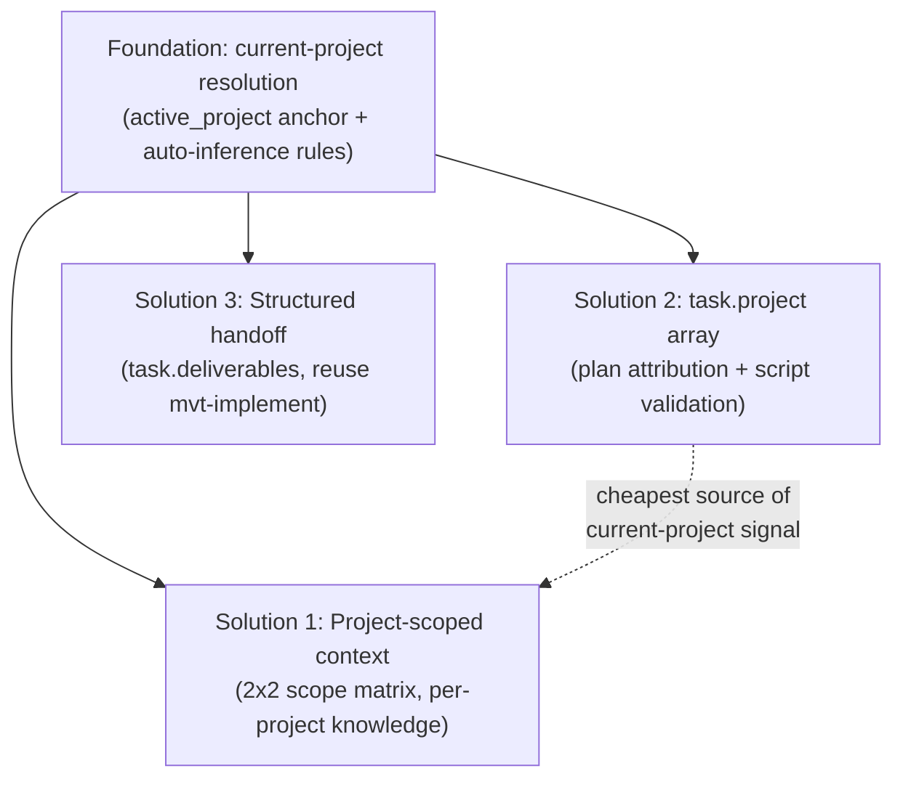

# Requirements Analysis: Multi-Project Workflow Support (OPT-2026-002)

> Source proposal: `docs/proposals/OPT-2026-002-multi-project-workflow-support.md` (v2.4)
> Change-id: `20260605-multi-project-workflow-support`
> Scope: skill instruction layer + data schema layer + two deterministic scripts.

## Feature Overview

Make the MVTT **workflow layer** project-aware so that a single MVTT workspace can drive a multi-project (monorepo) repository, while preserving today's single-project behavior with zero new prompts.

The **data layer** already supports multi-project indexing (`project-context.yaml > projects[]` with `name`/`path`/`type`/`tech_stack`, and `mvt-analyze-code --all`/`{name}`). The gap is entirely in the layers built on top of that index: context is loaded globally, plan tasks have no project attribution, progress is not grouped per project, and cross-project handoffs are not persisted.

The feature decomposes into three solutions over one shared foundation:

## Actors

| Actor | Role in this feature |
|-------|----------------------|
| Framework user (developer) | Works in a multi-project repo through one MVTT workspace; never required to pass `--project`; picks from offered options only when inference is ambiguous |
| Workflow skills (project-aware consumers) | `mvt-implement`, `mvt-plan-dev`, `mvt-update-plan`, `mvt-analyze-code`, `mvt-sync-context`, `mvt-status`, `mvt-check-context`, `mvt-resume`, `mvt-manage-context`, `mvt-init` |
| Activation protocol | Resolves the current project set (PS) + current skill (S), then loads the union of the four scope quadrants |
| Deterministic scripts | `plan-update.js` (validation + deliverables pointer + stale marking) and `session-update.js` (active_project anchor) |
| `mvt-analyze-code` / `mvt-sync-context` | Produce/route the per-project `project-context.md` semantic files |

## Requirements

### Foundation (4.0) — Current-Project Resolution

- **F-1** Add `active_project` to `session.yaml` (single-project = empty / `"default"`); framework-maintained, never user-set.
- **F-2** Add a `project` field to plan tasks (see Solution 2).
- **F-3** Activation resolves the current project set (PS) automatically, by priority: (1) active plan's `current_task.project`; (2) `session.active_project`; (3) file-path reverse lookup against `projects[].path`/`source_paths`; (4) structural fallback.
- **F-4** Structural fallback: single-project repo → use the sole project with **no prompt**; multi-project + still ambiguous → **offer candidate options** (smart-preselected from path/anchor hits), never silently load everything, never demand a typed param.
- **F-5 (RESOLVED)** The single-project backward-compat collapse triggers on **`projects.length == 1`**, independent of the project's `name`. When the index has one entry, PS = that sole project, all scoping logic is a no-op, and no new prompts fire. The `"default"` name is a convention, not the gate. *(Decision recorded below; reconciles the proposal's interchangeable use of `name=="default"` and `length==1`.)*

### Solution 1 (4.1) — Project-Scoped Context (2x2 orthogonal model)

- **S1-1** Knowledge has two orthogonal axes: **skill axis** (all skills vs specific skill) and **project axis** (all projects vs specific project), forming a 2x2 matrix:

  |  | All skills | Specific skill |
  |---|---|---|
  | All projects | (1) global shared: `core` | (2) global per-skill |
  | Per project | (3) project shared: that project's `project-context.md` | (4) **project x skill**: e.g. front-end coding-standard loaded only when implementing/reviewing front-end |

- **S1-2 (Layer 1)** Split `mvt-analyze-code` output: single-project keeps flat `knowledge/project/_generated/project-context.md`; multi-project writes `knowledge/project/_generated/{name}/project-context.md` per project.
- **S1-3 (Layer 2)** Project-level user knowledge (coding-standards etc.) also lives under `{name}/` subdirectories, parallel to semantic files; single/global stays flat.
- **S1-4 (Layer 3)** Restructure `registry.yaml`: every `knowledge` block (top-level and `skills.<name>.knowledge`) becomes a **map keyed by project name**, with reserved key `_all` meaning "all projects." Skill axis = which layer; project axis = which key.
  - Breaking change: `knowledge.shared` (list) → `knowledge._all`; `skills.<name>.knowledge` (flat list) → `skills.<name>.knowledge._all`; multi-project `project-context` moves to `knowledge.<projectName>`.
- **S1-5 (Layer 4)** Activation loads the union (pure key lookup, no scanning): `knowledge._all` + for each P in PS `knowledge[P]` + `skills[S].knowledge._all` + for each P in PS `skills[S].knowledge[P]`. Missing `[P]` keys are silently skipped. Cross-project tasks load the **union** of all involved projects' knowledge.
- **S1-6** `mvt-implement` (and `mvt-review`/`mvt-test`/`mvt-refactor`) must stop hardcoding a single `coding-standards.md` path; they consume the standard injected by activation per current-project x skill.
- **S1-7 (Layer 5)** `mvt-manage-context` add/move asks two option-form questions (scope: global vs project; breadth: all skills vs specific skill), mapping to the four quadrants and the corresponding registry key. `list`/`remove`/`check-context` must recognize the new map (with `_all`) structure.

### Solution 2 (4.2) — Plan Task Project Attribution

- **S2-1** Add `project` to plan task schema as an **array**; each element must match a `projects[].name`.
- **S2-2** Most tasks are single-element; genuinely cross-project tasks list real projects (`["web","api"]`) — no pseudo-projects like `shared`/`root`.
- **S2-3** Validation lives in `plan-update.js`, not the LLM (consistent with "plan.yaml mutated by script, not model"). `mvt-plan-dev` Step 5 adds the same check at creation.
- **S2-4** `mvt-plan-dev` auto-infers `project` from analysis/design artifact paths; only asks (multi-select options) when a task can't be uniquely attributed.
- **S2-5** Granularity guidance: prefer one-task-one-project; multi-element only for cohesive cross-project work, not as a substitute for splitting.

### Solution 3 (4.3) — Structured Task Handoff (Plan A: extend schema, reuse skill)

- **S3-1** Add `deliverables` to the plan task schema. **Content** is free-structured Markdown accumulated in `implementation.md` (single-file accumulation); `plan.yaml`'s `task.deliverables` holds only a lightweight pointer + freshness flag (`current`/`stale`).
- **S3-2** Deliverables capture the **contract downstream tasks consume** (API shape, exported types) — the gap that file lists and prose don't structure. A soft section skeleton (e.g. "Public Interface / Data Shapes / Usage Constraints") guides but is not validated.
- **S3-3** `mvt-implement` maintains deliverables **interactively** (not silent auto-generation).
- **S3-4** Downstream tasks (those listing the task in `depends_on`) auto-load the upstream `deliverables` at execution.
- **S3-5 (interaction a)** On task completion, `mvt-implement` does a reverse-dependency lookup. If downstream consumers exist → prompt to generate/update deliverables (smart default = yes, list dependents). No downstream → skip silently.
- **S3-6 (interaction b)** When a task that already has deliverables is re-implemented/rescoped and has downstream consumers → prompt to update; regardless of the answer, mark downstream-consumed deliverables `stale` via `plan-update.js` so `mvt-resume`/`mvt-status` can surface "downstream may need review."
- **S3-7** All `plan.yaml` writes still go through `plan-update.js`; interaction (y/n) happens at the skill layer only.

### Script Impact (4.4)

- **SC-1 (plan-update.js #1)** Add `--projects "web,api"` (caller-supplied valid names read from `project-context.yaml`). When provided and count > 1, each task's `project` array must be non-empty with every element in the list. Missing/`default`-only list → absent `project` allowed (treated as `["default"]`), preserving today's behavior. Gating lives in `validatePlan`. Script keeps its "no project-root awareness" mechanical style (caller-passes-args chosen; self-reading project root rejected).
- **SC-2 (plan-update.js #2)** Add e.g. `--deliverables-pointer <ptr>` to `applyUpdate` writing `task.deliverables` pointer + `current`; freshness enum optionally added to `validatePlan`.
- **SC-3 (plan-update.js #3)** Add reverse-stale marking (e.g. `--mark-deliverable-stale <task_id>`) — mechanical reverse-dependency logic. Orthogonal to `recomputeCurrentTask` and `findCycle`.
- **SC-4 (session-update.js #1)** Add `--set-active-project <name|csv>` (PS is now a set; supports comma-separated). Persists the resolved current-project set as the priority-2 session anchor.
- **SC-5** Free transitive guarantee: both scripts are full `parseYaml → mutate → stringifyYaml` round-trips, so unknown new fields (`task.project`, `task.deliverables`, `session.active_project`) are auto-preserved even before the scripts learn to validate/write them. (Existing cost: `yaml` parse→stringify drops comments — pre-existing, out of scope.)

### Adjacent Optimizations (Section 6 — required for usability)

- **A-1** `mvt-init`: detect monorepo sub-projects and populate `projects[]` with multiple entries (the entry point — without it the index stays single).
- **A-2** `mvt-status`: group progress per project ("front-end 3/5, back-end 2/4").
- **A-3** `mvt-check-context`: account tokens per project; fix the "loaded by every skill" estimate now that `project-context` is no longer global; recognize the new map structure including the project x skill quadrant.
- **A-4** `mvt-sync-context`: route aggregated knowledge to the correct per-project semantic file by the change/task's project.
- **A-5** `mvt-resume` / DAG advance: make cross-project `current_task` switches explicitly visible so users don't stay in the wrong context.

## Domain Concepts

| Concept | Definition |
|---------|------------|
| Project (sub-project) | One entry in `project-context.yaml > projects[]` (`name`/`path`/`type`/`tech_stack`); the unit of scoping |
| `active_project` | New `session.yaml` anchor recording the last-resolved current project set; framework-maintained |
| Current project set (PS) | The set of projects a skill invocation operates on; single-element for normal tasks, multi-element for cross-project tasks |
| Scope matrix (2x2) | Orthogonal skill-axis x project-axis classification of knowledge into four quadrants |
| `_all` reserved key | Map key meaning "all projects," following the repo's `_framework`/`_generated`/`_archived` underscore-reserved convention |
| `task.project` | Array of project names a plan task belongs to; validated against `projects[].name` |
| `deliverables` | A task's downstream-facing contract; free-structured Markdown in `implementation.md` + lightweight pointer/freshness flag in `plan.yaml` |
| Freshness (`current`/`stale`) | Whether a downstream-consumed deliverable is still trustworthy after an upstream re-implementation |
| Reverse-dependency lookup | Finding tasks whose `depends_on` includes a given task; drives both interaction triggers and stale marking |

## Business Rules

- **BR-1 (RESOLVED: backward-compat trigger)** When `projects.length == 1`, all project-scoping logic collapses to today's behavior with zero new prompts; PS = the sole project. The trigger is the **count**, not the name — `name` is cosmetic when single.
- **BR-2** Activation never silently loads all projects in a multi-project repo; on ambiguity it offers smart-preselected options. Users always "pick from offered options," never "recall and type a param."
- **BR-3** `plan.yaml` mutations (project validation, deliverables pointer, freshness, stale marking) are deterministic script logic, never LLM judgment; y/n interaction is skill-layer only. *(Consistent with the recorded MVTT determinism decision.)*
- **BR-4** Prefer extending schema over adding skills: Solution 3 reuses `mvt-implement`; the heavyweight "dedicated handoff skill" (Plan B) is deferred until structured `deliverables` proves insufficient.
- **BR-5** Deliverables interaction fires only when downstream consumers actually exist (reverse-dep hit); no consumers → no prompt.
- **BR-6** `task.project` validation: when `--projects` count > 1, array non-empty and every element ∈ valid names; otherwise absent allowed and defaulted to `["default"]`.
- **BR-7** Cross-project tasks load the **union** of involved projects' quadrant-3 and quadrant-4 knowledge.
- **BR-8** Registry restructure is a **breaking change** accepted under the green-field premise: old `shared`/flat lists move under `_all`; single-project repos use only `_all` (equivalent to today plus one nesting level).
- **BR-9 (RESOLVED: migration)** Existing flat multi-project workspaces auto-split into the `_generated/{name}/` layout (and corresponding registry keys) on the **next `/mvt-analyze-code --all`** — implicit migration, lowest friction. New/single-project workspaces are unaffected.
- **BR-10 (verify in design)** `install-manifest.yaml` must classify the new `_generated/{name}/` paths as `generated` (MVTT-owned, overwritten on update), consistent with the existing flat `_generated/` classification.

## Ambiguities & Questions

The proposal is unusually complete (v2.4 closed most prior open points). Two requirement-level ambiguities were detected against the actual repo state and **resolved with the user before this artifact**:

1. **Backward-compat collapse trigger (RESOLVED).** The proposal used `name == "default"` and `projects.length == 1` interchangeably, but this very repo has `name="mvtt"`, `length==1` — so the two criteria diverge here. **Decision: trigger on `projects.length == 1`; name is cosmetic when single.** → BR-1, F-5.

2. **Flat multi-project migration (proposal §7 open question, RESOLVED).** **Decision: auto-split on the next `/mvt-analyze-code --all`.** → BR-9.

Remaining items to settle in **design** (architecture decisions, not requirements gaps — deliberately deferred per analyst boundaries):

- **D-1** Exact `--projects` argument contract and where `mvt-plan-dev`/`mvt-update-plan` read the valid-name list (proposal fixes the "caller passes" approach; the precise CSV/escaping and call sites are design detail).
- **D-2** Deliverables pointer format in `plan.yaml` (what the "lightweight pointer" actually references inside `implementation.md` — anchor, section id, or task-keyed block).
- **D-3** Whether the freshness enum is enforced in `validatePlan` or left advisory.
- **D-4** Coding-standard de-hardcoding mechanism in `business.md` for `mvt-implement`/`review`/`test`/`refactor` (how a section consumes "already-loaded standard" without a fixed path).
- **D-5** `install-manifest.yaml` classification confirmation for `_generated/{name}/` (BR-10).

These are intentionally **not** resolved here; they belong to `/mvt-design`.

## Change Tracking

- **Change-id:** `20260605-multi-project-workflow-support`
- **Source:** OPT-2026-002 v2.4 (status: draft)
- **Affected skills:** mvt-manage-context, mvt-plan-dev, mvt-update-plan, mvt-implement, mvt-analyze-code, mvt-sync-context, mvt-init, mvt-status, mvt-check-context, mvt-resume (+ review/test/refactor for coding-standard consumption)
- **Affected files:** `sources/defaults/project-context.yaml`, `sources/defaults/session.yaml`, `registry.yaml`, `sources/sections/activation-load-context.md`, multiple `sources/skills/*/business.md`, `sources/scripts/plan-update.js`, `sources/scripts/session-update.js`
- **Suggested implementation order (proposal §5):** Foundation → Solution 2 → Solution 1 → adjacent (status/check-context/sync-context/init) → Solution 3 Plan A.
- **Hard invariant:** single-project (`projects.length == 1`) = zero behavior change, zero new prompts.
