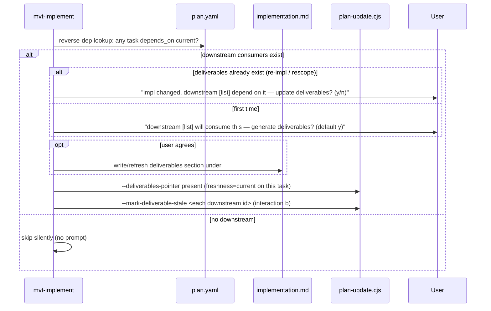

# Architecture Design: Multi-Project Workflow Support (OPT-2026-002)

> Source: `analysis.md` (this change) + proposal OPT-2026-002 v2.4.
> Change-id: `20260605-multi-project-workflow-support`
> Subject system: the MVTT framework itself (YAML schemas, the shared activation section, skill instruction Markdown, two deterministic scripts, and the `src/` reconcile layer).

## Overview

Make the MVTT **workflow layer** project-aware so one workspace can drive a multi-project repo, while a single-project repo (`projects.length == 1`) behaves exactly as today with zero new prompts. The work spans four artifact classes, layered by the proposal's dependency chain:

1. **Foundation** — a current-project anchor (`session.active_project`) plus an auto-inference rule in the shared activation section.
2. **Plan attribution** — a `project` array on plan tasks, validated deterministically by `plan-update.js`.
3. **Project-scoped context** — a 2x2 (skill-axis × project-axis) knowledge model expressed as project-keyed `knowledge` maps in `registry.yaml`, resolved by a project-aware activation step.
4. **Structured handoff** — a `deliverables` field carrying the downstream-facing contract, maintained interactively by `mvt-implement`.

### Architectural concerns

| Concern | Source of evidence | Priority |
|---------|--------------------|----------|
| Backward compatibility (single-project = no behavior change) | analysis BR-1, proposal §5.2 | must |
| Preserve user-added knowledge bindings across `mvtt update` | `src/fs/registry-merge.ts`, memory `mvtt-registry-preservation` | must |
| Determinism of `plan.yaml` mutation (script, not LLM) | memory `mvtt-determinism-decisions`, proposal §5.4 | must |
| No silent full-context loading in multi-project repos | analysis BR-2 | must |
| Cross-session persistence of handoff contracts | analysis S3-* | should |
| Avoid schema/merge drift between `install` and `update` | `registry-merge.ts` comment lines 205-208 | must |
| Token accounting accuracy after context split | analysis A-3 | should |

### Key finding overriding proposal §8

Proposal §8 asserts "no `src/` TypeScript changes." This **cannot hold**: the S1-4 breaking change (registry `knowledge` from list → project-keyed map) breaks `src/fs/registry-merge.ts`, which hardcodes `knowledge.shared` and `skills.<name>.knowledge` as **arrays** to preserve user bindings on update (lines 118-128, 145-160). Leaving it unchanged would silently drop user-added project-scoped bindings on every `mvtt update`. The design therefore **expands scope to `src/`** (ADR-6) — a deliberate, recorded override of §8.

## Architecture Decision Records

### ADR-1: Single-project collapse keys on `projects.length == 1`, not on name

| Field | Content |
|-------|---------|
| Status | accepted |
| Context | The proposal uses `name == "default"` and `projects.length == 1` interchangeably; this very repo has `name="mvtt"`, length 1, so they diverge. Concern: backward-compatibility must-have. |
| Decision | All project-scoping branches gate on `projects.length == 1`. When true: PS = the sole project, activation skips every project-keyed lookup beyond `_all`, no project prompt ever fires, and `mvt-analyze-code` keeps the flat `_generated/project-context.md` path. The project's `name` is cosmetic in this mode. |
| Alternatives | Gate on `name == "default"` — rejected: would force this repo (and any single project not literally named "default") into multi-project prompting, a behavior regression. |
| Consequences | (+) Zero-config back-compat for all existing single-project installs regardless of name. (-) The literal `"default"` convention loses meaning as a gate; documented as convention-only. |

### ADR-2: Registry knowledge becomes a project-keyed map with reserved `_all` key

| Field | Content |
|-------|---------|
| Status | accepted |
| Context | Knowledge has two orthogonal scope axes (skill × project). A flat list cannot express the project axis. Concern: no-silent-full-load, clean 2x2 model. |
| Decision | Every `knowledge` block — top-level and each `skills.<name>.knowledge` — becomes a map keyed by project name, with reserved key `_all` = all projects. Skill axis = which layer the block lives in; project axis = which map key. Activation loads the union: `knowledge._all` ∪ `knowledge[P]`∀P∈PS ∪ `skills[S].knowledge._all` ∪ `skills[S].knowledge[P]`∀P∈PS. Pure key lookup, missing keys skipped silently. |
| Alternatives | (a) Per-entry `project:` field filtered at activation — rejected: requires scanning/filtering, less cohesive (proposal §7 already settled this). (b) Defer restructure, use a convention path — rejected: abandons the 2x2 model and S1-4. |
| Consequences | (+) Direct key lookup, semantically cohesive. (-) Breaking change to registry shape (ADR-3); forces `registry-merge.ts` rewrite (ADR-6); `mvt-manage-context` and `mvt-check-context` must learn the map shape. |

### ADR-3: Breaking registry migration — old lists move under `_all`

| Field | Content |
|-------|---------|
| Status | accepted |
| Context | Green-field premise permits breaking changes. The shipped `registry.yaml` and any installed user copy use the flat form. |
| Decision | `knowledge.shared` (list) → `knowledge._all` (same list). `skills.<name>.knowledge` (flat list) → `skills.<name>.knowledge._all` (same list). Multi-project semantic `project-context` entries move from shared to `knowledge.<projectName>`. Single-project repos use only `_all` (today's content + one nesting level). The framework `registry.yaml` is rewritten by hand as part of this change. |
| Alternatives | Dual-read both shapes indefinitely — rejected: permanent complexity for a green-field framework. |
| Consequences | (+) One clean shape everywhere. (-) Existing installed registries need migration handled by the merge rewrite (ADR-6) on next `mvtt update`. |

### ADR-4: `task.project` is an array, validated in `plan-update.js` via caller-supplied `--projects`

| Field | Content |
|-------|---------|
| Status | accepted |
| Context | Tasks must declare their project(s); validation must be deterministic (not LLM). `plan-update.js` currently has no project-root awareness and only holds the plan object. Concern: determinism must-have. |
| Decision | Add `project: string[]` to the task schema. Validation lives in `validatePlan`, gated by a new `--projects "a,b"` arg the **caller skill** supplies (read from `project-context.yaml > projects[].name`). When the list has > 1 entry, every task's `project` must be a non-empty array with each element ∈ the list. When `--projects` is absent or only `default`, missing `project` is allowed and treated as `["default"]`. |
| Alternatives | Script self-reads `project-context.yaml` via `findProjectRoot()` — rejected: introduces project-root + disk coupling into `plan-update.js`, breaking its "no project-root awareness" design (proposal §4.4 settled this). |
| Consequences | (+) Determinism preserved, script stays mechanical. (-) Correctness depends on callers passing the right `--projects`; documented in both caller skills. |

### ADR-5: Deliverables — content in `implementation.md`, `{ freshness }` pointer in `plan.yaml`, enum-validated but non-blocking

| Field | Content |
|-------|---------|
| Status | accepted |
| Context | Downstream tasks need a persisted, structured contract. `implementation.md` already accumulates per-task sections keyed by `## Task: {task_id}`. Concern: cross-session persistence; determinism of plan writes. |
| Decision | Deliverables **content** is free-structured Markdown under the task's existing `implementation.md` section (soft skeleton: "Public Interface / Data Shapes / Usage Constraints"). `plan.yaml`'s `task.deliverables` holds **only** `{ freshness: current|stale }` — the implementation.md section is derivable from the task id, so no redundant file/anchor is stored. `validatePlan`: if `deliverables` is present, `freshness` must be `current` or `stale` (else reject as malformed), but a `stale` value **never blocks** a write — staleness is surfaced by `mvt-resume`/`mvt-status`, not enforced. |
| Alternatives | (a) Store file+heading anchor — rejected: duplicates task-id-derivable info, drifts on rename. (b) Store inline summary in plan.yaml — rejected: splits contract across two files. (c) Block on stale — rejected: over-couples plan mutation to handoff state. (d) No validation — rejected: typo'd freshness passes silently. |
| Consequences | (+) Single source of truth for content; minimal plan footprint; integrity without over-enforcement. (-) Resume/status must read `implementation.md` to render the actual contract (acceptable — they already read artifacts). |

### ADR-6: Expand scope to `src/fs/registry-merge.ts` (override proposal §8)

| Field | Content |
|-------|---------|
| Status | proposed |
| Context | ADR-2/3 change the registry shape that `mergeRegistry` reconciles. The module's binding-preservation invariant (memory `mvtt-registry-preservation`) is implemented against arrays. Concern: preserve-user-bindings must-have; this is a breaking change to behavior of an existing module. |
| Decision | Rewrite `mergeRegistry` to be map-aware: diff `knowledge` per project key (including `_all`) instead of per array; re-graft user-added bindings under the correct project key on framework skills; preserve `_all` semantics. Update `test/fs/registry-merge.test.ts` to cover map-shaped registries and project-keyed binding preservation. `RegistryDoc.knowledge` type loosens from `{ shared?: unknown[] }` to a project-keyed map. No other `src/` module needs changes: `install-manifest.ts` is shape-agnostic; `Registry` type (`src/types/registry.ts`) does not model `knowledge` at all. |
| Alternatives | Ship schema without touching merge (proposal §8 literal) — rejected: silently drops user project-scoped bindings on `mvtt update`, regressing a must-have invariant. |
| Consequences | (+) Invariant preserved under the new shape; install/update stay byte-identical (single merge path retained). (-) Overrides §8; adds one TS module rewrite + test to scope. Flagged `proposed` for explicit user sign-off (breaking change to existing behavior). |

### ADR-7: `mvt-analyze-code` writes per-project semantic files only in multi-project mode

| Field | Content |
|-------|---------|
| Status | accepted |
| Context | Layer-1 file split. `_generated/` is already a `user_data_dir` (install-manifest.yaml:35), written at runtime by the skill, never CLI-owned. |
| Decision | Single-project (`length == 1`): keep flat `knowledge/project/_generated/project-context.md` (zero migration). Multi-project: write `knowledge/project/_generated/{name}/project-context.md` per project, replacing whole-file instead of in-file section replacement. Existing flat multi-project workspaces auto-split on the next `/mvt-analyze-code --all` (analysis BR-9). No `install-manifest.yaml` change: the `{name}/` subdir nests under the existing `_generated/` user-data entry. |
| Alternatives | Classify `_generated/{name}/` as `generated` in install-manifest (analysis BR-10 premise) — rejected: `_generated/` is user_data, written by the skill not the CLI; BR-10's premise was mistaken. |
| Consequences | (+) Simpler skill logic (whole-file write); no CLI/manifest change. (-) Auto-split migration is implicit; `mvt-sync-context` must route to the right per-project file (A-4). |

## Module Design

The "modules" here are framework artifacts. Each maps to one or more concerns.

| Artifact | Type | Responsibility | Change |
|----------|------|----------------|--------|
| `sources/defaults/session.yaml` | schema | Add `active_project: ""` field | modify |
| `sources/defaults/project-context.yaml` | schema | (no change — `projects[]` already multi-entry) | none |
| `sources/sections/activation-load-context.md` | shared section | Resolve PS (4-priority rule) + load 2x2 knowledge union | modify |
| `registry.yaml` (framework) | schema/data | Restructure `knowledge` to project-keyed maps with `_all` | modify (breaking) |
| `sources/scripts/session-update.js` | script | `--set-active-project <name\|csv>` | modify |
| `sources/scripts/plan-update.js` | script | `--projects` validation, `--deliverables-pointer`, freshness enum, `--mark-deliverable-stale` | modify |
| `src/fs/registry-merge.ts` | TS module | Map-aware merge preserving project-keyed bindings | modify (ADR-6) |
| `test/fs/registry-merge.test.ts` | test | Cover map-shaped merge | modify |
| `sources/skills/mvt-plan-dev/business.md` | skill | `project` array on tasks, auto-infer, pass `--projects` | modify |
| `sources/skills/mvt-update-plan/business.md` | skill | Pass `--projects`; deliverables stale flow | modify |
| `sources/skills/mvt-implement/business.md` | skill | Consume injected coding-standard (de-hardcode); deliverables interaction (a)/(b) | modify |
| `sources/skills/mvt-analyze-code/business.md` | skill | Per-project file output (ADR-7) | modify |
| `sources/skills/mvt-sync-context/business.md` | skill | Route to per-project semantic file | modify |
| `sources/skills/mvt-manage-context/business.md` | skill | Two-question scope/breadth UI → 4 quadrants; map-aware list/remove | modify |
| `sources/skills/mvt-init/business.md` | skill | Detect monorepo sub-projects → multi-entry `projects[]` | modify |
| `sources/skills/mvt-status/business.md` | skill | Per-project progress grouping | modify |
| `sources/skills/mvt-check-context/business.md` | skill | Per-project token accounting; map-aware structure | modify |
| `sources/skills/mvt-resume/business.md` | skill | Surface cross-project `current_task` switches + stale deliverables | modify |
| `sources/skills/{mvt-review,mvt-test,mvt-refactor}/business.md` | skill | Consume injected per-project coding-standard | modify |

## Key Interfaces

### `session.yaml` schema addition

```yaml
active_project: ""        # "" or "default" = single-project; CSV-resolved set otherwise
```

### `registry.yaml` knowledge shape (after ADR-2/3)

```yaml
knowledge:                          # top level = all skills
  _all:                             # quadrant 1: all projects, all skills
    - id: core
      source: knowledge/core/
      files_from_manifest: true
  web:                              # quadrant 3: web project, all skills
    - id: project-context
      source: knowledge/project/_generated/web/
      files: ["project-context.md"]

skills:
  mvt-implement:
    knowledge:                      # skill layer = this skill only
      _all:                         # quadrant 2: all projects, this skill
        - id: general-review
          type: static
          source: knowledge/principle/
          files: ["general-review.md"]
      web:                          # quadrant 4: web project × this skill
        - id: coding-standards
          type: static
          source: knowledge/principle/web/
          files: ["coding-standards.md"]
```

### `task` schema additions (plan.yaml)

```yaml
- id: "t1-api-contract"
  project: ["web", "api"]           # ADR-4: array, each ∈ projects[].name
  deliverables:                     # ADR-5: present only if task exposes a contract
    freshness: current              # current | stale
  # ...existing fields unchanged
```

### Script CLI additions

```bash
# session-update.js (ADR, foundation)
node .ai-agents/scripts/session-update.cjs --skill <s> --summary <t> \
  --set-active-project "web,api"

# plan-update.js (ADR-4, ADR-5)
node .ai-agents/scripts/plan-update.cjs --plan <p> --task <id> --status <st> \
  --projects "web,api" \
  [--deliverables-pointer present] \
  [--mark-deliverable-stale <downstream_task_id>]
```

### `mergeRegistry` (ADR-6, TS signature unchanged, behavior generalized)

```ts
// RegistryDoc.knowledge: was { shared?: unknown[] } & Dict
//                        now Record<string, unknown[]>   (project-keyed, incl. "_all")
function mergeRegistry(framework: RegistryDoc, user: RegistryDoc):
  { merged: RegistryDoc; result: Omit<RegistryMergeResult, "written" | "backup"> }
// Per project key (including _all and skills.*.knowledge.*):
//   framework baseline + user additions not in framework (keyed by id, then stableKey)
```

## Data Flow

### Flow 1: Project resolution at skill activation (foundation)

```mermaid
sequenceDiagram
    participant S as Skill (activation section)
    participant SY as session.yaml
    participant PY as project-context.yaml
    participant PL as plan.yaml
    participant U as User

    S->>PY: read projects[]
    alt projects.length == 1
        S->>S: PS = [sole project]; skip all prompts (ADR-1)
    else multi-project
        S->>PL: current_task.project? (priority 1)
        alt found
            S->>S: PS = current_task.project
        else
            S->>SY: active_project? (priority 2)
            alt set
                S->>S: PS = active_project
            else
                S->>S: reverse-lookup file paths vs projects[].path (priority 3)
                alt unique hit
                    S->>S: PS = matched project
                else ambiguous (priority 4)
                    S->>U: offer candidates (smart-preselected); never silent full-load
                    U-->>S: pick
                end
            end
        end
        S->>SY: --set-active-project <PS>  (persist for priority 2)
    end
    S->>S: load knowledge union (Flow 2)
```

Error path: if PS resolution yields a project name absent from `projects[]` (stale plan/session), drop it and fall through to the next priority; if none resolve, fall to priority-4 prompt.

### Flow 2: 2x2 knowledge union load (ADR-2)

Numbered (pure key lookup, no scan):

1. Load `knowledge._all`.
2. For each P in PS: load `knowledge[P]` (skip if key absent).
3. Load `skills[S].knowledge._all`.
4. For each P in PS: load `skills[S].knowledge[P]` (skip if key absent).

Cross-project task (PS = `["web","api"]`) loads the **union** of both projects' quadrant-3 and quadrant-4 entries.

### Flow 3: Deliverables handoff (ADR-5)



Error path: if `plan-update.cjs` rejects (e.g. malformed freshness), `mvt-implement` surfaces stderr and leaves `implementation.md` as written (content is source of truth; pointer retried).

### Flow 4: `mvtt update` registry reconciliation (ADR-6)

1. `materializeProject` → `updateRegistry(projectRoot, packageRoot)`.
2. `mergeRegistry` reads framework (new map shape) + user (possibly old flat shape or new map shape).
3. Normalize user flat `knowledge.shared`/`skills.*.knowledge` arrays → treat as the `_all` key (migration of installed registries, ADR-3).
4. Per project key: framework baseline + user additions (keyed by `id` then `stableKey`), preserving project-scoped bindings.
5. Serialize; install and update share the one merge path (no drift).

Error path: unreadable framework registry → `written: false` (existing behavior retained).

## File Structure

| Path | Module role |
|------|-------------|
| `sources/defaults/session.yaml` | `active_project` field |
| `sources/sections/activation-load-context.md` | PS resolution + 2x2 union (Flow 1, 2) |
| `registry.yaml` | project-keyed knowledge maps |
| `sources/scripts/session-update.js` | `--set-active-project` |
| `sources/scripts/plan-update.js` | `--projects`, `--deliverables-pointer`, freshness, `--mark-deliverable-stale` |
| `src/fs/registry-merge.ts` | map-aware merge (ADR-6) |
| `test/fs/registry-merge.test.ts` | map-merge coverage |
| `sources/skills/mvt-plan-dev/business.md` | task `project` array + `--projects` |
| `sources/skills/mvt-update-plan/business.md` | `--projects` + stale flow |
| `sources/skills/mvt-implement/business.md` | injected standard + deliverables interaction |
| `sources/skills/mvt-analyze-code/business.md` | per-project `_generated/{name}/` output |
| `sources/skills/mvt-sync-context/business.md` | per-project routing |
| `sources/skills/mvt-manage-context/business.md` | 4-quadrant UI + map-aware list/remove |
| `sources/skills/mvt-init/business.md` | monorepo detection |
| `sources/skills/mvt-status/business.md` | per-project progress |
| `sources/skills/mvt-check-context/business.md` | per-project accounting + map shape |
| `sources/skills/mvt-resume/business.md` | cross-project switch + stale surfacing |
| `sources/skills/{mvt-review,mvt-test,mvt-refactor}/business.md` | injected per-project standard |
| `sources/knowledge/principle/{name}/` (runtime) | per-project user standards (created by manage-context) |

Note: every `sources/skills/*/business.md` edit requires a rebuild (`mvtt build`) to regenerate the assembled `.claude/skills/mvt-*/SKILL.md` and the local `.ai-agents` deployment. The `activation-load-context.md` section is shared, so its edit propagates to **all** skills that include it on rebuild.

## Implementation Guidelines

Implement in the proposal's risk-ascending order (analysis §5). Suggested task grouping for `/mvt-plan-dev`:

1. **Foundation** — `session.yaml` field + `session-update.js --set-active-project` + the PS-resolution step in `activation-load-context.md` (the single-project `length==1` no-op path first, so back-compat is provable before any multi-project branch). Acceptance: single-project install shows zero behavior change.
2. **Plan attribution (ADR-4)** — `plan-update.js --projects` validation + `mvt-plan-dev`/`mvt-update-plan` passing it. Produces the cheapest current-project signal for the foundation.
3. **Registry restructure + merge (ADR-2/3/6)** — hand-rewrite `registry.yaml`, rewrite `mergeRegistry` + test together (schema and merge must land in one commit to keep install/update consistent). Then the 2x2 union load in activation, then `mvt-manage-context` 4-quadrant UI.
4. **Adjacent project-awareness** — `mvt-init` detection, `mvt-status` grouping, `mvt-check-context` accounting, `mvt-sync-context` routing, `mvt-analyze-code` per-project split (ADR-7), coding-standard de-hardcode across implement/review/test/refactor.
5. **Deliverables (ADR-5)** — `plan-update.js` deliverables/freshness/stale args + `mvt-implement` interaction + `mvt-resume`/`mvt-status` stale surfacing.

Hard invariant for every task: `projects.length == 1` ⇒ today's behavior, zero new prompts (ADR-1).

Determinism boundary: all `plan.yaml` mutation (project validation, deliverables pointer, freshness, stale marking) stays in `plan-update.js`; y/n interaction is skill-layer only.

## Change Tracking

Files expected to be **modified** (no creations beyond runtime per-project dirs, no deletions):

- `sources/defaults/session.yaml`
- `sources/sections/activation-load-context.md`
- `registry.yaml`
- `sources/scripts/session-update.js`
- `sources/scripts/plan-update.js`
- `src/fs/registry-merge.ts` *(ADR-6, overrides proposal §8)*
- `test/fs/registry-merge.test.ts`
- `sources/skills/mvt-plan-dev/business.md`
- `sources/skills/mvt-update-plan/business.md`
- `sources/skills/mvt-implement/business.md`
- `sources/skills/mvt-analyze-code/business.md`
- `sources/skills/mvt-sync-context/business.md`
- `sources/skills/mvt-manage-context/business.md`
- `sources/skills/mvt-init/business.md`
- `sources/skills/mvt-status/business.md`
- `sources/skills/mvt-check-context/business.md`
- `sources/skills/mvt-resume/business.md`
- `sources/skills/mvt-review/business.md`
- `sources/skills/mvt-test/business.md`
- `sources/skills/mvt-refactor/business.md`

Runtime-created (by skills, not this change): `knowledge/project/_generated/{name}/project-context.md`, `knowledge/principle/{name}/*.md`.

No change required: `sources/defaults/project-context.yaml` (already multi-entry), `install-manifest.yaml` (ADR-7: `_generated/` already user_data), `src/types/registry.ts` (does not model `knowledge`), `src/fs/install-manifest.ts` (shape-agnostic).

> Scope is ~20 files across schema, scripts, one TS module, and 12 skills, with one breaking change (ADR-3) and one proposed ADR needing sign-off (ADR-6). This exceeds the 5-file / 1-module threshold → `/mvt-plan-dev` is the required next step.
