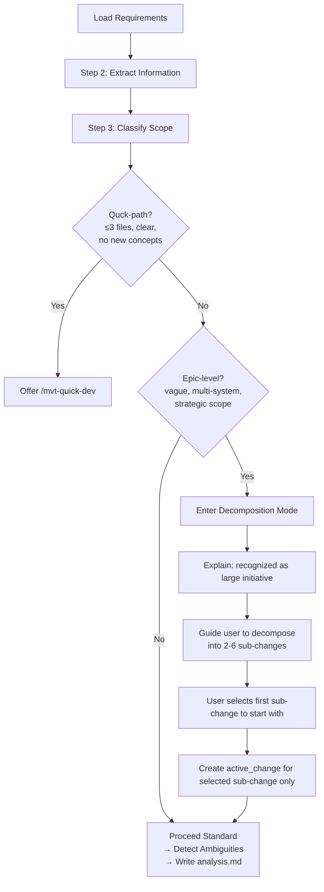

# Requirements Analysis: Epic Scope Detection for mvt-analyze

## Feature Overview

The MVTT framework currently has a gap in its workflow: when users input large-scale, vague, or strategic requirements (e.g., "build an e-commerce system", "implement based on this design manual"), `/mvt-analyze` treats them as a single actionable change. This propagates through the entire pipeline (`/mvt-design` → `/mvt-plan-dev` → `/mvt-implement`), causing scope explosion, unclear task boundaries, and chaotic development. The proposed improvement introduces an "epic detection gate" that recognizes when a requirement is at initiative-level granularity and guides the user to decompose it into focused, executable changes before creating any `active_change`.

## Actors

| Actor | Role |
|-------|------|
| **User (Developer)** | Inputs requirements at various granularity levels: task, feature, epic, initiative |
| **Analyst (mvt-analyze)** | Requirements analysis skill — needs to distinguish change levels and route accordingly |
| **Architect (mvt-design)** | Downstream consumer — needs well-scoped requirements to produce clean designs |
| **Planner (mvt-plan-dev)** | Downstream consumer — limited to 3-10 tasks per change; epic-level input forces phasing |

## Requirements

### Functional Requirements

| ID | Requirement | Priority |
|----|-------------|----------|
| FR-1 | Detect when input requirement is at "epic/initiative" level vs. "feature/change" level | Must |
| FR-2 | When epic detected, guide user through scope decomposition before creating `active_change` | Must |
| FR-3 | Preserve the existing quick-path (Step 3) for truly simple changes | Must |
| FR-4 | Preserve the existing standard analysis flow for well-scoped feature-level requirements | Must |
| FR-5 | The decomposition output should produce concrete, independently-actionable change descriptions | Must |
| FR-6 | Each decomposed sub-change should be able to go through the normal analyze → design → plan → implement flow | Should |
| FR-7 | Allow the user to select a starting sub-change and immediately proceed with analysis on it | Should |
| FR-8 | Track decomposed sub-changes in a lightweight scope document for reference | Nice to have |

### Business Rules

| Rule | Description |
|------|-------------|
| BR-1 | `active_change` must never represent an epic/initiative — only concrete feature-level work |
| BR-2 | Epic detection must happen before creating any `active_change` in Step 6 |
| BR-3 | Decomposition is iterative: user can always refine further if a sub-change is still too large |
| BR-4 | The existing quick-path detection (Step 3) is preserved and takes priority over epic detection |
| BR-5 | A scope document (if written) must not be confused with an analysis artifact — different file and purpose |

## Domain Concepts

| Concept | Definition |
|---------|------------|
| **Change** | A unit of work that can be analyzed, designed, and implemented in one linear pass. Typically maps to a feature, a module addition, or a refactoring slice. The smallest granularity that `/mvt-analyze` creates as `active_change`. |
| **Epic** | A large, multi-feature initiative that cannot be completed in a single analyze → design → implement pass. Must be decomposed into multiple Changes first. Examples: "build e-commerce system", "migrate to microservices". |
| **Epic Detection Gate** | A new decision point in `/mvt-analyze` that identifies epic-level input and triggers decomposition instead of change creation. |
| **Scope Document** | A lightweight artifact (not `analysis.md`) that records the decomposition of an epic into planned sub-changes. Each sub-change has a title, a one-line description, and a status (planned/in-progress/done). |
| **Scope Heuristics** | Rules of thumb used to detect epic-level input: vagueness score, implied sub-systems count, estimated file count, number of distinct actors, presence of multi-phase language. |
| **Three-Tier Classification** | The proposed expansion of Step 3's binary decision (quick vs. standard) into a three-way split: Quick / Standard / Epic. |

## Ambiguities & Questions

| # | Ambiguity | Priority | Question |
|---|-----------|----------|----------|
| AQ-1 | Detection criteria: what specific signals separate "epic" from "large feature"? | High | Should detection use keyword heuristics (e.g., "system", "platform", "full"), sub-system counting, user confirmation, or a combination? |
| AQ-2 | Decomposition depth: how fine-grained should the decomposition be? | High | Should each sub-change map to individual features (e.g., "product catalog", "shopping cart") or could sub-changes still be multiple-feature slices? |
| AQ-3 | Scope document format: where and how to store decomposition results? | Medium | Option A: a section in analysis.md. Option B: a separate scope.yaml. Option C: no persisted document, purely conversational. |
| AQ-4 | Downstream impact on mvt-design and mvt-plan-dev: do those skills need changes too? | Medium | If mvt-analyze changes handling, do mvt-design and mvt-plan-dev need to be more resilient to scope ambiguity, or is the gate sufficient? |
| AQ-5 | Existing active_change: what if one already exists when the epic is detected? | Low | Should the existing change be completed/archived first, or can the decomposition coexist? |

## Change Tracking

| Item | Action | Expected outcome |
|------|--------|-----------------|
| mvt-analyze business.md | Modify | Add Epic Detection Gate and Three-Tier Classification |
| mvt-analyze SKILL.md | Regenerate | Reflect new Step 3 flow with epic branch |
| scope document (new concept) | Create | Optional lightweight artifact for decomposition tracking |
| mvt-design business.md | No change needed | Gate at analyze level should suffice |
| mvt-plan-dev business.md | No change needed | Existing 10-task limit already handles large plans |

## Solution Options

### Option A: Three-Tier Classification in Step 3 (Recommended)

Expand the existing Step 3 (Complexity Assessment) from a binary decision into a three-tier gate:

**Epic detection heuristics** (at least 2 trigger):

| Heuristic | Signal examples |
|-----------|-----------------|
| Vagueness cues | Input contains "system", "platform", "full", "suite" + lacks specific features |
| Sub-system count | Requirement mentions 3+ distinct functional areas (e.g., "users, products, orders, payments") |
| Multi-phase language | "Phase 1", "first step would be", "eventually we need" |
| Design manual reference | "Implement based on this design handbook/manual/spec (50+ pages)" |
| Explicit scope question | Requirement text asks "where should I start?" or "what do you recommend?" |

**Epic decomposition output**: conversation-driven (no mandatory file write). Optionally write a lightweight scope document at `workspace/artifacts/{change-id}/scope.yaml` if the user requests tracking.

**Pros**: Minimal change (one new decision branch in existing flow), no new skills, preserves all existing behavior.
**Cons**: Adds complexity to `mvt-analyze` business logic; detection heuristics may have false positives.

### Option B: New `/mvt-scope` Skill

Create a dedicated skill for epic-level decomposition. The workflow becomes:

- `/mvt-scope` → takes vague/large input → decomposes → writes scope document → user picks a sub-change → runs `/mvt-analyze` on it
- `/mvt-analyze` remains unchanged

**Pros**: Clean separation of concerns, no change to existing skill.
**Cons**: Adds another entry point to the workflow, more cognitive load for users ("should I use analyze or scope?"), more code to maintain.

### Option C: Prompt-Based Decomposition in Standard Flow

No detection automation. In Step 5 (ambiguity detection), if the requirement is vague, the existing clarification questions naturally surface the need to decompose. The user manually decides to run multiple `/mvt-analyze` passes.

**Pros**: Zero code changes, no new heuristics.
**Cons**: Relies entirely on user judgment; no scaffolding or guidance; inconsistent results; most users won't realize the problem until it's too late (in the design or plan-dev phase).

### Recommended: Option A

Option A is recommended because:

- It adds a single well-defined decision point to an existing step
- It has clear heuristics that are easy to implement and iterate on
- It prevents scope confusion before it propagates downstream
- It creates zero new skills to maintain
- It preserves all existing behavior for non-epic input
- It is consistent with the existing design principle: "Ambiguous target: ask, don't guess"

## Suggested Next Steps

- `/mvt-design` -- Design the architecture for the Epic Detection Gate (ADR for the three-tier classification, heuristics spec, and integration points in mvt-analyze)
- `/mvt-quick-dev` -- If the scope change is well-understood enough to implement directly (affects only `sources/skills/mvt-analyze/business.md`)
