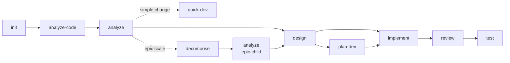
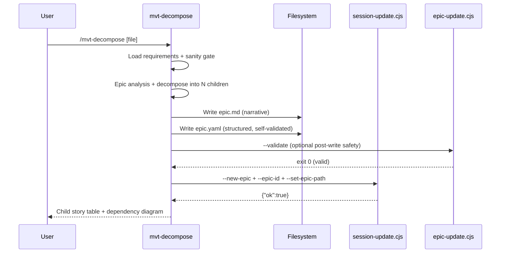
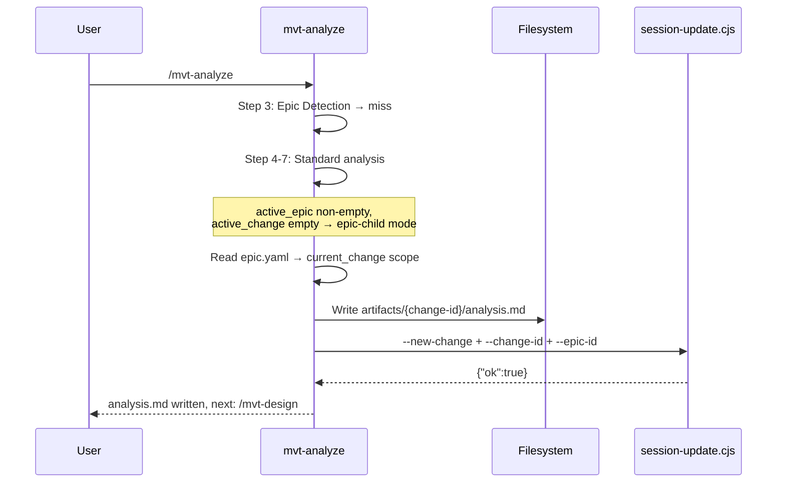
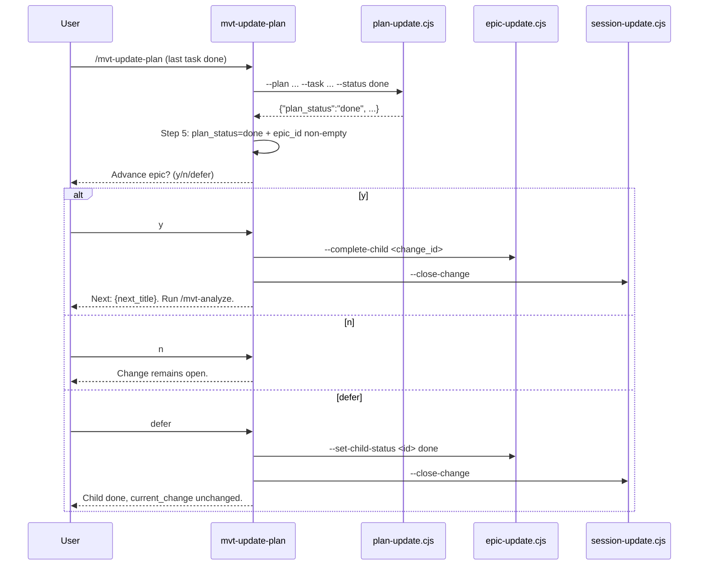
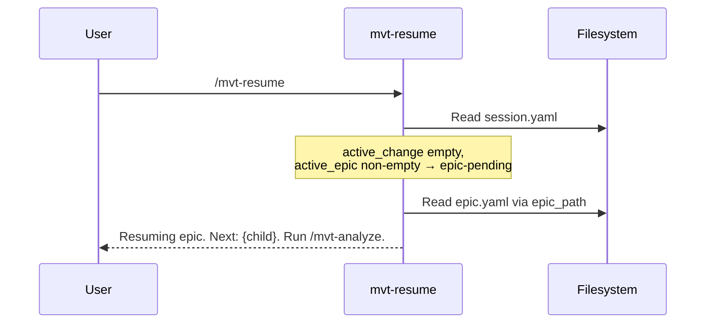

# Architecture Design: Epic Decomposition Layer (OPT-2026-003)

> Source: `analysis.md` (this change) + proposal OPT-2026-003 v2.1 + existing codebase patterns.
> Change-id: `20260608-epic-scope-detection`
> Subject system: the MVTT framework itself (YAML schemas, two deterministic scripts, skill instruction Markdown, build pipeline, registry, and test suite).

## Overview

Introduce a two-tier requirement hierarchy -- **Epic -> Change** -- into the MVTT framework. When users input large-scale requirements (e.g., "build an e-commerce system"), the current single-layer `change` model forces the entire epic into one `analysis.md`, one `active_change`, and one `plan.yaml` (capped at 3-10 tasks), causing scope explosion and chaotic development. The solution adds an Epic layer above Change, with a new `mvt-decompose` skill as the dedicated entry point for large requirements, and a symmetric "upward detection gate" in `mvt-analyze` that routes epic-level input to `mvt-decompose`.

This design covers 7 modules (data foundation, deterministic script, skill entry, detection gate, advancement trigger, epic-pending alignment, archiving) spanning 18 files across 4 classes: YAML schemas, scripts, skill Markdown, and tests.

> **Template structure note**: MVTT templates are *directory-assembled*, not flat files. Each template lives as `sources/templates/{name}/manifest.yaml` + `body.md` and is built (via `build:templates`) into `.ai-agents/skills/_templates/{name}.md`. The new `decompose-output` template therefore consists of two source files mirroring `sources/templates/analyze-output/`. The `install-manifest.yaml` pattern `.ai-agents/skills/_templates/*-output.md` already globs the built output, so no install-manifest change is needed for the template.

### Architectural concerns

| Concern | Source of evidence | Priority |
|---------|-------------------|----------|
| Backward compatibility (existing changes without `epic_id` treated as "no epic") | analysis NFR-1, proposal §10 | must |
| Deterministic `epic.yaml` mutations (script, not LLM) | analysis BR-4, ADR-2, `[[mvt-determinism-decisions]]` | must |
| Single `current_change` pointer, DAG-based advancement | analysis BR-5, ADR-5 | must |
| `epic-pending` state cross-session recovery | analysis FR-9, proposal §4.4 | must |
| No impact on `mvt-sync-context` | analysis NFR-3 | must |
| Existing 155+ tests remain green | analysis NFR-2 | must |
| Skill design principles: single entry point, options over params | `development-guide.md` | must |

## Architecture Decision Records

The proposal OPT-2026-003 v2.1 contains 8 ADRs (ADR-1 through ADR-8) that define the architectural boundaries for this feature. All 8 are adopted as-is. This design adds implementation-level ADRs that refine or extend the proposal's decisions for the implementation phase.

### ADR-9: epic-update.js mirrors plan-update.js structure and output protocol

| Field | Content |
|-------|---------|
| Status | accepted |
| Context | `epic-update.js` is a new script that manages `epic.yaml` state mutations. `plan-update.js` (574 lines) is the proven reference pattern for deterministic YAML mutation scripts in this codebase. |
| Decision | Mirror `plan-update.js`'s structure: `parseArgs()` → `findProjectRoot()` → read/parse YAML → apply mutation → validate → atomic write → JSON stdout on exit 0, plain-text stderr on exit 1. Same import set (`node:fs`, `node:path`, `yaml`). Same `ERRORS` constant object pattern for centralized error messages. Same atomic write pattern (temp + rename). |
| Alternatives | (a) New script with different conventions -- rejected: breaks team muscle memory and increases cognitive load. (b) Extract shared utility module -- rejected: premature for 2 scripts; the duplication is small and each script is self-contained. |
| Consequences | (+) Immediate familiarity for anyone who has read plan-update.js. (+) Same test patterns apply (tmpdir, real fs, parse stderr). (-) Code duplication between the two scripts (~40 lines of boilerplate). |

### ADR-10: session-update.js epic params use existing flat-flag pattern, not subcommand

| Field | Content |
|-------|---------|
| Status | accepted |
| Context | `session-update.js` uses flat flags (`--new-change`, `--close-change`, etc.). The proposal §9.1.1 explicitly rejects subcommand mode. 5 new epic flags needed. |
| Decision | Add `--new-epic`, `--epic-id`, `--set-epic-path`, `--set-epic-status`, `--close-epic` as flat flags, mirroring the existing `--new-change` / `--change-id` pattern. Auto-snapshot of `active_epic` into `epics[]` on `--new-epic` (mirroring `--new-change` → `changes[]`). Combo validation as a post-`parseArgs` step (§9.1.1 rules). |
| Alternatives | Subcommand mode (`session-update.cjs epic --new ...`) -- rejected: partial migration breaks consistency, existing skills all use flat flags. |
| Consequences | (+) Zero learning curve for skill authors. (+) Existing `parseArgs` / `main()` branch pattern directly reusable. (-) `parseArgs` grows by ~5 branches; acceptable since it's already 15+ branches. |

### ADR-11: Epic Detection step inserted before Quick Path with mutual exclusion

| Field | Content |
|-------|---------|
| Status | accepted |
| Context | `mvt-analyze/business.md` currently has Step 3 = Quick Path Detection (downward routing). The proposal ADR-3 requires inserting Epic Detection (upward routing) before it, renumbering Steps 3-6 to 4-7. |
| Decision | New Step 3 "Assess Scale (Epic Detection)" inserted before the existing Step 3. Epic hit → skip remaining steps, suggest `/mvt-decompose`. Epic miss → fall through to Step 4 (Quick Path). The two gates are mutually exclusive by design: Epic = upward (too large), Quick = downward (too small). Original Steps 3-6 become Steps 4-7. All step-number references in `manifest.yaml` `conditional_suggestions` and downstream documentation updated. |
| Alternatives | (a) Decimal step number `Step 3.5` -- rejected: MVTT convention disallows non-integer steps. (b) Append after Quick Path -- rejected: Epic detection must run first (if input is epic-scale, Quick Path criteria will trivially fail anyway, wasting evaluation). |
| Consequences | (+) Unified entry point preserved. (+) Users always start with `/mvt-analyze`. (-) Step renumbering requires updating manifest.yaml references and any external documentation. |

### ADR-12: mvt-update-plan epic advancement as a post-script skill-layer step

| Field | Content |
|-------|---------|
| Status | accepted |
| Context | After `plan-update.cjs` outputs `plan_status: "done"` + `active_change.epic_id` is non-empty, epic advancement must be triggered. `plan-update.cjs` itself remains unchanged (BR-13). |
| Decision | Add a new **Step 5: Epic Advancement Check** to `mvt-update-plan/business.md` after the existing Step 4 (Output). The step reads `plan-update.cjs` stdout JSON: if `plan_status == "done"` and `session.active_change.epic_id` is non-empty, prompt the user (y/n/defer). On `y`: call `epic-update.cjs --complete-child <change_id>` + `session-update.cjs --close-change`. On `n`: no advancement. On `defer`: mark child done via `epic-update.cjs --set-child-status` but do not advance `current_change`. The existing Steps 1-4 remain untouched. |
| Alternatives | (a) Add epic logic inside `plan-update.cjs` -- rejected: violates separation of concerns, script should remain a pure plan mutator. (b) Trigger via cleanup -- rejected: cleanup is optional maintenance, not core workflow (proposal §12 #4). |
| Consequences | (+) `plan-update.cjs` remains a pure plan mutator, zero regression risk. (+) User gets explicit choice at the advancement point. (-) `mvt-update-plan/business.md` grows by ~20 lines. |

## Module Design

### Module 1: Data Foundation

| Aspect | Detail |
|--------|--------|
| **Responsibility** | Extend `session.yaml` schema and `session-update.js` with epic state management |
| **Owned entities** | `active_epic`, `epics[]`, `active_change.epic_id` |
| **Public interface** | `session-update.cjs --new-epic <title> --epic-id <id> [--set-epic-path <path>]`, `--set-epic-status <status>`, `--close-epic`, extended `--new-change` with optional `--epic-id <id>` |
| **Dependencies** | None (foundational) |
| **Files** | `sources/defaults/session.yaml`, `sources/scripts/session-update.js`, `install-manifest.yaml` |

**session.yaml schema additions**:

```yaml
active_epic:
  id: ""
  title: ""
  created_at: ""
  epic_path: ""
epics: []
  # - id: "epic-20260608-ecommerce-platform"
  #   title: "ecommerce platform"
  #   epic_path: ".ai-agents/workspace/artifacts/epic-20260608-ecommerce-platform/epic.yaml"
  #   status: "active"   # active | done | abandoned
  #   updated_at: "..."
active_change:
  id: ""
  title: ""
  created_at: ""
  plan_path: ""
  epic_id: ""            # NEW: epic parent id or empty
```

**session-update.js changes** (mirror existing `--new-change` / `--close-change` pattern):

| Parameter | Effect on session.yaml |
|-----------|----------------------|
| `--new-epic <title>` + `--epic-id <id>` | Set `active_epic.{id,title,created_at}`; if old `active_epic.id` non-empty, snapshot into `epics[]` |
| `--set-epic-path <path>` | Set `active_epic.epic_path` |
| `--set-epic-status <status>` | Update matching `epics[]` entry status |
| `--close-epic` | Set matching `epics[]` entry to done, clear `active_epic` |
| `--new-change` + `--epic-id <id>` (extended) | Set `active_change.epic_id` |

**Combo validation** (post-`parseArgs`, non-zero exit on violation):

| Rule | Description |
|------|-------------|
| `--new-epic` requires `--epic-id` | Mirror `--new-change` + `--change-id` pairing |
| `--close-epic` mutually exclusive with `--new-epic` | Cannot open and close in same call |
| `--set-epic-path` / `--set-epic-status` require active epic | No `active_epic` and not simultaneously creating one |
| `--epic-id` (for sub-change) requires `--new-change` | Meaningless alone |

### Module 2: Deterministic Epic State Script

| Aspect | Detail |
|--------|--------|
| **Responsibility** | Deterministic mutations on `epic.yaml`: complete children, advance `current_change`, validate DAG |
| **Owned entities** | `epic.yaml` children status, `current_change` pointer, epic status |
| **Public interface** | `epic-update.cjs --epic <path> --complete-child <change_id>`, `--set-child-status <id> <status>`, `--switch-active <id>`, `--add-child <id> --child-title <t> --child-scope <s> [--child-depends-on <a,b>]`, `--validate <path>` |
| **Dependencies** | Module 1 (session-update for coordination, but script is standalone) |
| **Files** | `sources/scripts/epic-update.js`, `build-scripts.js`, `install-manifest.yaml` |

**epic.yaml schema** (as defined in proposal §4.2.1):

```yaml
version: 1
epic_id: "epic-20260608-ecommerce-platform"
title: "ecommerce platform"
created_at: "2026-06-08T10:00:00Z"
updated_at: "2026-06-08T10:00:00Z"
status: in_progress          # in_progress | done | abandoned
vision: >
  ...
current_change: "20260608-user-auth"
children:
  - change_id: "20260608-user-auth"
    title: "User auth"
    status: active             # pending | active | done | abandoned
    depends_on: []
    project: ["default"]
    scope: >
      ...
    completed_at: null
```

**Script operations**:

| Operation | Behavior |
|-----------|----------|
| `--complete-child <id>` | Set child status to `done`, set `completed_at` to now. Recompute `current_change`: scan `children[]` **in array order** and select the **first** child whose `depends_on` are all in `resolvedIds` (done + abandoned) and whose status is `pending`; set it to `active` and point `current_change` at it. **Tie-break is deterministic: array order wins** (the `children[]` order written by `mvt-decompose` reflects the intended DAG sequence). If no such child exists and all children are done/abandoned, set `epic.status = done` and `current_change = ""`. |
| `--set-child-status <id> <status>` | Explicitly set child status. If setting to `active`, validate at-most-one-active constraint (see `--switch-active` for the safe re-pointing path). |
| `--switch-active <id>` | **Atomic active-pointer move** (serves scenario C reorder, proposal §4.3 step 4). In one mutation: demote the current `active` child to `pending`, promote `<id>` to `active`, and set `current_change = <id>`. Validates `<id>`'s `depends_on` are resolved before promoting (rejects with exit 1 otherwise). This avoids the at-most-one-active validation failure that a naive two-call `--set-child-status` sequence would hit. |
| `--add-child <id> --child-title <t> --child-scope <s> [--child-depends-on <a,b>]` | Append new child to `children[]`. Re-validate after insertion. |
| `--validate <path>` | Read-only validation, no writes. Exit 0 on valid, exit 1 with error list on invalid. |

**Validation rules** (run on every write, and by `--validate`):

1. All `change_id` values in `children[]` are unique
2. `depends_on` references exist in `children[]`
3. No cycles in the dependency DAG (Kahn's algorithm or DFS-based)
4. `current_change` points to a `pending` or `active` child (or is empty if all done/abandoned)
5. At most one child with `status: active`
6. `epic.status` consistent with children (all done/abandoned → `done`)

**Output protocol** (ADR-9, mirrors `plan-update.cjs`):
- Exit 0: single-line JSON on stdout:
  ```json
  {"ok":true,"child":{"change_id":"...","old_status":"active","new_status":"done"},"current_change":"next-id","epic_status":"in_progress","progress":{"done":2,"total":5}}
  ```
- Exit 1: plain-text error on stderr

**build-scripts.js** change: add `"sources/scripts/epic-update.js"` to `entryPoints`.

**install-manifest.yaml** change: add generated pattern for `epic-update.cjs`:
```yaml
- pattern: ".ai-agents/scripts/epic-update.cjs"
  source: "bundle:sources/scripts/epic-update.js"
```

### Module 3: Epic Decomposition Skill

| Aspect | Detail |
|--------|--------|
| **Responsibility** | Accept epic-scale requirements, decompose into 2-8 sub-changes with DAG dependencies, write `epic.yaml` + `epic.md` |
| **Owned entities** | `epic.yaml` initial draft, `epic.md` narrative |
| **Public interface** | `/mvt-decompose [file-path]` |
| **Dependencies** | Module 1 (session-update for `--new-epic`), Module 2 (optional `--validate`) |
| **Files** | `sources/skills/mvt-decompose/manifest.yaml`, `sources/skills/mvt-decompose/business.md`, `sources/templates/decompose-output/manifest.yaml`, `sources/templates/decompose-output/body.md`, `registry.yaml` |

**Execution flow** (`business.md`):

1. **Load requirements** -- file path argument or user message text
2. **Lightweight Sanity Gate** -- only block if input is clearly single-file-level small; offer choice (continue as 1-child epic or redirect to `/mvt-analyze`)
3. **Epic analysis** -- vision, scope/out-of-scope, cross-cutting concerns, actors
4. **Decompose into 2-8 sub-changes** -- each "right-sized" (one analyze→design→plan(3-10 tasks) pipeline), single deliverable capability slice, explicit DAG dependencies, `project` hints for multi-project workspaces. WARN if > 8 (suggest narrowing scope).
5. **Write artifacts** -- `epic.md` (narrative via the `decompose-output` template) + `epic.yaml` (structured, LLM self-validates §9.2 checklist). Optional: call `epic-update.cjs --validate <path>` as post-write safety net. The `decompose-output` template body defines six sections (proposal §4.2.2): **Vision**, **Scope & Out of Scope**, **Cross-cutting Concerns**, **Child Stories** (table mirroring `epic.yaml.children`), **Dependency Map** (mermaid), **Open Questions**.
6. **Update session** -- `session-update.cjs --new-epic <title> --epic-id <id>` then `--set-epic-path <path>`
7. **Output** -- child story table + dependency mermaid diagram + suggested starting child

**Manifest structure** (modeled on `mvt-analyze/manifest.yaml`):

```yaml
name: mvt-decompose
output: .claude/skills/mvt-decompose/SKILL.md
frontmatter:
  name: mvt-decompose
  description: "Decompose epic-scale requirements into right-sized sub-changes. ..."
sections:
  - type: inline        # header + purpose
  - type: shared        # role-header (Strategist / analyst)
  - type: shared        # activation-load-context
  - type: shared        # activation-load-config
  - type: shared        # output-language-constraint
  - type: shared        # output-format-constraint
  - type: shared        # activation-preflight
  - type: file          # business.md
  - type: inline        # artifact structure (epic.md + epic.yaml)
  - type: shared        # session-update
  - type: shared        # footer-next-steps
```

**Registry entry**:
```yaml
mvt-decompose:
  agent: analyst
  description: "Decompose epic-scale requirements into sub-changes with DAG dependencies."
  path: .claude/skills/mvt-decompose/SKILL.md
  template: .ai-agents/skills/_templates/decompose-output.md
  category: workflow
```

### Module 4: Epic Detection Gate in mvt-analyze

| Aspect | Detail |
|--------|--------|
| **Responsibility** | Detect epic-scale input and route to `/mvt-decompose`; when `active_epic` exists, enter epic-child mode |
| **Owned entities** | Detection signal table, epic-child input arbitration |
| **Public interface** | New Step 3 in `/mvt-analyze` flow |
| **Dependencies** | Module 3 (routes to `mvt-decompose`), Module 1 (reads `active_epic` from session) |
| **Files** | `sources/skills/mvt-analyze/business.md`, `sources/skills/mvt-analyze/manifest.yaml` |

**Step 3: Assess Scale (Epic Detection)** -- inserted before existing Step 3 (now Step 4: Quick Path Detection):

| Signal type | Signal | Example |
|-------------|--------|---------|
| Strong | Whole system / platform scope | "Build an e-commerce system" |
| Strong | Input is a multi-feature design manual | "Implement based on this design manual" |
| Strong | Multiple independent deliverable capability domains | Auth + Catalog + Cart + Payment |
| Weak (corroboration only) | Multiple actors with multiple independent main flows | -- |
| Weak (corroboration only) | No single cohesive acceptance criterion | -- |

**Trigger**: any strong signal, OR (strong + 2+ weak). Weak signals alone never trigger.

**Branches**:

| Condition | Action |
|-----------|--------|
| Epic detection hits | Ask: "This looks like an epic-level requirement (multiple independent capability domains). Use `/mvt-decompose` to decompose it first? (y / n / show-signals)" |
| `y` | Do NOT write `analysis.md`. Guide to `/mvt-decompose`. |
| `n` | Continue standard analysis (Steps 4-7). Cheap reversal path. |
| `show-signals` | Display matched signals, re-prompt. |
| Epic misses | Fall through to Step 4 (Quick Path Detection). |

**Epic-child mode** (when `active_epic.id` non-empty and `active_change.id` empty):

| Scenario | User message | Handling |
|----------|-------------|----------|
| A | Empty | Auto-use `current_change` scope as requirement input |
| B | Supplements current child | Merge user message + scope, analyze for current child |
| C | Points to different child | Out-of-order arbitration (proposal §4.3 step C): locate the target in `children[]`. If its `depends_on` has unfinished prerequisites → warn and ask to confirm forced reorder (y/n). If deps are satisfied but it's just later in order → confirm switch (y/n). On confirmed reorder, call `epic-update.cjs --switch-active <target>` (atomic demote-old + promote-target, Module 2) — **not** a bare `--set-child-status active`, which would trip the at-most-one-active validation. If the target isn't in `children[]`, offer to treat it as an independent change (exit epic-child mode) or `--add-child`. |

**manifest.yaml changes**: update `conditional_suggestions` to add epic-detection branch, update step number references from 3-6 to 4-7.

### Module 5: Epic Advancement Trigger in mvt-update-plan

| Aspect | Detail |
|--------|--------|
| **Responsibility** | Detect plan completion within an epic context and offer advancement |
| **Owned entities** | Epic advancement decision (y/n/defer) |
| **Public interface** | New Step 5 in `/mvt-update-plan` flow |
| **Dependencies** | Module 2 (calls `epic-update.cjs --complete-child`), Module 1 (calls `session-update.cjs --close-change`) |
| **Files** | `sources/skills/mvt-update-plan/business.md` |

**New Step 5: Epic Advancement Check** (appended after existing Step 4: Output):

```
After plan-update.cjs reports plan_status: "done":
1. Read session.active_change.epic_id
2. If empty -> skip (standard change, no epic context)
3. If non-empty -> prompt user:
   "This change belongs to epic: {epic_title}.
    All plan tasks are complete.
    (y) Mark child done and advance to next sub-change
    (n) Keep change open (continue review/test/sync)
    (defer) Mark child done but don't advance yet"
4. On y:
   - epic-update.cjs --epic <path> --complete-child <change_id>
   - session-update.cjs --skill mvt-update-plan --summary "..." --close-change
   - Display: next child info from epic-update stdout
5. On n: no action, display reminder to close later
6. On defer:
   - epic-update.cjs --epic <path> --set-child-status <change_id> done
   - session-update.cjs --close-change
   - Display: "Child marked done, current_change unchanged"
```

### Module 6: Epic-Pending State Alignment

| Aspect | Detail |
|--------|--------|
| **Responsibility** | Handle the intermediate state where `active_epic` exists but `active_change` is empty |
| **Owned entities** | Epic-pending state detection and display |
| **Public interface** | Updated status display, resume fallback, help decision table |
| **Dependencies** | Module 1 (reads `active_epic` + `active_change` from session) |
| **Files** | `sources/skills/mvt-status/business.md`, `sources/skills/mvt-resume/business.md`, `sources/skills/mvt-help/business.md` |

**epic-pending state definition**: `session.active_epic.id` non-empty AND `session.active_change.id` empty AND `epic.yaml.status != done`.

**mvt-status changes** -- new section before Changes Overview:

```markdown
## Epic: {epic_title}  ({epic_id})
Progress: {done}/{total} done - Status {status}

| Sub-change | status | depends_on | Internal Progress |
|------------|--------|------------|-------------------|
| {title} | done | -- | -- |
| {title} | active | {dep} | plan {d}/{t} tasks ({phase}) |
| {title} | pending | {dep} | -- |

-> Current: {current_change_title}. Run `/mvt-analyze` to start.
```

- Read `epic.yaml` via `active_epic.epic_path`
- For the active child, optionally read its `plan.yaml` to show internal progress
- In epic-pending state: show "Next sub-change: {title}. Run `/mvt-analyze` to start."

**mvt-resume changes** -- new fallback path in Step 1:

```
After reading session.yaml:
- If active_change.id non-empty AND active_change.epic_id non-empty:
  -> Read epic.yaml, display epic context alongside plan progress
- If active_change.id empty AND active_epic.id non-empty:
  -> Read epic.yaml via active_epic.epic_path
  -> current_change child is the resume target
  -> Display: "Resuming epic: {title}. Next: {current_change_title}.
     Run `/mvt-analyze` to start the next sub-change."
  -> Skip plan-based resume (no active plan)
```

**mvt-help changes** -- add row to Step 2 decision table:

| Condition | Recommendation |
|-----------|---------------|
| `active_epic.id` non-empty AND `active_change.id` empty (epic-pending) | `/mvt-analyze` -- Start the next sub-change in the epic |

Update workflow mermaid diagram to include epic dimension:



### Module 7: Archiving with Epic Awareness

| Aspect | Detail |
|--------|--------|
| **Responsibility** | Epic-aware archiving with integrity checks and batch suggestions; NO advancement trigger |
| **Owned entities** | Epic archive workflow |
| **Public interface** | Updated `/mvt-cleanup` flow |
| **Dependencies** | Module 1 (reads epic state), Module 2 (reads `epic.yaml` children) |
| **Files** | `sources/skills/mvt-cleanup/business.md` |

**Two additions to existing flow** (no advancement trigger -- per BR-14):

1. **Epic integrity check** (Step 4 addition): When a change with non-empty `epic_id` is a cleanup candidate, check if its parent epic `status != done`. If so, warn: "This change belongs to in-progress epic '{title}'. Archiving it separately may leave the epic in an inconsistent state." Default to `n` (skip).

2. **Batch archive suggestion** (Step 7 addition): When archiving a completed epic (status: done), read `epic.yaml.children` and present:

   | Option | Description |
   |--------|-------------|
   | Epic only | Archive only the epic directory |
   | All children | Archive epic + all child change directories |
   | Selective | User picks which children to include |

   Per ADR-8: archive = abandon references, no post-archive `epic_id` integrity maintenance.

## Key Interfaces

### epic-update.cjs CLI Interface

```bash
# Complete a child change and advance current_change
node .ai-agents/scripts/epic-update.cjs \
  --epic <path-to-epic.yaml> \
  --complete-child <change_id>

# Explicitly set child status
node .ai-agents/scripts/epic-update.cjs \
  --epic <path-to-epic.yaml> \
  --set-child-status <change_id> <pending|active|done|abandoned>

# Atomically move the active pointer (scenario C reorder): demote
# current active -> pending, promote <change_id> -> active, repoint current_change
node .ai-agents/scripts/epic-update.cjs \
  --epic <path-to-epic.yaml> \
  --switch-active <change_id>

# Add a new child to an existing epic
node .ai-agents/scripts/epic-update.cjs \
  --epic <path-to-epic.yaml> \
  --add-child <change_id> \
  --child-title "<title>" \
  --child-scope "<scope>" \
  [--child-depends-on "<dep1,dep2>"]

# Validate epic.yaml without writing
node .ai-agents/scripts/epic-update.cjs \
  --validate <path-to-epic.yaml>
```

**stdout (exit 0)**: single-line JSON with mutation result
**stderr (exit 1)**: plain-text error message

### session-update.cjs Epic Interface

```bash
# Create a new epic (called by mvt-decompose)
node .ai-agents/scripts/session-update.cjs \
  --skill mvt-decompose \
  --summary "..." \
  --new-epic "<title>" \
  --epic-id "epic-20260608-..." \
  --set-epic-path "<path-to-epic.yaml>"

# Close an epic
node .ai-agents/scripts/session-update.cjs \
  --skill mvt-update-plan \
  --summary "..." \
  --close-epic

# Create a sub-change linked to an epic
node .ai-agents/scripts/session-update.cjs \
  --skill mvt-analyze \
  --summary "..." \
  --new-change "<title>" \
  --change-id "<id>" \
  --epic-id "epic-20260608-..."
```

## Data Flow

### Flow 1: Epic Decomposition (mvt-decompose)



**Error paths**: Sanity gate detects trivially small input (offer choice); `--validate` fails (report, do not proceed); `session-update.cjs` fails (epic.yaml already written, idempotent on re-run).

### Flow 2: Epic-Child Analysis (mvt-analyze)



**Error paths**: `epic.yaml` unreadable (warn, fallback to user message); out-of-order request Scenario C (dependency check, prompt to confirm reorder).

### Flow 3: Epic Advancement (mvt-update-plan)



**Error paths**: `epic-update.cjs` fails (report, do not close change); `session-update.cjs` fails (epic already advanced, report session error).

### Flow 4: Epic-Pending Recovery (mvt-resume)



**Error paths**: `epic.yaml` missing at `epic_path` (warn, suggest `/mvt-status`); `current_change` points to non-existent child (warn, suggest manual fix).

## File Structure

| Module | File path | Type |
|--------|-----------|------|
| Data Foundation | `sources/defaults/session.yaml` | Modify |
| Data Foundation | `sources/scripts/session-update.js` | Modify |
| Deterministic Script | `sources/scripts/epic-update.js` | New |
| Build | `build-scripts.js` | Modify |
| Build | `install-manifest.yaml` | Modify |
| Decompose Skill | `sources/skills/mvt-decompose/manifest.yaml` | New |
| Decompose Skill | `sources/skills/mvt-decompose/business.md` | New |
| Decompose Template | `sources/templates/decompose-output/manifest.yaml` | New |
| Decompose Template | `sources/templates/decompose-output/body.md` | New |
| Registry | `registry.yaml` | Modify |
| Analyze Skill | `sources/skills/mvt-analyze/business.md` | Modify |
| Analyze Skill | `sources/skills/mvt-analyze/manifest.yaml` | Modify |
| Update-Plan Skill | `sources/skills/mvt-update-plan/business.md` | Modify |
| Status Skill | `sources/skills/mvt-status/business.md` | Modify |
| Resume Skill | `sources/skills/mvt-resume/business.md` | Modify |
| Cleanup Skill | `sources/skills/mvt-cleanup/business.md` | Modify |
| Help Skill | `sources/skills/mvt-help/business.md` | Modify |
| Tests | `test/epic-update.test.ts` | New |
| Tests | `test/` (session-update regression) | Modify |

## Implementation Guidelines

### Build Order (dependency-driven, matches proposal section 11)

| Order | Task | Rationale |
|-------|------|-----------|
| 1 | `sources/defaults/session.yaml` + `session-update.js` epic params + combo validation | Data foundation -- all other modules read/write epic state |
| 2 | `epic-update.js` + `build-scripts.js` + `install-manifest.yaml` | Deterministic script -- Module 3 and 5 depend on it |
| 3 | `mvt-decompose` (manifest + business + template) + registry entry | Skill entry -- needs Module 1 and 2 |
| 4 | `mvt-analyze` Step 3 (Epic Detection) + epic-child mode + step renumbering | Detection gate -- needs Module 1 and 3 |
| 5 | `mvt-update-plan` Step 5 (Epic Advancement) | Advancement trigger -- needs Module 2 |
| 6 | `mvt-status` / `mvt-resume` / `mvt-help` epic-pending alignment | Cross-session recovery -- needs Module 1 |
| 7 | `mvt-cleanup` epic integrity + batch archive | Archiving -- needs Module 1 and 2 |
| 8 | Tests: epic-update unit + session-update regression | Validation -- all 155 existing tests must stay green |

### Testing Strategy

**epic-update.test.ts** (new, ~30-40 test cases):

| Category | Cases |
|----------|-------|
| `--complete-child` | Normal completion, last-child auto-done, DAG advancement, **tie-break = array order when multiple children become ready**, invalid change_id |
| `--set-child-status` | Status transitions, at-most-one-active violation, invalid status |
| `--switch-active` | Demotes old active to pending + promotes target + repoints current_change, rejects target with unresolved deps, no-op when target already active |
| `--add-child` | Valid addition, duplicate change_id, invalid depends_on |
| `--validate` | Valid epic, missing fields, cycle detection, dangling depends_on, multiple active |
| Output protocol | JSON stdout on success, stderr on failure, exit codes |
| Edge cases | Empty children array, all children done, abandoned children |

**session-update regression** (extend existing test file):

| Category | Cases |
|----------|-------|
| `--new-epic` | Creates active_epic, snapshots old epic, requires --epic-id |
| `--close-epic` | Clears active_epic, updates epics[] status |
| `--set-epic-path` / `--set-epic-status` | Update correct fields |
| Combo validation | All 4 rules (reject invalid combos) |
| `--new-change --epic-id` | Writes epic_id to active_change and history |
| Backward compat | Old-format session.yaml (no epic fields) handled gracefully |

### Key Implementation Notes

1. **epic-update.js** should import the same `node:fs` + `yaml` pattern as plan-update.js. No new npm dependencies needed.
2. **DAG cycle detection** in epic-update.js can use a simpler algorithm than plan-update.js (no per-project partitioning needed, since the epic DAG is a flat graph of children).
3. **Step renumbering** in mvt-analyze: search for all `Step 3`, `Step 4`, `Step 5`, `Step 6` references in manifest.yaml and business.md, shift each by +1.
4. **`install-manifest.yaml`** needs the `epic-update.cjs` pattern added under `generated`, alongside the existing `session-update.cjs` and `plan-update.cjs` entries.
5. **registry.yaml** uses `registry-merge.ts` reconcile on update -- the new `mvt-decompose` entry is a framework entry and will be auto-added; user custom skills are unaffected.
6. **`decompose-output` template is directory-assembled** (`manifest.yaml` + `body.md`), mirroring `sources/templates/analyze-output/` -- NOT a flat `.md` file. The build (`build:templates`) emits `.ai-agents/skills/_templates/decompose-output.md`, already matched by the existing `*-output.md` install-manifest glob.
7. **`--complete-child` advancement is deterministic**: when multiple children become ready simultaneously, the first in `children[]` array order is activated (tie-break rule). Scenario-C reorders use the dedicated atomic `--switch-active` op, never a bare `--set-child-status active` (which the at-most-one-active validator would reject).
8. **`src/types/epic.ts` -- not needed.** Per proposal §8 this was flagged "evaluate". Decision: **skip.** `epic-update.cjs` is plain JS operating on parsed YAML (same as `plan-update.js`, which has no companion type file), and `SkillEntry` is already an open structure. No TypeScript consumer reads `epic.yaml` at compile time, so a strong type adds maintenance cost with no caller benefit. Revisit only if a future TS module (e.g. a status renderer) needs to consume epic state.

## Change Tracking

| File | Action | Description |
|------|--------|-------------|
| `sources/defaults/session.yaml` | Modify | Add `active_epic`, `epics[]`, `active_change.epic_id` |
| `sources/scripts/session-update.js` | Modify | Add 5 epic flags + combo validation + auto-snapshot |
| `sources/scripts/epic-update.js` | New | Deterministic epic.yaml mutation script (~350 lines est.) |
| `build-scripts.js` | Modify | Add `epic-update.js` to esbuild entryPoints |
| `install-manifest.yaml` | Modify | Add `epic-update.cjs` to generated patterns |
| `sources/skills/mvt-decompose/manifest.yaml` | New | Skill assembly manifest |
| `sources/skills/mvt-decompose/business.md` | New | Epic decomposition execution flow (~80 lines) |
| `sources/templates/decompose-output/manifest.yaml` | New | Template assembly manifest (output → `.ai-agents/skills/_templates/decompose-output.md`, single `file` section → `body.md`); mirrors `sources/templates/analyze-output/manifest.yaml` |
| `sources/templates/decompose-output/body.md` | New | `epic.md` chapter template body (6 sections per proposal §4.2.2) |
| `registry.yaml` | Modify | Register `mvt-decompose` (category: workflow) |
| `sources/skills/mvt-analyze/business.md` | Modify | Add Step 3 Epic Detection, epic-child mode, renumber Steps 4-7 |
| `sources/skills/mvt-analyze/manifest.yaml` | Modify | Add epic detection branch to conditional_suggestions, update step refs |
| `sources/skills/mvt-update-plan/business.md` | Modify | Add Step 5 Epic Advancement Check |
| `sources/skills/mvt-status/business.md` | Modify | Add epic progress section, epic-pending state |
| `sources/skills/mvt-resume/business.md` | Modify | Add epic-pending fallback path in Step 1 |
| `sources/skills/mvt-cleanup/business.md` | Modify | Add epic integrity check + batch archive suggestion |
| `sources/skills/mvt-help/business.md` | Modify | Add epic-pending to decision table + workflow diagram |
| `test/epic-update.test.ts` | New | Unit tests for epic-update.cjs |
| `test/` (session-update) | Modify | Epic parameter regression tests |
