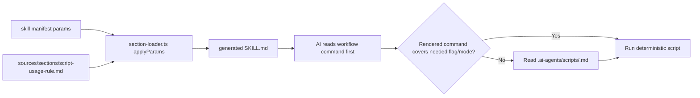

# Architecture Design: Script Call Prompt Optimization

## Overview

The current shared `Script Usage Rule` section uses coarse boolean parameters (`uses_plan_update`, `uses_epic_update`, `uses_session_update`) to render the same generic script guidance into every calling skill. This solved the earlier script-callability problem by preventing `.js` / `.cjs` source reads, but it now creates avoidable prompt overhead and occasional ambiguity: some skills already contain exact, workflow-specific script commands, yet still receive a generic minimal command plus a prompt to read `.ai-agents/scripts/*.md`.

This design introduces mode-specific script guidance using additional boolean template flags, not string enum branching, because `section-loader.ts` supports truthy/inverted/block rendering but does not support equality checks. The change stays in the documentation/assembly layer: it modifies `sources/sections/script-usage-rule.md` and selected skill manifests/business guidance, with focused tests proving that rendered skills preserve script safety while avoiding unnecessary reference reads.

### Architectural Concerns

| Concern | Source of evidence | Priority |
|---|---|---|
| Avoid unnecessary `.ai-agents/scripts/*.md` reads during normal skill execution | Proposal findings for `mvt-implement`, `mvt-update-plan`, `mvt-decompose` | must |
| Preserve the rule that agents must not read `.js` / `.cjs` source for script usage | Existing `script-usage-rule.md`, prior script-callability design | must |
| Avoid adding template engine complexity for a prompt-only optimization | `section-loader.ts` supports booleans/blocks, not string equality | must |
| Preserve generic script reference where a skill truly needs output or argument semantics | `mvt-update-plan` requires plan-update output interpretation | must |
| Keep State Update self-contained and do not regress into session script doc reads | Existing shared-section prompt optimization ADR-5 | must |
| Reduce duplicate or conflicting command templates in generated `SKILL.md` files | `mvt-implement` has both concrete deliverables command and generic plan command | should |
| Keep migration small and reviewable | Only six script-related skills are affected | should |

## Architecture Decision Records

### ADR-1: Use boolean guidance flags instead of string-valued modes

| Field | Content |
|---|---|
| Title | Use boolean script guidance flags compatible with the existing section loader |
| Status | accepted |
| Context | The proposal described conceptual modes such as `plan_update_guidance: inline_command_only`. However, `section-loader.ts` only supports `{{#key}}`, `{{^key}}`, `{{?key}}`, arrays, objects, and variable substitution. It does not support equality checks such as `{{#if plan_update_guidance == "inline_command_only"}}`. Adding equality support would expand engine behavior for a prompt-only optimization. |
| Decision | Keep existing booleans for backward compatibility and add explicit boolean flags for specialized rendering paths, such as `plan_update_inline_command_only`, `plan_update_project_reminder`, `epic_update_inline_modes_only`, and `epic_update_fallback_for_unrendered_modes`. `script-usage-rule.md` uses truthy blocks and inverted defaults only. |
| Alternatives | **String enum params**: clearer manifest vocabulary, but requires unsupported template comparisons or preprocessing. **Engine enhancement**: flexible long term, but outside this change's scope and increases test surface. |
| Consequences | Positive: no change to `section-loader.ts`, `assembler.ts`, manifest schema, or build pipeline. Negative: manifests carry more boolean flags and must avoid contradictory combinations; tests must cover representative combinations. |

### ADR-2: Preserve legacy boolean behavior as the default path

| Field | Content |
|---|---|
| Title | Preserve `uses_plan_update` and `uses_epic_update` as generic reference defaults |
| Status | accepted |
| Context | Existing skills already pass `uses_plan_update`, `uses_epic_update`, and `uses_session_update`. Removing or redefining those flags would force a broader migration and could break skills not included in this optimization pass. |
| Decision | Existing booleans continue to render the current generic reference behavior unless a more specific boolean suppresses or replaces that script's block. Specialized flags are opt-in per skill. |
| Alternatives | **Replace booleans entirely**: cleaner final state but larger blast radius. **Separate new section file per mode**: avoids template branching but fragments script guidance across more files. |
| Consequences | Positive: backward compatible and incremental. Negative: the section must include explicit suppression logic to avoid rendering both generic and specialized blocks for the same script. |

### ADR-3: Render inline-command-only guidance for skills with authoritative local commands

| Field | Content |
|---|---|
| Title | Suppress generic minimal commands when the workflow already renders the authoritative command |
| Status | accepted |
| Context | `mvt-implement` already includes the exact deliverables handoff command using `--deliverables-pointer` and `--mark-deliverable-stale`. Rendering the generic `plan-update.cjs --status <new_status>` command in the same skill creates duplicate guidance and may encourage reading `plan-update.md` unnecessarily. |
| Decision | Add a `plan_update_inline_command_only` path that renders only invariants: do not hand-edit `plan.yaml`; use the exact command shown in the workflow; do not read `.js` / `.cjs` source. It does not render a generic command or `.ai-agents/scripts/plan-update.md` pointer. Apply this to `mvt-implement`. |
| Alternatives | **Keep generic plan block**: lowest implementation cost but preserves the ambiguity. **Move the concrete command into the shared section**: possible later, but larger because the command is workflow-specific and tied to deliverables freshness behavior. |
| Consequences | Positive: `mvt-implement` becomes more direct and less likely to trigger extra doc reads. Negative: maintainers must ensure the workflow command remains complete because the shared generic fallback is intentionally absent. |

### ADR-4: Keep generic reference behavior for the dedicated plan update skill

| Field | Content |
|---|---|
| Title | Keep `mvt-update-plan` as the generic plan-update reference user |
| Status | accepted |
| Context | `mvt-update-plan` is itself the generic interface for mutating `plan.yaml`. It must explain task status, artifacts, notes, script output interpretation, and failure reporting. Unlike `mvt-implement`, it cannot rely on one fixed workflow command. |
| Decision | Keep generic plan-update guidance and the `.ai-agents/scripts/plan-update.md` reference for `mvt-update-plan`, especially for argument value sources and output interpretation. Narrow only the epic-update guidance in that skill where the exact `--complete-child` and `--set-child-status` commands are already rendered inline. |
| Alternatives | **Suppress all script docs for `mvt-update-plan`**: saves tokens but risks incorrect interpretation of script output. **Inline every plan-update semantic into the skill**: increases generated prompt size and duplicates the script doc. |
| Consequences | Positive: correctness is preserved for the skill with the highest script-semantics burden. Negative: `mvt-update-plan` keeps more prompt text than task-specific skills. |

### ADR-5: Treat script document reads as explicit fallback behavior

| Field | Content |
|---|---|
| Title | Read script docs only for flags or modes not rendered in the current skill |
| Status | accepted |
| Context | Current language says to read script `.md` files for optional flags or all modes. This is safe but too eager when a skill already renders exact commands for the modes it uses. |
| Decision | Reword script guidance so rendered workflow commands are authoritative. Script docs are read only when the workflow requires a flag, mode, output field, or value source not rendered in the current skill. `.js` and `.cjs` source remains prohibited. |
| Alternatives | **Always point to script docs**: safer for unknown modes but causes recurring token/file-read overhead. **Never point to script docs**: leaner but unsafe for generic or rare modes. |
| Consequences | Positive: reduces normal execution overhead while keeping a safe escape hatch. Negative: wording must be precise enough that agents do not over-suppress useful references. |

## Module Design

| Module | Responsibility | Owned entities | Dependencies |
|---|---|---|---|
| `sources/sections/script-usage-rule.md` | Render script safety guidance with generic and specialized boolean paths | Plan/epic/session script guidance text and doc-read fallback rules | `section-loader.ts` Mustache-like boolean rendering |
| `sources/skills/mvt-implement/manifest.yaml` | Opt into plan inline-command-only guidance | `plan_update_inline_command_only` param | Existing `mvt-implement/business.md` deliverables command |
| `sources/skills/mvt-sync-context/manifest.yaml` | Opt into compact plan project reminder if plan mutation remains only a reminder | `plan_update_project_reminder` param | Existing Step 12 reminder |
| `sources/skills/mvt-update-plan/manifest.yaml` | Keep generic plan reference and opt into inline-only epic modes | `uses_plan_update`, `epic_update_inline_modes_only` | Existing inline `--complete-child` and `--set-child-status` commands |
| `sources/skills/mvt-decompose/manifest.yaml` | Use epic fallback only for modes not rendered locally | `epic_update_fallback_for_unrendered_modes` | Existing inline `--validate`, `--add-child`, `--complete-child` examples |
| `sources/skills/mvt-analyze/manifest.yaml` | Use epic fallback for unresolved epic-child modes | `epic_update_fallback_for_unrendered_modes` | Existing epic-child `--switch-active` behavior |
| `sources/skills/mvt-cleanup/manifest.yaml` | Avoid session-only Script Usage Rule output | Remove section or set session-only suppression | State Update section already renders session command |
| `test/section-loader.test.ts` | Verify section rendering combinations | Focused render assertions | `applyParams` / `loadSection` |
| `test/assembler.test.ts` | Verify representative generated skills | `mvt-implement`, `mvt-update-plan`, `mvt-cleanup` output assertions | `assembleFromManifest` |

Layer compliance: all edits remain in `sources/sections`, `sources/skills`, and tests. No runtime CLI module, script, YAML schema, or materialization behavior changes.

## Key Interfaces

### Manifest parameter contract

```yaml
# Existing generic behavior, preserved
uses_plan_update: true
uses_epic_update: true
uses_session_update: true

# New specialized boolean paths
plan_update_inline_command_only: true
plan_update_project_reminder: true
epic_update_inline_modes_only: true
epic_update_fallback_for_unrendered_modes: true
session_update_state_update_only: true
```

Rules:

| Flag | Meaning | Should not be combined with |
|---|---|---|
| `uses_plan_update` | Render generic plan-update command and docs reference | `plan_update_inline_command_only`, `plan_update_project_reminder` |
| `plan_update_inline_command_only` | Render only invariant safety text; use workflow command | `uses_plan_update`, `plan_update_project_reminder` |
| `plan_update_project_reminder` | Render compact `--projects` reminder and fallback rule | `uses_plan_update`, `plan_update_inline_command_only` |
| `uses_epic_update` | Render generic epic-update command and docs reference | `epic_update_inline_modes_only`, `epic_update_fallback_for_unrendered_modes` |
| `epic_update_inline_modes_only` | Render invariant safety text; use inline workflow mode commands | `uses_epic_update`, `epic_update_fallback_for_unrendered_modes` |
| `epic_update_fallback_for_unrendered_modes` | Render invariant safety text plus doc fallback for non-rendered modes | `uses_epic_update`, `epic_update_inline_modes_only` |
| `uses_session_update` | Render session script safety text if no State Update section exists | `session_update_state_update_only` |
| `session_update_state_update_only` | Render nothing from Script Usage Rule for session-only skills | `uses_session_update` |

### Section rendering contract

`script-usage-rule.md` must remain implementable with the existing template grammar:

```markdown
{{#plan_update_inline_command_only}}
...
{{/plan_update_inline_command_only}}

{{^plan_update_inline_command_only}}
{{#uses_plan_update}}
...
{{/uses_plan_update}}
{{/plan_update_inline_command_only}}
```

Because nested inverted/generic combinations can be hard to reason about, tests should cover the final rendered outputs rather than relying on visual inspection alone.

### No engine interface changes

The following files must not change for this design:

- `src/build/section-loader.ts`
- `src/build/assembler.ts`
- `src/types/manifest.ts`
- `sources/scripts/*.js`
- `sources/scripts/*.cjs`

## Data Flow

No runtime script data flow changes. The prompt rendering flow changes only by selecting a more specific text block at assembly time:



Error path: if a manifest accidentally sets contradictory flags, a generated skill may render both generic and specialized guidance or render no guidance. This is mitigated by section-loader/assembler tests for representative combinations and by documenting mutually exclusive flags in this design.

## File Structure

| File | Action | Purpose |
|---|---|---|
| `sources/sections/script-usage-rule.md` | modify | Add specialized boolean rendering paths and fallback-first wording |
| `sources/skills/mvt-cleanup/manifest.yaml` | modify | Remove session-only Script Usage Rule or suppress it |
| `sources/skills/mvt-implement/manifest.yaml` | modify | Replace `uses_plan_update` with `plan_update_inline_command_only` |
| `sources/skills/mvt-sync-context/manifest.yaml` | modify | Replace `uses_plan_update` with `plan_update_project_reminder` if no concrete command is added |
| `sources/skills/mvt-update-plan/manifest.yaml` | modify | Keep generic plan guidance; replace generic epic guidance with `epic_update_inline_modes_only` |
| `sources/skills/mvt-decompose/manifest.yaml` | modify | Replace generic epic guidance with fallback-for-unrendered-modes guidance |
| `sources/skills/mvt-analyze/manifest.yaml` | modify | Replace generic epic guidance with fallback-for-unrendered-modes guidance |
| `sources/skills/*/business.md` | modify selectively | Remove eager `read .ai-agents/scripts/*.md` phrasing where inline command is sufficient |
| `test/section-loader.test.ts` | modify | Add focused rendering tests for specialized script guidance modes |
| `test/assembler.test.ts` | modify | Add/adjust representative skill output assertions |
| `.claude/skills/*/SKILL.md` | regenerate | Verify generated prompt reductions |
| `.qoder/skills/*/SKILL.md` | regenerate if installed/materialized | Keep installed platform outputs consistent |

## Implementation Guidelines

1. Start with `sources/sections/script-usage-rule.md`. Add specialized blocks before the generic blocks or use inverted wrappers so a specialized flag suppresses the generic rendering for the same script.
2. Keep the generic `uses_plan_update` and `uses_epic_update` behavior unchanged for any skill not migrated in this pass.
3. For `mvt-implement`, render only: do not hand-edit `plan.yaml`; use the exact deliverables command in the workflow; do not read `.js` / `.cjs` source; read `plan-update.md` only if a future workflow step needs an unrendered flag.
4. For `mvt-update-plan`, keep the plan docs reference because the skill must interpret script output. Narrow epic guidance to the two inline commands already shown in Step 5.
5. For `mvt-cleanup`, remove the `script-usage-rule.md` shared section if it only renders session guidance; State Update is already self-sufficient.
6. Avoid changing `section-loader.ts`. If the desired branching seems hard with boolean flags, simplify the section text rather than expanding the template engine.
7. Add tests before broad regeneration: one focused section-loader test for each specialized mode, plus assembler assertions that `mvt-implement` does not contain the generic `--status <new_status>` plan command or eager `plan-update.md` pointer.
8. Run focused tests first, then full validation:

```bash
npx vitest run test/section-loader.test.ts test/assembler.test.ts
npm run build
npm test
```

9. Regenerate installed skill outputs through the existing materialization path and compare generated `.claude/skills/*/SKILL.md` diffs for the six target skills.

## Change Tracking

| Item | Value |
|---|---|
| Change ID | `20260619-script-call-prompt-optimization` |
| Source input | Conversation request + `script-call-prompt-optimization-proposal.md` |
| Files created | `.ai-agents/workspace/artifacts/20260619-script-call-prompt-optimization/design.md` |
| Files expected to change in implementation | `sources/sections/script-usage-rule.md`, six selected skill manifests, selected business prose, focused tests, generated skill outputs |
| New runtime modules | None |
| Engine changes | None |
| Script behavior changes | None |
| Schema changes | None |
| ADRs | 5 |
| Expected generated prompt savings | About 150-250 words across affected generated skills, plus fewer execution-time script doc reads |
| Recommended next skill | `/mvt-implement` |
