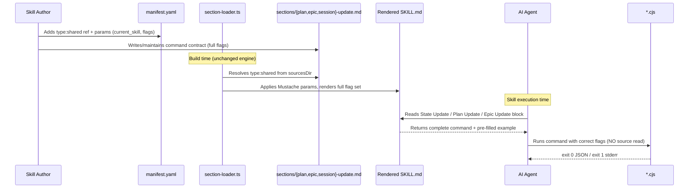

# Architecture Design: Script Callability — Eliminate AI Reading Script Source

> Source: `analysis.md` (this change) + `bug-detect` diagnosis + existing codebase patterns.
> Change-id: `20260619-script-callability`
> Subject system: the MVTT framework documentation/assembly layer (shared sections, skill manifests, business.md prose). No script behavior, section-loader engine, or build pipeline changes.

## Overview

The MVTT framework ships three deterministic scripts (`session-update.cjs`, `plan-update.cjs`, `epic-update.cjs`) that skills call to mutate `session.yaml`, `plan.yaml`, and `epic.yaml`. Today, only `session-update.cjs` has a shared section (`sources/sections/session-update.md`) documenting its command contract; `plan-update.cjs` and `epic-update.cjs` have none, so their usage is described ad-hoc inside each skill's `business.md` with inconsistent completeness. Worse, `session-update.md` uses ~15 Mustache conditional flags, so a skill whose manifest forgets to enable a flag silently loses that parameter's documentation from its rendered `SKILL.md`. The net effect: the AI, facing a placeholder template or a hidden flag, reduces uncertainty the only way it can — opening the `.js` source under `sources/scripts/`, incurring per-invocation context-token cost and latency.

This design makes every rendered `SKILL.md` a self-contained, copy-runnable command contract for the scripts it calls. It introduces two new shared sections (`plan-update.md`, `epic-update.md`), aligns each skill's manifest flags with the flags its `business.md` actually invokes, and adds a skill-specific pre-filled example command to each script-call block. The change is confined to the documentation/assembly layer: no script CLI surface, output format, or exit-code contract changes; the section-loader engine and build pipeline are untouched.

### Architectural concerns

| Concern | Source of evidence | Priority |
|---------|-------------------|----------|
| Self-contained command contract per script (no source reads) | analysis R1, bug-detect root cause | must |
| Shared sections for plan-update and epic-update | analysis R2, bug-detect "missing sections" | must |
| Manifest flags must cover flags business.md actually invokes | analysis R3, BR2 | must |
| Concrete pre-filled example per skill | analysis R4 | must |
| Single authoritative usage source (no duplication) | analysis R5, BR1 | must |
| Zero behavior change (scripts, engine, schemas) | analysis R6, BR6 | must |
| Read-only skills exempt from command contracts | analysis BR5 | must |
| Drift prevention between script headers and shared sections | analysis Q2 | should |
| Audit scope: all script-calling skills, high-friction first | analysis Q3 | should |
| Keep rendered SKILL.md size growth bounded | analysis Q1 | nice |

## Architecture Decision Records

### ADR-1: Create shared sections for plan-update and epic-update, mirroring session-update.md

| Field | Content |
|-------|---------|
| Status | accepted |
| Context | `sources/sections/` contains `session-update.md` but no `plan-update.md` or `epic-update.md`. Their usage lives only in script header comments and ad-hoc `business.md` prose. The section-loader (`src/build/section-loader.ts`) already resolves `type: shared` sections from `sourcesDir` and applies Mustache params, so the mechanism is proven. |
| Decision | Add `sources/sections/plan-update.md` and `sources/sections/epic-update.md`, each containing: (a) a full command template, (b) an argument value-source table, (c) a parameter-semantics table, (d) an output-interpretation block (exit 0 JSON / exit 1 stderr). Reference them from each calling skill's `manifest.yaml` via `type: shared` + `source: sections/<name>.md`. |
| Alternatives | (a) Keep ad-hoc `business.md` prose only — rejected: inconsistent coverage is the root cause. (b) A single consolidated `scripts-reference.md` loaded via registry knowledge — rejected as primary mechanism (see ADR-4); per-skill sections are co-located with where the command is needed. |
| Consequences | (+) Every plan/epic skill gets an identical, complete command contract. (+) Single source of truth per script (BR1). (-) Two new files to maintain; mitigated by ADR-5 drift-prevention. |

### ADR-2: plan-update.md and epic-update.md render their full flag set unconditionally

| Field | Content |
|-------|---------|
| Status | accepted |
| Context | `session-update.md` uses ~15 conditional flags because `session-update.cjs` has many modes and conditional rendering keeps each rendered SKILL.md lean. `plan-update.cjs` (8 flags) and `epic-update.cjs` (5 modes) have far fewer flags. The bug-detect root cause showed conditional rendering reintroduces the "hidden flag" risk when a manifest forgets to enable a flag (R3). |
| Decision | `plan-update.md` and `epic-update.md` render their complete flag set unconditionally (no `{{#flag}}` gating). Every skill that references the section gets the full command template and full argument table. Skills still pass `current_skill` (and any skill-specific example values) as params, but flag *presence* is not gated. |
| Alternatives | (a) Mirror session-update.md's per-flag conditional rendering — rejected: fewer flags mean the lean-rendering benefit is negligible, while the hidden-flag risk is the exact defect being fixed. (b) Hybrid (gate only rarely-used flags) — rejected: adds complexity and still has hidden-flag risk. |
| Consequences | (+) Zero hidden-flag risk for plan/epic scripts (BR2 trivially satisfied). (+) Simpler manifests (no per-flag booleans needed). (-) Each rendered SKILL.md grows by ~15-25 lines of flag docs; acceptable given the scripts' small flag count and the callability goal. |

### ADR-3: session-update.md keeps conditional rendering but gains a manifest-flag audit

| Field | Content |
|-------|---------|
| Status | accepted |
| Context | `session-update.md`'s ~15 conditional flags are justified by `session-update.cjs`'s many modes and the large per-SKILL.md size savings. Ripping out conditionality would bloat every skill's State Update block with flags it never uses. However, the bug-detect found manifest/business.md misalignment (e.g. `mvt-implement` uses plan-update deliverables flags with no section coverage; `mvt-cleanup` relies on `--close-change`/`--truncate-history`). |
| Decision | Keep `session-update.md`'s conditional rendering as-is. Add a one-pass audit aligning each skill's `manifest.yaml` `session-update.md` params with the flags its `business.md` actually invokes (BR2). The audit is a documentation fix, not an engine change. |
| Alternatives | (a) Make session-update.md unconditional too — rejected: ~15 flags × every skill = excessive bloat. (b) Auto-generate manifests from business.md script calls — rejected: premature automation, adds build complexity. |
| Consequences | (+) Preserves lean rendering for the large session-update section. (+) Audit closes the hidden-flag gap for existing skills. (-) Future skills must maintain the manifest↔business.md alignment manually; mitigated by ADR-5 and a review checklist. |

### ADR-4: Per-skill pre-filled example, not a consolidated scripts-reference knowledge doc

| Field | Content |
|-------|---------|
| Status | accepted |
| Context | analysis Q4 asked whether a consolidated `scripts-reference.md` loaded via registry knowledge should complement per-skill sections. The bug-detect noted the AI needs the command *at the point of execution* (the State Update block), not as a separate lookup. |
| Decision | Per-skill shared sections (ADR-1) are the primary mechanism. Each skill's script-call block additionally includes one skill-specific pre-filled example command (R4) with every flag the skill uses substituted with realistic placeholders. Do NOT create a consolidated `scripts-reference.md` knowledge doc at this time. |
| Alternatives | (a) Consolidated `scripts-reference.md` via registry `knowledge._all` — rejected as primary: adds a second loading path and a lookup indirection; revisit only if per-skill sections prove insufficient in practice. (b) Example only, no shared section — rejected: examples without a full flag table still leave the AI guessing about flags the example omits. |
| Consequences | (+) Command contract is co-located with execution context. (+) Concrete example reduces AI uncertainty more than abstract templates. (-) Example must be kept in sync with the skill's actual flag usage; covered by the ADR-3 audit. |

### ADR-5: Script header comments become pointers; shared section is the source of truth

| Field | Content |
|-------|---------|
| Status | accepted |
| Context | analysis Q2 flagged drift risk: script headers (`session-update.js` lines 14-33, `epic-update.js` lines 15-37, `plan-update.js` lines 17-27) currently hold authoritative usage. Once shared sections are the source of truth, headers can drift. |
| Decision | Shared sections (`sources/sections/*.md`) are the single source of truth for script usage (BR1). Reduce each script's header comment to a brief one-line pointer: `// Usage: see sources/sections/<name>.md (rendered into each skill's SKILL.md)`. Keep the `Output:` block (exit 0/exit 1 contract) in the header since it documents runtime behavior, not skill-facing usage. |
| Alternatives | (a) Auto-generate shared sections from script headers via build pipeline — rejected: adds build complexity; manual section is simpler and matches current architecture. (b) Keep full usage in both header and section — rejected: guarantees drift. |
| Consequences | (+) Eliminates drift by having one source of truth. (+) Headers stay short. (-) A developer reading only the script sees a pointer, not full usage; acceptable since skills are the primary consumer. |

### ADR-6: Audit scope is all script-calling skills, high-friction four first

| Field | Content |
|-------|---------|
| Status | accepted |
| Context | analysis Q3 asked whether the manifest-flag audit (ADR-3) and section referencing should cover only the four high-friction skills (`mvt-decompose`, `mvt-implement`, `mvt-cleanup`, `mvt-update-plan`) or all script-calling skills. |
| Decision | Audit all skills that call any script, but implement in two passes. Pass 1 (high-friction): `mvt-decompose` (add `epic-update.md` reference + concrete `--complete-child`/`--switch-active`/`--add-child` examples), `mvt-implement` (add `plan-update.md` reference covering `--deliverables-pointer`/`--mark-deliverable-stale`), `mvt-cleanup` (verify `--close-change`/`--truncate-history` flags enabled), `mvt-update-plan` (replace inline command with `plan-update.md` + `epic-update.md` references). Pass 2 (remaining): `mvt-analyze`, `mvt-plan-dev`, `mvt-fix`, `mvt-sync-context`, and any other skill whose `business.md` references a script. |
| Alternatives | (a) Only the four high-friction skills — rejected: leaves known gaps in other skills. (b) All skills in one pass — rejected: larger change surface, harder to review. |
| Consequences | (+) Prioritized delivery of highest-value fixes. (+) Full coverage eventually. (-) Two-pass means a temporary state where some skills are fixed and others aren't; acceptable since each skill is independent. |

## Module Design

This change touches the documentation/assembly layer only. "Modules" here are documentation components, not runtime modules.

| Module | Responsibility | Owned entities | Dependencies |
|--------|---------------|----------------|--------------|
| `sections/plan-update.md` (new) | Single source of truth for `plan-update.cjs` command contract: full template, arg value-source table, parameter-semantics table, output interpretation. | plan-update.cjs flag set (8 flags) | Referenced by skills via `type: shared` |
| `sections/epic-update.md` (new) | Single source of truth for `epic-update.cjs` command contract: full template (5 modes), arg value-source table, parameter-semantics table, output interpretation. | epic-update.cjs flag set (5 modes) | Referenced by skills via `type: shared` |
| `sections/session-update.md` (modified) | Unchanged structure; benefits from the manifest-flag audit ensuring all calling skills enable the flags they use. | session-update.cjs flag set (~15 flags) | Referenced by skills via `type: shared` |
| Skill manifests (modified) | Add `type: shared` references to new sections; align conditional flags with `business.md` actual calls; pass `current_skill` + example values. | Per-skill `manifest.yaml` | sections/*, business.md |
| Skill business.md (modified) | Replace inline ad-hoc command prose with references to the shared section; keep skill-specific *when to call* guidance; ensure pre-filled example is present. | Per-skill `business.md` | sections/* |
| Script headers (modified) | Reduce usage comment to a one-line pointer to the shared section; keep `Output:` contract block. | `session-update.js`, `epic-update.js`, `plan-update.js` | sections/* (referenced) |

**Layer compliance**: All changes are within the `sources/sections/` + `sources/skills/` + `sources/scripts/` documentation layer. No change crosses into `src/build/` (engine) or script runtime logic. The section-loader's `type: shared` resolution path is reused as-is.

## Key Interfaces

No runtime interfaces change. The documentation interfaces are:

### New shared section: `sources/sections/plan-update.md`

```markdown
## Plan Update Script

After completing the skill's plan-mutation task, call the plan update script:

```bash
node .ai-agents/scripts/plan-update.cjs \
  --plan "<active_change.plan_path>" \
  --task <task_id> \
  --status <pending|in_progress|done|blocked|skipped> \
  --projects "<comma,separated,project,names>" \
  [--artifacts "<comma,separated,paths>"] \
  [--notes "<free-form text>"] \
  [--deliverables-pointer current] \
  [--mark-deliverable-stale <task_id>[,task_id2,...]]
```

### Argument values
| Argument | Value source | Example |
|----------|-------------|---------|
| `--plan` | `active_change.plan_path` from session.yaml | `".ai-agents/workspace/artifacts/chg-001/plan.yaml"` |
| `--task` | the task_id being updated | `t1` |
| `--status` | new status | `done` |
| `--projects` | comma-separated project names from `plan.yaml > current_tasks` keys (single-project: `default`) | `"web,api"` |
| `--artifacts` | optional; comma-separated paths to append (de-duplicated) | `"src/auth.ts,src/auth.test.ts"` |
| `--notes` | optional; overwrites the task's notes | `"blocked on API spec"` |
| `--deliverables-pointer` | optional; set to `current` to record that this task's deliverables section is written | `current` |
| `--mark-deliverable-stale` | optional; comma-separated downstream task ids whose deliverables are now stale | `"t3,t4"` |

### Parameter semantics
| Argument | When to use | Effect on `plan.yaml` |
|----------|-------------|------------------------|
| `--task` + `--status` | Always (core mutation) | Sets task status; sets `completed_at` when `done`. |
| `--projects` | Always (per-project validation) | Drives per-project DAG advancement + validation. |
| `--artifacts` | Task produced/touched files | Appends + de-duplicates paths. |
| `--notes` | Task needs a free-form note | Overwrites existing notes. |
| `--deliverables-pointer` + `--mark-deliverable-stale` | Task wrote its deliverables section | Records pointer; marks downstream tasks stale for `/mvt-resume` + `/mvt-status`. |

### Output interpretation
- **Exit 0**: one-line JSON on stdout, e.g. `{"ok":true,"task":{...},"current_tasks":{"web":"t2"},"plan_status":"in_progress",...}`. Use these fields directly; the file is already written — do NOT read it back.
- **Exit 1**: plain-text error on stderr. The file was NOT modified. Report the error; do not fabricate success.
```

### New shared section: `sources/sections/epic-update.md`

```markdown
## Epic Update Script

Call the epic update script for epic.yaml mutations (child completion, advancement, switching, adding children, validation):

```bash
# Complete current child and advance to next
node .ai-agents/scripts/epic-update.cjs --epic <epic_path> --complete-child <change_id>

# Set a child's status without advancing
node .ai-agents/scripts/epic-update.cjs --epic <epic_path> --set-child-status <change_id> --child-status <status>

# Switch active child to a different one
node .ai-agents/scripts/epic-update.cjs --epic <epic_path> --switch-active <change_id>

# Add one or more children
node .ai-agents/scripts/epic-update.cjs --epic <epic_path> \
  --add-child <id> --child-title "<t>" --child-scope "<s>" [--child-depends-on "dep1,dep2"] \
  [--add-child <id2> --child-title "<t2>" --child-scope "<s2>" ...]

# Validate an epic.yaml
node .ai-agents/scripts/epic-update.cjs --validate <epic_path>
```

### Argument values
| Argument | Value source | Example |
|----------|-------------|---------|
| `--epic` | `active_epic.epic_path` from session.yaml | `".ai-agents/workspace/artifacts/epic-20260608-x/epic.yaml"` |
| `--complete-child` | `active_change.id` being completed | `20260608-sub` |
| `--set-child-status` / `--child-status` | target child id / new status (`active`\|`pending`\|`done`\|`abandoned`) | `20260608-sub` / `done` |
| `--switch-active` | target child id to make active | `20260609-sub2` |
| `--add-child` / `--child-title` / `--child-scope` | new child id / title / scope (repeatable for multiple) | `20260620-sub3` / `"Cart"` / `"..."` |
| `--child-depends-on` | optional; comma-separated prerequisite child ids | `"20260608-sub"` |
| `--validate` | path to an epic.yaml to validate | same as `--epic` |

### Parameter semantics
| Argument | When to use | Effect on `epic.yaml` |
|----------|-------------|------------------------|
| `--complete-child` | A child change's plan is fully done | Sets child `status: done`, advances `current_change` to next pending child per DAG. |
| `--set-child-status` | Mark a child done/abandoned without advancing | Sets child status only. |
| `--switch-active` | Reorder to a different child (deps permitting) | Sets target child `active`, others `pending`, updates `current_change`. |
| `--add-child` | Append children to an existing epic | Adds to `children[]`; validates uniqueness + DAG. |
| `--validate` | Verify epic.yaml integrity | Read-only check; no write. |

### Output interpretation
- **Exit 0**: one-line JSON on stdout. Use fields directly; file already written — do NOT read it back.
- **Exit 1**: plain-text error on stderr. File NOT modified. Report the error; do not fabricate success.
```

### Skill manifest reference pattern (per calling skill)

```yaml
  - type: shared
    source: sections/plan-update.md
    params:
      current_skill: mvt-implement
  # and/or
  - type: shared
    source: sections/epic-update.md
    params:
      current_skill: mvt-decompose
```

## Data Flow

This is a documentation/assembly-layer change. The runtime data flow (skill → script → YAML mutation) is unchanged. The *documentation rendering* flow is:



**Error path**: If a skill's manifest omits a `type: shared` reference to a section for a script its `business.md` calls, the rendered SKILL.md lacks the command contract. The AI would fall back to reading source — this is the defect the audit (ADR-3, ADR-6) eliminates. Post-audit, every script-calling skill references the relevant section.

## File Structure

| Path | Action | Purpose |
|------|--------|---------|
| `sources/sections/plan-update.md` | create | Shared section for plan-update.cjs command contract |
| `sources/sections/epic-update.md` | create | Shared section for epic-update.cjs command contract |
| `sources/sections/session-update.md` | modify (audit only) | No structural change; calling skills' manifests aligned |
| `sources/skills/mvt-decompose/manifest.yaml` | modify | Add `type: shared` ref to `sections/epic-update.md` |
| `sources/skills/mvt-decompose/business.md` | modify | Replace inline `--validate`-only command with section reference + concrete `--complete-child`/`--switch-active`/`--add-child` examples |
| `sources/skills/mvt-implement/manifest.yaml` | modify | Add `type: shared` ref to `sections/plan-update.md` |
| `sources/skills/mvt-implement/business.md` | modify | Replace inline plan-update command with section reference; keep deliverables-specific *when* guidance |
| `sources/skills/mvt-cleanup/manifest.yaml` | modify | Verify `close_change` + `truncate_history` flags enabled (already set per context) |
| `sources/skills/mvt-cleanup/business.md` | modify | Add pre-filled example command; reference session-update section |
| `sources/skills/mvt-update-plan/manifest.yaml` | modify | Add `type: shared` refs to `sections/plan-update.md` + `sections/epic-update.md` |
| `sources/skills/mvt-update-plan/business.md` | modify | Replace inline commands with section references; keep epic-advancement *when* guidance |
| `sources/skills/mvt-analyze/business.md` | modify (Pass 2) | Reference epic-update section for epic-child mode `--switch-active`/`--add-child` |
| `sources/skills/mvt-plan-dev/business.md` | modify (Pass 2) | Reference plan-update section if it calls plan-update |
| `sources/skills/mvt-fix/business.md` | modify (Pass 2) | Reference relevant sections if it calls scripts |
| `sources/skills/mvt-sync-context/business.md` | modify (Pass 2) | Reference plan-update section for `--projects` guidance |
| `sources/scripts/session-update.js` | modify | Reduce header usage comment to one-line pointer; keep `Output:` block |
| `sources/scripts/epic-update.js` | modify | Reduce header usage comment to one-line pointer; keep `Output:` block |
| `sources/scripts/plan-update.js` | modify | Reduce header usage comment to one-line pointer; keep `Output:` block |
| `test/section-loader.test.ts` | modify | Add tests asserting new sections render with full flag set unconditionally |
| `test/assembler.test.ts` | modify | Add snapshot/assertion tests for skills referencing new sections |

## Implementation Guidelines

1. **Order**: Create the two new shared sections first (`plan-update.md`, `epic-update.md`), since all skill changes depend on them existing.
2. **Pass 1 (high-friction skills)**: Update `mvt-decompose`, `mvt-implement`, `mvt-cleanup`, `mvt-update-plan` manifests + business.md. Run the build + tests after this pass to validate rendering.
3. **Pass 2 (remaining skills)**: Audit `mvt-analyze`, `mvt-plan-dev`, `mvt-fix`, `mvt-sync-context` and any other script-calling skill; add section references + pre-filled examples.
4. **Script headers**: Reduce to one-line pointers last, after sections are confirmed complete, to avoid a window where neither header nor section is authoritative.
5. **Tests**: Add section-loader tests for the new sections (unconditional rendering of full flag set) and assembler tests confirming the high-friction skills' rendered output contains the expected command contract. Existing tests must remain green.
6. **Validation**: After each pass, run `npm run build` (or equivalent) and inspect a rendered high-friction SKILL.md (e.g. `.claude/skills/mvt-implement/SKILL.md`) to confirm the command contract is present and complete.
7. **No `project-context.yaml` / `project-context.md` changes** (BR6).

## Change Tracking

| File | Created | Modified | Deleted |
|------|---------|----------|---------|
| `sources/sections/plan-update.md` | yes | — | — |
| `sources/sections/epic-update.md` | yes | — | — |
| `sources/sections/session-update.md` | — | yes (audit only, no structural change) | — |
| `sources/skills/mvt-decompose/manifest.yaml` | — | yes | — |
| `sources/skills/mvt-decompose/business.md` | — | yes | — |
| `sources/skills/mvt-implement/manifest.yaml` | — | yes | — |
| `sources/skills/mvt-implement/business.md` | — | yes | — |
| `sources/skills/mvt-cleanup/manifest.yaml` | — | yes | — |
| `sources/skills/mvt-cleanup/business.md` | — | yes | — |
| `sources/skills/mvt-update-plan/manifest.yaml` | — | yes | — |
| `sources/skills/mvt-update-plan/business.md` | — | yes | — |
| `sources/skills/mvt-analyze/business.md` | — | yes (Pass 2) | — |
| `sources/skills/mvt-plan-dev/business.md` | — | yes (Pass 2) | — |
| `sources/skills/mvt-fix/business.md` | — | yes (Pass 2) | — |
| `sources/skills/mvt-sync-context/business.md` | — | yes (Pass 2) | — |
| `sources/scripts/session-update.js` | — | yes (header pointer) | — |
| `sources/scripts/epic-update.js` | — | yes (header pointer) | — |
| `sources/scripts/plan-update.js` | — | yes (header pointer) | — |
| `test/section-loader.test.ts` | — | yes | — |
| `test/assembler.test.ts` | — | yes | — |

**Total**: 2 created, 18 modified, 0 deleted = 20 files. Exceeds the ~5-file threshold → recommend `/mvt-plan-dev` as the next step.
