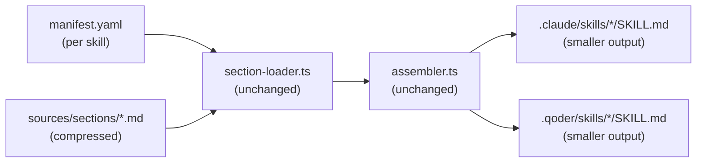

# Architecture Design: Shared Section Prompt Quality Optimization

## Overview

MVTT-generated `SKILL.md` files derive 45-68% of their content from shared template sections that are identical or near-identical across all 18+ skills. This dilutes the signal-to-noise ratio: each skill's unique business logic occupies only 27-55% of the document. The goal is to reduce shared-section token cost by 30%+ without compromising AI execution strength for time-critical instructions.

The design adopts a **two-strategy approach** governed by execution criticality classification:

1. **In-place phrasing compression** for time-critical execution flow (Activation Protocol) and global output constraints (Language Constraint, Output Format Constraint). These sections stay inline in every `SKILL.md`, proximate to business logic, because attention attenuation makes distant instructions less likely to be executed. Compression tightens prose without removing any actionable rule or override assertion.

2. **Inline operational compression** for State Update command guidance. The State Update section is a mandatory closing action for non-read-only skills, so it must remain self-sufficient. The long parameter tables are replaced with a fully pre-filled command template plus a compact list of safety-critical flag semantics. No new `session-update.md` reference file is created and no pointer is added that would encourage the AI to spend extra tokens reading another file during normal execution.

This is a documentation/assembly-layer change. No engine (`section-loader.ts`, `assembler.ts`), no script (`*.cjs`), and no YAML schema is modified. The rendered `SKILL.md` output changes in content volume and phrasing, not in structural section ordering.

### Architectural Concerns

| Concern | Source of evidence | Priority |
|---------|-------------------|----------|
| Token cost of shared sections dilutes business-logic SNR | analysis.md R1, measured 45-68% across 7 skills | must |
| Time-critical instructions must remain proximate to business logic | analysis.md BR1, stakeholder feedback on attention attenuation | must |
| Override assertions must survive compression | analysis.md R5, BR4 | must |
| State Update must remain self-sufficient without extra file reads | stakeholder feedback, analysis.md R5/BR4 | must |
| Cross-skill structural consistency (heading sequence) must be preserved | analysis.md R6 | must |
| No engine/script/schema changes | analysis.md R7, BR6 | must |
| `project-context-profile.md` is domain-specific, not boilerplate | analysis.md BR7 | nice |

## Architecture Decision Records

### ADR-1: Two-strategy optimization by execution criticality

| Field | Content |
|-------|--------|
| Title | Classify shared sections by execution criticality and apply strategy per class |
| Status | accepted |
| Context | analysis.md R2 requires classifying each shared section. Three classes emerged: time-critical execution flow (Activation Protocol, Pre-flight), global output constraints (Language, Output Format), and operational script guidance (State Update). Stakeholder feedback rejected extracting State Update parameter semantics into a new `session-update.md` because the AI may read the pointer during normal execution, increasing token cost and adding an avoidable file read. |
| Decision | Apply in-place phrasing compression to Activation Protocol and output constraints. Apply inline operational compression to State Update: keep the command template and safety-critical semantics inline, remove verbose table framing, and do not create or point to `sources/scripts/session-update.md`. No content moves to a global layer. |
| Alternatives | **Rejected: Extract State Update tables to `session-update.md`.** Saves inline characters only if the AI never reads the pointer; in practice the pointer can create extra token cost and one more file read. **Rejected: Extract all shared content to a global layer.** Violates BR1; attention attenuation risk for time-critical instructions. |
| Consequences | Positive: normal execution stays single-file and self-sufficient while still reducing boilerplate. Negative: savings are lower than full table extraction, especially for non-read-only skills. Downstream: `/mvt-implement` must compress State Update carefully rather than move content out. `/mvt-review` must verify that no extra file-read prompt was introduced. |

### ADR-2: Keep Language and Output Format as separate sections

| Field | Content |
|-------|--------|
| Title | Do not merge Language Constraint and Output Format Constraint into one section |
| Status | accepted |
| Context | analysis.md A2 raised whether merging the two constraint sections would save ~200 chars of duplicated framing prose. Merging would change the heading structure that all 17+ skill manifests reference via `type: shared` + `source:` declarations. |
| Decision | Keep the two sections separate. Compress each independently. The ~200-char saving is not worth the cross-manifest structural change and the risk of breaking the heading contract that lets readers navigate any `SKILL.md` by the same sequence. |
| Alternatives | **Rejected: Merge into single "Output Constraints" section.** Saves ~200 chars but requires updating all 17+ manifests' section references and risks heading-contract drift. The saving is marginal relative to the 30%+ target. |
| Consequences | Positive: zero manifest changes for constraint sections; heading contract preserved. Negative: ~200 chars of duplicated framing prose remain. Downstream: `/mvt-implement` edits only the two section source files, no manifest edits for this ADR. |

### ADR-3: Compress Activation Protocol worked example and anti-pattern to one-line summaries

| Field | Content |
|-------|--------|
| Title | Compress Activation Protocol worked example and anti-pattern list to single-line summaries |
| Status | accepted |
| Context | analysis.md A3. The worked example (registry entry to resolved path, ~350 chars) and anti-pattern list (two DO-NOT bullets, ~250 chars) together account for ~600 chars. They carry unique instructional value (preventing base-directory guessing errors) but are verbose. BR1 disallows moving them out of the section; only compression vs. verbatim is open. |
| Decision | Compress the worked example to a single-line path resolution demonstration. Compress the anti-pattern list to two single-line prohibitions. Preserve the instructional content (the path-join rule and the two prohibited behaviors) in condensed form. |
| Alternatives | **Rejected: Retain verbatim.** The verbose form costs ~300 extra chars for the same instructional content. **Rejected: Move to knowledge file.** Violates BR1 (time-critical content stays inline). |
| Consequences | Positive: ~300 chars saved while preserving the error-prevention value. Negative: the compressed form is less self-explanatory for a reader unfamiliar with the path-join convention. Downstream: `/mvt-implement` rewrites these two sub-blocks in `activation-load-context.md`. |

### ADR-4: Retain "re-assert every turn" in compressed Language Constraint

| Field | Content |
|-------|--------|
| Title | Preserve the explicit "re-assert every turn" instruction in the compressed Language Constraint |
| Status | accepted |
| Context | analysis.md A1. The "re-assert every turn" instruction costs ~15 chars but directly defends against a previously observed bug: interaction language intermittently outputting English (fixed in change `20260608-regular` by adding this exact instruction). Removing it risks regression. |
| Decision | Retain "re-assert every turn" (or equivalent single-clause phrasing) in the compressed Language Constraint. The compression target of <=600 chars accommodates this clause. |
| Alternatives | **Rejected: Simplify to single sentence without re-assert clause.** Saves ~15 chars but removes defense against the observed language-drift bug. The saving is negligible relative to the regression risk. |
| Consequences | Positive: regression defense preserved. Negative: ~15 chars above the theoretical minimum. Downstream: `/mvt-implement` must include this clause in the compressed `language-constraint.md`. |

### ADR-5: Keep State Update self-sufficient with inline operational compression

| Field | Content |
|-------|--------|
| Title | Do not create `sources/scripts/session-update.md`; compress State Update inline |
| Status | accepted |
| Context | The previous design treated State Update parameter tables as reference-only and proposed moving them to `sources/scripts/session-update.md`. Stakeholder feedback corrected the execution model: State Update is a mandatory closing action for every non-read-only skill, and a visible pointer to a new reference file may cause the AI to read more content during normal execution. That would trade inline boilerplate for extra token cost and latency. |
| Decision | Keep `sources/sections/session-update.md` self-sufficient. Replace the long "Argument values" and "Parameter semantics" tables with: (1) a fully pre-filled command template using `--skill {{current_skill}}`, (2) a compact "Critical flag semantics" list covering only dangerous combinations and non-obvious side effects, and (3) existing success/failure handling. Do not create `sources/scripts/session-update.md` and do not add a pointer to `.ai-agents/scripts/session-update.md`. |
| Alternatives | **Rejected: Create standalone `session-update.md`.** It can increase total token cost if read during normal execution and adds deployment/manifest surface area. **Rejected: Keep the current tables verbatim.** Preserves clarity but leaves the largest repeated State Update block untouched. |
| Consequences | Positive: normal execution remains one-pass and the command is easier to run without lookup. Negative: savings are smaller than extraction because critical semantics remain inline. Downstream: `/mvt-implement` edits only `sources/sections/session-update.md`; no new script doc or install-manifest entry is required. |

### ADR-6: Do not compress Suggested Next Steps

| Field | Content |
|-------|--------|
| Title | Leave footer-next-steps.md uncompressed |
| Status | accepted |
| Context | analysis.md A4. The Suggested Next Steps section (855 chars in mvt-analyze) contains a mandatory constraint ("Candidate set constraint") and conditional recommendation logic. The conditional tables carry decision logic, not framing prose. |
| Decision | Do not compress `footer-next-steps.md`. The section is already lean relative to its decision-logic content, and the absolute saving (~100-150 chars) is the lowest among all candidates. Focus implementation effort on higher-yield sections. |
| Alternatives | **Rejected: Light compression of conditional tables.** Yields ~100-150 chars; not worth the review effort relative to the 30%+ target driven by other sections. |
| Consequences | Positive: implementation scope reduced by one section. Negative: ~100 chars of potential saving foregone. Downstream: `/mvt-implement` does not touch `footer-next-steps.md`. |

## Module Design

No new code modules. All changes are to documentation/template source files. The "modules" here are the shared section files and their optimization strategy:

| Module (section file) | Responsibility | Optimization strategy | Est. saving/skill |
|------------------------|---------------|----------------------|-------------------|
| `sources/sections/language-constraint.md` | Interactive + persisted output language rules | In-place compression (ADR-4: retain re-assert clause) | ~1,000 chars |
| `sources/sections/output-format-constraint.md` | Diagram/table/code/heading format rules | In-place compression | ~1,100 chars |
| `sources/sections/activation-load-context.md` | Activation Steps 1-3 (load context, resolve PS, load knowledge) | In-place compression (ADR-3: compress worked example + anti-pattern) | ~1,000 chars |
| `sources/sections/activation-load-config.md` | Activation Step 4 (load config preferences) | In-place compression | ~300 chars |
| `sources/sections/session-update.md` | Session state update command template + critical flag semantics | Inline operational compression (ADR-5: no new reference file) | ~700-1,000 chars for non-read-only skills |
| `sources/sections/script-usage-rule.md` | Script usage general rule + per-script pointers | Light compression (remove redundant framing) | ~200 chars |
| `sources/sections/footer-next-steps.md` | Suggested next skills logic | No change (ADR-6) | 0 |
| `sources/sections/activation-preflight.md` | Pre-flight checks table | No change (already compact, 520 chars) | 0 |
| `sources/sections/role-header.md` | Role + decision rules + boundaries | No change (already compact, 187 chars; content is skill-specific via params) | 0 |
| `sources/sections/project-context-profile.md` | project-context.md writing guidance | No change (BR7: out of scope) | 0 |

**Estimated saving**: ~3,500-4,600 chars for non-read-only skills and ~2,500-3,600 chars for read-only skills. The before/after report must separate read-only and non-read-only skills because read-only skills already skip the verbose State Update tables.

## Key Interfaces

No code interfaces. The "interfaces" here are the Mustache template contracts that must be preserved:

### Preserved Mustache variables (compression must not break these)

| Section | Variables/blocks | Used by |
|---------|-----------------|---------|
| `activation-load-context.md` | `{{?extended_context}}`, `{{#extended_context}}` `{{.}}` `{{/extended_context}}` | mvt-design, mvt-implement, mvt-review (skills with extended context) |
| `activation-load-config.md` | (none — static content) | all skills |
| `language-constraint.md` | (none — static content) | all skills |
| `output-format-constraint.md` | (none — static content) | all skills |
| `activation-preflight.md` | `{{#checks}}` `{{order}}` `{{field}}` `{{level}}` `{{message}}` `{{/checks}}` | all skills with pre-flight checks |
| `session-update.md` | `{{?read_only}}`, `{{^read_only}}`, `{{current_skill}}`, `{{#update_active_change}}`, `{{#link_subchange_to_epic}}`, `{{#set_plan_path}}`, `{{#update_change}}`, `{{#close_change}}`, `{{#set_change_status}}`, `{{#new_epic}}`, `{{#set_epic_path}}`, `{{#set_epic_status}}`, `{{#close_epic}}`, `{{#no_change}}`, `{{#set_synced}}`, `{{#truncate_history}}`, `{{#update_initialized_at}}` | all skills with state update |
| `script-usage-rule.md` | `{{#uses_plan_update}}`, `{{#uses_epic_update}}`, `{{#uses_session_update}}` | skills that use scripts |
| `footer-next-steps.md` | `{{current_skill}}`, `{{#conditional_suggestions}}`, `{{#conditions}}`, `{{condition}}`, `{{primary}}`, `{{primary_desc}}`, `{{#alternatives}}`, `{{skill}}`, `{{desc}}`, `{{/alternatives}}`, `{{/conditions}}`, `{{^conditional_suggestions}}` | all skills |

**Rule**: Every variable and block listed above must remain present in the compressed section. Compression changes the prose around them, not the template contract. The `section-loader.ts` engine is not modified.

### Inline State Update contract

After compression, `sources/sections/session-update.md` must render (for non-read-only skills) a self-sufficient command template that includes the current skill name directly:

```markdown
node .ai-agents/scripts/session-update.cjs --skill {{current_skill}} --summary "<concise one-line summary>"...
```

The compressed section must not tell the AI to read `.ai-agents/scripts/session-update.md`. It must retain only the critical semantics needed to avoid incorrect state mutation: required flag pairings, `--epic-id` contexts, `--set-plan-path` + `--update-change`, success behavior, and failure handling.

## Data Flow

No runtime data flow (no code execution changes). The build-time data flow is unchanged:



The only flow change: `sources/sections/session-update.md` renders a smaller self-sufficient block. The section-loader still renders the shared section with the same Mustache params; there is no new script documentation dependency.

## File Structure

| File | Action | Description |
|------|--------|-------------|
| `sources/sections/language-constraint.md` | modify | Compress from 1,629 to <=600 chars; retain "re-assert every turn" (ADR-4) |
| `sources/sections/output-format-constraint.md` | modify | Compress from 1,821 to <=700 chars |
| `sources/sections/activation-load-context.md` | modify | Compress from 2,499 to ~1,500 chars; compress worked example + anti-pattern to one-line (ADR-3) |
| `sources/sections/activation-load-config.md` | modify | Compress from 726 to ~400 chars |
| `sources/sections/session-update.md` | modify | Replace verbose tables with pre-filled command template + compact critical semantics; no pointer to another file (ADR-5) |
| `sources/sections/script-usage-rule.md` | modify | Light compression: remove redundant framing prose (~200 chars) |
| `.claude/skills/*/SKILL.md` | regenerate | All 18+ skill outputs rebuilt via `npm run build` |
| `.qoder/skills/*/SKILL.md` | regenerate | All 18+ skill outputs rebuilt via `npm run build` |
| `test/section-loader.test.ts` | modify (if needed) | Update any snapshot assertions that check compressed section content; add test that State Update renders `--skill {{current_skill}}` and no reference-file pointer |
| `test/assembler.test.ts` | modify (if needed) | Update snapshot assertions if they pin full SKILL.md content |

**Files NOT modified** (explicitly out of scope):
- `src/build/section-loader.ts` — engine unchanged
- `src/build/assembler.ts` — assembler unchanged
- `sources/scripts/session-update.cjs` — script behavior unchanged
- `sources/sections/footer-next-steps.md` — ADR-6
- `sources/sections/activation-preflight.md` — already compact
- `sources/sections/role-header.md` — already compact, skill-specific via params
- `sources/sections/project-context-profile.md` — BR7 out of scope
- Any `*.yaml` schema file — no schema changes

## Implementation Guidelines

### Ordering for `/mvt-implement`

1. **Compress `sources/sections/session-update.md` inline first** (ADR-5). Replace `--skill <skill_command_name>` with `--skill {{current_skill}}`. Remove the long "Argument values" and "Parameter semantics" tables, but keep a compact "Critical flag semantics" list covering: `--new-change` requires `--change-id`; `--epic-id` is valid only with `--new-epic` or `--new-change`; `--set-plan-path` must be paired with `--update-change`; `--close-change` and `--close-epic` clear active state; `--no-change` suppresses history association; success does not require rereading session; failure does not abort the main task.

2. **Verify the State Update block remains self-sufficient**. The compressed section must not create or point to `sources/scripts/session-update.md`, `.ai-agents/scripts/session-update.md`, or any `.js`/`.cjs` source. It must preserve the `{{?read_only}}` / `{{^read_only}}` branches and all existing Mustache flag blocks.

3. **Compress `sources/sections/language-constraint.md`** (ADR-4). Target <=600 chars. Preserve: both scopes (interactive + persisted), `preferences.interaction_language` / `preferences.document_output_language` references, fallback rule, "re-assert every turn" clause, override assertion, anti-mirroring rule. Remove: redundant emphasis ("This applies to EVERY message..."), meta-commentary about the constraint itself.

4. **Compress `sources/sections/output-format-constraint.md`**. Target <=700 chars. Preserve: all four format rules (diagrams→mermaid, tables→markdown, code→fenced+lang, headings→hierarchy), scope statement, override assertion. Remove: the "Notes" paragraph (merge the "cannot express in mermaid" edge case into the diagrams rule as a clause).

5. **Compress `sources/sections/activation-load-context.md`** (ADR-3). Target ~1,500 chars. Preserve: Steps 1-3 structure, all file paths referenced, the path-join rule (condensed), the `_all` reserved key rule, Mode A/B distinction. Compress: worked example to one-line path demonstration; anti-pattern to two single-line prohibitions.

6. **Compress `sources/sections/activation-load-config.md`**. Target ~400 chars. Preserve: all four preference references (`interaction_language`, `document_output_language`, `no_emojis`, `data_format`, `relevance_threshold`). Remove: the "See the Language Constraint section below" cross-references (the constraint section follows immediately; the pointer is redundant).

7. **Light-compress `sources/sections/script-usage-rule.md`**. Remove the redundant "General rule" framing paragraph; the three per-script blocks already convey the rule. ~200 chars.

8. **Run `npm run build`** to regenerate all `.claude/skills/*/SKILL.md` and `.qoder/skills/*/SKILL.md` outputs.

9. **Run `npm test`** to verify all existing tests pass. Update snapshot assertions in `test/section-loader.test.ts` and `test/assembler.test.ts` if they pin compressed content.

10. **Produce before/after character-count comparison** for the 7 representative skills (mvt-analyze, mvt-design, mvt-implement, mvt-review, mvt-help, mvt-status, mvt-quick-dev). Report read-only and non-read-only skills separately; non-read-only skills should target >=30% shared-section reduction, while read-only skills should report the achieved reduction without inheriting the State Update table-removal expectation.

### Verification checklist for `/mvt-review`

- [ ] Every Mustache variable/block listed in Key Interfaces is still present in the compressed section.
- [ ] No override assertion ("NON-NEGOTIABLE", "overrides all other signals") was removed.
- [ ] "re-assert every turn" clause present in compressed Language Constraint (ADR-4).
- [ ] `sources/sections/session-update.md` renders `--skill {{current_skill}}` for non-read-only skills.
- [ ] `sources/sections/session-update.md` does not render a pointer to `.ai-agents/scripts/session-update.md` or any `.js`/`.cjs` source.
- [ ] Critical State Update semantics remain inline (required flag pairings, `--epic-id` contexts, close/no-change behavior, success/failure handling).
- [ ] `{{?read_only}}` block still renders the "read-only, does NOT modify session.yaml" message.
- [ ] `section-loader.ts` and `assembler.ts` are unmodified.
- [ ] All `*.cjs` scripts are unmodified.
- [ ] All YAML schemas are unmodified.
- [ ] `npm test` passes (250+ tests green).
- [ ] Before/after comparison separates read-only and non-read-only skills; non-read-only skills meet the >=30% target or document any exception.

## Change Tracking

| Item | Value |
|------|-------|
| Change ID | `20260619-shared-section-prompt-optimization` |
| Files created | 0 |
| Files modified | 6 section sources + 2 test files (if snapshots pin content) + regenerated SKILL.md outputs (36+ files across .claude and .qoder) |
| Files deleted | 0 |
| New modules | 0 |
| ADRs | 6 (ADR-1 through ADR-6) |
| Breaking changes | None (output content changes only; no schema, engine, or script changes) |
| Estimated shared-section reduction | ~3,500-4,600 chars for non-read-only skills; ~2,500-3,600 chars for read-only skills |
