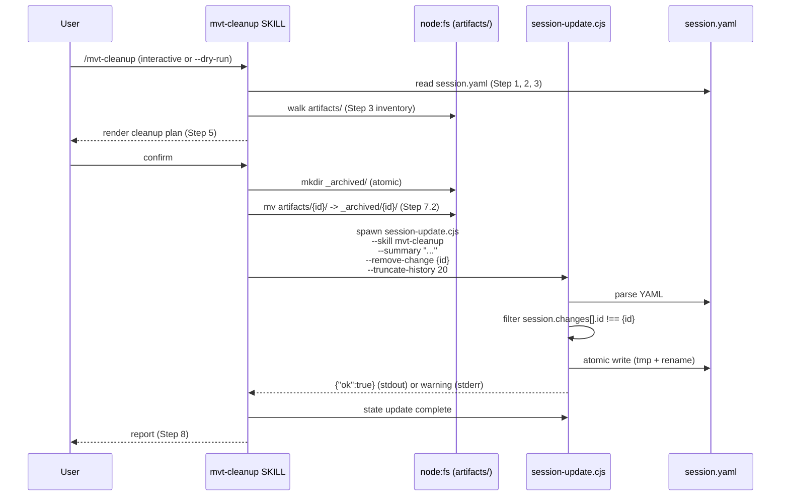
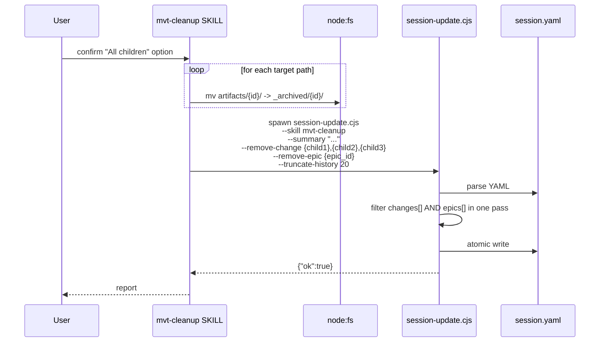

# Architecture Design: Session Index — Archive Synchronization (v1, Plan-B only)

> Source: bug-detect (changes[] 归档后 plan_path 悬挂指针; epics[] 与 active_epic.epic_path 同型风险)
> Change ID: `20260622-session-archive-sync`
> Mode: full (scoped to Plan B only)

## Overview

`sources/scripts/session-update.js` 是 `session.yaml` 的**唯一**写入点。当前它提供 9 个写入路径（`--new-change`、`--set-plan-path`、`--update-change`、`--close-change`、`--set-change-status`、`--new-epic`、`--set-epic-path`、`--set-epic-status`、`--close-epic`），全部服务于"创建 / 切换 / 关闭"语义，**没有任何路径处理"已 done 的旧条目被归档"这一场景**。

`/mvt-cleanup` Step 7 在物理层执行了 `mv artifacts/{id}/ -> artifacts/_archived/{id}/`（含 Step 7.1 summarize、7.2 archive、7.2a batch archive 三种形态），但在索引层只触发 `--close-change` / `--truncate-history`（Step 10），**对归档动作的索引更新为零覆盖**。结果：

| 索引字段 | 归档后 | 后果 |
|---|---|---|
| `changes[].plan_path` | 仍指向 `artifacts/{id}/plan.yaml`（已不存在） | `mvt-status` Changes Overview 显示 `(missing)`；AI 自主遍历读到 ENOENT |
| `epics[].epic_path` | 仍指向 `artifacts/{epic_id}/epic.yaml`（已不存在） | `mvt-resume` Step 7 Epic Context 退化；`mvt-status` Epic Progress 报 `(epic.yaml not found at {path})` |

`mvt-sync-context` 与 `mvt-resume` 通过"目录存在性检查"实现了读取层降级，避免了硬错误，但这只是治标：悬空指针本身仍然存在，AI 推理链仍会消耗 token 解释这些 `(missing)` / `not found` 标记。

本 design **v1 范围**：选定**方案 B（归档时从 `changes[]` / `epics[]` 同步删除对应条目）**为唯一实现路径。在 `session-update.js` 新增两个对称 flag：`--remove-change` / `--remove-epic`。`mvt-cleanup` Step 7 实际执行归档时，Step 10 的 session-update 调用**追加**这两个 flag，把索引与物理位置同步收敛。

**v1 明确不做**：
- 方案 A（路径改写为 `_archived/` 前缀）—— 等后续 change 独立需要时再开
- `--update-change-path` / `--update-epic-path` flag —— 同上
- `mvt-cleanup` 的 `--archive-mode=rewrite` 选项 —— 不实现

### Architectural Concerns

| Concern | Source of evidence | Priority |
|---|---|---|
| 索引与物理位置失同步导致 AI 推理开销 | bug-detect §3 真实影响表；现场证据 1 条悬挂 | must |
| `mvt-cleanup` Step 7 的三类归档动作必须都被索引写入覆盖 | Step 7.1 / 7.2 / 7.2a (`.claude/skills/mvt-cleanup/SKILL.md:194-208`) | must |
| `changes[]` 与 `epics[]` 同型问题需对称处理 | 本次 bug-detect 二次确认 | must |
| 不破坏 `mvt-sync-context` 的"归档后跳过"逻辑 | `mvt-sync-context` Step 2.4 显式依赖"`status: done` 条目 + 目录存在性"过滤 | must |
| 批量归档（"All children"）可能一次清理 N 个 change + 1 个 epic | Step 7.2a 选项 2；需单次脚本调用支持多 id | should |
| 调用方契约清晰、不增加无谓 flag | 与既有 9 个 flag 风格一致 | should |
| 不破坏现有 240+ 回归测试 | `test/session-update.test.ts` | must |
| v1 范围最小化、避免分两轮走完整 fix 流程 | 用户确认仅实现方案 B | must |

## Architecture Decision Records

### ADR-1: Add `--remove-change` and `--remove-epic` flags to session-update.cjs

| Field | Content |
|---|---|
| Title | Add `--remove-change` and `--remove-epic` flags (symmetric, Plan B only) |
| Status | accepted |
| Context | bug-detect 文档 §5 推荐方案 B：`mvt-cleanup` 归档后从 `changes[]` / `epics[]` 删除对应条目，避免悬空指针。两个数组结构同型，应在 `session-update.js` 中以**对称**的两个 flag 同时实现，并复用既有 upsert + truncate 模式。用户确认 v1 范围仅含方案 B，方案 A 推迟到独立 change。 |
| Decision | 新增 `--remove-change <id>` 与 `--remove-epic <id>` 两个 flag，单次调用支持**逗号分隔多 id**（`--remove-change id1,id2`），参数解析沿用既有 `parseArgs` 的"下一个非 `--` 开头的 token 视为值"约定。`--remove-change` 命中 `session.changes[].id === id` 的条目，按原顺序全部移除。`--remove-epic` 同理作用于 `session.epics[]`。两个 flag 都**不**操作 `active_change` / `active_epic`（活动游标由 `--close-change` / `--close-epic` 管理，职责分离）。 |
| Alternatives | **方案 C（引入 `archived` 状态）**：改动面最大，需要 mvt-status / mvt-resume / mvt-sync-context 全部识别新状态；不采用。**方案 D（读取时容错）**：治标不治本，分散在 4+ 个 SKILL.md；不采用。**方案 A（路径改写）**：用户明确推迟到独立 change；本 v1 不实现。 |
| Consequences | Positive: 索引与物理位置在归档后即一致；`mvt-status` 的 `(missing)` 边缘规则可以移除；`mvt-resume` Step 7 的 Epic Context 退化分支被消除；v1 范围最小、改动面最窄。Negative: 失去"归档后仍可在 changes[] 看到历史条目"的能力（用户必须查看 `_archived/` 目录或依赖 sync-context 聚合后的知识文件）；未来需要"保留历史可见性"时需开新 change 实现 `--update-*-path`。Downstream: `/mvt-implement` 同步更新 `mvt-cleanup` Step 7 / Step 10 调用形态；`/mvt-test` 补充两个新 flag 的回归测试。 |

### ADR-2: `mvt-cleanup` Step 10 always calls `--remove-change` / `--remove-epic` (no mode switch)

| Field | Content |
|---|---|
| Title | mvt-cleanup defaults to --remove-* on every archive action; no archive-mode switch in v1 |
| Status | accepted |
| Context | 设计了 `--archive-mode=rewrite` 备选流程会让 mvt-cleanup 承担 CLI 解析职责（需要改 `src/commands/cleanup.ts` 或 SKILL.md 增加分支判断）。用户确认 v1 范围仅含方案 B，方案 A 的入口都不实现。 |
| Decision | `mvt-cleanup` SKILL.md Step 7 实际执行时，按归档动作分类追加 session-update 调用：<br>• Step 7.1 summarize 完成 → 追加 `--remove-change <id>`<br>• Step 7.2 archive 完成 → 追加 `--remove-change <id>`<br>• Step 7.2a batch archive 选项 1 / 2 / 3 完成 → 追加 `--remove-epic <epic_id>`；选项 2/3 选中的每个子 change 追加 `--remove-change <child_id>`<br><br>**组合场景**：当 `mvt-cleanup` 在一次运行中同时关闭 active_change（plan 已完成）和归档旧 done change 时，将 `--close-change` 与 `--remove-change <ids>` **合并到一次 session-update.cjs 调用**。两者职责不重叠——`--close-change` 操作 `active_change`，`--remove-change` 操作 `session.changes[]`，在脚本内部先后处理互不干扰。<br><br>Step 9/10 state-update 段落只列"默认 `remove`"一种调用形态，不出现 `rewrite` 备选模板。 |
| Alternatives | **Step 10 同时列两种调用模板**：用户已明确 v1 不实现方案 A；不采用。**实现 `--archive-mode=rewrite` CLI flag**：超出 v1 范围；不采用。 |
| Consequences | Positive: SKILL.md 调用模板单一清晰；无需 CLI 解析改动。Negative: 未来需要方案 A 时需重读 SKILL.md 增补模板。Downstream: `/mvt-test` 只需验证"默认 remove"调用形态（`--remove-change` 单 id 与逗号多 id）。 |

### ADR-3: Multi-id single-call semantics (comma-separated, not repeated flags)

| Field | Content |
|---|---|
| Title | Accept comma-separated multiple ids in `--remove-change` / `--remove-epic` |
| Status | accepted |
| Context | `mvt-cleanup` Step 7.2a "All children" 一次可能归档 N 个 done 子 change + 1 个 epic。若每个 id 单独调用一次 session-update，需要 N+1 次进程创建、文件解析、原子写。在批量场景下这是显著的 token 与时间成本。 |
| Decision | 一次调用 `--remove-change id1,id2,id3` 等价于逐个 remove。内部用 `String.split(",").map(s => s.trim()).filter(Boolean)` 拆分（沿用 `sources/scripts/epic-update.js:74` 既有的逗号分隔约定）。不实现重复 flag 形式（`--remove-change id1 --remove-change id2`），因为 `parseArgs` 的 `args[key] = next` 会覆盖前者，扩展性差。 |
| Alternatives | **重复 flag**：与 `parseArgs` 冲突；不采用。**两次 session-update 调用**：性能差；不采用。 |
| Consequences | Positive: 单次进程即可完成批量清理；调用契约清晰。Negative: 与既有 `--close-change` 等单值 flag 的"key 接受单值"约定略有不一致；必须在 SKILL.md 注释中显式说明。Downstream: `/mvt-test` 必须覆盖"单 id / 多 id / 末尾空值 / 全部为空"四种输入。 |

### ADR-4: No changes to `mvt-sync-context` filtering logic

| Field | Content |
|---|---|
| Title | Do not modify mvt-sync-context; rely on existing directory existence check |
| Status | accepted |
| Context | `mvt-sync-context` Step 2.4 显式依赖"对 `status: done` 的 changes[] 条目做目录存在性检查"来过滤已归档的 change。本 fix 把归档后的 change 从 `changes[]` 移除，目录检查自然不会再命中它们，但语义保持一致：sync-context 永远处理"有实际目录 + 还没聚合过"的 change。 |
| Decision | 不修改 `mvt-sync-context` SKILL.md。归档后该 change 在 `changes[]` 中消失，sync-context 走"目录扫描"分支时也会因 `_archived/` 排除规则（`mvt-sync-context/SKILL.md:185`）跳过，行为等价。 |
| Alternatives | **修改 sync-context 增加"显式跳过 changes[] 之外 id"逻辑**：与现有 filter 冗余；不采用。 |
| Consequences | Positive: 改动面最小，sync-context 行为完全不变。Negative: 必须在 SKILL.md / review note 中明确这一点，避免后续维护者误以为 sync-context 也需改动。Downstream: `/mvt-review` 验证 sync-context 在归档后不需调整。 |

### ADR-5: Validation rules for new flags

| Field | Content |
|---|---|
| Title | Require non-empty value for --remove-change / --remove-epic; silently skip unknown ids |
| Status | accepted |
| Context | 既有 `--change-id` 等 flag 通过 `validate()` 函数做必填校验。新增 flag 必须遵循同一约定，避免"传了 `--remove-change` 但没传 id"导致静默无操作。同时批量调用对部分失败需要鲁棒（与 `--set-change-status` 一致，见 `sources/scripts/session-update.js:316-326`）。 |
| Decision | 在 `validate()` 中增加：<br>• `--remove-change` 后面必须跟随非空值（与 `--change-id` 同样规则）<br>• `--remove-epic` 后面必须跟随非空值<br>• 空字符串 / 全空白输入 → 报错退出码 1<br>• id 在 `session.changes[]` / `session.epics[]` 中不存在 → **不报错**（保持与 `--set-change-status` 一致的"找不到时静默"语义）<br>逗号分隔的多 id 中，任意一个不存在 → 静默跳过存在的；最终结果 = 实际移除的子集 |
| Alternatives | **"找不到就报错"**：与既有风格冲突，会让 `mvt-cleanup` 的批量调用变得脆弱（任一子 change 已被别处移除就阻塞整次清理）；不采用。 |
| Consequences | Positive: 错误处理与既有 flag 风格一致；批量调用对部分失败鲁棒。Negative: 调用方无法通过退出码判断"是否真的移除了"；必须通过 `{"ok":true}` 之外的信息判定（见 ADR-6）。Downstream: `/mvt-test` 覆盖"不存在的 id 静默跳过"的语义。 |

### ADR-6: Output protocol — keep `{"ok":true}` for success, add warning to stderr when no-op

| Field | Content |
|---|---|
| Title | Preserve binary success protocol; emit a warning when requested removal finds no match |
| Status | accepted |
| Context | 既有 `session-update.cjs` 的输出契约是"成功 stdout 一行 `{"ok":true}`；失败 stderr 一行错误消息，exit 1"。下游 `mvt-implement` / `mvt-cleanup` 通过 exit code 判断成败。本 fix 不能破坏这一契约（否则所有调用方需同步修改）。 |
| Decision | 新增 flag 沿用既有契约：<br>• 成功（无论是否实际移除了条目）→ stdout `{"ok":true}`，exit 0<br>• 至少一个 id 命中并移除 → 无额外输出<br>• 全部 id 均未命中（全部不存在或全部已不在数组中）→ stderr 写一行 `Warning: --remove-change requested ids [a, b] not found; no entries removed.`，但 **exit 仍为 0**（与 ADR-5 的"静默跳过"语义一致，警告不升级为错误）<br>• 参数解析失败（空值）→ exit 1（与既有 `validate()` 行为一致） |
| Alternatives | **找不到时 exit 1**：破坏既有契约，调用方需重构；不采用。**完全不警告**：用户无法察觉误操作；不采用。 |
| Consequences | Positive: 输出契约与既有 flag 完全一致；误操作有可见信号但不会阻塞流程。Negative: 调用方若想严格检测"是否真的移除"，需要解析 stderr 而非只看 exit code。Downstream: `mvt-cleanup` 在 state-update 之后可以 grep stderr 的 "Warning" 行做软告警日志。 |

## Module Design

> **注意**：`Module Design` 只列运行时模块（核心写入脚本 + skill 调用方）。测试文件已在 `File Structure` 章节归类为手改源文件，不重复列出。`.claude/skills/*/SKILL.md` 是 `npm run build` 生成的产物，不是源文件 —— 修改发生在 `sources/skills/*/business.md` + `manifest.yaml` 中。

| Module (file) | Path | Responsibility | Dependencies |
|---|---|---|---|
| `session-update.cjs` (核心写入) | `sources/scripts/session-update.js` (build → `dist/scripts/session-update.cjs` → `.ai-agents/scripts/session-update.cjs`) | 新增 2 个 flag：`--remove-change`、`--remove-epic`；扩展 `validate()`、扩展 `main()` 2 个分支 | `yaml` (解析), `node:fs`, `node:path` |
| `mvt-cleanup` (调用方) | `sources/skills/mvt-cleanup/{business.md,manifest.yaml}` | Step 7 实际执行时追加 session-update 调用形态；Step 9 表格 + Step 10 列出 `--remove-*` 模板；manifest 启用 `remove_change` / `remove_epic` params | (无代码, 纯 Markdown) |
| `mvt-status` (消费者, 不改) | `sources/skills/mvt-status/business.md` | Edge case "changes[] 引用不存在的 plan_path → 标 (missing)" 可以降级为日志；新增的"已归档条目不再出现"行为无需显式修改（因为已经从 `changes[]` 移除）。**design 推荐保留该边缘规则作为防御性提示，不改** | (无代码, 纯 Markdown) |
| `mvt-resume` (消费者, 不改) | `sources/skills/mvt-resume/business.md` | Step 7 Epic Context 的"找不到时 warn"分支可降级为日志；解析逻辑无需变化。**design 推荐保留该分支作为防御性提示，不改** | (无代码, 纯 Markdown) |

## Key Interfaces

### CLI flag contract (新增)

```text
--remove-change <ids>   Comma-separated change-ids to remove from session.changes[]
--remove-epic <ids>     Comma-separated epic-ids to remove from session.epics[]
```

**v1 不实现**：`--update-change-path` / `--update-epic-path`（方案 A 推迟到后续 change）

### Internal function signatures (新增 / 修改)

```text
// In sources/scripts/session-update.js

// New helper — comma-separated multi-id support
function parseIdList(value) → string[]
  // Split by ",", trim, filter empty; return array (empty array if input null/undefined)

// New validation rules in validate(args):
//   --remove-change requires non-empty value
//   --remove-epic requires non-empty value

// New main() branches (after --close-epic, before atomic write):
//
// --remove-change <ids>:
//   removed = 0
//   for id of parseIdList(args["remove-change"]):
//     const before = session.changes.length
//     session.changes = session.changes.filter(e => e.id !== id)
//     if (session.changes.length < before) removed++
//   if (removed === 0):
//     console.warn(`Warning: --remove-change requested ids [${ids}] not found; no entries removed.`)
//
// --remove-epic <ids>:
//   same shape, operates on session.epics[]
```

### Behavioral contract (preserved / changed)

| Flag | Before this design | After this design |
|---|---|---|
| `--close-change` | snapshots active → done, clears active | **unchanged** |
| `--close-epic` | snapshots active → done, clears active | **unchanged** |
| `--remove-change` | (does not exist) | removes from `session.changes[]`; does NOT touch `active_change` |
| `--remove-epic` | (does not exist) | removes from `session.epics[]`; does NOT touch `active_epic` |
| `--update-change-path` | (does not exist) | **v1 不实现** |
| `--update-epic-path` | (does not exist) | **v1 不实现** |

**Critical constraint**: `--remove-change` **never** affects `active_change`. An entry in `changes[]` may share the same id as `active_change.id` (e.g., right after `--new-change` snapshots the old active), but the active pointer is governed exclusively by `--new-change` / `--close-change`. Symmetric rule for epic.

## Data Flow

### Sequence: mvt-cleanup archives one done change (Step 7.2)



### Sequence: mvt-cleanup batch-archives epic + 3 done children (Step 7.2a option 2)



### Error paths

| Failure point | Fallback behavior |
|---|---|
| `session.yaml` 写入失败（disk full / permission） | `session-update.cjs` 退出 1；`mvt-cleanup` 报 "state update failed, artifact already moved"；**不**回滚 mv（mv 已是最终态，由 Step 7.6 "if any single action fails, STOP further actions" 保护） |
| 部分 id 不存在 | 静默跳过（ADR-5）；exit 0；stderr Warning 行 |
| 并发：两个 cleanup 同时跑 | `writeFileSync + renameSync` 原子写（既有契约）；后写者覆盖前者；不引入新冲突 |

## File Structure

> **视角说明**：本 change 改的是 MVTT 框架自身。下表只列**手写修改的源文件**；所有 `.claude/skills/*/SKILL.md`、`.qoder/skills/*/SKILL.md`、`dist/scripts/*.cjs`、`.ai-agents/scripts/*.cjs`、`.mvtt-manifest.json` 都是 `npm run build` 由 `install-manifest.yaml > generated` 规则自动重新生成的产物，**不需要也禁止手改**。

### 手改源文件（5 个）

| File | Action | Description |
|---|---|---|
| `sources/scripts/session-update.js` | modify | 核心写入点：新增 2 个 CLI flag、扩展 `validate()`、扩展 `main()` 2 个分支、扩展 `ERRORS` 字典、新增 `parseIdList()` 工具函数 |
| `sources/sections/session-update.md` | modify | **新增** `{{#remove_change}} ... {{/remove_change}}` 与 `{{#remove_epic}} ... {{/remove_epic}}` 两个条件块，并在 "Critical flag semantics" 段落补上对应说明。**此模板硬约束 "Use only the flags rendered in the command above"**，不增加条件块会阻止 `mvt-cleanup` 在 Step 10 实际调用新 flag |
| `sources/skills/mvt-cleanup/manifest.yaml` | modify | 在 `sections/session-update.md` 的 `params` 中**新增** `remove_change: true` + `remove_epic: true`（按 cleanup 动作可选）；其他 23 个引用该模板的 skill **不**会启用这俩 key，渲染输出完全不变 |
| `sources/skills/mvt-cleanup/business.md` | modify | Step 7 末尾追加 `node .ai-agents/scripts/session-update.cjs --remove-change <id>` 提示行；Step 9 表格新增 "Archive removal" 行（覆盖 Step 7.1/7.2/7.2a 三类归档动作）；Step 10 列出完整 `--remove-change` / `--remove-epic` 调用模板 |
| `test/session-update.test.ts` | modify | 新增 `describe("session-update.cjs (remove-change flag)")` 与 `describe("session-update.cjs (remove-epic flag)")` 两个 describe 块；每 describe 5+ cases：单 id 命中 / 单 id 不存在 / 多 id 全命中 / 多 id 部分命中 / 末尾空值 |

### 自动重新生成产物（`npm run build` 自动产出）

按 `install-manifest.yaml > generated` 规则逐条对应：

| 生成产物 | 来源规则 | 备注 |
|---|---|---|
| `dist/scripts/session-update.cjs` | `npm run build` esbuild bundle | 终端用户产物 |
| `.ai-agents/scripts/session-update.cjs` | `bundle:sources/scripts/session-update.js` | install-manifest 显式声明的 bundle 目标 |
| `.claude/skills/mvt-cleanup/SKILL.md` | `build:skills` | 由 `business.md` + `manifest.yaml` + `sections/*.md` 渲染 |
| `.qoder/skills/mvt-cleanup/SKILL.md` | `build:skills` | 与 `.claude/` 镜像 |
| 23 个其他 skill 的 `.claude/skills/mvt-*/SKILL.md` 与 `.qoder/skills/mvt-*/SKILL.md` | `build:skills` | **不**启用 `remove_change` / `remove_epic` 的 params，渲染输出**完全不变**（纯加法、无破坏性） |
| `.mvtt-manifest.json` | build 终产物 | 记录所有生成产物的 hash，用于增量更新判断 |

### 问题文档

| File | Action | Description |
|---|---|---|
| `docs/problems/archived-change-lingers-in-changes.md` | (no change) | 问题文档；本 design 是其推荐方案 B 的实现蓝图 |

### Files NOT modified (explicitly out of scope)

- `src/build/*.ts` — build 引擎不变
- `sources/scripts/plan-update.js` / `epic-update.js` — 内部脚本不变
- `sources/sections/*.md` 中**除 `session-update.md` 外的其他模板** — 不需要改
- `install-manifest.yaml` / `registry.yaml` / `sources/defaults/*.yaml` — schema 不变
- `sources/skills/mvt-status/business.md` — design **推荐保留** `(epic.yaml not found at {path})` 边缘规则作为防御性提示
- `sources/skills/mvt-resume/business.md` — design **推荐保留** "Epic context could not be loaded" 分支作为防御性提示
- `sources/skills/mvt-sync-context/business.md` — ADR-4 显式声明不需要改（依赖既有目录存在性检查，归档后从 `changes[]` 移除自然失效）
- `sources/skills/mvt-help/business.md` — 不读 `changes[]` / `epics[]`
- `sources/skills/mvt-{analyze,analyze-code,design,implement,review,test,plan-dev,refactor,decompose,quick-dev,fix,bug-detect,update-plan,manage-context,check-context,config,sync-context,init,template,create-skill}/business.md` — 不读 `changes[]` / `epics[]` 的写入
- `.claude/skills/*/SKILL.md` 与 `.qoder/skills/*/SKILL.md`（全部 24 个 skill × 2 个目录 = 48 个文件）— **由 `npm run build` 自动生成，禁止手改**

## Implementation Guidelines

### Ordering for `/mvt-implement`

> **阶段概述**：整个实施过程分为四个阶段 —— **Plan（原型）→ Test（写测试）→ Implement（实现）→ Build（重构建）**。每个阶段内子步骤按编号执行，前置完成方可进入下一阶段。

#### Phase A: Prototype（实现骨架 — 先让 flag 能被识别）

1. **扩展 `ERRORS` 字典**：新增 `MISSING_REMOVE_VALUE` 错误消息（函数，返回 "Missing required argument: --remove-change / --remove-epic requires a non-empty value"）。

2. **新增 `parseIdList()` 工具函数**：放在 `parseArgs` 之下、`validate` 之上。具体位置：
   ```
   parseArgs()         ← 既有（不变）
   ──── parseIdList()  ← 新增 ────
   validate()          ← 扩展（下一步）
   main()              ← 扩展（Phase C）
   ```
   复用逗号分隔约定（`String.split(",").map(s => s.trim()).filter(Boolean)`，与 `sources/scripts/epic-update.js:74` 风格一致）。

3. **扩展 `validate()`**：在既有校验之后追加两条规则 —— `args["remove-change"]` 必须为非空值；`args["remove-epic"]` 必须为非空值。空字符串 / 全空白 → 返回 `MISSING_REMOVE_VALUE`。

**验证点**：此时 `node session-update.js --skill x --summary "test" --remove-change ""` 应退出 1 并报 `MISSING_REMOVE_VALUE` 错误（先通过基础校验，再命中新增的空值校验）。

#### Phase B: Test（TDD — 先写测试看到失败）

4. **写测试 `test/session-update.test.ts`**：新增 2 个 describe 块、合计 10+ cases：
   - `describe("session-update.cjs (remove-change flag)")`：5+ cases — 单 id 命中 / 单 id 不存在 / 多 id 全部命中 / 多 id 部分命中 / 末尾空值
   - `describe("session-update.cjs (remove-epic flag)")`：同上 5 cases
   - 额外 2 个组合 case：与 `--close-change` 同时调用（验证职责分离，`active_change` 不受 `--remove-change` 影响）
   
   **跑测试**：确认新测试全部 **FAIL**（因为 `main()` 尚未实现），既有测试全部 **PASS**（没有破坏现有行为）。

#### Phase C: Implement（实现 `main()` 分支 + 模板条件块 + 调用方配置）

5. **扩展 `main()` 的新分支**：在 `--close-epic` 之后、原子写入之前，插入两个新分支：
   ```
   // --remove-change <ids>: 过滤 session.changes
   // --remove-epic <ids>: 过滤 session.epics
   ```
   遵循 ADR-3（逗号多 id）、ADR-5（未知 id 静默跳过）、ADR-6（全未命中时 stderr Warning、exit 0）。

6. **更新 `sources/sections/session-update.md` 模板**：在命令拼接行的 `{{#truncate_history}}` 之后追加：
   ```
   {{#remove_change}} --remove-change <ids>{{/remove_change}}{{#remove_epic}} --remove-epic <ids>{{/remove_epic}}
   ```
   在 "Critical flag semantics" 段落用同样的条件块补上语义说明：
   ```
   {{#remove_change}}
   - `--remove-change <ids>` 从 `session.changes[]` 中移除指定 id 的条目（逗号分隔多 id）；不影响 `active_change`。
   {{/remove_change}}
   {{#remove_epic}}
   - `--remove-epic <ids>` 从 `session.epics[]` 中移除指定 id 的条目（逗号分隔多 id）；不影响 `active_epic`。
   {{/remove_epic}}
   ```
   **必须在步骤 7 之前完成** —— 当前渲染器对未定义的模板变量采取**静默空字符串**策略（见 `src/build/section-loader.ts:38` 的 `expandBlocks` 与 `:77` 的 `expandConditionals`），**不会报错**；但若步骤 6 未完成，步骤 7 启用的 `remove_change` / `remove_epic` params 对应的 `{{#remove_change}}` / `{{#remove_epic}}` 块不存在，命令拼接行不会渲染出 `--remove-change` / `--remove-epic`，`mvt-cleanup` Step 10 实际调用会**静默丢失新 flag**，导致归档后索引与物理位置失同步的 bug 未被修复。

7. **启用 `mvt-cleanup/manifest.yaml` params**：在 `sections/session-update.md` 的 `params` 中追加：
   ```yaml
   remove_change: true
   remove_epic: true
   ```
   **仅改这一个 manifest**，其他 23 个 skill **不**改。

8. **改造 `mvt-cleanup/business.md`**：
   - Step 7 末尾追加 `node .ai-agents/scripts/session-update.cjs --remove-change <id>` 提示行
   - Step 9 表格由 2 行扩为 **4 行**：

     | Actual cleanup action | session-update parameters |
     |---|---|
     | Closed `active_change` (all plan tasks completed) **+** archived old done changes | `--close-change --remove-change <ids> --truncate-history <N>` |
     | Closed `active_change` only (no old changes archived) | `--close-change --truncate-history <N>` |
     | Archived old changes only (active_change still in progress) | `--remove-change <ids> --truncate-history <N>` |
     | Archived epic + its children (batch) | `--remove-epic <epic_id> --remove-change <child1>,<child2> --truncate-history <N>` |

     第一行对应**组合场景**（ADR-2），`--close-change` 与 `--remove-change <ids>` 职责不重叠。

   - Step 10 列出完整 `--remove-change` / `--remove-epic` 调用模板

**验证点**：此时所有新测试应 **PASS**，既有测试全部 **PASS**。

#### Phase D: Build（常规重构建）

9. **`npm run build`**：刷新所有生成产物 —— 包括 `dist/scripts/session-update.cjs`、`.ai-agents/scripts/session-update.cjs`、所有 24 个 skill 的 `.claude/skills/*/SKILL.md` 与 `.qoder/skills/*/SKILL.md`、`.mvtt-manifest.json`。

**验证点**：23 个未启用 `remove_change` / `remove_epic` params 的 skill 渲染输出**完全不变**。可执行命令：
```bash
# 重新构建后，对比 .claude/ 与 .qoder/ 下除 mvt-cleanup 外所有 skill 的 SKILL.md
# （包含在仓库内时）应与 build 前完全一致
git diff -- .claude .qoder -- '*/SKILL.md' ':!mvt-cleanup/SKILL.md'
# 或使用 manifest 哈希比对（更可靠，不依赖 git 暂存）
# 对比 .mvtt-manifest.json 中除 mvt-cleanup 外所有 skill 的 content_hash
```
若发现任何 skill 的 SKILL.md 发生变化，说明模板改动不小心"穿透"到了无关 skill，必须回退步骤 6 的模板修改并检查 `{{#remove_change}}` / `{{#remove_epic}}` 条件块的包裹。

### Sequencing constraints

- **调用链约束**（Phase A → Phase C）：`sources/scripts/session-update.js` → `sources/sections/session-update.md` 模板 → `sources/skills/mvt-cleanup/manifest.yaml` → `sources/skills/mvt-cleanup/business.md`。四个文件构成一条调用链，任何一环前置未做都会让后续步骤引用不存在的 flag / 渲染变量。
- **Phase B 完整性约束**：测试先行确保新代码至少被一次运行覆盖。如果 Phase C 实现后发现测试覆盖不足，应回到 Phase B 补充测试，**不**允许实现先于测试。
- **23-skill hash 不变约束**（Phase D 验证点）：`npm run build` 后 `.mvtt-manifest.json` 中除 `mvt-cleanup` 外所有 skill 的 hash 不应变化。若发生变化，说明模板改动不小心"穿透"到了无关 skill，必须回退步骤 6 的模板修改，检查 `{{#remove_change}}` / `{{#remove_epic}}` 条件块的包裹是否正确。
- **review 阶段需验证 `mvt-sync-context` 行为不变**：bug-detect 已识别 sync-context 是关键消费者，review 时必须回归测试 sync-context 的"归档后跳过"逻辑。

## Change Tracking

| Item | Value |
|---|---|
| Change ID | `20260622-session-archive-sync` |
| Scope | v1, Plan B only (方案 A 推迟到独立 change) |
| Affected files (estimated) | **手改源文件（5）**：`sources/scripts/session-update.js`、`sources/sections/session-update.md`、`sources/skills/mvt-cleanup/manifest.yaml`、`sources/skills/mvt-cleanup/business.md`、`test/session-update.test.ts`。**自动重生产物（build）**：`dist/scripts/session-update.cjs`、`.ai-agents/scripts/session-update.cjs`、所有 24 个 skill 的 `.claude/skills/*/SKILL.md` 与 `.qoder/skills/*/SKILL.md`、`.mvtt-manifest.json`（其中 23 个 skill 渲染输出应完全不变） |
| New modules | None |
| New flags | 2 (`--remove-change`, `--remove-epic`) |
| ADRs | 6 (this design) |
| Breaking changes | None — additive flags only; existing 9 flags and all behaviors preserved |
| Regression risk | Low — all new flags are new code paths; no modification to existing branches |
| Reviewer checklist | (1) `mvt-cleanup` Step 7 → Step 10 调用形态；(2) `mvt-sync-context` 归档后行为不变；(3) `mvt-status` (missing) 边缘规则是否降级或保留；(4) 2 个新 flag 的测试覆盖度；(5) `parseArgs` 扩展（仅 `parseIdList` 助手）是否影响既有 9 个 flag 的解析；(6) `sources/sections/session-update.md` 新增条件块后，23 个未启用 `remove_change` / `remove_epic` 的 skill 渲染输出 hash 不变 —— 执行 `git diff -- .claude .qoder -- '*/SKILL.md' ':!mvt-cleanup/SKILL.md'` 应为空，或对比 `.mvtt-manifest.json` 中除 `mvt-cleanup` 外所有 skill 的 `content_hash` |
| Future work (out of scope) | 方案 A：`--update-change-path` / `--update-epic-path` flag（路径改写为 `_archived/` 前缀） |
