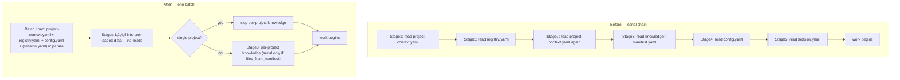

# Architecture Design: Activation-Phase Load Parallelization

> Source: `.ai-agents/workspace/mvt-status-activation-optimization-proposal.md` (proposal-driven; no `analysis.md`).
> Goal: cut skill activation latency by collapsing a serial chain of per-stage file reads into a single parallel batch, at the instruction layer only.

## Overview

Every MVTT skill compiles a shared activation scaffold (`activation-load-context` → `activation-load-config` → `activation-preflight`) from `sources/sections/`. Each stage is phrased as an independent imperative read, which leads a faithful LLM executor to read one file per stage in sequence — 5+ serial tool round-trips before any real work. The reads are in fact mutually independent and parallelizable; the latency is structural, not data-volume.

This design specifies a structure-only refactor of the shared activation sections (and a hardening of `mvt-status/business.md`) that instructs a single parallel load batch up front and reframes downstream stages as *interpretation* of already-loaded content. The set of files read and the knowledge applied are unchanged; only the number of round-trips drops. Because the sections are shared, the fix lands once and benefits all 24 skills.

The build pipeline is relevant context: `assembleFromManifest` concatenates sections in manifest order; `activation-load-context.md` is always the first activation section, making its head the single correct injection point for a batch-load preamble. The section loader supports conditional (`{{?param}}`) and loop (`{{#param}}`) templating, which enables a parametric design where each skill declares exactly the activation files it needs.

## Architecture Decision Records

### ADR-1: Inject the parallel-load preamble at the head of `activation-load-context.md`

| Field | Content |
|-------|---------|
| Status | proposed |
| Context | The preamble must appear before Stage 1 in every skill. `assembleFromManifest` emits sections in manifest order and `activation-load-context` is universally the first activation section (24/24 skills), so its head is the only injection point that is both universal and ordered-first. |
| Decision | Add a "Batch Load" preamble immediately under `## Activation Protocol`, instructing a single parallel read of the activation base files, followed by a rule that downstream stages MUST NOT re-read them. |
| Alternatives | (a) Add the preamble to each skill's `business.md` — rejected: 24-file churn, drift risk. (b) Add a new standalone shared section ordered before load-context — rejected: every manifest would need a new `sections` entry (24-file churn) and the loader has no cross-section ordering guarantee beyond manifest order. |
| Consequences | + One edit, 24 skills benefit. + No manifest churn. − The preamble's file list must be correct for the union of stages; handled by ADR-2. |

### ADR-2: Base load list = 3 universal files; `session.yaml` and extra files are opt-in via a param

| Field | Content |
|-------|---------|
| Status | proposed |
| Context | The three activation sections are not included by the same skill set: `activation-load-context` and `activation-load-config` → 24 skills; `activation-preflight` (which reads `session.yaml`) → 16 skills. A fixed 4-file preamble naming `session.yaml` (as the proposal's Change A suggested) would instruct an unnecessary read in the 8 skills that include no preflight and never touch session at activation (`bug-detect`, `check-context`, `config`, `help`, `manage-context`, `quick-dev`, `refactor`, `template`). |
| Decision | The preamble's base list is the three files every skill needs at activation: `project-context.yaml`, `registry.yaml`, `config.yaml`. A new optional param `activation_reads` (string list) on `activation-load-context` lets a skill append files its activation genuinely needs (e.g. `session.yaml` for the 16 preflight skills, plus the existing `extended_context` entries). Rendered via the loader's `{{#activation_reads}}` block. |
| Alternatives | (a) Always include `session.yaml` in the base list — rejected on the "options over params / no needless reads" principle, though the cost is small (154-line file). Kept as the fallback if param wiring proves noisy. (b) Per-skill preamble text — rejected (churn, drift). |
| Consequences | + Each skill reads exactly its activation footprint. + Reuses the existing template engine; no engine change. − 16 preflight manifests gain one `activation_reads: [session.yaml]` param line. This is config, not logic, and is mechanical. |

### ADR-3: Reframe downstream stages as interpretation, not re-reads

| Field | Content |
|-------|---------|
| Status | proposed |
| Context | Stage 1 ("Load foundational context"), Stage 2 ("Read project-context.yaml > projects[]"), Stage 4 ("Read config.yaml"), and Stage 5 ("inspect session.initialized_at") all currently read or re-name files already covered by the batch. `project-context.yaml` is named in both Stage 1 and Stage 2 — an explicit re-read invitation. |
| Decision | Reword Stage 1/2/4/5 from imperative reads to "From the already-loaded `<file>`, …". No load semantics removed; the files are still named so coverage is auditable. |
| Alternatives | Delete the per-stage file references entirely — rejected: the verification step ("each SKILL.md still names every file it must read") relies on the names being present. |
| Consequences | + Removes redundant-read invitations. + Keeps auditability. − Pure wording; zero risk. |

### ADR-4: Single-project fast path in Stage 2/3

| Field | Content |
|-------|---------|
| Status | proposed |
| Context | The current workspace is single-project (`projects[]` = `[mvtt]`) and `knowledge` is empty (`{}`). Today every run still reads and reasons over the multi-project Mode A/Mode B logic and the knowledge-loading protocol. |
| Decision | Add an early-exit at the top of Stage 2: if `projects.length == 1`, set PS = [sole project] and skip the rest of Stage 2 and the per-project branch of Stage 3 (the `_all` load still runs). This already exists as prose ("skip the rest of this step") but is buried; promote it to a guarded early-exit that also short-circuits Stage 3's per-project loop. |
| Alternatives | Leave as-is — rejected: the multi-project reasoning is dead weight for single-project workspaces, which is the common case. |
| Consequences | + Less instruction to process and zero per-project knowledge reads in single-project mode. − Must preserve the `_all` knowledge load; only the per-project branch is skipped. |

### ADR-6: Two-wave load model for `extended_context`

| Field | Content |
|-------|---------|
| Status | proposed |
| Context | The `extended_context` param (used by ~11 skills) mixes two kinds of entries: (a) concrete files whose paths interpolate `{active_change.id}` / `{plan_path}` (e.g. `analysis.md`, `design.md`, `plan.yaml`) and static-path files (templates, a reference SKILL.md); (b) discovery directives that are not fixed files ("scan project root config files", "load source files based on bug description", "scan artifacts/"). The concrete files CANNOT join the first batch because their paths are only known after `session.yaml` is parsed (a real read-after-read dependency). ADR-1/2 deliberately scoped the preamble to the 3 base files, leaving `extended_context` unaddressed — and ADR-3's Stage 1 rewording now reads as if `extended_context` belongs to the batch, which the preamble does not list. That is an inconsistency to fix. |
| Decision | Adopt a **two-wave** activation-load model. Wave 1 (no dependencies): the 3 base files + `activation_reads`. Wave 2 (after `session.yaml` is parsed): read the change-scoped concrete `extended_context` files (`analysis.md`/`design.md`/`plan.yaml`/static templates) in a single parallel sub-batch — they are independent of each other. Discovery-type `extended_context` entries are explicitly marked **deferred** (runtime, on-demand) and never forced into either wave. Reword Stage 1 so it no longer implies `extended_context` is part of Wave 1. No new param and no engine change — reuse the existing `extended_context` list, only add classification + a Wave-2 instruction in the preamble. |
| Alternatives | (a) Force everything into one batch — rejected: the `{active_change.id}` paths are unresolved pre-session-read, so a literal one-batch instruction would tell the model to read paths it cannot yet construct. (b) Split `extended_context` into two new params (`extended_files` vs `discovery`) — rejected: param churn across 11 manifests for marginal gain; prose classification in the preamble achieves the same at lower cost. (c) Leave as-is — rejected: leaves the ADR-3 Stage 1 inconsistency in place. |
| Consequences | + mvt-review (parallel `analysis.md`+`design.md`), mvt-design, mvt-plan-dev, mvt-implement read their change artifacts in one wave instead of serially. + Removes the Stage 1 / preamble contradiction. − Discovery-type entries must be correctly classified as deferred or they would wrongly appear "batchable"; handled by explicit wording. − Smaller win than the base-file batch (fewer files), but near-zero cost. |

### ADR-5: `mvt-status` reads after existence, glob is source of truth for plans

| Field | Content |
|-------|---------|
| Status | proposed |
| Context | `mvt-status/business.md` Step 1 reads `project-context.md` (118 lines) only to test presence; Step 3 reads every `changes[].plan_path` even when the file is gone (two dangling pointers confirmed at runtime). |
| Decision | Step 1: test presence only (`test -f`), forbid reading contents. Step 3: treat the `artifacts/*/plan.yaml` glob as the source of truth for live plans; read a `changes[].plan_path` only after confirming it exists, using `changes[]` solely to enrich metadata. |
| Alternatives | Keep reading and rely on graceful-failure handling — rejected: it preserves the wasted round-trips the proposal set out to remove. |
| Consequences | + Removes the 118-line read and the dangling-plan reads. + Existing `(missing)` edge-case marker is preserved (a `changes[]` entry whose file is absent still renders with the marker). − None observable for valid data. |

### ADR-7: Merge the three activation sections into one `activation-protocol.md`

| Field | Content |
|-------|---------|
| Status | proposed |
| Context | The Activation Protocol is split across three shared sections — `activation-load-context.md` (Stages 1–3), `activation-load-config.md` (Stage 4), `activation-preflight.md` (Stage 5). A scan of all 24 manifests shows the three are **always adjacent and always in the same order** (ctx → cfg → pre); the split's flexibility has never been used. The split has a real cost, observed in this very change: ADR-6's Wave 2 rule lives in the ctx preamble but governs behavior that spans into the preflight stage, and any protocol-wide edit (e.g. ADR-3's reframe) must open three files in lockstep. The "Batch Load → stages don't re-read" semantics is one logical unit cut by file boundaries. Note: the merge yields **no runtime gain** — `assembler.ts` already concatenates sections into one `SKILL.md`, so the runtime sees one block today. The benefit is source maintainability and elimination of cross-file inconsistency. |
| Decision | Merge the three into a single `sources/sections/activation-protocol.md`. Stage 5 (preflight) is wrapped in `{{?checks}} … {{/checks}}` so the whole stage disappears for the 8 non-preflight skills; the inner `{{#checks}}` table loop nests inside that wrapper. Verified against the engine: nested same-name `{{?checks}}`/`{{#checks}}` expands correctly (conditionals expand before blocks), and the stage vanishes when `checks` is absent. Each manifest's three `sections` entries collapse to one entry whose `params` merge `activation_reads` + `extended_context` (+ `checks` for the 16 preflight skills). Delete the three old section files after migration. |
| Alternatives | (a) New boolean `has_preflight` param to gate Stage 5 — rejected: redundant, the truthiness of the existing `checks` list already encodes it. (b) Keep three files — rejected: the adjacency data shows zero benefit and a demonstrated inconsistency cost. (c) Defer to a separate change — viable and lower-risk, but the user opted to fold it into this change; mitigated by doing it as its own task verified at the t6 gate. |
| Consequences | + One file is the single source of truth for the Activation Protocol; protocol-wide edits touch one file. + Removes the class of cross-file inconsistency that produced the ADR-6 fix. − A 24-manifest reverse migration (collapse 3 section entries → 1, merge params). Mechanical but broad; must be machine-validated. − Enlarges this change's t6 verification surface (every SKILL.md re-diffed). − Param merge must preserve each skill's exact `checks`, `extended_context`, and `activation_reads` values verbatim. |

> **Correction (see ADR-8):** the Decision's `{{?checks}}`-wrapper plan and the rejection of alternative (a) did **not survive implementation**. During t8 the engine's non-greedy conditional regex was found to mis-pair a same-name `{{?checks}}` wrapper around an inner `{{#checks}}` loop (leaving a stray `{{/checks}}`). Alternative (a) — the `has_preflight` boolean — was therefore adopted. ADR-8 records the final mechanism.

### ADR-8: Activation Protocol condensed to a two-block (Load / Resolve) structure; `has_preflight` gate; product-reference constraint for `mvt-create-skill`

| Field | Content |
|-------|---------|
| Status | accepted |
| Context | Three issues surfaced after ADR-1…7 were implemented. (1) The incremental parallelization edits (ADR-1/3/4/6) left the same rule restated across multiple Stages — "never re-read" appeared 4×, the Wave-1 file list 2×, the single-project fast path 2×, the Wave-2 rule 2×, and the old Stage 1 carried no information beyond the batch list. The merged `activation-protocol.md` (ADR-7) inherited all of this and read as long and repetitive, which the user flagged as hard for an AI to execute. (2) ADR-7's chosen `{{?checks}}` gating mechanism proved engine-infeasible (see Correction above). (3) `mvt-create-skill` generates self-contained SKILL.md files by copying standard sections from its own compiled output; it must therefore reference *product-level concepts* (headings in the generated SKILL.md), never build-time `sources/sections/*.md` filenames. Two reference fixes during this change first mis-swapped one source filename for another (`activation-preflight.md` → `activation-protocol.md`) before the underlying reference-type error was caught by the user. |
| Decision | (a) **Restructure** `activation-protocol.md` from five numbered Stages into two topic blocks: **Load** (all read mechanics — Wave 1 parallel batch, deferred knowledge, Wave 2 extended-context) and **Resolve** (decision logic only — Project Scope, Knowledge, Config, Pre-flight). Each rule stated exactly once; the old Stage 1 is deleted (it only restated the batch list). Stage numbers are dropped (no source file references them — verified). (b) **Gate Stage 5 on a distinct `has_preflight` boolean** (`{{?has_preflight}} … {{/has_preflight}}`) rather than the `checks` truthiness, because a same-name wrapper around the inner `{{#checks}}` loop mis-pairs under the engine's non-greedy conditional regex. The 16 preflight manifests carry `has_preflight: true`. (c) **Constraint for `mvt-create-skill`:** all references to standard sections must point at product-level concepts (the `## Activation Protocol` heading and its Load/Resolve blocks as they appear in the generated SKILL.md), never at `sources/sections/*.md` build-time files — the generator has no assembler and inlines everything. |
| Alternatives | (a-alt) Keep the 5-Stage structure and only de-duplicate in place — rejected: the Stage framing was itself the source of the cross-stage repetition; the mechanism/decision split is what removes it. (b-alt) Fix the engine regex to support same-name nesting, then keep ADR-7's `{{?checks}}` plan — rejected for this change: an engine change is higher-risk and out of scope; `has_preflight` is a one-line, zero-risk param. (c-alt) Leave `mvt-create-skill` referencing a section filename — rejected: the generated skill is self-contained, so any `sources/sections/*.md` reference is a dangling pointer in the product. |
| Consequences | + The protocol reads as two clear blocks (mechanism then decision); ~92 → ~60 source lines; non-preflight skills render ~33 lines. + Semantic-equivalence verified by `/mvt-review` (16 load-bearing rules each traced to a home). + `mvt-create-skill` no longer emits dangling section references. − **Supersedes ADR-7's rendered structure**: design.md's "Activation Protocol" narrative and any ADR text using "Stage N" / "Batch Load" wording is now stale relative to the Load/Resolve product; treat those as historical. − **t6 acceptance must be relaxed**: the prior "compiled SKILL.md identical to baseline / names every file" criterion cannot hold byte-wise after restructuring — t6 verifies **semantic** equivalence (every pre-change load-bearing rule still present), not byte-identity. − A worked example in the knowledge-loading protocol was dropped during the condense; optional to restore (review S-1). − Lesson: when renaming/merging shared sections, verify the **reference type** (product concept vs build-time file), not just the filename. |

## Module Design

Here "modules" are instruction units (shared sections and one skill body) plus the build pipeline that compiles them. No runtime code modules change.

| Module | Path | Responsibility | Dependencies |
|--------|------|----------------|--------------|
| activation-load-context (modified) | `sources/sections/activation-load-context.md` | Hosts the batch-load preamble (ADR-1/2); reframes Stage 1/2 (ADR-3); single-project fast path (ADR-4) | section-loader template engine; `activation_reads` param |
| activation-load-config (modified) | `sources/sections/activation-load-config.md` | Reframe Stage 4 to "already-loaded config.yaml" (ADR-3) | none |
| activation-preflight (modified) | `sources/sections/activation-preflight.md` | Reframe Stage 5 to "already-loaded session.yaml" (ADR-3) | session.yaml present in batch via `activation_reads` |
| mvt-status business (modified) | `sources/skills/mvt-status/business.md` | Existence-only check + glob-as-truth (ADR-5) | none |
| skill manifests (16, param add) | `sources/skills/<preflight-skill>/manifest.yaml` | Add `activation_reads: [session.yaml]` to the `activation-load-context` section params (ADR-2) | activation-load-context param contract |
| build pipeline (unchanged) | `src/build/assembler.ts`, `src/build/section-loader.ts`, `src/fs/materialize.ts` | Recompile sources → `.claude/skills/*/SKILL.md` for all platforms | — |

## Key Interfaces

The only new contract is a template param on the `activation-load-context` shared section.

```yaml
# manifest.yaml — section entry, new optional param
- type: shared
  source: sections/activation-load-context.md
  params:
    activation_reads:        # optional; files to add to the batch beyond the 3 base files
      - session.yaml
    extended_context:        # existing param, unchanged
      - ".ai-agents/workspace/artifacts/{active_change.id}/analysis.md"
```

```text
# activation-load-context.md — new preamble (rendered text contract)
## Activation Protocol

### Batch Load (do this first)
The files below are mutually independent. Read them in a SINGLE parallel batch,
then proceed. Later stages interpret already-loaded content and MUST NOT re-read:
- .ai-agents/workspace/project-context.yaml
- .ai-agents/registry.yaml
- .ai-agents/config.yaml
{{#activation_reads}}
- .ai-agents/workspace/{{.}}
{{/activation_reads}}
```

(Path prefixes in the rendered list must match each file's real location; `session.yaml` lives under `workspace/`, `config.yaml`/`registry.yaml` at `.ai-agents/` root — the template will spell the literal paths, the `{{.}}` shown above is illustrative and will be replaced with full literal paths in implementation.)

## Data Flow

Activation read sequence, before and after.



Error / edge paths (unchanged semantics):
- A batched file is missing → the consuming stage marks its section `(unavailable)` and continues (existing fallback).
- Stage 3 `files_from_manifest: true` remains the one legitimately serial read (manifest → its listed files); it is entered only when knowledge entries exist. With `knowledge: {}` it is a no-op.
- `mvt-status` Step 3: a `changes[]` entry whose plan file is absent still renders with the `(missing)` marker, but without an attempted read.

## File Structure

```text
sources/
  sections/
    activation-load-context.md     # MODIFY: preamble + reframe + single-project fast path
    activation-load-config.md      # MODIFY: Stage 4 reframe
    activation-preflight.md        # MODIFY: Stage 5 reframe
  skills/
    mvt-status/business.md         # MODIFY: existence-only check + glob-as-truth
    <16 preflight skills>/manifest.yaml  # MODIFY: add activation_reads param (ADR-2)
# Regenerated (do not hand-edit):
.claude/skills/*/SKILL.md          # GENERATED by `mvtt`/materialize after source edits
```

## Implementation Guidelines

Suggested order (each step independently verifiable):

1. **ADR-3 reframes first** (load-context Stage 1/2, load-config Stage 4, preflight Stage 5). Lowest risk, pure wording. Recompile, diff a couple of `SKILL.md` to confirm clean rendering.
2. **ADR-1 preamble + ADR-2 param** in `activation-load-context.md`. Add the `{{#activation_reads}}` block. Verify rendering with a skill that passes the param and one that does not.
3. **ADR-2 manifest param** on the 16 preflight skills. Mechanical; can be scripted. Confirm the 8 non-preflight skills do NOT name `session.yaml` in their compiled preamble.
4. **ADR-4 single-project fast path** in Stage 2/3 wording. Confirm `_all` knowledge load survives.
5. **ADR-5 mvt-status** Step 1/3 edits.
6. **Recompile all** and run the verification matrix (below). Keep the pre-change `mvt-status` output to diff against.

Verification matrix (from the proposal, binding):

| Check | Method |
|-------|--------|
| Artifacts regenerate cleanly | recompile; diff affected `SKILL.md` |
| No load semantics dropped | each `SKILL.md` still names every required file |
| Tests pass | `vitest`; pass count unchanged or higher (note: section-loader/render tests may need new expectations for the preamble) |
| Output equivalence | `/mvt-status` before/after: identical report sections |
| Round-trip reduction | activation issues one parallel batch, not a serial chain |

## Change Tracking

Expected footprint (source files to edit):

| File | Action | ADR |
|------|--------|-----|
| `sources/sections/activation-load-context.md` | modify | 1, 2, 3, 4 |
| `sources/sections/activation-load-config.md` | modify | 3 |
| `sources/sections/activation-preflight.md` | modify | 3 |
| `sources/skills/mvt-status/business.md` | modify | 5 |
| `sources/skills/<16 preflight skills>/manifest.yaml` | modify (param add) | 2 |
| `.claude/skills/*/SKILL.md` | regenerate (generated) | — |
| render/section-loader tests | update expectations if preamble breaks snapshots | — |

Source edits: 4 section/skill files + up to 16 manifest param lines. This exceeds ~5 files and touches a shared contract consumed by 24 skills → **`/mvt-plan-dev` is recommended** to sequence ADR-3 → ADR-1/2 → ADR-4 → ADR-5 with a verification gate after each, rather than a single large edit.
