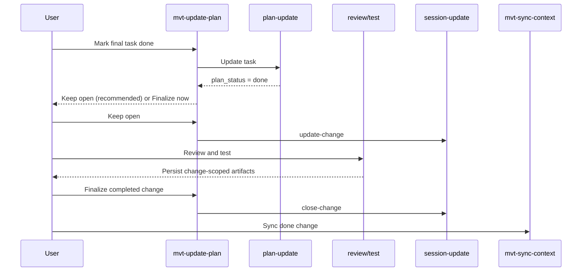
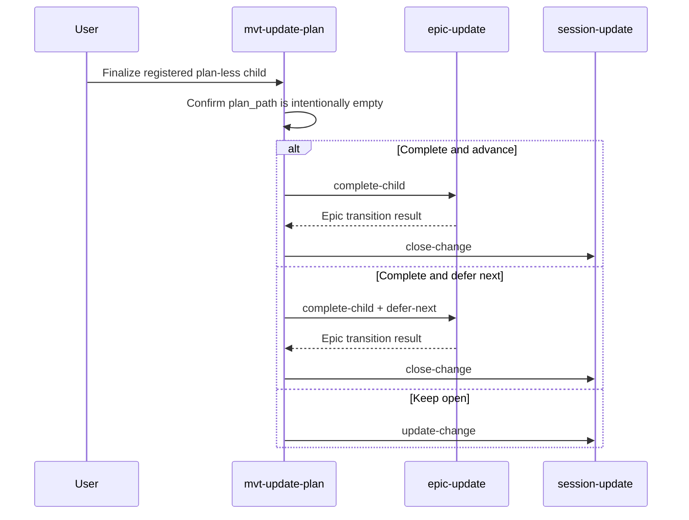
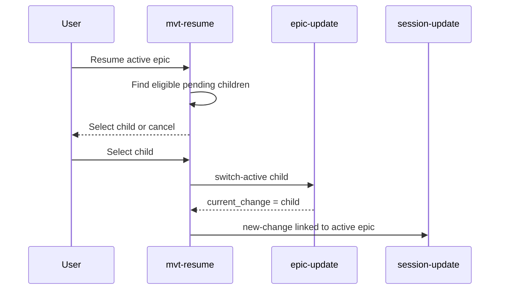
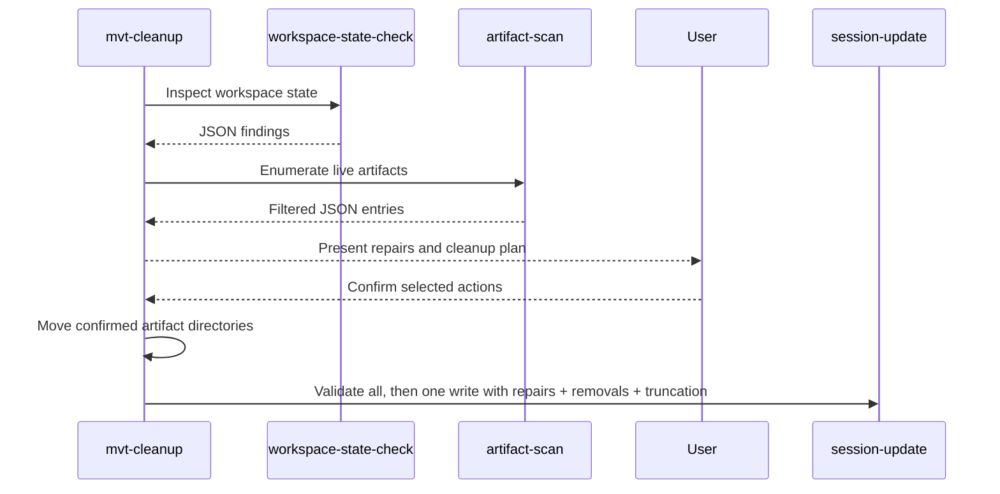

# Architecture Design: MVTT Workflow Bug Remediation

## Overview

This revision separates plan completion from change finalization, provides explicit finalization and abandonment paths, prevents implicit replacement of an existing active change before artifacts are written, and moves artifact discovery and workspace-state inspection into deterministic read-only scripts. It also defines deferred epic advancement and removes direct session writes from `epic-update`, making `session-update` the sole `session.yaml` writer. Workflow skills remain responsible for user decisions, while scripts own deterministic filesystem classification and state mutation. The design adds no external dependency or runtime service.

### Concerns

| Concern | Source of evidence | Priority |
|---|---|---|
| Lifecycle consistency | Plan completion, review/test readiness, finalization, and archival currently collapse into inconsistent status side effects. | must |
| Active-change continuity | Review and test artifacts require `active_change` after implementation tasks finish. | must |
| Replacement safety | `--new-change` snapshots a different active change as `active`, producing stale historical entries. | must |
| Abandonment safety | An incomplete or obsolete active change needs a terminal path before another change can start. | must |
| Deterministic archive isolation | Prompt-only `_archived` filtering cannot guarantee executor behavior. | must |
| Plan-less recoverability | A registered change without a plan needs a supported finalization path. | must |
| Backward consistency | Existing empty ids, stale statuses, and dangling epic references need inspection without hidden writes. | should |
| Single-writer discipline | Every workflow transition must mutate `session.yaml` through exactly one `session-update` invocation; domain scripts must not write session state. | must |

## Architecture Decision Records

### ADR-1: Separate Plan Completion From Change Finalization

- Status: accepted
- Context: marking the last plan task done means implementation work is complete, but `/mvt-review` and `/mvt-test` still use `active_change` to load and persist change-scoped artifacts. Immediate closure breaks that routing, while never offering closure prevents sync and cleanup.
- Decision: define two workflow phases without adding a new persisted status. `Plan Complete` means `plan.status: done` while `active_change` remains populated and its indexed entry remains `active`. `Change Finalized` means the user explicitly confirms completion, after which `--close-change` writes one `done` entry and clears `active_change`. When a plan first becomes done, `/mvt-update-plan` offers `Keep open for review/test` as the recommended default and `Finalize now`. Reinvoking `/mvt-update-plan` on an already-done plan enters the finalization interaction directly.
- Alternatives: close automatically on the final task; rejected because it breaks review/test artifact routing. Add a persisted `ready_to_close` state; rejected because the existing plan status already expresses readiness and a schema expansion is unnecessary.
- Consequences: review/test remain change-aware, then finalization makes the change visible to `/mvt-sync-context`, followed by `/mvt-cleanup`.

### ADR-2: Reject Implicit Active-Change Replacement

- Status: accepted
- Context: `--new-change` currently snapshots any existing active change with hard-coded `status: active`, even when its plan is complete. This is a root path for stale entries described by ISS-002.
- Decision: `session-update --new-change` may update the current record only when no active id exists or the requested `change-id` equals the current active id. If a different active id exists, the command exits non-zero without writing and instructs the workflow to finalize or abandon the current change first. `--update-change` likewise fails when `active_change.id` is empty.
- Alternatives: infer the old status from `plan.yaml`; rejected because a generic session writer should not depend on plan files. Preserve automatic replacement with an extra status argument; rejected because replacement can silently lose active workflow context.
- Consequences: this is a breaking behavioral change for callers that start a new change without closing the old one. The migration path is explicit: finalize or abandon through `/mvt-update-plan`, or re-invoke with the same change id.

### ADR-3: Use `/mvt-update-plan` as the Finalization Entry Point

- Status: accepted
- Context: plan-backed and plan-less registered changes both need lifecycle completion, while epic advancement already belongs to `/mvt-update-plan`.
- Decision: `/mvt-update-plan` has four routes: valid in-progress plan updates; valid already-done plan finalization; empty-`plan_path` plan-less finalization; and explicit abandonment of the current change. For epic children, terminal choices are `Complete and advance`, `Complete and defer next`, `Abandon and advance`, and `Keep open`. `Complete and defer next` invokes `epic-update --complete-child <id> --defer-next`; it marks the current child done, clears `epic.current_change`, and leaves eligible pending children unchanged until a later `--switch-active`. For non-epic changes the choices are `Finalize change`, `Abandon change`, and `Keep open`.
- Alternatives: add `/mvt-complete-change`; rejected because it expands the public skill catalog for behavior already adjacent to plan completion. Extend `/mvt-quick-dev`; rejected because it is intentionally conversation-only and untracked.
- Consequences: `/mvt-update-plan` becomes a task-update and change-finalization workflow but does not mutate plans on the plan-less or already-done routes.

### ADR-4: Treat Missing Plan Files as Recovery, Not Plan-Less Work

- Status: accepted
- Context: an empty `plan_path` is intentional plan-less state; a non-empty path whose file is missing or invalid indicates corruption or external movement.
- Decision: only an empty `plan_path` enters normal plan-less finalization. A non-empty missing or invalid path presents `Repair plan`, `Force finalize`, and `Cancel`. `Repair plan` stops the current invocation and directs the user to `/mvt-plan-dev`; it does not fabricate or mutate a plan. `Force finalize` requires explicit confirmation and records the recovery in the session history summary.
- Alternatives: treat both states identically; rejected because it can hide loss of task history.
- Consequences: intended plan-less work stays lightweight, while corrupted tracked work receives a visible recovery boundary.

### ADR-5: Centralize Live Artifact Discovery in a Deterministic Script

- Status: accepted
- Context: ISS-001 exists because executors can widen a prescribed glob or read recursive results before applying a soft filter.
- Decision: add `artifact-scan.js`, bundled as `artifact-scan.cjs`, backed by a shared `workspace-artifacts.js` module. It resolves the project root, excludes `_archived` before enumeration, and emits JSON for `plans`, `change-dirs`, and `files` modes. `/mvt-status`, `/mvt-resume`, `/mvt-sync-context`, `/mvt-check-context`, and the live inventory phase of `/mvt-cleanup` must consume this output and must not perform fallback recursive artifact discovery.
- Alternatives: strengthen wording in each skill; rejected because it repeats the failed soft-control model. Let each skill implement its own script; rejected because filtering semantics would drift.
- Consequences: discovery becomes testable and consistent. Cleanup may inspect `_archived` separately only to verify directories moved by its own confirmed operation.

### ADR-6: Inspect Workspace State With a Separate Read-Only Script

- Status: accepted
- Context: reconciliation requires reading plans and epic references, but adding read/repair behavior to `session-update` would mix inspection with mutation and force multiple state-update calls.
- Decision: add `workspace-state-check.js`, bundled as `workspace-state-check.cjs`. It emits JSON findings only and never writes session/history. Findings include empty change ids, stale completed-plan indexes, missing or invalid plan paths, and unresolved epic ids. `PLAN_DONE_INDEX_ACTIVE` is emitted only when the indexed change id differs from `session.active_change.id`; `plan: done` plus indexed `active` is valid while that change remains the current review/test context. Missing/invalid plans and unresolved epic references use `recommended_action: manual_review`, never an automatic mutation. `/mvt-cleanup` presents findings before candidate selection. Confirmed repairs are passed to its one final `session-update` call through explicit batch flags.
- Alternatives: reconcile inside `session-update`; rejected because inspection and write phases would violate the exactly-once State Update contract. Repair silently on every skill call; rejected because unrelated invocations must not rewrite lifecycle history.
- Consequences: checking is safe and repeatable; application remains atomic with the cleanup state update.

### ADR-7: Extend Session Update With Explicit Batch Repair Flags

- Status: accepted
- Context: cleanup needs to apply confirmed historical corrections together with its normal close/remove/truncate actions.
- Decision: add `--repair-change-statuses "<id>=<status>,..."` and `--prune-empty-changes` to `session-update`. Repair statuses use the explicit `active`, `done`, and `abandoned` whitelist and accept only existing non-empty ids. The existing singular `--set-change-status` receives the same whitelist validation so a misspelled batch flag cannot persist an arbitrary status. Empty-entry pruning occurs only when explicitly requested. Before mutation, validate the complete command and reject overlapping ids between status repairs and removals, or between a lifecycle target and removals. After validation, apply operations in this fixed order: prune empty entries, apply batch status repairs, apply exactly one active-change lifecycle operation, apply at most one active-epic lifecycle operation, remove explicitly archived ids, sort/truncate indexes, append/truncate history, then atomically write. No partial result is written on validation failure.
- Alternatives: let the executor edit `session.yaml`; rejected because session mutation must remain deterministic. Give the checker write access; rejected because it would split one logical transaction across scripts.
- Consequences: the session writer gains narrow repair primitives but still does not inspect plans or epics.

### ADR-8: Provide Explicit Abandonment for Active Changes and Epic Children

- Status: accepted
- Context: rejecting implicit active-change replacement without an abandonment path can deadlock an incomplete or obsolete change. Existing `--set-change-status abandoned` does not create a missing indexed entry or clear `active_change`, and `epic-update --set-child-status abandoned` does not advance `current_change` safely.
- Decision: add `session-update --abandon-change`, mutually exclusive with `--new-change`, `--update-change`, and `--close-change`. It snapshots the active change exactly once with `status: abandoned` and clears `active_change`. Add `epic-update --abandon-child <id>`, which marks the child abandoned, sets `completed_at`, and recomputes `current_change` using the same dependency resolution as `--complete-child`. If every child is terminal, the epic becomes `abandoned` when every child is abandoned; otherwise it becomes `done`. `/mvt-update-plan` requires explicit confirmation before either abandonment route. For an epic child, run `--abandon-child` first and apply the resulting change and optional epic terminal state in one `session-update` invocation.
- Alternatives: use cleanup to abandon active work; rejected because cleanup owns archival and cannot safely advance an active epic DAG. Reuse `--set-change-status`; rejected because it neither guarantees an indexed snapshot nor clears the active pointer.
- Consequences: users can intentionally release the active slot without falsely finalizing unfinished work. Epic abandonment remains a two-script workflow with explicit divergence reporting if session mutation fails after epic success.

### ADR-9: Detect Active-Change Conflicts Before Artifact Writes

- Status: accepted
- Context: `/mvt-analyze` currently writes `analysis.md` before its final `--new-change` state update. Rejecting a different active id only at that final call would leave an orphan artifact. `/mvt-plan-dev` reuses the current active id and is not a replacement, but shares the same rendered command shape.
- Decision: `/mvt-analyze` adds an early preflight before requirement processing and before generating a new change id. If a non-empty active change exists, present `Continue current change`, `Finalize current change`, `Abandon current change`, and `Cancel`. `Continue current change` reuses the existing id and updates that change's analysis; finalize/abandon stop and direct the user to `/mvt-update-plan`, after which the user reruns analyze. The skill must never write a new change artifact before the active slot is resolved. `/mvt-plan-dev` remains allowed only for the same active id and receives a dedicated failure rule: an active-id conflict is blocking, not the shared non-blocking State Update failure.
- Alternatives: delete an orphan artifact after `--new-change` fails; rejected because rollback is fragile and occurs after user data was written. Combine abandon and new-change in one command; rejected because epic abandonment may require a preceding epic transition.
- Consequences: `mvt-analyze` business/manifest and their assembly tests enter the change footprint. The generic shared failure text is overridden for active-id conflicts in analyze and plan-dev.

### ADR-10: Make Session Update the Sole Session-State Writer

- Status: accepted
- Context: `epic-update` currently calls `syncSessionOnEpicClose` after writing a terminal `epic.yaml`. An epic-child workflow can therefore write `session.yaml` once inside `epic-update` and again through the mandatory `session-update` call, violating the single-writer boundary and weakening failure recovery.
- Decision: remove `syncSessionOnEpicClose` and all direct session-file mutation from `epic-update`. The script returns `epic_status` and `current_change` only. `/mvt-update-plan` maps that result to exactly one session command: `--close-change` plus `--close-epic` when the epic becomes done, or `--abandon-change` plus `--abandon-epic` when the epic becomes abandoned. `--close-epic` and the new `--abandon-epic` both require a non-empty active epic, upsert its indexed snapshot, and clear `active_epic`; empty active change/epic lifecycle targets fail before any mutation.
- Alternatives: retain best-effort epic session synchronization; rejected because two writers can diverge and the second write cannot reliably distinguish partial success. Add a `--no-session-sync` compatibility flag; rejected because session mutation is not part of the epic writer's domain responsibility and should not remain an optional side effect.
- Consequences: `epic-update` becomes a pure epic-file writer. Session lifecycle transitions become atomic within one command, while epic-file and session-file writes remain sequential; if the epic write succeeds and the session write fails, the workflow reports divergence and recovery uses `/mvt-update-plan` without replaying the epic mutation.

## Module Design

### Concern Mapping

| Concern | Response | Owning module | Boundary impact |
|---|---|---|---|
| Lifecycle consistency | Validated close/abandon commands and explicit terminal mapping | session-update | Extends existing public CLI flags |
| Active-change continuity | Keep plan-complete changes active until explicit finalization | mvt-update-plan | Workflow-only change |
| Replacement and abandonment safety | Pre-write conflict gate plus terminal abandon route | mvt-analyze, mvt-update-plan | Breaking replacement behavior |
| Plan-less epic completion | Advance or defer-next completion operations | epic-update | Extends existing public CLI flags |
| Single-writer discipline | Remove epic-to-session synchronization; combine terminal session flags | session-update | Restores one session persistence boundary |
| Deterministic archive isolation | Script-owned live artifact enumeration | artifact-scan | Adds a read-only script boundary |
| Backward consistency | Read-only findings plus explicit repair flags | workspace-state-check, session-update | Adds inspection and repair interfaces |

| Module | Path | Responsibility | Dependencies |
|---|---|---|---|
| Session lifecycle writer | `sources/scripts/session-update.js` | Sole writer for session history and active/indexed change and epic lifecycle state. | Node fs/path, YAML |
| Epic lifecycle writer | `sources/scripts/epic-update.js` | Mutate only `epic.yaml`: complete, defer, abandon, or activate children using one dependency resolver. | Node fs/path, YAML |
| Artifact discovery core | `sources/scripts/lib/workspace-artifacts.js` | Resolve live artifact directories and exclude `_archived` before returning entries. | Node fs/path |
| Artifact scanner CLI | `sources/scripts/artifact-scan.js` | Expose deterministic live plans, change directories, and files as JSON. | artifact discovery core |
| Workspace state checker | `sources/scripts/workspace-state-check.js` | Read session/plans/epics and emit non-mutating consistency findings. | artifact discovery core, YAML |
| Build pipeline | `build-scripts.js` | Bundle the two new script entry points into zero-dependency `.cjs` files. | esbuild |
| Update/finalize workflow | `sources/skills/mvt-update-plan/` | Route plan updates, already-done plans, plan-less finalization, abandonment, and recovery confirmation. | plan-update, epic-update, session-update |
| Analysis workflow | `sources/skills/mvt-analyze/` | Resolve active-change conflicts before selecting an id or writing analysis artifacts. | session state, mvt-update-plan |
| Cleanup workflow | `sources/skills/mvt-cleanup/business.md` | Consume checker findings, confirm repairs, inventory live artifacts, and submit one atomic session update. | scanner, checker, session-update |
| Resume workflow | `sources/skills/mvt-resume/business.md` | Consume scanner output and reactivate an eligible deferred epic child. | artifact-scan, epic-update, session-update |
| Discovery workflows | status, sync-context, check-context business files | Consume scanner JSON instead of executor-controlled recursive discovery. | artifact-scan |
| Shared State Update rendering | `sources/sections/session-update.md` | Preserve static rendering for ordinary skills and support one runtime-selected lifecycle command only for `mvt-update-plan`. | session-update contract |
| Test suites | `test/` | Verify scripts, assembled prompts, lifecycle sequences, and migration behavior. | built scripts, assembler |

## Key Interfaces

### Artifact Scanner

```text
node .ai-agents/scripts/artifact-scan.cjs --mode <plans|change-dirs|files>

stdout JSON:
{
  "ok": true,
  "mode": "plans",
  "entries": [".ai-agents/workspace/artifacts/<id>/plan.yaml"]
}

Invariants:
- entries are sorted and workspace-relative
- no entry contains an `_archived` path segment
- plans includes only immediate child plan.yaml files
- files recurse only within live immediate child change directories
```

### Workspace State Checker

```text
node .ai-agents/scripts/workspace-state-check.cjs

stdout JSON:
{
  "ok": true,
  "findings": [
    {
      "code": "PLAN_DONE_INDEX_ACTIVE",
      "change_id": "<id>",
      "recommended_action": "set_status_done"
    }
  ]
}

Finding codes:
- EMPTY_CHANGE_ID -> prune_empty_entry
- PLAN_DONE_INDEX_ACTIVE -> set_status_done only when change_id != active_change.id
- PLAN_PATH_MISSING -> manual_review
- PLAN_INVALID -> manual_review
- EPIC_REFERENCE_UNRESOLVED -> manual_review

The checker never recommends automatic finalization, plan repair, or epic mutation.
```

### Session Lifecycle Commands

```text
session-update --new-change <title> --change-id <id>
  allowed when active_change.id is empty or equals <id>
  rejected atomically when a different active id exists

session-update --update-change
  requires a non-empty active_change.id
  upserts that id as active

session-update --close-change
  upserts the active id once as done and clears active_change
  fails without writing when active_change.id is empty

session-update --abandon-change
  upserts the active id once as abandoned and clears active_change
  fails without writing when active_change.id is empty
  mutually exclusive with new/update/close lifecycle operations

session-update --close-epic | --abandon-epic
  upserts the active epic as done or abandoned, then clears active_epic
  fails without writing when active_epic.id is empty
  mutually exclusive with other active-epic lifecycle operations

session-update --repair-change-statuses "id-1=done,id-2=abandoned" --prune-empty-changes
  applies only explicitly requested, validated repairs
  accepts only active, done, and abandoned statuses
  composes with close/remove/truncate flags in the same write

Validation and operation order:
1. Parse and validate all flags, ids, statuses, and collisions without mutation.
2. Prune invalid empty-id entries when requested.
3. Apply batch status repairs.
4. Apply at most one close or abandon operation for active_change.
5. Apply at most one close or abandon operation for active_epic.
6. Remove ids whose artifact directories were confirmed archived.
7. Sort/truncate indexes and append/truncate history.
8. Atomically replace session.yaml.

Collision rules:
- the same id cannot appear in both status repairs and removals
- the active lifecycle target cannot also appear in removals
- duplicate repair ids or conflicting status assignments are rejected
- close and abandon are mutually exclusive within each change/epic lifecycle
- any validation error produces no file write
```

### Epic Lifecycle Commands

```text
epic-update --complete-child <id>
  marks the child done and advances current_change

epic-update --complete-child <id> --defer-next
  marks the child done, clears current_change, and leaves pending children pending

epic-update --abandon-child <id>
  marks the child abandoned and advances current_change
  uses the same dependency-ready selection as complete-child

Terminal epic rule:
- all children abandoned -> epic.status = abandoned
- all children terminal with at least one done -> epic.status = done
- pending children with deferred next -> epic.status = in_progress and current_change = ""

Output contains epic_status and current_change but never session_sync.
```

### Analyze Conflict Preflight

```text
Before generating a change id or writing analysis.md:
- no active id: create a new id and proceed
- request continues current work: reuse active_change.id and proceed
- request is different: offer finalize, abandon, or cancel
- finalize/abandon: stop and direct to /mvt-update-plan; write no artifact
```

### Finalization Decision Table

| State | User choice | Epic operation | Single session operation |
|---|---|---|---|
| Plan becomes done, non-epic | Keep open | none | `--update-change` |
| Plan becomes done, non-epic | Finalize now | none | `--close-change` |
| Plan already done, non-epic | Finalize change | none | `--close-change` |
| Plan-less, non-epic | Finalize change | none | `--close-change` |
| Done/plan-less epic child, epic remains open | Complete and advance | `--complete-child` | `--close-change` |
| Done/plan-less epic child, pending children remain | Complete and defer next | `--complete-child ... --defer-next` | `--close-change` |
| Done/plan-less epic child, epic becomes done | Complete | `--complete-child` | `--close-change --close-epic` |
| Any active non-epic change | Abandon change | none | `--abandon-change` |
| Active epic child, epic remains open | Abandon and advance | `--abandon-child` | `--abandon-change` |
| Active epic child, epic becomes abandoned | Abandon last remaining work | `--abandon-child` | `--abandon-change --abandon-epic` |
| Any finalizable state | Keep open | none | `--update-change` |

Abandoning an epic child always advances or clears `current_change`; it cannot leave the abandoned child current. A deferred epic remains active but has no current child until `/mvt-resume` explicitly activates one.

## Data Flow

### Implementation, Quality, and Finalization



If the user selects `Finalize now`, the quality stage is intentionally skipped. A warning states that later review/test can target explicit files but cannot write change-scoped artifacts without an active change.

### Plan-Less Epic Finalization



If epic update fails, no session finalization runs. If the epic result is terminal, the one session call includes both change and epic terminal flags. If session finalization fails after epic success, the workflow reports divergence and stops without another state-update call.

### Resume Deferred Epic Work



If activation fails, no session call runs. If registration fails after epic activation, report divergence and rerun `/mvt-resume`; reselecting the same child is idempotent.

### Active Change Abandonment

```mermaid
sequenceDiagram
  participant U as User
  participant UP as mvt-update-plan
  participant EU as epic-update
  participant SU as session-update

  U->>UP: Abandon active change
  UP-->>U: Confirm terminal abandonment
  alt Epic child
    UP->>EU: abandon-child
    EU-->>UP: Advanced epic state
  end
  UP->>SU: abandon-change + optional abandon-epic
  SU-->>UP: Indexed abandoned; active cleared
```

If `epic-update` succeeds and `session-update` fails, the workflow reports the exact divergence and stops. Recovery is manual review through `/mvt-update-plan`; no compensating second session call is attempted.

### Cleanup Inspection and Atomic Repair



The checker never mutates state. If artifact movement fails, cleanup stops and submits only repairs that remain valid for the resulting filesystem state, or submits no session update when safety cannot be established.

### Persistence Boundaries

| Boundary | Transaction | Failure behavior |
|---|---|---|
| `epic-update` | One atomic temporary-file replacement of `epic.yaml` | No session command runs when the epic write fails. |
| `session-update` | One validation-before-mutation and atomic replacement of `session.yaml` | No partial session state is written on validation or write failure. |
| Epic then session workflow | Two ordered file transactions; no cross-file transaction exists | If epic succeeds and session fails, report divergence and recover through the idempotent workflow route; do not issue an automatic compensating session write. |
| Cleanup move then session workflow | Filesystem moves followed by one session transaction | Remove only ids whose moves succeeded; retain/report stale indexes if the session transaction fails so the checker can surface them on retry. |

## File Structure

| Path | Action | Intent |
|---|---|---|
| `sources/scripts/session-update.js` | modify | Reject invalid lifecycle targets, add atomic repair flags, and own terminal change/epic snapshots. |
| `sources/scripts/epic-update.js` | modify | Add defer/abandon transitions and remove direct session synchronization. |
| `sources/scripts/lib/workspace-artifacts.js` | create | Share deterministic live-artifact classification. |
| `sources/scripts/artifact-scan.js` | create | Expose filtered artifact discovery JSON. |
| `sources/scripts/artifact-scan.md` | create | Document modes, output, and failure behavior. |
| `sources/scripts/workspace-state-check.js` | create | Emit read-only consistency findings. |
| `sources/scripts/workspace-state-check.md` | create | Document finding codes and consumers. |
| `build-scripts.js` | modify | Bundle the new script entry points. |
| `sources/sections/session-update.md` | modify | Support a runtime-selected lifecycle flag set only when invoked by update-plan. |
| `sources/skills/mvt-update-plan/manifest.yaml` | modify | Replace no-plan BLOCK and static update flag with route-aware instructions. |
| `sources/skills/mvt-update-plan/business.md` | modify | Add done-plan, plan-less, repair-plan handoff, finalize, and abandon flows. |
| `sources/skills/mvt-analyze/manifest.yaml` | modify | Add blocking active-change conflict preflight before artifact production. |
| `sources/skills/mvt-analyze/business.md` | modify | Reuse the current id or route finalize/abandon without writing a new artifact. |
| `sources/skills/mvt-plan-dev/manifest.yaml` | modify | Make active-id conflicts blocking while preserving same-id plan creation. |
| `sources/skills/mvt-cleanup/business.md` | modify | Consume checker/scanner output and apply confirmed repairs once. |
| `sources/skills/mvt-status/business.md` | modify | Use scanner plans mode. |
| `sources/skills/mvt-resume/business.md` | modify | Use scanner plans mode and reactivate eligible deferred epic children. |
| `sources/skills/mvt-sync-context/business.md` | modify | Use scanner change-dirs mode. |
| `sources/skills/mvt-check-context/business.md` | modify | Use scanner files mode. |
| `test/session-update.test.ts` | modify | Cover empty lifecycle targets, change/epic terminal composition, repair whitelist, ordering, collisions, and atomicity. |
| `test/epic-update.test.ts` | modify | Cover defer-next, abandoned-child advancement, terminal status rules, and absence of session writes. |
| `test/artifact-scan.test.ts` | create | Cover nested archive exclusion and deterministic modes. |
| `test/workspace-state-check.test.ts` | create | Cover every finding code, active-change exclusion, recommendations, and read-only behavior. |
| `test/assembler.test.ts` | modify | Assert analyze preflight, route-aware update-plan/resume, scoped dynamic rendering, and scanner-only discovery instructions. |
| `test/commands/install.test.ts` and update tests | modify if required | Verify new bundled scripts are materialized and updated. |

## Implementation Guidelines

1. Implement and test the shared artifact classifier and `artifact-scan` first; downstream workflows depend on its JSON contract.
2. Implement `workspace-state-check` as strictly read-only and verify file hashes or mtimes are unchanged after execution.
3. Harden `session-update` next, including no-write failure tests for replacement, empty lifecycle targets, status whitelists, and composed change/epic terminal operations.
4. Remove `epic-update` session synchronization, then add defer/abandon primitives using the existing dependency resolver and explicit terminal-status rules.
5. Add runtime lifecycle rendering only to `/mvt-update-plan`, ensuring it invokes `session-update` exactly once on every successful route. Other skills retain static State Update rendering.
6. Add `/mvt-analyze`'s conflict preflight before artifact generation and make `/mvt-plan-dev`'s same-id requirement explicit.
7. Implement plan-backed finalization, then already-done, plan-less, recovery, defer, and abandon routes.
8. Add deferred-child reactivation to `/mvt-resume` and test the epic-write/session-write divergence recovery path.
9. Integrate checker/scanner output into cleanup and apply all confirmed repairs in its final atomic session update.
10. Migrate discovery workflows to scanner-only operation and remove fallback recursive artifact scans.
11. Rebuild generated skills/scripts and run focused tests before the full suite.

## Change Tracking

- Change id: `20260804-mvtt-workflow-bugs`
- Expected footprint: approximately 22-24 source, documentation, build, and test files.
- New modules: deterministic artifact scanner and read-only workspace state checker; both bundle into standalone zero-dependency scripts.
- Breaking changes: `--new-change` no longer replaces a different active change implicitly; `epic-update` no longer synchronizes session state as a side effect. User confirmed the replacement direction on 2026-08-04; the session side-effect removal restores the documented single-writer boundary.
- No new external dependency, deployment boundary, persistence store, or service is introduced.
- `/mvt-plan-dev` is required because the design spans multiple modules and has ordered migration dependencies.