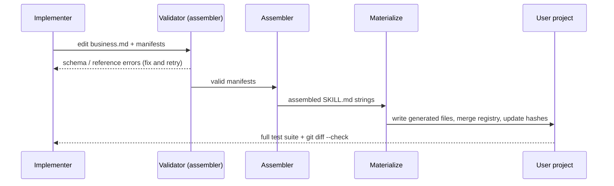
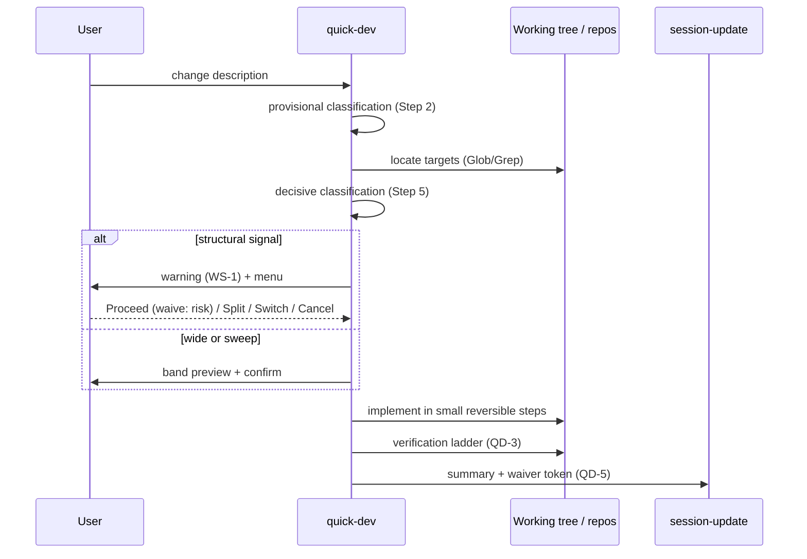

# Architecture Design: Relax mvt-quick-dev Admission Model

## Overview

Redesign the admission model of the `mvt-quick-dev` shortcut skill from file-count hard gates to a scope-by-impact model with warn-plus-waiver user decisions, and align the `mvt-analyze` Step 4 Quick Path router to the same model. The change is content-only under `sources/` (skill prompts plus routing text) plus regenerated outputs; no runtime code, modules, dependencies, or layer structure change. Constraints honored throughout: zero new CLI parameters, zero new configuration keys, zero artifacts from quick-dev runs.

## Architecture Decision Records

### ADR-1: Demote file count from gate to signal; adopt a scope-by-impact model

* Status: accepted
* Context: File count correlates poorly with change risk (a 20-file rename is safer than a 2-file contract break), and the hard gate misfires before targets are even located (Steps 2/5 of quick-dev). Analysis R1, R3; concerns C1, C7.
* Decision: Classify on two axes — blast radius (drives preview and verification depth only) crossed with architectural impact (the sole source of warnings). Tiers become Trivial / Simple / Mechanical Sweep / Wide / Structural.
* Alternatives: Keep the 3-file gate (rejected: proxy-metric failure documented in consultation); raise the limit to N files (rejected: any N is still a proxy and reintroduces the same cliff).
* Consequences: Positive — mechanical multi-file work unblocks. Negative — wider quick-dev usage; contained by the verification ladder and waiver trail.

### ADR-2: Zero hard STOPs and zero forced transfers; user authority under informed consent

* Status: accepted
* Context: Every sibling skill already prefers confirm-over-block; the user explicitly requires warn-then-decide for all structural signals including cross-repo edits. Analysis R2, R7; concern C7.
* Decision: Structural signals produce a specific warning plus menu Proceed (waive) / Split into batches / Switch to standard workflow / Cancel. Transfer to the standard workflow is offered, never forced. The only non-policy behaviors are asking on ambiguous scope and surfacing physically unreachable targets.
* Alternatives: Retain structural STOPs (rejected by the user: warnings first, user decides).
* Consequences: Positive — no dead-ends; fast path always available. Negative — bypass risk; contained by mandatory risk-quoting waivers, the waiver trail, and the verification ladder.

### ADR-3: No new CLI parameters or configuration keys

* Status: accepted
* Context: The framework interaction model is parameterless (menus, not flags); per-project thresholds would add config and cognitive burden. Both were explicitly rejected in consultation. Analysis R8.
* Decision: All new decision points are in-skill confirmation menus following the shared confirmation-prompt pattern.
* Alternatives: `--force`-style flag (rejected: conflicts with the parameterless model); `quick_dev.max_files` config (rejected: burden without proportional benefit).
* Consequences: Zero surface change for all other skills and scripts.

### ADR-4: Align mvt-analyze Step 4 in the same change

* Status: accepted
* Context: A second file-count gate lives in Quick Path Detection (`business.md` Scope criterion, confirm text, Example 2). Changing quick-dev alone would split-brain the two entries to the fast path. Analysis R6; concern C1.
* Decision: Rewrite Step 4 scope criterion, confirm text, and Example 2 in the same change; scope-only concerns get warn-plus-decide instead of silent routing to standard analysis.
* Alternatives: quick-dev only (rejected: inconsistent routing — analyze entrants would still hit the old wall).
* Consequences: Both entries agree; worked examples must be rewritten carefully to stay truthful.

### ADR-5: Tighten routing keywords while dropping counts

* Status: accepted
* Context: Frontmatter and registry descriptions double as skill-routing signals; widening the wording risks misrouting complex work into quick-dev. Concern C2.
* Decision: Remove counts, keep tight routing keywords (clearly specified, reversible, single-concept, explicit user waiver for structural work). Exact strings are fixed in Key Interfaces.
* Alternatives: Keep count wording (rejected: stale contract); fully generic wording (rejected: misrouting).
* Consequences: Router precision preserved; implement must use the exact strings.

### ADR-6: Waiver trail in the session-update one-line summary; no artifacts

* Status: accepted
* Context: quick-dev is conversation-only by operation mode, yet waivers must leave a trace. The session-update pipeline already exists. Analysis R5; concern C8.
* Decision: Append a compact waiver token to the skill summary; never write artifacts. Format is fixed in Key Interfaces.
* Alternatives: Per-waiver artifact (rejected: violates conversation-only mode and adds friction the change exists to remove).
* Consequences: Lightweight auditability with zero workflow cost.

### ADR-7: Mandatory verification bands and sweep soundness guard

* Status: accepted
* Context: Wider scope needs stronger proof; pattern-declared sweeps are unsound for symbols resolved dynamically. Analysis R4; concerns C4, C5.
* Decision: Type-check becomes required (not suggested) from the Wide band upward; sweeps require a zero-residue batch proof and exclude reflection, dynamic dispatch, and string-lookup symbols; cross-repo verification is per repository, marked unverified where tooling is absent.
* Alternatives: Keep verification advisory at all bands (rejected: insufficient cover for the widened scope); trust declared patterns unconditionally (rejected: known unsound, precedent in mvt-refactor).
* Consequences: Slightly higher per-run cost on wide changes; failures surface instead of slipping through.

### Escalation UX options considered

| Option | Shape | Verdict |
|--------|-------|---------|
| A — Confirm menu (Proceed-waive / Split / Switch / Cancel) | User decides per occurrence | Recommended: matches the framework confirmation pattern and the user's warn-first philosophy |
| B — Auto-split into batches, no question | Always decomposes wide work | Rejected: removes user agency on structural risk; splits can still be wrong-scoped |
| C — Silent proceed with stronger verification only | No interruption | Rejected: no informed consent; waiver trail would record decisions the user never made |

## Module Design

| Module | Path | Responsibility | Dependencies |
|--------|------|----------------|--------------|
| Quick-dev logic | `sources/skills/mvt-quick-dev/business.md` | Tier table, provisional/decisive branches, warning schema section, verification ladder, edge cases | None (content source) |
| Quick-dev manifest | `sources/skills/mvt-quick-dev/manifest.yaml` | Frontmatter description, decision rules, reworded boundaries | Must mirror the tier vocabulary of Quick-dev logic |
| Analyze router | `sources/skills/mvt-analyze/business.md` | Step 4 criteria, confirm text, worked examples | Must mirror the tier vocabulary of Quick-dev logic |
| Routing text | `registry.yaml` (repo-root source of truth; workspace copy `.ai-agents/registry.yaml` refreshes via update merge) | Skill descriptions used for routing | Must use the exact strings in Key Interfaces |
| Generated outputs | `.claude/skills/mvt-quick-dev/SKILL.md`, `.claude/skills/mvt-analyze/SKILL.md` | Assembled prompts consumed at runtime | Produced by assembler/materialize from the four modules above; never hand-edited |

Concern mapping:

| Concern | Response | Owning module | Boundary impact |
|---------|----------|---------------|-----------------|
| C1 Routing consistency | Rewrite both gates with one shared tier vocabulary | Quick-dev logic, Analyze router | None |
| C2 Router selection quality | Exact replacement description strings | Quick-dev manifest, Routing text | None |
| C3 Informed-consent quality | Fixed per-signal warning schema; waiver quotes risk | Quick-dev logic | None |
| C4 Sweep safety | Declared pattern plus zero-residue proof plus dynamic-symbol exclusion | Quick-dev logic | None |
| C5 Verification adequacy | Mandatory bands; per-repo verification | Quick-dev logic | None |
| C6 Cross-repo limits | Reachability check; unknown-conventions note; half-failure edge row | Quick-dev logic | None |
| C7 Behavior-contract change | Deliberate, user-confirmed; covered by ADR-1/ADR-2 | All content modules | None (no runtime contract changes) |
| C8 One-line waiver trail | Fixed compact token format | Quick-dev logic | Reuses existing session-update pipeline |

Layer-compliance check: the edit surface is `sources/` data consumed by the Build layer; no `src/` imports, modules, or dependencies change. The CLI → Build → FS layering is untouched. Passes with no exception.

## Key Interfaces

Contracts `/mvt-implement` must match exactly.

### QD-1 — Step 2 tier table (replaces Trivial/Simple/Complex)

| Tier | Criteria | Behavior |
|------|----------|----------|
| Trivial | 1 file, no new concepts, no interface change, ≤10 lines affected | Implement directly, conversation-only |
| Simple | 1–3 files, no new module, no interface break, existing patterns sufficient | Implement after showing plan, conversation-only |
| Mechanical Sweep | Any file count, one declared 1:1 transform, no logic change; symbols resolved via reflection, dynamic dispatch, or string lookup are excluded | Declare pattern, implement, prove zero residue |
| Wide | More than 3 files, architecturally neutral, single concept | Mandatory plan preview plus confirmation; never a STOP |
| Structural | New module, interface change, new dependency, cross-layer or cross-repo edit, or external contract change | Specific warning plus decision menu |

Step 2 is labeled provisional; Step 5 re-derives the verdict from the resolved file list and is decisive.

### QD-1b — Step 2 scope-signal mapping (replaces heuristic rows pointing at the removed Complex tier)

| Signal | Maps to |
|--------|---------|
| Mentions specific file/symbol | Trivial / Simple (unchanged) |
| "add a field/property/column" | Simple (unchanged) |
| "change label/text/color" | Trivial (unchanged) |
| "new API/endpoint/module" | Structural |
| "refactor/redesign/migrate" | Mechanical Sweep if a single 1:1 transform is declared, else Structural |
| "integration with X" | Structural |
| Affects >1 module (per `project-context.md`) | Wide if architecturally neutral, else Structural |
| Introduces new dependency | Structural |

The Branches row "Ambiguous (could be Simple or Complex)" becomes "Ambiguous (could be Simple, Wide, or Structural)".

### QD-2 — Step 5 decision branches (replace STOP rows)

| Condition | Action |
|-----------|--------|
| Trivial tier | Proceed silently |
| Simple tier | Show plan preview; wait for confirmation |
| Mechanical Sweep tier | Show declared pattern plus residue-proof command; wait for confirmation |
| Wide tier | Show expanded preview (file list with one-line intent, risk note, rollback story); confirm — choices `Proceed` / `Split into batches` / `Cancel`; default `Proceed` |
| Structural tier | Show warning per schema WS-1 plus mandated countermeasure; confirm — choices `Proceed (waive: <risk>)` / `Split into batches` / `Switch to standard workflow` / `Cancel`; no default, explicit choice required |
| Mixed unrelated intents | Decline as one invocation; offer split |
| Ambiguous scope | Ask for specifics; not a gate |
| Target physically unreachable | Surface the limitation; user decides (provide path / narrow scope / stop) |

### WS-1 — Warning schema (one block per structural signal)

Fields, in order: `signal` (which structural fact fired) / `affected_surface` (contracts, call sites, repos touched) / `consequence` (what breaks or drifts if wrong) / `countermeasure` (what the skill will do before editing: enumerate call sites, locate module placement, record rationale, or record exemption) / `waiver_text` (the exact `waive: <risk>` token the user approves).

### QD-3 — Verification ladder (strengthens Step 7)

| Band | Preview | Verification | Commit |
|------|---------|--------------|--------|
| 1–3 files, neutral | Plan preview | Type-check suggested | As today |
| Wide (4+ files) | Mandatory preview with risk note and rollback story | Type-check required; relevant tests suggested or run on approval | One commit per concept |
| Mechanical sweep | Declared pattern | Mandatory batch command proving zero residue of the old pattern | Single commit |
| Structural | Waiver preview | Countermeasure executed; type-check required | Small reversible steps |
| Cross-repo | Per-repo file list | Per-repo verification where tooling exists; otherwise explicitly `unverified in <repo>` | One commit per repo |

### QD-4 — Role boundaries rewording (manifest params)

Replace prohibitions with default-routing plus waiver: quick-dev does not analyze complex requirements, design architecture, or review code — it routes there by default; the user may explicitly waive routing for structural work, in which case the waiver rules (WS-1, QD-2, QD-5) apply.

### QD-5 — Waiver summary token

Append `waived: <kebab-risk>[, <kebab-risk>...]` to the session-update summary one-liner (e.g. `waived: cross-layer-import, external-api-change`). Compact; never an artifact. Canonical tokens, one per structural signal: `new-module`, `interface-change`, `new-dependency`, `cross-layer-edit`, `cross-repo-edit`, `external-contract-change`. Use exactly these tokens so the trail stays greppable.

### AN-1 — Analyze Step 4 replacement

* Scope criterion becomes: estimate breadth only to select the preview band; breadth alone never fails the quick path.
* Failing criteria split: scope-only concern → offer the quick path with a Wide-band note (breadth alone never fails); structural concern → offer the quick path with the structural warning, or continue standard analysis per user choice.
* Confirm text drops the count and states the band, e.g. quick path for a clearly specified, reversible change with an explicit band note.
* Example 2 (SSO) is rewritten so the Scope row passes on breadth while the verdict still routes to standard analysis on structural grounds (new IdP contract, new external dependency).

### RT-1 — Routing text (exact strings)

* Manifest frontmatter and registry description for quick-dev: `Quickly implement well-scoped, clearly specified changes without the full analyze-design-implement workflow — including multi-file mechanical sweeps; architecturally neutral by default, structural changes only with explicit user waiver.`
* Analyze router wording (exact strings, mirroring the QD-1 band vocabulary; no file counts, no bare "simple change" label for non-Simple bands): Simple band — "This appears to be a clearly specified, reversible change (Simple band). Use /mvt-quick-dev for faster execution?"; Wide band — "This is a clearly specified, reversible change, but wider than 3 files (Wide band: plan preview plus confirmation). Use /mvt-quick-dev for faster execution?"; structural concern — "This change touches <signal>. You may still use /mvt-quick-dev with an explicit waiver, or continue standard analysis."

### Edge rows to add

* Half-failed cross-repo commit: report per-repo committed versus pending state; never auto-roll back a foreign repo; mark the change partially applied; the user decides the next step.
* Sweep target discovered mid-implementation to use dynamic lookup: stop the sweep treatment for that symbol, reclassify the affected file as Structural, and re-confirm before touching it.

## Data Flow

Build-time flow (sources to runtime prompt):

Runtime waiver flow (one quick-dev invocation):

Error paths: user cancels at any menu → no file writes, conversation-only note. Assembler validation fails → fix sources, never hand-edit generated outputs. Session-update fails → continue and note the failure in the closing message. Half-failed cross-repo commit → per-repo status report, no foreign rollback, user decides.

## File Structure

Modify (source of truth):

* `sources/skills/mvt-quick-dev/business.md` — Steps 2/5/6/7 tables and branches, scope-signal mapping (QD-1b), warning schema section, edge rows. (Boundaries live in the manifest params, not here.)
* `sources/skills/mvt-quick-dev/manifest.yaml` — frontmatter description, decision rules, boundaries params (QD-4, RT-1).
* `sources/skills/mvt-analyze/business.md` — Step 4 criteria, confirm text, Example 2 (AN-1).
* `registry.yaml` — quick-dev description (RT-1). The repo-root file is the source of truth (`install-manifest.yaml` maps it to `.ai-agents/registry.yaml`, create_once with reconcile-merge); edit the root file, then run `mvtt update` to refresh the workspace copy.

Regenerate (never hand-edit):

* `.claude/skills/mvt-quick-dev/SKILL.md`
* `.claude/skills/mvt-analyze/SKILL.md`

This repo materializes the claude platform only (no `.qoder`/`.cursor`/`.opencode` outputs on disk); if the update command used at implement time targets additional platforms, include their outputs too.

Delete: nothing.

## Implementation Guidelines

Order: Quick-dev logic first (tier tables and branches are the vocabulary everything else mirrors), then the manifest (wording must match QD-1/QD-1b/QD-4/RT-1 exactly), then the Analyze router (AN-1 mirroring with the exact strings), then routing text, then assemble plus materialize plus the full suite (`vitest`, `git diff --check`). Sequencing constraint: identical tier, band, and waiver terms across all three content modules — a single glossary, no synonyms. Verify each stage: assembler validation after the manifest edit; full suite only at the end. If the suite is green and the diff is content-only, no plan-task granularity beyond a short file-ordered list is needed — though Step 8 still recommends `/mvt-plan-dev` on footprint grounds.

## Change Tracking

Expected footprint: 4 source edits plus 2–3 regenerated outputs, no new modules, no dependency changes. Exceeds the ~5-file guideline, so `/mvt-plan-dev` is recommended before `/mvt-implement`.
