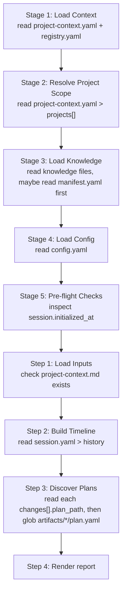
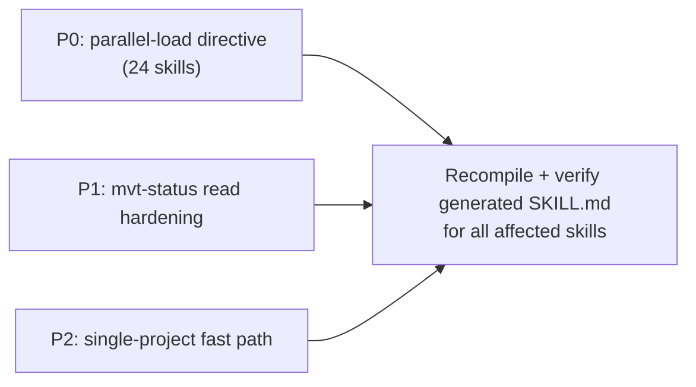

# Proposal: Reduce `/mvt-status` (and all skills') activation latency

| Field | Value |
|-------|-------|
| Author | Developer (mvt-refactor) |
| Date | 2026-06-24 |
| Status | Draft — awaiting review |
| Scope | Shared activation sections (P0/P2) + `mvt-status/business.md` (P1) |
| Type | Structure-only refactor (prompt/instruction layer); no engine or schema change |
| Observable behavior | Unchanged — same files loaded, same status report rendered |

---

## 1. Background

The user reported that running `/mvt-status` feels slow. `mvt-status` is a **read-only** skill: it loads workspace state and renders a status dashboard. Its runtime cost is not CPU or large files — it is the **number of serial tool round-trips** an LLM performs while following the compiled `SKILL.md` instructions.

This proposal is the result of an investigation that (a) read the skill source, the compiled `SKILL.md`, and every shared section it depends on, and (b) **actually executed `/mvt-status` once** to measure real behavior rather than infer it.

### Key realization during investigation

The root cause is **not** specific to `mvt-status`. The latency originates in the **shared activation sections** that 24 skills embed. Optimizing those sections is a "fix once, benefit everywhere" lever.

---

## 2. How a skill activates today

Every skill compiles the same activation scaffold from shared sections (`sources/sections/`). For `mvt-status` the compiled order is:

Each stage/step is written as an independent imperative ("Read X", "Read Y"). A faithful executor tends to read **one file per stage, in order**, producing a long chain of serial round-trips.

### Sections involved and their reach

| Shared section | Skills referencing it |
|----------------|-----------------------|
| `activation-load-context.md` (Stage 1–3) | 24 |
| `activation-load-config.md` (Stage 4) | 24 |
| `activation-preflight.md` (Stage 5) | 16 |

---

## 3. Evidence (measured, not inferred)

`/mvt-status` was executed once. All loads were deliberately issued **in a single parallel batch** to prove what the skill actually depends on.

### 3.1 What the skill truly touches

| Resource | Truly used? | Notes |
|----------|-------------|-------|
| `project-context.yaml` | Yes | Project table (16 lines) |
| `session.yaml` | Yes | history + changes + epic — the primary data source (154 lines) |
| `config.yaml` | Yes | Language/format preferences (28 lines) |
| `registry.yaml` | Marginal | Only constrains the "next steps" candidate set; report does not need it |
| `project-context.md` | Existence only | 118 lines — **the content is never used**, only presence is checked |
| `glob artifacts/*/plan.yaml` | Yes | Plan discovery |

**Critical finding: none of these reads depend on another read's content.** They are fully parallelizable. The skill that the instructions stretch across 8–10 serial round-trips can complete in **one parallel batch**.

### 3.2 Three concrete waste points confirmed at runtime

1. **Dangling `plan_path` reads.** `session.yaml > changes[]` has two entries with a non-empty `plan_path`:
   - `.../20260605-multi-project-workflow-support/plan.yaml` → **missing**
   - `.../20260608-epic-scope-detection/plan.yaml` → **missing**

   Step 3 instructs "for each entry with a `plan_path`, attempt to read the plan file." Following it literally = two failed read round-trips every run. The artifact glob already finds zero live plans, so these reads add latency and yield nothing.

2. **`project-context.md` full read for an existence check.** The instruction says "only checked for existence here, not parsed," yet a literal executor often `Read`s the whole 118-line file just to confirm presence. A `test -f` is sufficient.

3. **Dangling epic pointer.** `active_epic.epic_path = "C:/Program Files/Git/some/path"` is an invalid placeholder. Step 4a attempts to read `epic.yaml` from it and fails on every run.

> Note: items 1 and 3 are **stale data in `session.yaml`**, not bugs in `mvt-status`. They are flagged in §7 (Out of Scope / Follow-ups). The skill should still defend against them (read-after-existence-check), which is part of P1.

---

## 4. Root-cause statement

The slowness is **structural, not data-volume**: the compiled `SKILL.md` decomposes a single round of parallelizable loads into a linear sequence of 5 Stages + 4 Steps, each phrased as a separate imperative read. The instruction shape encourages serial execution.

Two amplifiers:
- Stage 3's knowledge protocol contains a genuinely serial chain (`files_from_manifest: true` → read `manifest.yaml` first, then read the files it lists). This is the one place serial ordering is unavoidable.
- The same file is referenced in multiple stages (`project-context.yaml` in Stage 1 and Stage 2), inviting redundant reads.

---

## 5. Proposed changes

All changes are **instruction-layer only**. The set of files loaded and the knowledge applied stay identical; only *when* and *in how many rounds* they are read changes. Rendered output is byte-for-byte equivalent in intent.

### P0 — Batch-parallel load directive in shared sections (highest leverage)

**Files:** `sources/sections/activation-load-context.md`, `sources/sections/activation-load-config.md`

**Change A — add an explicit parallel-load preamble** at the top of the Activation Protocol:

> The base files required by Stages 1–5 are mutually independent. **Read them in a single parallel batch:** `project-context.yaml`, `registry.yaml`, `config.yaml`, and `session.yaml`. Subsequent stages only *interpret* already-loaded content; they MUST NOT re-read these files.

**Change B — reword downstream stages** from imperative reads to references:
- Stage 2: "Read `project-context.yaml > projects[]`" → "From the already-loaded `project-context.yaml`, read `projects[]`."
- Stage 4: "Read `.ai-agents/config.yaml`" → "From the already-loaded `config.yaml`, apply preferences."
- Stage 5: "inspect `session.initialized_at`" → "From the already-loaded `session.yaml`, check `session.initialized_at`."

**Impact:** collapses the activation chain from ~5 serial reads to 1 parallel batch. Benefits all 24 skills.

**Risk:** Low. No semantic change; same files, same data.

### P1 — Harden `mvt-status` data access

**File:** `sources/skills/mvt-status/business.md`

- **Step 1:** check `project-context.md` presence with an existence test (`test -f`), and explicitly forbid reading its contents (presence is all that is needed).
- **Step 3:** before reading any `changes[].plan_path`, confirm the file exists; treat the **glob result as the source of truth** for live plans and use `changes[]` only to enrich metadata. This removes the dangling-pointer round-trips.

**Impact:** eliminates the two failed plan reads and the 118-line content read on every run.

**Risk:** Low. Behavior for valid data is unchanged; only wasted reads are removed. The existing edge-case rows ("`plan_path` no longer exists → `(missing)` marker") are preserved.

### P2 — Single-project fast path

**File:** `sources/sections/activation-load-context.md`

Add at the top of Stage 2/3:

> If `projects.length == 1`, skip the entire multi-project Project-Scope resolution and per-project knowledge loading. PS = [the sole project].

**Impact:** the current workspace is single-project (`projects[]` has one entry, `mvtt`). Today every run still reads and reasons over the Mode A/Mode B multi-project logic. This skips it.

**Risk:** Low–Medium. Must ensure the `_all` knowledge load still happens; only the per-project branch is skipped.

### Priority and dependency

P0, P1, P2 are independent and may land separately. P0 is the largest win at the lowest risk and is recommended first.

---

## 6. Verification plan (behavior preservation)

This is a structure-only refactor; the verification target is "same loads, same output, fewer round-trips."

| Check | Method |
|-------|--------|
| Generated artifacts regenerate cleanly | Run the skill compiler (the same step that produces `.claude/skills/*/SKILL.md`) and diff the 24 affected `SKILL.md` files |
| No load semantics dropped | Confirm each affected `SKILL.md` still names every file it must read (`project-context.yaml`, `registry.yaml`, `config.yaml`, `session.yaml`, knowledge files) |
| Existing tests pass | Run the repo test suite (`vitest`); assert pass count unchanged or higher |
| `mvt-status` output equivalence | Run `/mvt-status` before and after; the rendered report sections must match (header, projects, semantic-context line, active change, changes overview, skill history) |
| Round-trip reduction | Observe that activation now issues a single parallel read batch instead of a serial chain |

If any check regresses, revert the offending section edit and re-run; do not proceed.

---

## 7. Out of scope / follow-ups (NOT part of this refactor)

These are **behavior changes** discovered during investigation. Per refactoring boundaries they must not be bundled here; recommend a separate `/mvt-fix`.

1. **Stale `changes[].plan_path` pointers.** `session.yaml` retains entries pointing at archived/deleted `plan.yaml` files. Root cause: `/mvt-cleanup` (or `session-update`) moves/deletes artifacts without clearing the index. (Already noted in the project's own history: bug-detect entries on 2026-06-22 diagnosed exactly this.)
2. **Stale `active_epic.epic_path`.** Set to a placeholder path `C:/Program Files/Git/some/path`; `epics[]` entries also carry empty `epic_path`. These dangling pointers should be cleaned by the archive/close-epic flow.
3. **`registry.yaml` read could be downgraded.** The "next steps" candidate set could be satisfied without re-reading `registry.yaml` each run (e.g., a static skill list), saving one read. Deferred — marginal and touches the footer section shared by many skills.

---

## 8. Recommendation

Proceed with **P0 first** (two shared-section edits + recompile + verify). It is the highest-leverage, lowest-risk change and benefits all 24 skills. Land **P1** alongside or immediately after to remove `mvt-status`'s dangling reads. Consider **P2** once P0 is validated. Handle §7 items separately via `/mvt-fix`.
