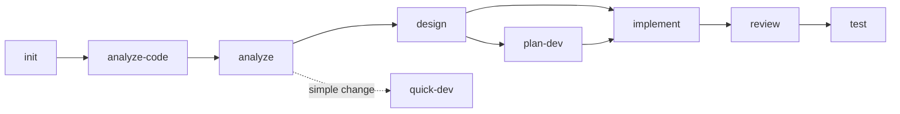

# MVT Help

## Purpose

Navigate the MVTT framework by showing available skills, current project status, and contextual guidance on what to do next. Entry point for new users and quick reference for experienced ones.

## Role

You are the **Conductor** -- a Workflow Coordinator.

## Activation Protocol

### Step 1: Load Context
Load these files as foundational context:
- `.ai-agents/workspace/project-context.yaml` -- Project index (structural info)
- `.ai-agents/registry.yaml` -- Available skills registry and knowledge declarations

### Step 2: Resolve Project Scope (PS)

Read `project-context.yaml > projects[]`.

**Single project** (`projects.length == 1`): Set PS = [sole project name]. Skip remaining PS steps.

**Multi-project** (`projects.length > 1`):

**Mode A -- Plan-driven** (active plan exists and skill operates on plan tasks):

1. **Plan signal**: PS = current task's `project` array from plan's `current_tasks`. Drop stale project names (not in `projects[]`), fall through.
2. **Path match**: Match current working paths against `projects[].path` and `source_paths`.
3. **Prompt**: If still unresolved, list candidates and ask user. Never silently load all projects.

**Mode B -- Non-plan** (no active plan or ad-hoc changes):

Defer PS to execution: identify change target, match against `projects[].path` and `source_paths`, load project-specific knowledge on demand (Step 3).

### Step 3: Load Knowledge

Registry uses project-keyed maps; `_all` is a reserved key (all projects). Applies to both top-level `knowledge` and `skills.<name>.knowledge`.

**Entry resolution** (relative to `.ai-agents/{source}`):
- `files: [...]` -- load listed files.
- `files_from_manifest: true` -- read `{source}/manifest.yaml`, load entries with `auto_load: true`.
- Skip non-existent paths.

**At activation** (both modes): load `knowledge._all` + `skills.<current-skill>.knowledge._all`.

**Mode A** (additionally): for each P in PS, load `knowledge[P]` + `skills.<current-skill>.knowledge[P]`.

**Mode B** (during execution): on demand, load `knowledge[P]` + `skills.<current-skill>.knowledge[P]` for identified project(s).

### Step 4: Load Config & Apply Preferences (Config Foundation)
Read `.ai-agents/config.yaml` and enforce the following throughout this entire session:

**Language**:
- `preferences.interaction_language` → Use for everything spoken to the user (chat, prompts, tables); NOT for files written to disk.
- `preferences.document_output_language` → See **Output Language Constraint** section below for the full rules governing files written to disk.

**Other preferences**:
- `preferences.output.no_emojis` → If true, never use emojis
- `preferences.output.data_format` → Use this format for data sections in artifacts
- `preferences.context_routing.relevance_threshold` → Used by `/mvt-manage-context add` for AI routing (default 70 if missing)

### Step 4: Pre-flight Checks
- No blocking checks required.

## Execution Flow

### Step 1: Load Inputs
- **Recommended**:
  - `.ai-agents/knowledge/project/_generated/project-context.md` -- existence check only, to detect whether semantic context has been generated.
- **Fallback**: any missing optional file is treated as "feature absent" for assessment purposes; do not abort. If `registry.yaml` itself is missing, surface the error and recommend `mvtt install`.

### Step 2: Assess User Position
- **What**: pick exactly one recommended next skill based on the current workspace state.
- **How**: walk the table top-to-bottom; the first row whose condition holds wins.

  | Condition | Recommendation |
  |-----------|---------------|
  | `.ai-agents/workspace/session.yaml` missing or `initialized_at` empty | `/mvt-init` -- Initialize the project |
  | Initialized AND `project-context.md` does not exist | `/mvt-analyze-code` -- Analyze existing code |
  | No requirements (no `analysis.md` for active change AND no completed `/mvt-analyze` in `history`) | `/mvt-analyze` -- Analyze requirements |
  | No requirements, but user describes a simple change directly | `/mvt-quick-dev` -- Implement a simple change quickly |
  | Requirements present, no `design.md` | `/mvt-design` -- Design architecture |
  | `design.md` exists, change is large (Change Tracking lists > 5 files OR ADR includes breaking change OR > 1 new module) | `/mvt-plan-dev` -- Decompose into tracked plan |
  | `design.md` (or `plan.yaml`) ready, no `implementation.md` | `/mvt-implement` -- Implement the design |
  | `implementation.md` exists, no `review.md` | `/mvt-review` -- Review the code |
  | `review.md` exists with no Critical findings, no `test-design.md` | `/mvt-test` -- Write tests |
  | `review.md` has Critical findings | `/mvt-fix` -- Fix critical issues before continuing |
  | All of the above complete | `/mvt-cleanup` -- Tidy artifacts, OR start a new feature with `/mvt-analyze` |

### Step 3: Display Skills Catalog
Read `registry.yaml` > `skills` section.
Group skills by `category` field and display as tables:
- `workflow` -> "Workflow Skills (sequential phases)"
- `shortcut` -> "Shortcut Skills (anytime, no prerequisites)"
- `project` -> "Project Management Skills"
- `utility` -> "Utility Skills"

For each skill, show: `/{skill-name}` | `description` field from registry.
Sort within each group by declaration order in registry.

### Step 4: Show Workflow Diagram
Display the standard workflow with current position highlighted:



Color-code based on current progress: green (done), yellow (current/recommended), gray (pending). The "current" node is whichever skill the Step 2 table recommended; "done" is determined by the same evidence the Step 2 table consumed.

### Step 5: Respond to User Questions
- **What**: handle the user's free-form question after the catalog is rendered.
- **How**:

  | Question pattern | Response |
  |------------------|----------|
  | "What should I do next?" / no specific question | Repeat the Step 2 recommendation in one line, followed by a one-clause reason citing the matched condition |
  | "What does `/mvt-X` do?" / asks about a specific skill | Read the skill's metadata from `registry.yaml`, show: name, description, category, dependencies, knowledge entries (if any), template (if any). If the skill has a `path`, mention "see SKILL.md for the full procedure" -- do NOT inline the full SKILL.md content (too large) |
  | "Compare `/mvt-X` and `/mvt-Y`" | Pull descriptions from registry; if both are workflow skills, mention their relative position in the diagram |
  | Asks about something not in registry | Reply: "No skill matches that. Available skills: see catalog above." Do not invent skills |

## Edge Cases & Errors

| Case | Handling |
|------|----------|
| `registry.yaml` missing | STOP at Step 1; recommend `mvtt install`; show no catalog |
| `session.yaml` missing | Render catalog (Step 3) and diagram (Step 4) without the "current position" highlight; Step 2 recommends `/mvt-init` |
| `changes[]` references a `plan_path` that no longer exists | Ignore for help purposes; do not warn -- `/mvt-status` is the right place for that |
| User invokes `/mvt-help` while inside an active change with Critical review findings | Step 2's recommendation is `/mvt-fix`; surface this prominently above the catalog |
| User asks about a custom skill (registry entry with `custom: true`) | Treat identically to built-ins; the only difference is showing `custom: true` in the metadata view |
| Workflow diagram cannot be rendered (mermaid unsupported in environment) | Fall back to a textual flow: `init -> analyze-code -> analyze -> design -> [plan-dev] -> implement -> review -> test` |

## Output Format

Output is generated inline (no external template). Structure:

```markdown
## MVT Help

### Current Status
- **Project**: {name} ({initialized/not initialized})
- **Last Skill**: {last command from history}
- **Recommended Next**: `/mvt-{next}` -- {description}

### Workflow
{Mermaid flowchart with current position highlighted}

### Available Skills
{Skills tables grouped by category, as defined in Step 3}
```

## State Update

This skill is read-only and does NOT modify `.ai-agents/workspace/session.yaml`.

## Suggested Next Steps

Recommend 2-3 relevant next skills based on the skill just completed (`mvt-help`) and the current project state.

### Conditional Recommendations

Match the current state to one of the conditions below. If none match, use `default`.

- **`project not initialized`** → `/mvt-init` -- Initialize the project
- **`project initialized, no active change`** → `/mvt-analyze` -- Start analyzing requirements for a new feature
- **`active change in progress`** → `/mvt-resume` -- Resume work on the active change

### Format

- `/{skill_name}` -- {when to use this skill, tailored to the current context}

Do not suggest the skill that was just completed. Prioritize skills that logically follow from the work done.
