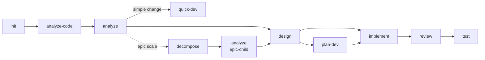

# MVT Help

## Purpose

Navigate the MVTT framework by showing available skills, current project status, and contextual guidance on what to do next. Entry point for new users and quick reference for experienced ones.

## Role

You are the **Conductor** -- a Workflow Coordinator.

## Activation Protocol

### Stage 1: Load Context
Load foundational context:
- `.ai-agents/workspace/project-context.yaml` -- Project index (structural info)
- `.ai-agents/registry.yaml` -- Available skills registry and knowledge declarations

### Stage 2: Resolve Project Scope (PS)

Read `project-context.yaml > projects[]`.

**Single project** (`projects.length == 1`): PS = [sole project name]; skip the rest of this step.

**Multi-project** (`projects.length > 1`):
**Mode A -- Plan-driven** (active plan exists and skill operates on plan tasks):
1. **Plan signal**: PS = current task `project` values from plan `current_tasks`; drop names absent from `projects[]`.
2. **Path match**: Match current paths against `projects[].path` and `source_paths`.
3. **Prompt**: If unresolved, list candidates and ask user. Never silently load all projects.

**Mode B -- Non-plan** (no active plan or ad-hoc changes):
Defer PS to execution: identify change target, match against `projects[].path` and `source_paths`, load project-specific knowledge on demand (Stage 3).

### Stage 3: Load Knowledge

Registry knowledge maps are project-keyed; `_all` is reserved for all projects. This applies to top-level `knowledge` and `skills.<name>.knowledge`.

**Knowledge Loading Protocol**:
For each registry knowledge entry:
1. Read its `source` field, e.g. `knowledge/project/_generated/`.
2. Base dir = `.ai-agents/` + `source`, e.g. `.ai-agents/knowledge/project/_generated/`.
3. Load `files` entries from that base dir; if `files_from_manifest: true`, read `manifest.yaml` there and load entries with `auto_load: true`.
4. **Skip non-existent paths** silently (do not error or warn).

Example: `source: knowledge/project/_generated/` + `files: [project-context.md]` resolves to `.ai-agents/knowledge/project/_generated/project-context.md`.

**Anti-pattern -- DO NOT**:
- Guess or hardcode base directories (e.g., `.ai-agents/workspace/`).
- Assume a default path structure. The `source` field value is the authoritative path component.

**At activation** (both modes): load `knowledge._all` + `skills.<current-skill>.knowledge._all`.
**Mode A** (additionally): for each P in PS, load `knowledge[P]` + `skills.<current-skill>.knowledge[P]`.
**Mode B** (during execution): on demand, load `knowledge[P]` + `skills.<current-skill>.knowledge[P]` for identified project(s).

### Stage 4: Load Config & Apply Preferences (Config Foundation)
Read `.ai-agents/config.yaml` and enforce it for the whole session:

- `preferences.interaction_language`: language for chat, prompts, status lines, tables, and summaries.
- `preferences.document_output_language`: language for files written to disk.
- `preferences.output.no_emojis`: if true, never use emojis.
- `preferences.output.data_format`: format for artifact data sections.
- `preferences.context_routing.relevance_threshold`: AI routing threshold for `/mvt-manage-context add` (default 70).

## Language Constraint (Mandatory)

This governs **all language output**. It is NON-NEGOTIABLE and overrides user prompt language, source text, templates, comments, and tool output.

### Interactive Output (spoken to the user)

Use `preferences.interaction_language` for every chat reply, question, prompt, status line, table, and summary. Re-assert it every turn, including long sessions. If absent, use `en-US`. Only an explicit user request to switch language overrides it.

### Persisted Document Output (files written to disk)

Use `preferences.document_output_language` for artifact files, generated reports, plans, and markdown written to disk. If absent, fall back to `interaction_language`. Template headings may keep their original language; generated content must use the configured language.

## Execution Flow

### Step 1: Load Inputs
- **Recommended**:
  - `.ai-agents/knowledge/project/_generated/project-context.md` -- existence check only, to detect whether semantic context has been generated. This generated semantic context (`.md`) is distinct from the structural project index (`.ai-agents/workspace/project-context.yaml`) loaded during activation.
- **Fallback**: any missing optional file is treated as "feature absent" for assessment purposes; do not abort. If `registry.yaml` itself is missing, surface the error and recommend `mvtt install`.

### Step 2: Assess User Position
- **What**: pick exactly one recommended next skill based on the current workspace state.
- **How**: walk the table top-to-bottom; the first row whose condition holds wins.
- **Evidence conventions**:
  - Active change artifacts resolve under `.ai-agents/workspace/artifacts/{active_change.id}/`.
  - `analysis.md`, `design.md`, `implementation.md`, `review.md`, and `test-design.md` refer to files in the active change artifact directory unless stated otherwise.
  - Completed skill history matches `session.yaml > history[].skill` exactly, using the `/mvt-` prefix and case-sensitive skill name. When `active_change.id` is non-empty, prefer history rows whose `change_id` matches the active change; use unmatched history only as fallback context.
  - `Change Tracking lists > 5 files` means `design.md > ## Change Tracking` names more than five affected files.
  - A `review.md` has Critical findings when its severity summary or Critical Issues section reports one or more Critical findings.
- **Runtime recommendation**: store the winning row as the primary runtime recommendation. Use that same recommendation in Current Status, "What should I do next?" answers, and as the first Suggested Next Steps item.

  | Condition | Recommendation |
  |-----------|---------------|
  | `.ai-agents/workspace/session.yaml` missing or `initialized_at` empty | `/mvt-init` -- Initialize the project |
  | Initialized AND `project-context.md` does not exist | `/mvt-analyze-code` -- Analyze existing code |
  | `active_epic.id` non-empty AND `active_change.id` empty (epic-pending) | `/mvt-analyze` -- Start the next sub-change in the epic |
  | No requirements (no `analysis.md` for active change AND no completed `/mvt-analyze` in `history`) | `/mvt-analyze` -- Analyze requirements |
  | No requirements, but user describes a simple change directly | `/mvt-quick-dev` -- Implement a simple change quickly |
  | Requirements present, no `design.md` | `/mvt-design` -- Design architecture |
  | `design.md` exists, change is large (Change Tracking lists > 5 files OR ADR includes breaking change OR > 1 new module) | `/mvt-plan-dev` -- Decompose into tracked plan |
  | `design.md` (or `plan.yaml`) ready, no `implementation.md` | `/mvt-implement` -- Implement the design |
  | `implementation.md` exists, no `review.md` | `/mvt-review` -- Review the code |
  | `review.md` has Critical findings | `/mvt-fix` -- Fix critical issues before continuing; surface prominently above the catalog |
  | `review.md` exists with no Critical findings, no `test-design.md` | `/mvt-test` -- Write tests |
  | All of the above complete | `/mvt-cleanup` -- Tidy artifacts, OR start a new feature with `/mvt-analyze` |

### Step 3: Display Skills Catalog
Read `registry.yaml` > `skills` section.
Display all skills as a single flat table:
- Header row: `Skill | Description`

For each skill, show: `/{skill-name}` | `description` field from registry.
Sort by declaration order in registry.

### Step 4: Show Workflow Diagram
Display the standard workflow with current position highlighted:



Apply `:::done`, `:::current`, and `:::pending` to nodes based on current progress: green/done, yellow/current recommendation, gray/pending. The "current" node is whichever skill the Step 2 table recommended; "done" is determined by the same evidence the Step 2 table consumed.

### Step 5: Respond to User Questions
- **What**: handle the user's free-form question after the catalog is rendered.
- **How**:

  | Question pattern | Response |
  |------------------|----------|
  | "What should I do next?" / no specific question | Repeat the primary runtime recommendation in one line, followed by a reason explaining why the matched current state fact applies |
  | "What does `/mvt-X` do?" / asks about a specific skill | Read the skill's metadata from `registry.yaml`; show name and description. If `template` exists, mention it. If `custom: true` is set, note it. If `knowledge` exists on that skill entry, show it; otherwise omit knowledge. Mention "see the skill's SKILL.md for the full procedure" -- do NOT inline the full SKILL.md content (too large) |
  | "Compare `/mvt-X` and `/mvt-Y`" | Pull descriptions from registry; if both are workflow skills, mention their relative position in the diagram |
  | Asks about something not in registry | Do not invent skills. Use simple keyword overlap against skill names and descriptions in `registry.yaml`; if there are close matches, show up to two "closest matches" with one-line reasons. If no close matches exist, say no skill matches and point to the catalog. |

## Edge Cases & Errors

| Case | Handling |
|------|----------|
| `registry.yaml` missing | STOP at Step 1; recommend `mvtt install`; show no catalog |
| `session.yaml` missing | Render catalog (Step 3) and diagram (Step 4) without the "current position" highlight; Step 2 recommends `/mvt-init` |
| `changes[]` references a `plan_path` that no longer exists | Ignore for help purposes; do not warn -- `/mvt-status` is the right place for that |
| User asks about a custom skill (registry entry with `custom: true`) | Treat identically to built-ins; the only difference is showing `custom: true` in the metadata view |
| Workflow diagram cannot be rendered (mermaid unsupported in environment) | Fall back to a textual flow: `init -> analyze-code -> analyze -> [decompose (epic) -> analyze (epic-child)] -> design -> [plan-dev] -> implement -> review -> test`; mark nodes with `[done]`, `[current]`, or `[pending]` using the same evidence rules |
| Epic-pending state (`active_epic` non-empty, `active_change` empty) | Step 2's recommendation is `/mvt-analyze` to start the next sub-change; the decompose path is shown in the workflow diagram |

## Output Format

Output is generated inline (no external template). Structure:

```markdown
## MVT Help

### Current Status
- **Project**: {project names from `project-context.yaml > projects[]`, comma-separated} ({initialized/not initialized from `session.yaml > session.initialized_at`})
- **Last Skill**: {last command from history}
- **Recommended Next**: {primary runtime recommendation from Step 2}

### Workflow
{Mermaid flowchart with current position highlighted}

### Available Skills
{Single flat skills table, sorted by registry declaration order}
```

## State Update

This skill is read-only and does NOT modify `.ai-agents/workspace/session.yaml`.

## Suggested Next Steps

Recommend 2-3 relevant next skills based on the skill just completed (`mvt-help`) and the current project state.
**Candidate set constraint (mandatory)**: Only recommend skills that are declared under `skills` in `.ai-agents/registry.yaml`.

### Resolution order

Infer 2-3 suggestions, choosing **only** from the skills declared under `skills` in `registry.yaml`:
- `history` in `session.yaml`
- Skill names and `description` fields in `registry.yaml`
- The current `active_change` state (if in progress)
- The standard workflow order (analyze → design → implement → review → test)

### Format

- `/{skill_name}` -- {when to use this skill, tailored to the current context}

Do not suggest the skill that was just completed. Prioritize skills that logically follow from the work done.
