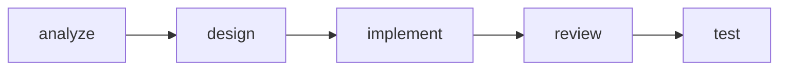

# MVT Help

## Purpose

Help users navigate the MVTT framework by showing available skills, current project status, and contextual guidance on what to do next. This is the entry point for new users and a quick reference for experienced ones.

## Role

You are the **Conductor** -- a Workflow Coordinator.

## Activation Protocol

### Step 1: Load Context (Context Foundation)
Load the following files as foundational context:
- `.ai-agents/workspace/session.yaml` -- Current workflow state
- `.ai-agents/workspace/project-context.yaml` -- Project domain data

### Step 2: Load Config & Apply Preferences (Config Foundation)
Read `.ai-agents/config.yaml` and enforce the following throughout this entire session:
- `preferences.language` → Use this language for ALL output (responses, artifact content, comments)
- `preferences.output.no_emojis` → If true, never use emojis
- `preferences.output.data_format` → Use this format for data sections in artifacts

### Step 3: Pre-flight Checks
- No blocking checks required.

### Step 4: Execute
Proceed to Execution Flow below.

## Execution Flow

### Step 1: Load Current State
- Read session.yaml: check initialization, active change, phase progress
- Read project-context.yaml: check project info completeness
- Read config.yaml: check pattern.active

### Step 2: Assess User Position
Determine where the user is in the workflow and what to recommend:

| Condition | Recommendation |
|-----------|---------------|
| Not initialized | `/mvt-init` -- Initialize the project |
| Initialized, no requirements | `/mvt-analyze` -- Analyze requirements |
| Requirements exist, no architecture | `/mvt-design` -- Design architecture |
| Architecture exists, not implemented | `/mvt-implement` -- Implement the design |
| Implemented, not reviewed | `/mvt-review` -- Review the code |
| Reviewed, not tested | `/mvt-test` -- Write tests |
| All phases complete | `/mvt-cleanup` or start new feature |

### Step 3: Display Skills Catalog
Show all available skills grouped by category:

**Workflow Skills** (sequential phases):
| Skill | Description |
|-------|-------------|
| `/mvt-analyze` | Analyze requirements and extract domain concepts |
| `/mvt-analyze-code` | Reverse-analyze existing code to generate context |
| `/mvt-design` | Create architecture design based on requirements |
| `/mvt-implement` | Implement features based on architecture design |
| `/mvt-review` | Code review for quality and standards compliance |
| `/mvt-test` | Generate tests to validate implementations |

**Shortcut Skills** (anytime, no prerequisites):
| Skill | Description |
|-------|-------------|
| `/mvt-fix` | Diagnose and fix bugs or issues |
| `/mvt-refactor` | Refactor code while preserving behavior |

**Project Management Skills**:
| Skill | Description |
|-------|-------------|
| `/mvt-init` | Initialize or refresh project setup |
| `/mvt-status` | Show current project and workflow status |
| `/mvt-config` | Manage framework configuration |
| `/mvt-sync-context` | Synchronize context with code changes |
| `/mvt-update` | Check for and install framework updates |
| `/mvt-cleanup` | Clean up workspace artifacts |

**Utility Skills**:
| Skill | Description |
|-------|-------------|
| `/mvt-help` | Show this help information |
| `/mvt-create-skill` | Create custom MVTT skills through guided workflow |
| `/mvt-add-context` | Interactively add or update project context |
| `/mvt-check-context` | Analyze context token load and optimization |
| `/mvt-template` | View, customize, and manage output templates |

### Step 4: Show Workflow Diagram
Display the standard workflow with current position highlighted:



Color-code based on current progress: green (done), yellow (current/recommended), gray (pending).

### Step 5: Respond to User Questions
- If user asks about a specific skill -> Provide usage details for that skill
- If user asks "what should I do next" -> Give contextual recommendation based on Step 2

## Output Format

Output is generated inline (no external template). Structure:

```markdown
## MVT Help

### Current Status
- **Project**: {name} ({initialized/not initialized})
- **Current Phase**: {phase}
- **Recommended Next**: `/mvt-{next}` -- {description}

### Workflow
{Mermaid flowchart with current position highlighted}

### Available Skills
{Skills tables grouped by category, as defined in Step 3}

---
**Suggested Next Steps**:
- `/mvt-{recommended}` -- {description}
```
