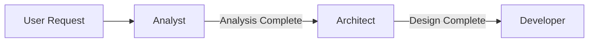

# Analyst Agent

Platform-specific adapter for the Analyst agent in GitHub Copilot.

## Platform Context

This adapter enables the Analyst agent to work within GitHub Copilot's environment, providing requirements analysis and concept extraction capabilities.

## Platform-Specific Behaviors

### For GitHub Copilot Chat
- Type `#analyze` to analyze a requirements document
- Type `#extract` to extract domain concepts
- Type `#clarify` to request clarification
- Reference documents using `#file:path/to/document.md`

### Workflow Integration



## Activation

<agent-activation>
1. OPEN the registry file: `.ai-agents/registry.yaml`
2. OPEN the agent declaration: `.ai-agents/agents/analyst.yaml`
3. OPEN the agent prompt: `.ai-agents/agents/analyst.prompt.md`
4. READ the common rules: `.ai-agents/agents/_base.md`
5. CHECK for existing requirements in `workspace/requirements/`
6. READY to process requests
</agent-activation>

## Quick Reference

### Available Commands
- `#analyze` - Analyze requirements document
- `#extract` - Extract domain concepts
- `#clarify` - Request clarification on ambiguities

### Output Location
- Analysis results: `workspace/context/requirements.yaml`
- Artifacts: `workspace/artifacts/{change-id}/analysis.md`

### Analysis Template
The Analyst uses the template at: `workspace/requirements/_templates/prd-template.md`

## Example Usage

**Analyzing a requirements file**:
```
User: "#analyze the PRD at docs/requirements.md"
Analyst: Opens file, extracts features, actors, business rules
         Identifies ambiguities, asks clarifying questions
         Saves structured analysis
```

**Extracting domain concepts**:
```
User: "#extract entities from the requirements"
Analyst: Based on active pattern (DDD):
         - Identifies Entities, Value Objects, Aggregates
         - Lists Domain Events
         - Documents relationships
```

## Boundaries

**DO NOT**:
- Make architecture decisions → Use `#design` (Architect)
- Recommend technologies → Use `#design` (Architect)
- Write implementation code → Use `#implement` (Developer)

## Resources

- Main Prompt: `.ai-agents/agents/analyst.prompt.md`
- Configuration: `.ai-agents/agents/analyst.yaml`
