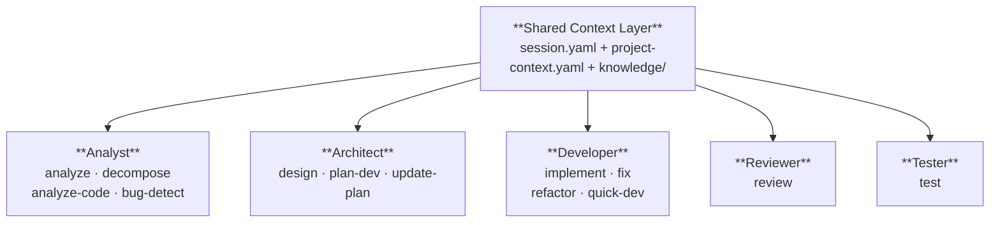
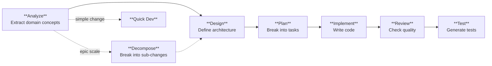
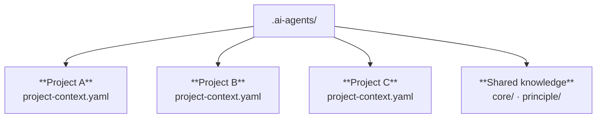
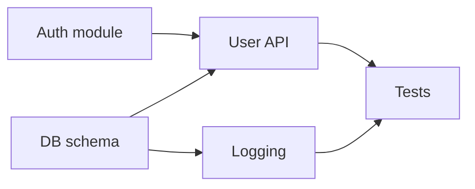
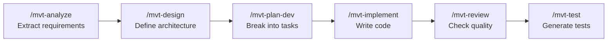

# My Virtual Tech Team (MVTT)

> **Stop repeating context. Ship features end-to-end.**
>
> 24 specialized AI skills that share a persistent workspace — covering the full development lifecycle from requirements to tested code.

**English** | [中文](README.zh-CN.md)

[](https://www.npmjs.com/package/@uoyo/mvtt) [](LICENSE) [](https://github.com/uoyoCsharp/My-Virtual-TechTeam/stargazers)

## The Problem

Every Claude Code session starts from zero. The project context you built yesterday — the architecture, the conventions, the domain knowledge — is gone today.

Three things make this painful on real projects:

- **Context evaporates** — close the IDE, switch machines, come back next week, and the AI has forgotten everything.
- **Same preamble every time** — re-explain the tech stack, re-state the conventions, re-describe the domain.
- **No separation of concerns** — analysis, design, code, and tests jumbled in a single conversation.

> **Mental model in 30 seconds**: imagine hiring a tiny engineering team — Analyst, Architect, Developer, Reviewer, Tester — and giving them a shared project notebook that lives in your repo. That's MVTT.

## Quick Start

```bash
# Install into any project
npx @uoyo/mvtt install

# Open in Claude Code, then:
/mvt-init          # Detect tech stack, initialize context
/mvt-analyze       # Start with requirements analysis
```

<!-- SCREENSHOT PLACEHOLDER #1: terminal screenshot showing `npx @uoyo/mvtt install`, the language selection prompt, and the first /mvt-init + /mvt-analyze invocation in Claude Code. Recommended size: ~1200x600. Save as docs/assets/quickstart.png and replace this comment with:  -->

## Who MVTT Is For

MVTT is for developers who use Claude Code on real, ongoing projects — not one-off scripts.

**Use MVTT if you:**

- Maintain a medium-sized codebase (5k+ LOC) and feel context-loss pain
- Want a structured workflow even when working solo — analysis, design, implement, review, test
- Bilingual projects: MVTT works in both English and Chinese
- Want a project notebook that travels with the repo (version-controlled, team-shared)

**Skip MVTT if you:**

- Build throwaway scripts (regular Claude Code is faster)
- Need enterprise CI/CD pipelines or role-based access control (not what MVTT does)
- Prefer a single CLAUDE.md and rolling your own prompts

## How It Works

### Persistent Context That Grows With Your Project

```
.ai-agents/
├── workspace/
│   ├── session.yaml              # Who did what, what's in progress
│   ├── project-context.yaml      # Tech stack, domain model, conventions
│   └── artifacts/                # Analysis docs, design specs, review logs
└── knowledge/
    ├── core/                     # Framework principles
    ├── principle/                # Your team's coding standards
    └── project/                  # Domain-specific knowledge
```

Context is **never lost between conversations**. Start a new Claude Code session tomorrow and it picks up exactly where you left off — your domain model, architecture decisions, in-progress tasks, and team conventions are all there.

### Save, Resume, and Sync

| Capability | How |
|---|---|
| **Save progress** | Every skill automatically updates `session.yaml` with what was done |
| **Resume anywhere** | `/mvt-resume` restores full context in a new conversation |
| **Sync after changes** | `/mvt-sync-context` updates context when code evolves outside the workflow |
| **Check context health** | `/mvt-check-context` analyzes token load and suggests optimizations |

You can close your IDE, switch machines, or come back days later — the context persists in version-controlled files that travel with your repo.

### One Shared Truth, Zero Drift



When the Analyst discovers a new domain concept, the Architect sees it. When the Architect makes a design decision, the Developer follows it. No skill can "go rogue" because they all read the same ground truth before acting.

### Complete Development Lifecycle

MVTT covers the full engineering workflow — not just code generation:



For epic-scale work, `/mvt-decompose` runs *before* `/mvt-analyze` and breaks the requirement into right-sized sub-changes with DAG dependencies. For small changes, `/mvt-quick-dev` skips the full workflow entirely.

Context flows through every phase via `session.yaml` and `project-context.yaml` — each step's output is the next step's input. The context accumulates, it doesn't reset.

### Multi-Project & Dependency-Aware

Real-world repos are rarely a single project. MVTT handles both shapes that slow other tools down.

**Multi-project in one repo.** Monorepos, microservices, multi-app repos — MVTT handles them natively. Each project gets its own `project-context.yaml` and its own knowledge subset. Skills scope to the active project automatically; you can switch scopes explicitly. One workspace, many projects, no context bleed.



**Dependency-aware task tracking.** Real features have dependencies — some tasks block others, some can run in parallel. Instead of tracking these in your head (or a spreadsheet), `/mvt-decompose` produces a DAG of sub-changes, `/mvt-plan-dev` mirrors it in `plan.yaml`, and `/mvt-update-plan` walks you through in the right order. You always see the critical path and what's runnable *now*.



Read this as: `T3` and `T4` run in parallel (both only need `T2`); `T5` waits for both. The plan tracks all of this automatically.

<!-- SCREENSHOT PLACEHOLDER #2: a 30-second GIF (or 3-panel screenshot) showing the full lifecycle: /mvt-analyze output → /mvt-design output → /mvt-test output. Recommended size: ~1200x800. Save as docs/assets/lifecycle.gif (or .png) and replace this comment with:  -->

## Skills Working as a Team

MVTT's 24 skills aren't 24 independent commands — they're an **integrated team** that shares one project notebook. Every skill's output becomes the next skill's input, so context compounds instead of evaporating.

### One Feature, Six Skills, One Continuous Flow

Adding a new feature end-to-end looks like this:



What would take 6 separate Claude Code sessions (and 6 rounds of re-explaining the project) takes **one continuous workflow** — same context, no re-explanation, no copy-paste.

### Common Recipes

You don't always need all 6. Pick the recipe that fits:

| Task | Skills used |
|------|-------------|
| Add a new feature | `analyze` → `design` → `plan-dev` → `implement` → `review` → `test` |
| Investigate a suspected bug | `bug-detect` (read-only diagnosis) |
| Fix a known bug | `fix` (with optional `bug-detect` first) |
| Refactor a module | `analyze-code` → `refactor` → `review` → `test` |
| Tackle an epic-scale change | `decompose` → `analyze` (per sub-change) → ... |
| Quick 1–3 file tweak | `quick-dev` |
| Onboard to an existing codebase | `analyze-code` |
| Resume after days off | `resume` (then continue the workflow) |
| Clean up accumulated artifacts | `cleanup` + `check-context` |

Each recipe is a **starting point** — `/mvt-help` suggests the next step based on your project's actual state, and you can drop or reorder skills as needed.

### Why Multi-Skill Coordination Wins

- **Compounding context** — the Analyst's extracted domain concepts feed the Architect; the Architect's design decisions feed the Developer. No skill re-derives what another already learned.
- **Specialized prompts** — each skill is a focused prompt tuned for one phase, not one bloated "do everything" prompt. Focused prompts produce higher-quality output.
- **Built-in handoffs** — the artifact from one skill (analysis doc, design spec, plan.yaml) is explicitly read by the next. Nothing gets lost in the conversation.
- **Interruptible** — stop mid-workflow, come back days later, `/mvt-resume` picks up exactly where you left off, with full state restored.

## The 24 Skills

### Workflow — Full Development Lifecycle

| Skill | Use when... | What it does |
|-------|-------------|--------------|
| `/mvt-analyze` | You have a new requirements doc | Extracts domain concepts, features, and acceptance criteria |
| `/mvt-decompose` | A requirement is epic-scale, spans multiple domains | Breaks it into right-sized sub-changes with DAG dependencies |
| `/mvt-analyze-code` | Joining an existing codebase | Reverse-analyzes code into structured project context |
| `/mvt-design` | Requirements ready, need architecture | Defines modules, boundaries, and data flow |
| `/mvt-plan-dev` | Design is too big for a single implement pass | Generates a tracked plan with ordered tasks |
| `/mvt-update-plan` | A task just completed or scope changed | Marks task done/blocked/skipped, auto-advances `current_tasks` |
| `/mvt-implement` | Design and plan are ready | Writes code following the design and plan |
| `/mvt-review` | Implementation is written | Checks quality, standards, and potential issues |
| `/mvt-test` | Implementation is reviewed | Generates tests that validate the behavior |

### Shortcuts — Skip the Ceremony

| Skill | Use when... | What it does |
|-------|-------------|--------------|
| `/mvt-bug-detect` | Suspect a bug, want diagnosis before any change | Investigates root cause and impact, makes no code changes |
| `/mvt-fix` | Bug confirmed, ready to resolve | Diagnoses and fixes with full context awareness |
| `/mvt-refactor` | Want to restructure, keep behavior unchanged | Refactors with awareness of architecture decisions |
| `/mvt-quick-dev` | 1–3 file change, well-scoped, architecturally neutral | Goes straight to implementation, no full workflow |

### Context Management

| Skill | Use when... | What it does |
|-------|-------------|--------------|
| `/mvt-init` | First time on a project, or major restructure | Detects tech stack and initializes the workspace |
| `/mvt-sync-context` | Code changed outside the MVTT workflow | Reconciles workspace with actual code state |
| `/mvt-resume` | New session, work was in progress | Restores full context from `session.yaml` |
| `/mvt-status` | "Where am I in the workflow?" | Shows progress and loaded context |
| `/mvt-manage-context` | Want to add/remove/reorganize knowledge | Manages knowledge entries and the registry |
| `/mvt-check-context` | Token usage feels high | Analyzes footprint and suggests optimizations |
| `/mvt-cleanup` | Workspace feels bloated | Archives stale artifacts, maintains health |

### Utility

| Skill | Use when... | What it does |
|-------|-------------|--------------|
| `/mvt-help` | New to MVTT or unsure what to do next | Shows skills, status, and workflow guidance |
| `/mvt-config` | Want different language or output format | Changes framework settings |
| `/mvt-create-skill` | Need a custom workflow for your team | Scaffolds a new skill interactively |
| `/mvt-template` | Want to customize output formats | Views and manages output templates |

## How Context Stays in Sync

A common fear: "what if the context becomes outdated?" MVTT handles this at multiple levels:

1. **Auto-update on skill execution** — Every skill writes its results back to session and artifacts
2. **Explicit sync** — `/mvt-sync-context` reconciles context with actual code changes
3. **Context health checks** — `/mvt-check-context` identifies stale or bloated entries
4. **Artifact cleanup** — `/mvt-cleanup` archives old artifacts that no longer reflect reality

The context is designed to be a **living document**, not a snapshot.

## CLI Commands

```bash
mvtt install              # First-time install (interactive language selection)
mvtt update [--check]     # Upgrade to latest (user data preserved)
mvtt doctor               # Check installation health
mvtt uninstall            # Remove generated files (user data preserved)
```

## Extending MVTT

- **Add team knowledge** — Drop markdown files into `.ai-agents/knowledge/principle/` for coding standards, or `project/` for domain knowledge. All skills load them automatically.
- **Create custom skills** — `/mvt-create-skill` scaffolds project-specific skills (e.g., `/mvt-test-e2e` for your E2E conventions).
- **Customize templates** — Override output formats in `.ai-agents/skills/_templates/custom/`.

## Configuration

Edit `.ai-agents/config.yaml` or use `/mvt-config`:

```yaml
version: "2.0"
preferences:
  interaction_language: en-US       # en-US | zh-CN
  document_output_language: en-US   # Language for generated artifacts
  output:
    no_emojis: true
    data_format: yaml               # yaml | json
  context_routing:
    relevance_threshold: 70
```

## FAQ

### How is MVTT different from a well-written CLAUDE.md?

A CLAUDE.md gives Claude **instructions**. MVTT gives Claude a **team** — 24 specialized skills with shared memory, dedicated templates, and a handoff protocol. CLAUDE.md is a memo; MVTT is an org chart. You can use both; they don't conflict.

### Does it explode my token usage?

No. The workspace is file-based and on-demand. MVTT loads only the context that's relevant to the current skill (default relevance threshold: 70%). Run `/mvt-check-context` to see your token footprint and optimize.

### Is it English-only?

No. Set `preferences.interaction_language: zh-CN` and the framework switches to Chinese — both in chat and in generated artifacts. Bilingual projects are first-class.

### Can my team use it together?

Yes. The `.ai-agents/` workspace is version-controlled, so it travels with your repo. Everyone on the team sees the same context, the same plans, the same history. The only requirement: commit `.ai-agents/` (or at least the `knowledge/` and `project-context.yaml` parts).

### Does it work with any existing project?

Yes. `npx @uoyo/mvtt install` adds MVTT to any repo. It doesn't change your code, your git history, or your workflow — it adds structure on top.

### What happens to my data when I uninstall?

`mvtt uninstall` removes the generated framework files but preserves your `.ai-agents/workspace/` and `.ai-agents/knowledge/`. Nothing you've written is lost.

### Why 24 skills? Isn't that overkill?

Most teams use 5–8 skills regularly. The other 15–19 are there for specific situations (epic decomposition, context sync, output templating) — you don't need to learn them up front. Run `/mvt-help` and it tells you exactly which one to use next.

## Community & Roadmap

- **Issues**: [github.com/uoyoCsharp/My-Virtual-TechTeam/issues](https://github.com/uoyoCsharp/My-Virtual-TechTeam/issues)
- **Discussions**: [github.com/uoyoCsharp/My-Virtual-TechTeam/discussions](https://github.com/uoyoCsharp/My-Virtual-TechTeam/discussions)
- **Roadmap**: see [open milestones](https://github.com/uoyoCsharp/My-Virtual-TechTeam/milestones)
- **Star the repo** if MVTT helps you ship faster

## Development

```bash
git clone https://github.com/uoyoCsharp/My-Virtual-TechTeam.git
cd My-Virtual-TechTeam
npm install
npm run build        # Compile TypeScript
npm test             # Run test suite
```

## License

MIT
