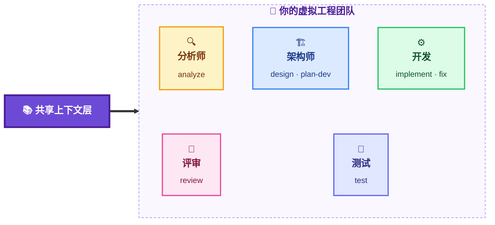
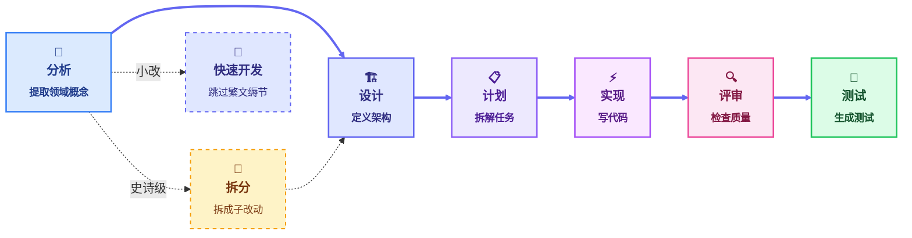
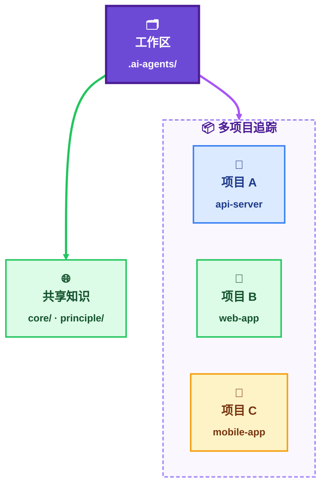
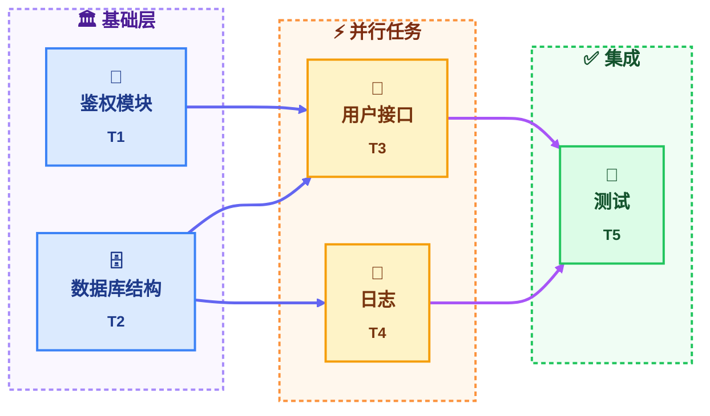

# My Virtual Tech Team (MVTT)

> **告别重复的上下文。功能端到端一气贯通。**
>
> 24 个专项 AI 技能，共享同一个持久化工作区 —— 覆盖从需求分析到测试交付的完整开发全流程。

[English](README.md) | **中文**

[](https://www.npmjs.com/package/@uoyo/mvtt) [](LICENSE) [](https://github.com/uoyoCsharp/My-Virtual-TechTeam/stargazers)

## 你正在面对的难题

每次 Claude Code 会话都从零开始。昨天花心思搭起来的项目上下文 —— 架构、约定、领域知识 —— 今天又没了。

在真实项目里，有三件事特别让人头疼：

- **上下文蒸发** —— 关闭 IDE、换台电脑、过一周再回来，AI 已经把什么都忘干净了。
- **每次都要重新交代** —— 解释技术栈、重述代码规范、描述业务领域。
- **没有职责分离** —— 需求分析、架构设计、写代码、测试，全挤在同一个对话里。

> **30 秒心智模型**：把 MVTT 想象成一支驻扎在你代码仓库里的精简工程团队 —— 分析师、架构师、开发、评审、测试 —— 共用同一本项目笔记。流程是标准化的，无论你是高级工程师还是新人，跑出来的效果都一样 —— AI 熟练度不再决定产出质量。这就是 MVTT。

## 快速开始

```bash
# 安装到任意项目
npx @uoyo/mvtt install

# 在 Claude Code 中运行：
/mvt-init          # 检测技术栈，初始化上下文
/mvt-analyze       # 从需求分析开始
```

## MVTT 适合谁

MVTT 适合那些用 Claude Code 做真实、长期项目的开发者 —— 不是写一次性脚本的人。

**适合 MVTT 的场景：**

- 维护一个中等规模代码库（5k+ 行），受够了上下文丢失的痛
- 即使单兵作战，也想走结构化流程 —— 分析、设计、实现、评审、测试
- 团队里 AI 熟练度参差不齐 —— MVTT 把流程标准化，让新人老人产出质量一致
- 中英双语项目：MVTT 完整支持中英文双语
- 想要一个能跟着仓库走、随团队共享的项目笔记（版本控制，团队可见）

**不太适合 MVTT 的场景：**

- 写一次性脚本（普通 Claude Code 更快）
- 需要企业级 CI/CD 流水线或基于角色的权限控制（这不是 MVTT 做的事）
- 偏好用一份 CLAUDE.md 凑合、自己组装 prompt

## 工作原理

### 随项目一起成长的持久化上下文

```
.ai-agents/
├── workspace/
│   ├── session.yaml              # 谁做了什么、当前在做什么
│   ├── project-context.yaml      # 技术栈、领域模型、约定
│   └── artifacts/                # 分析文档、设计稿、评审记录
└── knowledge/
    ├── core/                     # 框架原理
    ├── principle/                # 团队代码规范
    └── project/                  # 领域知识
```

上下文在会话之间**永不丢失**。明天再开一个新的 Claude Code 会话，它会接着上次的地方继续 —— 领域模型、架构决策、进行中的任务、团队约定，全都在。

### 保存、恢复与同步

| 能力 | 做法 |
|---|---|
| **自动保存进度** | 每个技能执行完都会自动更新 `session.yaml`，记录做了什么 |
| **任何地方都能恢复** | `/mvt-resume` 在新会话里恢复完整上下文 |
| **外部改动后同步** | `/mvt-sync-context` 在工作流之外改了代码时同步上下文 |
| **检查上下文健康度** | `/mvt-check-context` 分析 token 占用并给出优化建议 |

关闭 IDE、换台电脑、隔几天再回来 —— 上下文都存在版本控制的文件里，跟着仓库走。

### 同一份事实，零分歧



分析师发现新领域概念，架构师能看到。架构师做了设计决策，开发会照着做。没有任何技能能"我行我素"，因为它们动手前都先读同一份事实。

### 完整的开发全流程

MVTT 覆盖完整的工程流程 —— 不只是写代码：



史诗级需求先跑 `/mvt-decompose`，把需求拆成带 DAG 依赖的子改动，再走 `/mvt-analyze`。小改动则用 `/mvt-quick-dev`，直接跳过整个流程。

上下文通过 `session.yaml` 和 `project-context.yaml` 在每个阶段流转 —— 上一步的产出就是下一步的输入。上下文在累积，不在重置。

### 多项目与依赖感知

现实中的仓库很少是单一项目。MVTT 都能应付。

**单仓库多项目。** monorepo、微服务、多应用仓库 —— MVTT 天然支持。一份 `project-context.yaml` 用 `projects[]` 数组追踪所有子项目，注册表按项目名路由知识。技能会自动聚焦到当前项目，也可以显式切换作用域。一个工作区，多个项目，上下文不串。



**依赖感知的任务跟踪。** 真实功能有依赖关系 —— 有些任务阻塞别的任务，有些能并行跑。不用你拿脑子（或者 Excel）记，`/mvt-decompose` 生成子改动的 DAG，`/mvt-plan-dev` 把它镜像到 `plan.yaml`，`/mvt-update-plan` 带着你按正确的顺序走。关键路径和"现在能跑哪些"一目了然。



读法：`T3` 和 `T4` 并行跑（都只依赖 `T2`），`T5` 等它们都完成。计划自动跟踪这一切。

<!-- SCREENSHOT PLACEHOLDER #2：完整 lifecycle 的 30 秒 GIF（或 3 联截图），展示 analyze → design → test 的输出。建议尺寸：~1200x800。保存为 docs/assets/lifecycle.gif（或 .png），替换本注释为：  -->

## 24 个技能如何像一个团队协作

MVTT 的 24 个技能不是 24 条互不相关的命令 —— 它们是**一个整体团队**，共用同一本项目笔记。每个技能的输出就是下一个技能的输入，上下文在叠加，不在蒸发。

### 一个功能，六个技能，一气贯通

端到端加一个新功能，流程长这样：

```mermaid
flowchart LR
    A["🔎<br/><b>/mvt-analyze</b><br/><sub>提取需求</sub>"] ==> B["🏗️<br/><b>/mvt-design</b><br/><sub>定义架构</sub>"] ==> C["📋<br/><b>/mvt-plan-dev</b><br/><sub>拆解任务</sub>"] ==> D["⚡<br/><b>/mvt-implement</b><br/><sub>写代码</sub>"] ==> E["🔍<br/><b>/mvt-review</b><br/><sub>检查质量</sub>"] ==> F["🧪<br/><b>/mvt-test</b><br/><sub>生成测试</sub>"]

    style A fill:#dbeafe,stroke:#3b82f6,stroke-width:2.5px,color:#1e3a8a,font-weight:bold
    style B fill:#e0e7ff,stroke:#6366f1,stroke-width:2.5px,color:#312e81,font-weight:bold
    style C fill:#ede9fe,stroke:#8b5cf6,stroke-width:2.5px,color:#4c1d95,font-weight:bold
    style D fill:#fae8ff,stroke:#a855f7,stroke-width:2.5px,color:#581c87,font-weight:bold
    style E fill:#fce7f3,stroke:#ec4899,stroke-width:2.5px,color:#831843,font-weight:bold
    style F fill:#dcfce7,stroke:#22c55e,stroke-width:2.5px,color:#14532d,font-weight:bold

    linkStyle 0 stroke:#6366f1,stroke-width:3px
    linkStyle 1 stroke:#8b5cf6,stroke-width:3px
    linkStyle 2 stroke:#a855f7,stroke-width:3px
    linkStyle 3 stroke:#ec4899,stroke-width:3px
    linkStyle 4 stroke:#22c55e,stroke-width:3px
```



原本要开 6 次 Claude Code 会话（外加 6 轮重新解释项目背景），现在**一条流水线搞定** —— 同一份上下文，不用重复解释，不用复制粘贴。

### 常用配方

不是每次都要跑满 6 个。挑合适的就行：

| 任务 | 使用的技能 |
|------|-------------|
| 添加一个新功能 | `analyze` → `design` → `plan-dev` → `implement` → `review` → `test` |
| 排查疑似 bug | `bug-detect`（只读诊断） |
| 修一个已知 bug | `fix`（可选先跑 `bug-detect`） |
| 重构一个模块 | `analyze-code` → `refactor` → `review` → `test` |
| 史诗级改动 | `decompose` → `analyze`（每个子改动） → ... |
| 1–3 个文件的小修 | `quick-dev` |
| 接手一个已有代码库 | `analyze-code` |
| 隔了几天再回来 | `resume`（然后接着原流程跑） |
| 清理堆积的产物 | `cleanup` + `check-context` |

每个配方都是**起点** —— `/mvt-help` 会根据项目实际状态推荐下一步，你也可以增删或重排技能。

### 多技能协作为什么赢

- **上下文叠加** —— 分析师提取的领域概念喂给架构师；架构师的设计决策喂给开发。没有任何技能去重复造另一个技能已经学过的轮子。
- **专项 prompt** —— 每个技能都是为单个阶段打磨过的聚焦 prompt，而不是一个臃肿的"啥都干"prompt。聚焦带来更高质量。
- **内置交接** —— 一个技能的产物（分析文档、设计稿、plan.yaml）会被下一个技能显式读取。内容不会在对话里丢。
- **可中断** —— 流程跑到一半停下来，隔几天再回来，`/mvt-resume` 准确接上，状态完全恢复。

## 24 个技能

### Workflow —— 完整开发全流程

| 技能 | 使用场景 | 它做什么 |
|-------|-------------|--------------|
| `/mvt-analyze` | 拿到一份新的需求文档 | 提取领域概念、功能和验收标准 |
| `/mvt-decompose` | 需求是史诗级、跨多个领域 | 拆分成大小合适的子改动，带 DAG 依赖 |
| `/mvt-analyze-code` | 接手一个已有代码库 | 反向分析代码，生成结构化项目上下文 |
| `/mvt-design` | 需求已就绪，需要架构 | 定义模块、边界和数据流 |
| `/mvt-plan-dev` | 设计太大，单次实现不下来 | 生成带顺序的任务计划 |
| `/mvt-update-plan` | 一个任务刚完成，或范围变化 | 标记任务为完成/阻塞/跳过，自动推进 `current_tasks` |
| `/mvt-implement` | 设计和计划都就绪 | 按设计与计划写代码 |
| `/mvt-review` | 代码已写好 | 检查质量、规范与潜在问题 |
| `/mvt-test` | 实现已评审 | 生成验证行为的测试 |

### Shortcuts —— 跳过繁文缛节

| 技能 | 使用场景 | 它做什么 |
|-------|-------------|--------------|
| `/mvt-bug-detect` | 怀疑有 bug，但想先诊断 | 调查根因和影响面，不动代码 |
| `/mvt-fix` | bug 已确认，准备修 | 带着完整上下文诊断并修复 |
| `/mvt-refactor` | 想重构，保持行为不变 | 带着架构决策意识做重构 |
| `/mvt-quick-dev` | 1–3 个文件的小改，范围明确、架构中性 | 直接实现，不走完整流程 |

### Context Management —— 上下文管理

| 技能 | 使用场景 | 它做什么 |
|-------|-------------|--------------|
| `/mvt-init` | 第一次接触项目，或项目结构大变 | 检测技术栈，初始化工作区 |
| `/mvt-sync-context` | 工作流之外改了代码 | 把工作区与代码实际状态对齐 |
| `/mvt-resume` | 新会话，上次工作没做完 | 从 `session.yaml` 恢复完整上下文 |
| `/mvt-status` | "我走到流程哪一步了？" | 显示进度和已加载的上下文 |
| `/mvt-manage-context` | 想增删、整理知识条目 | 管理知识条目和注册表 |
| `/mvt-check-context` | 感觉 token 占用太高 | 分析占用，给出优化建议 |
| `/mvt-cleanup` | 工作区显得臃肿 | 归档过期产物，保持健康 |

### Utility —— 工具

| 技能 | 使用场景 | 它做什么 |
|-------|-------------|--------------|
| `/mvt-help` | 新接触 MVTT，或不知道下一步做什么 | 展示技能、状态和流程指引 |
| `/mvt-config` | 想换语言或输出格式 | 修改框架设置 |
| `/mvt-create-skill` | 团队需要自定义工作流 | 交互式脚手架，生成新技能 |
| `/mvt-template` | 想自定义输出格式 | 查看并管理输出模板 |

## 上下文如何保持同步

一个常见的担心："上下文会不会过时？" MVTT 从多个层面应对：

1. **技能执行时自动更新** —— 每个技能都把结果写回 session 和 artifacts
2. **显式同步** —— `/mvt-sync-context` 把上下文和代码实际状态对齐
3. **健康度检查** —— `/mvt-check-context` 找出过时或臃肿的条目
4. **产物清理** —— `/mvt-cleanup` 归档已不反映现实的旧 artifacts

上下文被设计成**活文档**，不是快照。

## CLI 命令

```bash
mvtt install              # 首次安装（交互式选择语言）
mvtt update [--check]     # 升级到最新版（保留用户数据）
mvtt doctor               # 检查安装健康度
mvtt uninstall            # 移除生成的文件（保留用户数据）
```

## 扩展 MVTT

- **添加团队知识** —— 把 markdown 文件放进 `.ai-agents/knowledge/principle/`（团队代码规范）或 `project/`（领域知识），所有技能会自动加载。
- **创建自定义技能** —— `/mvt-create-skill` 以交互方式脚手架出项目专用技能（如 `/mvt-test-e2e`）。
- **自定义模板** —— 在 `.ai-agents/skills/_templates/custom/` 覆盖输出格式。

## 配置

编辑 `.ai-agents/config.yaml`，或使用 `/mvt-config`：

```yaml
version: "2.0"
preferences:
  interaction_language: zh-CN       # en-US | zh-CN
  document_output_language: zh-CN   # 生成 artifact 的语言
  output:
    no_emojis: true
    data_format: yaml               # yaml | json
  context_routing:
    relevance_threshold: 70
```

## 常见问题

### MVTT 和写一份好的 CLAUDE.md 有什么区别？

CLAUDE.md 给 Claude **指令**。MVTT 给 Claude **一个团队** —— 24 个专项技能，共享记忆、专用模板、交接协议。CLAUDE.md 是一份备忘，MVTT 是一张组织架构图。两者可以一起用，不冲突。

### 它会不会让 token 消耗爆炸？

不会。工作区存到文件里、按需加载。MVTT 只加载与当前技能相关的上下文（默认相关度阈值 70%）。跑 `/mvt-check-context` 就能看到 token 占用并优化。

### 只支持英文吗？

不是。把 `preferences.interaction_language` 设为 `zh-CN`，框架就切到中文 —— 对话和生成的 artifact 都是。双语项目是 MVTT 的一等公民。

### 团队能一起用吗？

能。`.ai-agents/` 工作区是版本控制的，跟着仓库走。团队所有人都看得到同一份上下文、同样的计划、同样的历史。唯一要求：把 `.ai-agents/` 提交进仓库（至少提交 `knowledge/` 和 `project-context.yaml`）。

### 能用在已有的项目上吗？

可以。`npx @uoyo/mvtt install` 把 MVTT 加到任意仓库，不改你的代码、git 历史、工作流 —— 是在上面叠一层结构。

### 卸载后我的数据会怎样？

`mvtt uninstall` 会移除框架生成的文件，但保留你的 `.ai-agents/workspace/` 和 `.ai-agents/knowledge/`。你写的所有东西都不会丢。

### 为什么是 24 个技能？会不会太多？

大多数团队日常只用 5–8 个。剩下的 15–19 个是给特定场景准备的（史诗级拆分、上下文同步、输出模板等），不需要一开始全学。跑 `/mvt-help` 它会告诉你下一步该用哪个。

## 社区与路线图

- **提 Issue**：[github.com/uoyoCsharp/My-Virtual-TechTeam/issues](https://github.com/uoyoCsharp/My-Virtual-TechTeam/issues)
- **讨论区**：[github.com/uoyoCsharp/My-Virtual-TechTeam/discussions](https://github.com/uoyoCsharp/My-Virtual-TechTeam/discussions)
- **路线图**：[open milestones](https://github.com/uoyoCsharp/My-Virtual-TechTeam/milestones)
- **顺手 Star** 如果 MVTT 帮你把功能做出来更快的话

## 开发

```bash
git clone https://github.com/uoyoCsharp/My-Virtual-TechTeam.git
cd My-Virtual-TechTeam
npm install
npm run build        # 编译 TypeScript
npm test             # 运行测试套件
```

## 许可证

MIT
