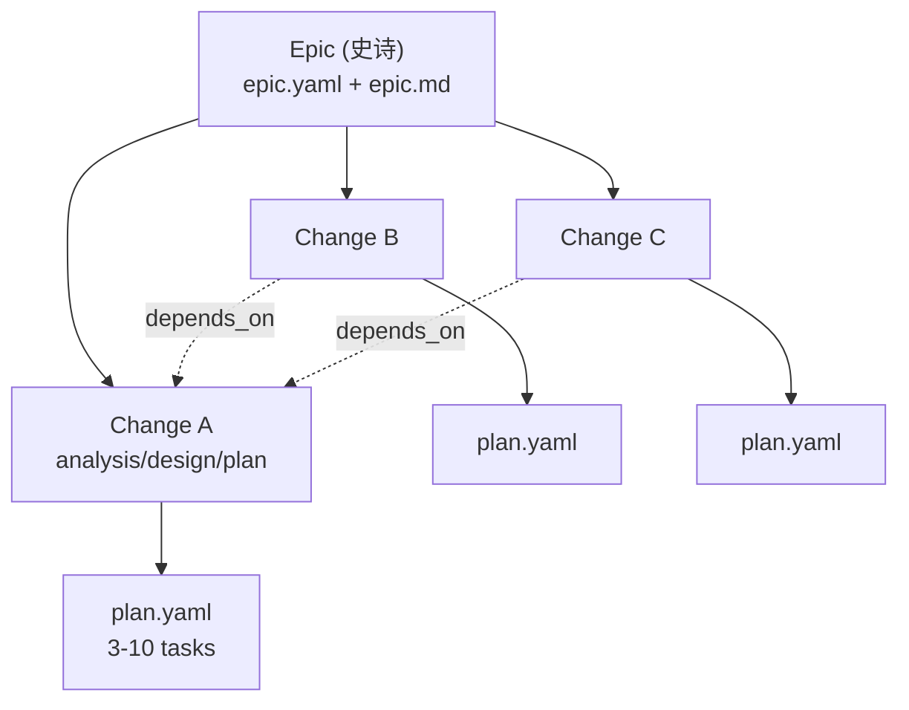
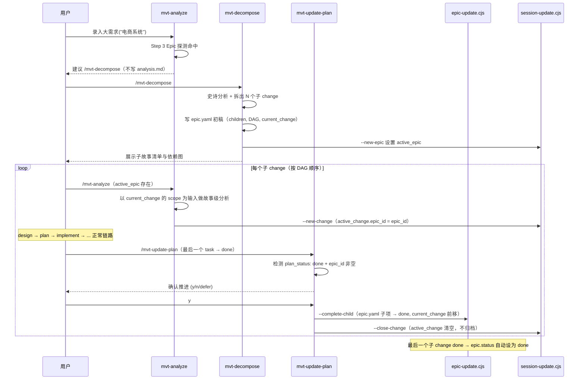
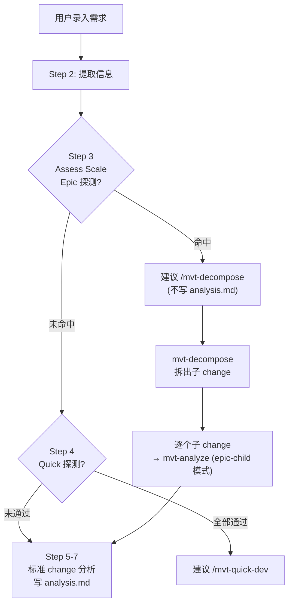

# 优化提案：引入 Epic 分解层与 mvt-decompose 技能

> **提案编号**：OPT-2026-003
> **版本**：v2.1（分析决议同步稿）
> **状态**：草案
> **方案**：在 change 之上新增 Epic 层，并新增 `mvt-decompose` 技能作为大需求入口
> **涉及 Skill**：mvt-decompose（新增）、mvt-analyze、mvt-update-plan、mvt-status、mvt-resume、mvt-cleanup、mvt-help
> **涉及文件**：`sources/skills/mvt-decompose/*`（新增）、`sources/scripts/epic-update.js`（新增）、`sources/scripts/session-update.js`、`sources/defaults/session.yaml`、`registry.yaml`、`build-scripts.js`、多个 `sources/skills/*/business.md`、新增模板 `sources/templates/decompose-output.md`
> **作者**：xiangjie
> **关联**：复用 [[mvt-determinism-decisions]]（结构化文件的状态变更由脚本而非 LLM 改写）、[[mvt-multiproject-registry-scope]]、[[mvt-design-principle-options-over-params]]

> **v2 相对早期草案的两点变化**：
> 1. **单阶段实施**：取消原"Phase 1 / Phase 2"分期，整个 Epic 层作为一次完整交付落地（见 §11）。
> 2. **取消小数步号**：MVTT 不允许 `Step 3.5` 这类小数步号。Epic 探测作为**整数 Step 3「Assess Scale」**插入 `mvt-analyze`，置于 Quick Path 之前，原 Step 3–6 顺延为 Step 4–7（见 §7、§8）。
>
> **v2.1 分析决议同步**（2026-06-08）：
> 3. **Epic 推进机制改为 plan-done 触发**（§4.3、§4.4、§8、§11、§12 #4）：推进由 `/mvt-update-plan` 检测 `plan_status: done` + `epic_id` 非空时触发（确认式 y/n/defer），不再依赖 cleanup。`plan-update.cjs` 不改，epic 感知全在技能层。cleanup 职责简化为纯归档。
> 4. **epic.yaml status 枚举简化**（§4.2.1）：移除 `planning`，枚举为 `in_progress | done | abandoned`。
> 5. **`--add-child` 采用 multi-flag 语法**（§9.2）：`--add-child <id> --child-title <title> --child-scope <scope> [--child-depends-on <a,b>]`。

---

## 1. 故事背景

MVTT 当前以 `/mvt-analyze` 作为一次开发任务的入口。整条工作流链路对"需求"的内建假设是：**一个 change ≈ 一个 user story 或小型 epic**。


当用户录入的是一个 **epic / initiative 级别**的庞大需求时——例如"我想创建一个电商系统""根据这份设计手册实现整个平台"——`mvt-analyze` 没有别的处理路径，只能把它当成一个普通 change，硬塞进这个单层模型，于是后续拆分、设计、实现全部建立在一个被压平的、范围失控的 change 之上，导致整个开发过程混乱、不清晰。

---

## 2. 现有问题

### 2.1 现象

录入大需求后：

- `mvt-analyze` 仍产出**单份** `analysis.md`，把一个本应包含多个用户故事的史诗压平成一篇文档；
- `active_change`（见 `session.yaml`）是**单数**字段，同一时刻只能承载一个 change，无法表达"电商系统"下面并列的多个子需求；
- 到了 `mvt-plan-dev`，要么在 **3-10 任务硬上限**处截断（丢任务），要么撞上技能里写的那句"超了就 propose phasing into multiple plans"——而这是个**无人接管的死胡同建议**：框架里没有任何技能或数据结构去管理"多个 plan / 多个阶段"。

### 2.2 根因分析

根因不是"识别错了"，而是 **MVTT 只有一个粒度层级**。三处证据：

**缺陷 A —— 缺少 change 之上的层级。**
`session.yaml` 只有 `active_change`（单数）+ `changes[]`（历史快照）。没有任何结构表达"一个大需求包含多个 change，以及它们之间的关系与整体进度"。

**缺陷 B —— mvt-analyze 只有向下的逃生口。**
`sources/skills/mvt-analyze/business.md` 的 Quick Path Detection 能探测"需求太小 → 路由到 `/mvt-quick-dev`"，但**没有对称的向上探测**——大需求来了无处可去，只能继续走标准 change 流程。

**缺陷 C —— plan-dev 的"分阶段"建议没有承载体。**
`mvt-plan-dev` 在任务超 10 时建议 "phasing into multiple plans"，但框架没有 epic.yaml 之类的结构来跟踪这些阶段/计划之间的关系，建议落空。

### 2.3 影响

| 维度 | 缺口带来的影响 |
|------|----------------|
| 清晰度 | 大需求被压成单层 change，范围边界模糊，AI 与用户都说不清"当前在做整体的哪一块" |
| 进度跟踪 | 无法回答"电商系统整体完成了几个子需求"，只能看到单个 change 的 plan 进度 |
| 可恢复性 | `mvt-resume` 只能恢复 active_change，无法还原"我在哪个史诗的哪个故事上" |
| 与设计甜区错配 | 每个子需求本应各自落在 analyze→design→plan(3-10 任务) 的甜区，现在全挤在一个 change 里 |

---

## 3. 设计目标与非目标

### 3.1 目标

1. 引入真正的两级层次：**Epic（史诗）→ Change（变更/用户故事）**。
2. 新增 `mvt-decompose` 技能，作为**大需求的专用入口**：把 epic 级需求分解为一组**右尺寸的子 change**。
3. 让每个子 change 仍走原有的 `analyze → design → plan → implement` 链路，粒度刚好落在框架设计甜区。
4. 持久化 epic 状态，使整体进度可跟踪、可跨会话恢复。
5. `mvt-analyze` 获得**对称的向上探测门**：检测到 epic 级输入时引导用户去 `mvt-decompose`（镜像现有 quick-dev 向下探测）。

### 3.2 非目标

- **不支持多级嵌套**：只有 Epic → Change 两级，Epic 之下不再有子 Epic（与现有工作流"一层即可"的取向一致）。
- **不改变单个 change 的内部流程**：analyze/design/plan/implement/review/test 的职责与产物不变。
- **不强制**：小需求、普通 user story 仍直接走 `mvt-analyze`，完全不受影响。Epic 层是**可选上层**。

---

## 4. 架构设计

### 4.1 概念模型



- **Epic** 是 change 之上的新顶层概念，**不是**一种特殊的 change（避免重载 change 语义，见 ADR-1）。
- 每个 **子 Change** 仍是标准 change，存活在标准路径 `artifacts/{change-id}/`，由 epic.yaml 通过 `change_id` 引用（**扁平、不嵌套**，把改动面降到最小，见 ADR-4）。
- Epic 维护子 change 之间的 `depends_on` DAG 与整体状态。

### 4.2 数据结构

#### 4.2.1 新增产物 `epic.yaml`

路径：`.ai-agents/workspace/artifacts/{epic-id}/epic.yaml`

```yaml
version: 1
epic_id: "epic-20260608-ecommerce-platform"
title: "电商系统"
created_at: "2026-06-08T10:00:00Z"
updated_at: "2026-06-08T10:00:00Z"
status: in_progress          # in_progress | done | abandoned
vision: >
  构建一个支持商品浏览、下单、支付的电商平台 MVP。
current_change: "20260608-user-auth"   # 当前激活的子 change（单指针）
children:
  - change_id: "20260608-user-auth"
    title: "用户认证"
    status: active             # pending | active | done | abandoned
    depends_on: []
    project: ["default"]       # 可选的项目归属提示（多项目工作区时有意义）
    scope: >
      注册、登录、会话管理。为后续所有需要鉴权的故事提供前置能力。
    completed_at: null
  - change_id: "20260608-product-catalog"
    title: "商品目录"
    status: pending
    depends_on: ["20260608-user-auth"]
    project: ["default"]
    scope: >
      商品的增删改查与分类浏览。
    completed_at: null
```

#### 4.2.2 新增产物 `epic.md`

路径：`.ai-agents/workspace/artifacts/{epic-id}/epic.md`（叙述性史诗分析，由模板 `decompose-output.md` 定义章节）。建议章节：

- `Vision` —— 一段话愿景与业务目标
- `Scope & Out of Scope` —— 边界
- `Cross-cutting Concerns` —— 贯穿所有子故事的横切关注点（鉴权、日志、多语言等）
- `Child Stories` —— 子 change 一览表（与 epic.yaml 对应）
- `Dependency Map` —— 子 change 依赖关系（mermaid）
- `Open Questions` —— 待澄清项

#### 4.2.3 `session.yaml` 扩展

在 `sources/defaults/session.yaml` 新增 `active_epic` 与 `epics[]`，与现有 `active_change` / `changes[]` 平行：

```yaml
active_epic:
  id: ""
  title: ""
  created_at: ""
  epic_path: ""          # 指向 epic.yaml
epics: []                # 历史快照，结构与 changes[] 平行
  # - id: "epic-20260608-ecommerce-platform"
  #   title: "电商系统"
  #   epic_path: ".ai-agents/workspace/artifacts/epic-20260608-ecommerce-platform/epic.yaml"
  #   status: "active"   # active | done | abandoned
  #   updated_at: "..."
```

并在 `active_change` 增加**可选**字段 `epic_id`，让恢复时能反查父史诗：

```yaml
active_change:
  id: ""
  title: ""
  created_at: ""
  plan_path: ""
  epic_id: ""            # 新增：若该 change 属于某 epic，记录其 id（如 epic-20260608-...）；否则为空
```

> **命名约定**（见 ADR-7）：epic-id 格式为 `epic-{YYYYMMDD}-{slug}`，子 change-id 仍为 `{YYYYMMDD}-{slug}`。`epic-` 前缀让 `artifacts/*` 在不打开目录的前提下即可区分 epic 与普通 change。
> **归档语义**（见 ADR-8）：epic 归档后不维护 `epic_id` 反查；`active_change.epic_id` 仅在活跃期有意义，指向已归档 epic 时悬空可接受。

### 4.3 生命周期



关键点：

- **`mvt-decompose` 只负责史诗级分析与拆分**，不替子 change 做需求分析。
- **每个子 change 仍从 `mvt-analyze` 进入**——但当 `active_epic` 存在且尚无 `active_change` 时，`mvt-analyze` 进入"epic-child 模式"：以 `epic.yaml.current_change` 对应子项的 `scope` 作为需求输入，做该子故事的标准分析，并把新建 change 的 `epic_id` 指回史诗。
- **epic.yaml 的初稿由 mvt-decompose（LLM）写出，后续状态推进由脚本 `epic-update.cjs` 完成**（见 ADR-2，对齐 plan.yaml 先例与 [[mvt-determinism-decisions]] 原则）。
- **Epic 推进由 `/mvt-update-plan` 触发**（非 cleanup）：当 `plan-update.cjs` 输出 `plan_status: "done"` 且 `active_change.epic_id` 非空时，技能层询问用户确认（y/n/defer），`y` 则调用 `epic-update.cjs --complete-child` + `session-update.cjs --close-change`（关闭但不归档）。`plan-update.cjs` 本身不改，epic 感知逻辑全在技能层。

#### epic-child 模式的输入源仲裁

epic-child 模式下，`mvt-analyze` 的需求输入有两个可能来源（用户消息 / epic.yaml 注入），优先级与冲突按下表处理——遵循 [[mvt-design-principle-options-over-params]]，探测后给选择而非武断：

| 情形 | 用户消息 | 处理 |
|------|----------|------|
| A | 为空 | 自动以 `current_change` 对应子项的 `scope` 作为需求输入，直接做该子故事分析 |
| B | 非空，且语义上是对 `current_change` 子故事的**细节补充** | 以用户消息为主、`scope` 为背景，合并后做 `current_change` 的分析 |
| C | 非空，且明显指向**另一个子 change**（如 current 指向"用户认证"，用户说"我想先做支付模块"） | 见下方乱序仲裁 |

**情形 C 的乱序仲裁**：

1. 在 epic.yaml 的 `children` 中定位用户所指子 change。
2. **若该子 change 的 `depends_on` 尚有未完成的前置**：警告"X 依赖尚未完成的 Y/Z，建议先做前置；仍要强制跳序吗？(y / n)"。
3. **若依赖已满足、只是顺序靠后**：提示"当前 epic 的下一个子 change 是 A，你要改做 B 吗？(y=改做 B / n=继续 A)"。
4. 用户确认跳序 → 调用 `epic-update.cjs --set-child-status <target> active`（并把原 current 子项退回 pending），重新对齐 `current_change` 后再分析。
5. 用户指向的目标**不在** children 列表 → 提示该需求不属于当前 epic，询问是否作为独立 change（退出 epic-child 模式）或追加为新子 change（`--add-child`）。

### 4.4 Epic 待续态（epic-pending）

一个子 change 的 plan 全部完成、`/mvt-update-plan` 经用户确认后调用 `epic-update.cjs --complete-child` + `session-update.cjs --close-change`（关闭但不归档），把 `current_change` 前移到下一个 pending 子项后，会出现一个必须显式定义的**一等中间态**：

> **判定条件**：`session.active_epic` 非空 **且** `session.active_change.id` 为空（且 `epic.yaml.status != done`）。

这个态意味着"史诗在进行中，上一个子故事已收尾，下一个子故事尚未通过 `/mvt-analyze` 启动"。若不显式定义，"跨会话可恢复"会在子 change 交界处断裂。三个技能必须统一对齐：

| 技能 | 在 epic-pending 态下的行为 |
|------|----------------------------|
| `mvt-status` | 显示"史诗 X 进行中（n/N done）→ 下一个子 change 是 Y（`current_change`），运行 `/mvt-analyze` 开始"。不报"无活动变更"。 |
| `mvt-resume` | **active_change 为空时回退读 `epic.yaml`**：以 `active_epic.epic_path` → `current_change` 指向的子项 `scope` 重建落点，引导 `/mvt-analyze`（epic-child 模式）。不能只依赖 active_change.epic_id（此刻 active_change 整体为空）。 |
| `mvt-help` | next-skill 决策表命中此态 → 推荐 `/mvt-analyze` 起始下一个子故事。 |

---

## 5. 架构决策记录（ADR）

### ADR-1：Epic 是新的顶层概念，不是特殊的 change

- **Context**：可以选择把 epic 实现为"带子任务的大 change"来复用现有 change 机制。
- **Decision**：新增独立的 Epic 层（`active_epic` / `epics[]` / `epic.yaml`），与 change 平行。
- **Alternatives**：复用 change + 在 plan.yaml 里加 phase 分组。
- **Rejection reason**：phase 分组方案直接违背 `mvt-plan-dev` "每个任务单技能可完成、3-10 任务"的核心约束，且会让单个 plan.yaml 膨胀到难以维护，`active_change` 单数瓶颈依然存在。
- **Consequences**：(+) 语义清晰、整体进度可跟踪；(-) 需新增数据结构与一个脚本。

### ADR-2：epic.yaml 由 LLM 写初稿、epic-update.cjs 负责后续状态变更

- **Context**：epic.yaml 含状态机（child status、current_change 指针、DAG 校验），与 plan.yaml 高度同构。需厘清"初次创作"与"后续变更"分别由谁负责。
- **Decision**：**对齐 `plan.yaml` 既有先例**——
  - **初稿**由 `mvt-decompose`（LLM）直接写出（正如 `mvt-plan-dev` 的 SKILL.md「Write plan.yaml」步骤是 LLM 写的），写前自校验 §9.2 的清单（唯一 change_id / DAG / 单 active）；
  - **后续状态变更**由新增的 `sources/scripts/epic-update.js`（打包为 `.ai-agents/scripts/epic-update.cjs`）承担：`--complete-child`、`--set-child-status`、current_change 推进、`--add-child`。LLM 不在初稿之后手改这些结构性状态字段。
- **Alternatives**：(a) 让脚本通过 `--init` 接收未落盘的 children 数据并写出初稿；(b) 让各技能在初稿后也用 LLM 直接编辑状态字段。
- **Rejection reason**：
  - **否决 (a) `--init`**：`plan.yaml` 的初稿从来是 LLM 写的、`plan-update.cjs` 只做变更——[[mvt-determinism-decisions]] 的"结构化文件由脚本而非 LLM 改写"约束的是**状态推进**，不是**初次创作**。让脚本接收复杂 children 数据反而要新引入 CLI/stdin/临时文件传参，既无先例又自找麻烦。
  - **否决 (b)**：初稿之后的状态推进若交回 LLM，才是真正违背确定性原则，易产生破损 YAML / 非法状态机。
- **Consequences**：(+) 与 plan.yaml 完全同构、无新传参机制、状态变更确定性可测（vitest）；(-) 需在 `build-scripts.js` 增加打包入口并编写测试。可选保留 `epic-update.cjs --validate <path>` 供 LLM 写后兜底校验，但它不承担"接收 children 数据写初稿"。

### ADR-3：mvt-analyze 增加对称的"向上探测门"（整数 Step）

- **Context**：现有 Quick Path Detection（原 Step 3）只能向下路由到 quick-dev。
- **Decision**：在 `mvt-analyze/business.md` 中**新增整数 Step 3「Assess Scale（Epic Detection）」**，置于 Quick Path Detection 之前；命中即停止标准流程、不写 analysis.md，引导用户去 `/mvt-decompose`（与 quick-dev 分支完全对称）。原 Step 3–6 顺延为 Step 4–7。
- **Alternatives**：让用户记住"大需求要先 decompose"。
- **Rejection reason**：违背 [[mvt-design-principle-options-over-params]]——应由框架探测并主动给出选择，而非要求用户预先知道。
- **Consequences**：(+) 入口统一，用户始终从 `mvt-analyze` 进入；(-) `mvt-analyze` 逻辑略增、下游步骤需顺延编号。

> **关于步号**：MVTT 不允许 `Step 3.5` 这类小数步号。Epic 探测必须落为整数 Step，并相应顺延后续步骤。

### ADR-4：子 change 扁平存放，epic.yaml 以 change_id 引用

- **Context**：子 change 产物可以嵌套在 `artifacts/{epic-id}/{change-id}/` 下，或保持扁平 `artifacts/{change-id}/`。
- **Decision**：保持**扁平**，epic.yaml 的 `children[].change_id` 做引用。
- **Alternatives**：嵌套目录。
- **Rejection reason**：嵌套会改变全框架到处硬编码的路径约定 `artifacts/{change-id}/analysis.md`，改动面巨大。
- **Consequences**：(+) 改动面最小，所有现有技能的路径逻辑不变；(-) epic-id 与 change-id 共享 `artifacts/` 命名空间，需保证可区分（区分方案见 ADR-7）。

### ADR-5：单活动子 change 指针，依赖以 DAG 表达

- **Context**：epic 下的子 change 是否允许并行推进。
- **Decision**：采用**单 `current_change` 指针**，子 change 间用 `depends_on` 形成 DAG，按拓扑顺序逐个激活。
- **Alternatives**：允许多个子 change 同时 active。
- **Rejection reason**：与现有 `active_change` 单数模型一致，避免一次性引入并行复杂度。
- **Consequences**：(+) 简单、与现状一致；(-) 暂不支持并行多故事（列为未来增强）。

### ADR-6：多项目下 epic 与 change 的项目归属

- **Context**：epic 可能跨多个项目（前端 + 后端）。
- **Decision**：epic 本身**项目无关**；项目归属在子 change 层解决——`epic.yaml.children[].project` 仅作提示，真正的项目作用域仍由各子 change 的 plan.yaml `task.project` 与现有 PS 解析逻辑决定（复用 [[mvt-multiproject-registry-scope]]）。
- **Consequences**：(+) 不与现有多项目模型冲突；(-) epic 层不强约束项目，跨项目协调仍靠子 change 的 depends_on。

### ADR-7：epic-id 采用 `epic-` 前缀实现路径级区分

- **Context**：epic 与 change 共享 `artifacts/` 命名空间，需要一种方式让框架在不打开目录的前提下区分二者。现有逻辑（已核实）从不解析目录名结构——目录名是**不透明键**，仅与 `session` 中存储的 id 做字符串相等匹配（`mvt-cleanup` 据此分类 `active / in-recent-changes / unindexed`）。
- **Decision**：epic-id 格式为 **`epic-{YYYYMMDD}-{slug}`**（如 `epic-20260608-ecommerce-platform`），并原样写入 `session.active_epic.id`。子 change 仍用 `{YYYYMMDD}-{slug}`。
- **Alternatives**：
  - (a) 用户最初设想的 `[E]` 方括号前缀；
  - (b) 不加前缀、在 epic.yaml 内置 `type: epic` 标记（内容级区分）。
- **Rejection reason**：
  - **否决 `[E]`**：`[` `]` 是 glob 字符类元字符，`artifacts/[E]*` 会被解释为"字符 E"而非字面量；且方括号在 bash/PowerShell 常需转义、排序混乱、与现有 `_archived` 下划线约定不一致。
  - **否决纯内容级标记**：靠"目录内有 `epic.yaml` 还是 `analysis.md`"判定需逐个打开目录，是 O(打开) 而非 O(读名)；任何遍历 `artifacts/*` 的脚本都要付额外 IO。
  - `epic-` 是纯 kebab-case，与 `{YYYYMMDD}-{slug}` 同族、无 glob 风险、排序自然、肉眼可辨。
- **Consequences**：
  - (+) 路径级区分，遍历 `artifacts/*` 无需打开目录即可定类型；
  - (-) 需同步修改 id 生成规则——`mvt-decompose` 生成 epic-id 时加 `epic-` 前缀（对照 `mvt-analyze/business.md` 的 change-id 规则），并确保前缀完整写入 `session.active_epic.id`，否则前缀与匹配会对不上。

### ADR-8：归档语义——建议成套归档，归档即放弃引用

- **Context**：epic 完成后需归档到 `_archived/`；epic 与其子 change 是**扁平分散**的目录（ADR-4），且归档后是否还要维护 `epic_id` 反查关系。
- **Decision**：
  1. **建议（非强制）成套归档**：归档 epic 时，列出 `epic.yaml.children` 的全部子 change，**建议**用户一并归档；主动权在用户（可选"仅归档 epic / 全部 / 选择性"）。
  2. **归档即放弃引用**：归档后**不维护任何 `epic_id` 反查或引用完整性**。已归档 = 数据退出活跃工作集、不再使用，因此无反查需求。
- **Rejection reason**（被否决的复杂方案）：曾考虑"归档后仍能从 `_archived/` 恢复 epic 反查"，否决——与现有 change 归档语义不符（`mvt-cleanup` 明确将 `_archived/` 排除在 walk 之外，框架从不回头解析已归档目录）。
- **Consequences**：
  - (+) 与现有"归档即遗忘引用"语义完全一致，设计更干净，**无需**为"从已归档目录恢复 epic"设计任何机制；
  - (+) epic 归档时只需清空 `session.active_epic`、在 `epics[]` 标 `done`，足矣；
  - (-) 若用户只归档 epic 而留下子 change，子 change 的 `epic_id` 将指向已归档（不存在于活跃区）的 epic——可接受：该字段仅在活跃期有意义，悬空不影响任何活跃逻辑。

---

## 6. 技能职责定义：mvt-decompose

| 项 | 内容 |
|----|------|
| **角色** | Strategist / Epic Planner（agent 复用 `analyst`，降低改动） |
| **Category** | `workflow` |
| **入口条件** | 用户录入 epic 级需求；或 `mvt-analyze` Step 3 探测后引导而来 |
| **Pre-flight** | session 已初始化、`projects[]` 非空（WARN 级，与 mvt-analyze 一致） |

### 执行流程（business.md）

1. **加载需求**：文件路径参数 → 读取；否则用消息中的需求文本（如设计手册）。
2. **轻量 Sanity Gate**：**不重跑** `mvt-analyze` Step 3 的强/弱信号完整评分（那是上游已做、用户已 `y` 确认的事，重跑会造成"两次 LLM 判断可能不一致 / 问了又说不用"）。这里只做一个**轻量兜底**——仅当输入明显是单文件级小改时才拦，且**不甩矛盾、给选择**（契合 [[mvt-design-principle-options-over-params]] 与 §7"误判可廉价撤销"哲学）：
   > "这个范围更像单个 change。要 (1) 当作只含 1 个子故事的 epic 继续，还是 (2) 直接用 `/mvt-analyze`？"

   > **为何不靠"是否从 analyze 引导而来"分流**：MVTT 技能间没有可靠的路径信号——上游 Epic 探测的 `y` 分支既不写 analysis.md 也不传上下文参数，`mvt-decompose` 无从区分自己是被引导来的还是被直接调用的。因此用"输入本身是否过小"这个**自包含**判据，对两条来路一视同仁，既消掉重复评分，又为直接调用 `/mvt-decompose` 保留安全网。
3. **史诗分析**：提炼愿景、范围/非范围、横切关注点、主要 actor。
4. **分解为子 change**：

   | 规则 | 说明 |
   |------|------|
   | 数量 | 目标 2-8 个子 change。每个子 change 应是"右尺寸"——可被一条 analyze→design→plan(3-10 任务) 链路覆盖 |
   | 单一主题 | 每个子 change 聚焦一个可独立交付的能力切片（如"用户认证""商品目录"） |
   | 显式依赖 | 子 change 间用 `depends_on` 表达；可并行者不设依赖 |
   | 无环 | 依赖图必须是 DAG |
   | 项目归属 | 多项目工作区下为每个子 change 推断 `project` 提示 |

   若拆出 > 8 个，停下提示用户：考虑缩小本期史诗范围，或分多个 epic。
5. **写产物**：`epic.md`（叙述）+ `epic.yaml`（结构）。**epic.yaml 初稿由本技能（LLM）直接写出**（对齐 `mvt-plan-dev` 写 plan.yaml 的先例，见 ADR-2），写前自校验 §9.2 清单（唯一 change_id / DAG / 单 active）；可选调用 `epic-update.cjs --validate <path>` 做写后兜底校验。**不经 `--init`**。
6. **更新会话**：调用 `session-update.cjs --new-epic ... --epic-id ...` 设置 `active_epic`。
7. **输出**：展示子故事清单表 + 依赖 mermaid 图 + 建议的起始子 change。

### 边界

- 不做单个子 change 的需求分析（交给 `mvt-analyze` 的 epic-child 模式）。
- 不做架构设计 / 不写代码。
- 不在初稿之后手改 epic.yaml 结构状态字段（经 `epic-update.cjs`）。

### Suggested Next Steps

- `default` → `/mvt-analyze` —— 开始分析第一个子 change（active_epic 已设，进入 epic-child 模式）。

---

## 7. Epic 探测门（mvt-analyze 新增整数 Step 3「Assess Scale」）

在 `mvt-analyze` 中新增整数 **Step 3「Assess Scale（Epic Detection）」**，置于现有 Quick Path Detection 之前（与附录 A 流程图"先探 Epic 再探 Quick"一致）。原 Step 3–6 顺延为 Step 4–7。两者均为复杂度路由，方向相反：Epic 向上、Quick 向下。

**触发阈值**：**命中任一强信号，或「命中 ≥1 强信号 + ≥2 弱信号」** 才建议 `/mvt-decompose`。弱信号**不作为独立触发条件**——它们只在已有强信号时起佐证作用。

| 类型 | 信号 | 示例 |
|------|------|------|
| 强 | 整系统/整平台范围 | "创建一个电商系统""实现整个平台" |
| 强 | 输入是覆盖多功能的设计手册/规格文档 | "根据这份设计手册实现这个系统" |
| 强 | 可识别出多个相互独立的可交付能力域 | 认证 + 目录 + 购物车 + 支付 |
| 弱（仅佐证） | 涉及多个 actor 的多条独立主流程 | —— |
| 弱（仅佐证） | 没有单一内聚的验收标准，需要多个独立交付物 | —— |

> **为何降权弱信号**：
> - 不采用"预估任务数远超 10"作为信号——它要求 LLM 做它最不擅长的数量预估，同一需求多次调用可能估出 8 或 15，且本提案 §2.2 本就批评过 10 任务硬上限不可靠，拿它当判据自相矛盾。
> - 不用"多个 bounded context"，改为"多个 actor 的多条主流程"——避免 DDD 术语被 LLM 过度解读，把普通模块误当 bounded context。
> - **根本认识**：阈值再怎么调都治不好 LLM 判断的不稳定。真正的安全网是下面那个**可逆的用户确认**：即便误触发，用户一个 `n` 就退回标准流程，代价极低。因此设计重心放在"误判可廉价撤销"，而非追求探测零误差。

**分支**：

| 条件 | 动作 |
|------|------|
| 命中 Epic 探测 | 询问用户："这看起来是一个史诗级需求（涉及多个独立能力域）。是否用 `/mvt-decompose` 先做史诗分解？(y / n / show-signals)" |
| 同时命中 Quick 与 Epic | 不可能（互斥）；按强信号优先 |
| 未命中 | 进入 Step 4（Quick Path Detection），继续标准流程 |

- `y` → 不写 analysis.md，引导 `/mvt-decompose`。
- `n` → 继续标准分析（用户坚持当作单 change）。这是误判的廉价撤销路径，须始终保留。
- `show-signals` → 展示命中的信号，再次询问。

> **边界 case 说明**：诸如"加一套完整 RBAC 权限系统"这类中等规模需求可能落在边界上——拆 2-3 个子 change 也合理。设计上**不追求**把它精确判为 change 或 epic；命中即给可逆选择，由用户一键定夺。

---

## 8. 改动文件清单

> 本仓库从 `sources/` 构建：技能由 `manifest.yaml` 装配为 `.claude/skills/*/SKILL.md`，脚本由 `build-scripts.js` 经 esbuild 打包为 `.ai-agents/scripts/*.cjs`。改动一律落在 `sources/` 源文件。

| 文件 | 类型 | 改动 |
|------|------|------|
| `sources/skills/mvt-decompose/manifest.yaml` | 新增 | 装配清单：frontmatter、role-header(Strategist/analyst)、激活/配置/约束共享段、business.md、next-steps |
| `sources/skills/mvt-decompose/business.md` | 新增 | §6 的执行流程 |
| `sources/templates/decompose-output.md` | 新增 | `epic.md` 章节模板（§4.2.2），构建后落到 `.ai-agents/skills/_templates/decompose-output.md` |
| `sources/scripts/epic-update.js` | 新增 | epic.yaml 的**后续状态变更**：`--complete-child` / `--set-child-status` / current_change 推进 / `--add-child` / 可选 `--validate`（ADR-2：初稿由 LLM 写，脚本不含 `--init`） |
| `build-scripts.js` | 修改 | esbuild `entryPoints` 增加 `sources/scripts/epic-update.js` |
| `sources/scripts/session-update.js` | 修改 | 新增 `--new-epic` / `--epic-id` / `--set-epic-path` / `--set-epic-status` / `--close-epic`；history 与 active_change 增加 `epic_id` 关联；新增参数组合校验（§9.1.1） |
| `sources/defaults/session.yaml` | 修改 | 新增 `active_epic`、`epics[]`，`active_change` 增加 `epic_id` |
| `registry.yaml` | 修改 | 注册 `mvt-decompose`（category: workflow）；经 `src/fs/registry-merge.ts` reconcile 合并到用户 registry（复用 [[mvt-registry-preservation]] 机制，用户自定义技能不丢） |
| `sources/skills/mvt-analyze/business.md` | 修改 | **新增整数 Step 3「Assess Scale（Epic Detection）」（§7），原 Step 3–6 顺延为 Step 4–7**；新增 epic-child 模式（active_epic 存在时以 current_change scope 为输入） |
| `sources/skills/mvt-analyze/manifest.yaml` | 修改 | next-steps 增加"epic 探测命中 → mvt-decompose"分支 |
| `sources/skills/mvt-status/business.md` | 修改 | 展示 active_epic 进度（见 §8.1 输出样例）：史诗级 `n/N done` + 子 change 状态表（status + depends_on）+ **仅对唯一 active 子项**附其内部 plan 阶段（读该子项 plan.yaml；pending 子项无阶段、done 子项已完成）；命中 epic-pending 态（§4.4）时显示"下一个子 change 是 Y，运行 `/mvt-analyze`" |
| `sources/skills/mvt-resume/business.md` | 修改 | 还原史诗上下文。**关键（§4.4 epic-pending 态）**：active_change 非空 → 用 `active_change.epic_id` 反查；**active_change 为空但 active_epic 非空 → 回退读 `epic.yaml.current_change` 重建落点**，引导 `/mvt-analyze`（epic-child 模式） |
| `sources/skills/mvt-cleanup/business.md` | 修改 | 两处（**不再触发 epic 推进**，职责简化为纯归档）：(1) **归档前 epic 完整性检查**——待归档 change 若属于 `status != done` 的 epic，复用现有"归档前警告"模式追加提示，默认偏保守 `n`；(2) **epic 完成归档时建议成套归档**——列出 `children` 全部子 change，给"仅 epic / 全部 / 选择性"选项（ADR-8） |
| `sources/skills/mvt-update-plan/business.md` | 修改 | **新增 epic 推进逻辑**：检测 `plan-update.cjs` 输出的 `plan_status: "done"` + `active_change.epic_id` 非空 → 询问用户 (y/n/defer) → `y` 调用 `epic-update.cjs --complete-child` + `session-update.cjs --close-change`（关闭但不归档）；`n` 不推进；`defer` 标 done 但暂不前移 `current_change`。`plan-update.cjs` 本身不改，epic 感知全在技能层（见 §12 第4问） |
| `sources/skills/mvt-help/business.md` | 修改 | **catalog 展示无需改**——mvt-help 动态读 `registry.yaml > skills` 按 category 分组展示，注册了 mvt-decompose 即自动列出。真正要改的是：**next-skill 决策表**（增加"active_epic 存在但无 active_change → 推荐 `/mvt-analyze` 起始子故事"，即 epic-pending 态）与**工作流 mermaid 图**（加入 epic 维度）|
| `tests/epic-update.test.ts` 等 | 新增 | epic-update.cjs 单测 + session-update epic 参数回归（现有 155 测试需保持绿） |
| `src/types/registry.ts` 等 | 评估 | SkillEntry 已是开放结构，通常无需改；如需 Epic 强类型可加 `src/types/epic.ts` |
| `sources/skills/mvt-sync-context/business.md` | **不改** | 已核实：以 change 为粒度逐个聚合到扁平 project-context.md，对 epic 层天然透明。子 change 完成后照常 sync（见 §10）|

### 8.1 mvt-status epic 视图输出样例

"3/8 done"信息量不足。但**子 change 的内部工作流阶段**只存在于各子项自己的 `plan.yaml`/history，`epic.yaml.children` 不记录；按 ADR-5 单 `current_change` 指针，同一时刻只有**一个** active 子项。故仅对该 active 子项读 plan 展示阶段，pending/done 不虚构阶段：

```markdown
## 史诗：电商系统  (epic-20260608-ecommerce-platform)
进度：2/5 done · 状态 in_progress

| 子 change | status | depends_on | 内部进度 |
|-----------|--------|------------|----------|
| 用户认证 | done | — | — |
| 商品目录 | done | 用户认证 | — |
| 购物车 | active | 商品目录 | plan 3/6 tasks (implement) |
| 订单 | pending | 购物车 | — |
| 支付 | pending | 订单 | — |

→ 当前活动子 change：购物车。继续用 `/mvt-implement` 推进其 plan。
```

epic-pending 态（§4.4，无 active 子项正在执行）下改为：

```markdown
→ 上一个子 change 已完成。下一个子 change：订单。运行 `/mvt-analyze` 开始。
```

---

## 9. session-update.cjs / epic-update.cjs 参数设计

### 9.1 session-update.js 新增参数（与现有风格一致）

| 参数 | 语义 | 对 session.yaml 的作用 |
|------|------|------------------------|
| `--new-epic <title>` + `--epic-id <id>` | mvt-decompose 创建史诗 | 设置 `active_epic.{id,title,created_at,epic_path}`；若旧 active_epic 非空则快照进 `epics[]`（镜像 `--new-change` 行为） |
| `--set-epic-path <path>` | 写入 epic.yaml 路径 | 设置 `active_epic.epic_path` |
| `--set-epic-status <s>` | 更新史诗状态 | 在 `epics[]` 中更新对应条目 status |
| `--close-epic` | 史诗完成 | `epics[]` 对应条目置 done，清空 `active_epic` |
| （现有 `--new-change` 扩展） | 子 change 创建时关联史诗 | 增加可选 `--epic-id`，写入 `active_change.epic_id` 及 history 条目 |

> 实现提示：现有 `parseArgs` / 各 `if (args["..."])` 分支模式可直接复用（见 `session-update.js` 的 main()），新增分支与 `--new-change` / `--close-change` 同构，风险低。

#### 9.1.1 参数组合校验

保留**扁平 flag**（与 change 参数 `--new-change`/`--close-change` 一致；不引入 `epic` 子命令模式，避免部分迁移破坏一致性）。为治"参数组合爆炸"，在 `parseArgs` 后增加一组**互斥/依赖校验**，非法组合直接报错退出（非零退出码）：

| 规则 | 说明 |
|------|------|
| `--new-epic` 依赖 `--epic-id` | 二者必须同时出现（镜像 `--new-change` + `--change-id`） |
| `--close-epic` 互斥 `--new-epic` | 不能在同一次调用里既开新史诗又关史诗 |
| `--set-epic-path` / `--set-epic-status` 依赖活跃或指定的 epic | 无 `active_epic` 且未同时新建时报错 |
| `--epic-id`（用于子 change 关联）依赖 `--new-change` | 单独出现无意义 |

> 子命令化（`session-update.cjs epic ...`）作为独立技术债另行评估，不进本提案。

### 9.2 epic-update.js 子命令（镜像 plan-update.cjs，无 `--init`）

> **设计对齐**（ADR-2）：与 `plan-update.cjs` 完全同构——**初稿由 LLM（mvt-decompose）写出**，脚本**只负责后续状态变更**。不提供 `--init`（避免引入"接收未落盘 children 数据"的传参难题）。

| 调用 | 作用 |
|------|------|
| `--validate <path>`（可选） | 仅校验既有 epic.yaml（不写入），供 mvt-decompose 写初稿后兜底调用 |
| `--complete-child <change_id>` | 将子 change 置 done、记 completed_at，按 DAG 推进 `current_change` 到下一个可执行子项 |
| `--set-child-status <change_id> <status>` | 显式置状态（pending/active/done/abandoned） |
| `--add-child <change_id> --child-title <title> --child-scope <scope> [--child-depends-on <a,b>]` | 史诗中途追加子 change（multi-flag 语法） |

校验项（mvt-decompose 写初稿前自校验、`--validate` 与各变更子命令写入前复校，借鉴 plan-dev 校验步骤）：唯一 change_id、depends_on 引用有效、无环（DAG）、current_change 指向 pending/active 子项、至多一个 active 子项。

---

## 10. 与现有机制的兼容性

| 现有机制 | 兼容性 |
|----------|--------|
| 普通 user story 走 mvt-analyze | **完全不变**。Epic 层是可选上层，未命中探测门则零影响 |
| 单项目工作区 | 不受影响；epic 的子 change 用 `project: ["default"]` |
| 多项目工作区 | 复用现有 PS 解析与 [[mvt-multiproject-registry-scope]]，epic 层不引入新的项目作用域规则 |
| registry 用户自定义技能 | 经 `registry-merge.ts` reconcile 合并，复用 [[mvt-registry-preservation]]，用户技能与知识绑定保留 |
| 现有 155 测试 | 新增参数为增量分支，旧路径不变；需补 epic 相关测试并保持全绿 |
| 已有 plan.yaml / change | 旧数据无 epic_id 字段，读取按"无史诗"处理，向后兼容 |
| mvt-analyze 既有步号引用 | 新增 Step 3 后原 Step 3–6 顺延为 4–7；需检查 manifest/模板/文档中对旧步号的引用并同步更新 |
| `mvt-sync-context` | **无需改动**（已核实 `business.md`）。该技能以 change 为粒度：消费 `changes[].status: done`、逐个聚合知识到扁平的 `project-context.md`，不感知任何上层结构。子 change 就是普通 change，完成后照常被 sync。扁平聚合模型对 epic 层天然透明 |

---

## 11. 实施范围（单阶段交付）

整个 Epic 层作为**一次完整交付**落地（不分期）。下表给出建议的构建顺序——按依赖从底层数据/脚本到技能编排，最后补测试，便于每步验证；但全部属于同一交付，缺任一项 epic 流程都不闭环。

| 顺序 | 工作项 | 说明 |
|------|--------|------|
| 1 | `session.yaml` 结构扩展 + `session-update.js` epic 参数与组合校验 | 数据底座；§4.2.3、§9.1 |
| 2 | `epic-update.js`（后续状态变更）+ `build-scripts.js` 打包入口 | 状态机脚本；ADR-2、§9.2 |
| 3 | `mvt-decompose` 技能（manifest + business + 模板）| 大需求入口，写 epic.yaml 初稿；§6 |
| 4 | `mvt-analyze` 新增整数 Step 3 探测门 + epic-child 模式 + 步号顺延 | 向上探测与子 change 分析；§7、ADR-3 |
| 5 | `mvt-status` / `mvt-resume` / `mvt-help` 对齐 epic-pending 态 | 跨会话可见与可恢复闭环；§4.4、§8.1 |
| 6 | `mvt-update-plan` epic 推进逻辑 + `mvt-cleanup` 两处改动（完整性检查 / 成套归档建议） | 推进归 update-plan（plan-done 触发）；cleanup 简化为纯归档；§8、§12 #4 |
| 7 | 测试：epic-update 单测 + session-update 回归，现有 155 测试保持绿 | §10 |

> **为何不分期**：早期草案曾设想"先做轻量探测门、后补持久化"，但若 epic 状态不落盘、子 change 交界处（epic-pending 态）不闭环，"跨会话可恢复 + `/mvt-status` 可见进度"这两个核心价值就不成立——只产出文档而无状态承载，反而留下半成品。故合并为单阶段，一次交付完整闭环。

---

## 12. 决策结论

| # | 问题 | 结论 | 依据 |
|---|------|------|------|
| 1 | agent 角色：analyst vs strategist | **复用 `analyst`** | 新增角色需改 registry 的 agent 映射，analyst 的"分析+结构化"能力已覆盖 decompose 需求 |
| 2 | 子 change 数量上限 | **WARN 不 BLOCK**：>8 提示"考虑缩小范围或拆多个 epic"，允许继续 | 硬阻止会卡死复杂项目；与框架现有 WARN/BLOCK 分级一致 |
| 3 | epic-id 命名 | **加 `epic-` 前缀**（如 `epic-20260608-ecommerce-platform`），见 ADR-7 | epic 与 change 共享 `artifacts/` 命名空间，`epic-` 前缀实现**路径级**区分（遍历无需打开目录）。已否决 `[E]`（glob 字符类冲突）与纯内容级 `type` 标记（需逐目录打开） |
| 4 | 子 change 推进时机 | **在 `/mvt-update-plan` 检测到 plan done 时推进**（确认式 y/n/defer），同时 `--close-change`（关闭但不归档） | cleanup 是可选维护操作，不应承载核心流程推进；plan done 是子 change 完成的最早可靠信号；确认推进给用户选择权（可先做 review/test/sync）；`plan-update.cjs` 不改，epic 感知全在技能层 |
| 5 | epic.yaml 初稿由谁写 | **LLM（mvt-decompose）写初稿，脚本只做后续变更**，见 ADR-2 | 对齐 plan.yaml 既有先例：[[mvt-determinism-decisions]] 约束的是**状态推进**而非**初次创作**。故 `epic-update.cjs` 无 `--init` |
| 6 | epic 归档方式 | **建议成套归档 + 归档即放弃引用**，见 ADR-8 | 归档 epic 时建议（非强制）一并归档全部子 change；归档后不维护 `epic_id` 反查，与现有"归档即遗忘引用"语义一致，无需恢复机制 |
| 7 | 实施分期 | **单阶段交付**，见 §11 | 状态不落盘 / 交界态不闭环则核心价值不成立，分期会留半成品 |
| 8 | 步号形式 | **Epic 探测落为整数 Step 3，原 3–6 顺延为 4–7**，见 §7、ADR-3 | MVTT 不允许小数步号（如 `Step 3.5`） |

---

## 附录 A：mvt-analyze 入口决策图（改造后）


