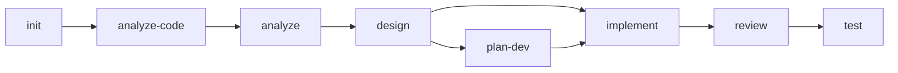

## Execution Flow

### Step 1: Load Current State
- Read session.yaml: check initialization, active change, phase progress
- Read project-context.yaml: check projects list and completeness
- Check if project-context.md exists

### Step 2: Assess User Position
Determine where the user is in the workflow and what to recommend:

| Condition | Recommendation |
|-----------|---------------|
| Not initialized | `/mvt-init` -- Initialize the project |
| Initialized, no semantic context | `/mvt-analyze-code` -- Analyze existing code |
| No requirements | `/mvt-analyze` -- Analyze requirements |
| Requirements exist, no architecture | `/mvt-design` -- Design architecture |
| Architecture exists, change is large | `/mvt-plan-dev` -- Decompose into tracked plan |
| Architecture exists (or plan ready), not implemented | `/mvt-implement` -- Implement the design |
| Implemented, not reviewed | `/mvt-review` -- Review the code |
| Reviewed, not tested | `/mvt-test` -- Write tests |
| All phases complete | `/mvt-cleanup` or start new feature |

### Step 3: Display Skills Catalog
Read `registry.yaml` > `skills` section.
Group skills by `category` field and display as tables:
- `workflow` → "Workflow Skills (sequential phases)"
- `shortcut` → "Shortcut Skills (anytime, no prerequisites)"
- `project` → "Project Management Skills"
- `utility` → "Utility Skills"

For each skill, show: `/{skill-name}` | `description` field from registry.
Sort within each group by declaration order in registry.

### Step 4: Show Workflow Diagram
Display the standard workflow with current position highlighted:

Color-code based on current progress: green (done), yellow (current/recommended), gray (pending).

### Step 5: Respond to User Questions
- If user asks about a specific skill -> Provide usage details for that skill
- If user asks "what should I do next" -> Give contextual recommendation based on Step 2
