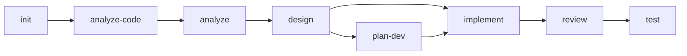

## Execution Flow

### Step 1: Load Current State
- Read session.yaml: check initialization, active change, phase progress
- Read project-context.yaml: check projects list and completeness
- Check if project-context.md exists

### Step 2: Assess User Position
Determine where the user is in the workflow and what to recommend:

| Condition | Recommendation |
|-----------|---------------|
| Not initialized | `/mvt-init` -- Initialize the project |
| Initialized, no semantic context | `/mvt-analyze-code` -- Analyze existing code |
| No requirements | `/mvt-analyze` -- Analyze requirements |
| Requirements exist, no architecture | `/mvt-design` -- Design architecture |
| Architecture exists, change is large | `/mvt-plan-dev` -- Decompose into tracked plan |
| Architecture exists (or plan ready), not implemented | `/mvt-implement` -- Implement the design |
| Implemented, not reviewed | `/mvt-review` -- Review the code |
| Reviewed, not tested | `/mvt-test` -- Write tests |
| All phases complete | `/mvt-cleanup` or start new feature |

### Step 3: Display Skills Catalog
Show all available skills grouped by category:

**Workflow Skills** (sequential phases):
| Skill | Description |
|-------|-------------|
| `/mvt-analyze` | Analyze requirements and extract domain concepts |
| `/mvt-analyze-code` | Analyze existing code to generate project-context.md |
| `/mvt-design` | Create architecture design based on requirements |
| `/mvt-plan-dev` | Decompose a large change into a tracked plan.yaml (optional, for big features) |
| `/mvt-implement` | Implement features based on architecture design |
| `/mvt-review` | Code review for quality and standards compliance |
| `/mvt-test` | Generate tests to validate implementations |

**Shortcut Skills** (anytime, no prerequisites):
| Skill | Description |
|-------|-------------|
| `/mvt-fix` | Diagnose and fix bugs or issues |
| `/mvt-refactor` | Refactor code while preserving behavior |

**Project Management Skills**:
| Skill | Description |
|-------|-------------|
| `/mvt-init` | Initialize or refresh project setup |
| `/mvt-status` | Show current project and workflow status |
| `/mvt-config` | Manage framework configuration |
| `/mvt-sync-context` | Synchronize context with code changes |
| `/mvt-cleanup` | Clean up workspace artifacts |
| `/mvt-update-plan` | Mark a plan task done/blocked/skipped and advance current_task |

**Utility Skills**:
| Skill | Description |
|-------|-------------|
| `/mvt-help` | Show this help information |
| `/mvt-resume` | Resume an in-progress task in a new conversation (reads session state) |
| `/mvt-create-skill` | Create custom MVTT skills through guided workflow |
| `/mvt-manage-context` | Add, remove, move, rename, or list knowledge entries (with AI routing) |
| `/mvt-check-context` | Analyze context token load and optimization |
| `/mvt-template` | View, customize, and manage output templates |

### Step 4: Show Workflow Diagram
Display the standard workflow with current position highlighted:

Color-code based on current progress: green (done), yellow (current/recommended), gray (pending).

### Step 5: Respond to User Questions
- If user asks about a specific skill -> Provide usage details for that skill
- If user asks "what should I do next" -> Give contextual recommendation based on Step 2
