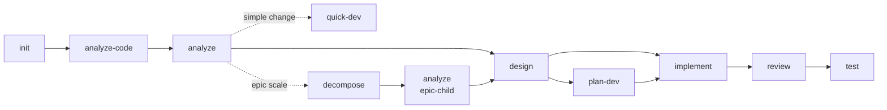

## Execution Flow

### Step 1: Load Inputs
- **Recommended**:
  - `.ai-agents/knowledge/project/_generated/project-context.md` -- existence check only, to detect whether semantic context has been generated.
- **Fallback**: any missing optional file is treated as "feature absent" for assessment purposes; do not abort. If `registry.yaml` itself is missing, surface the error and recommend `mvtt install`.

### Step 2: Assess User Position
- **What**: pick exactly one recommended next skill based on the current workspace state.
- **How**: walk the table top-to-bottom; the first row whose condition holds wins.

  | Condition | Recommendation |
  |-----------|---------------|
  | `.ai-agents/workspace/session.yaml` missing or `initialized_at` empty | `/mvt-init` -- Initialize the project |
  | Initialized AND `project-context.md` does not exist | `/mvt-analyze-code` -- Analyze existing code |
  | `active_epic.id` non-empty AND `active_change.id` empty (epic-pending) | `/mvt-analyze` -- Start the next sub-change in the epic |
  | No requirements (no `analysis.md` for active change AND no completed `/mvt-analyze` in `history`) | `/mvt-analyze` -- Analyze requirements |
  | No requirements, but user describes a simple change directly | `/mvt-quick-dev` -- Implement a simple change quickly |
  | Requirements present, no `design.md` | `/mvt-design` -- Design architecture |
  | `design.md` exists, change is large (Change Tracking lists > 5 files OR ADR includes breaking change OR > 1 new module) | `/mvt-plan-dev` -- Decompose into tracked plan |
  | `design.md` (or `plan.yaml`) ready, no `implementation.md` | `/mvt-implement` -- Implement the design |
  | `implementation.md` exists, no `review.md` | `/mvt-review` -- Review the code |
  | `review.md` exists with no Critical findings, no `test-design.md` | `/mvt-test` -- Write tests |
  | `review.md` has Critical findings | `/mvt-fix` -- Fix critical issues before continuing |
  | All of the above complete | `/mvt-cleanup` -- Tidy artifacts, OR start a new feature with `/mvt-analyze` |

### Step 3: Display Skills Catalog
Read `registry.yaml` > `skills` section.
Display all skills as a single flat table (no grouping; the section comment headers in `registry.yaml` already group them by role for human readers):
- Header row: `Skill | Description`

For each skill, show: `/{skill-name}` | `description` field from registry.
Sort by declaration order in registry.

### Step 4: Show Workflow Diagram
Display the standard workflow with current position highlighted:

Color-code based on current progress: green (done), yellow (current/recommended), gray (pending). The "current" node is whichever skill the Step 2 table recommended; "done" is determined by the same evidence the Step 2 table consumed.

### Step 5: Respond to User Questions
- **What**: handle the user's free-form question after the catalog is rendered.
- **How**:

  | Question pattern | Response |
  |------------------|----------|
  | "What should I do next?" / no specific question | Repeat the Step 2 recommendation in one line, followed by a one-clause reason citing the matched condition |
  | "What does `/mvt-X` do?" / asks about a specific skill | Read the skill's metadata from `registry.yaml`, show: name, description, dependencies, knowledge entries (if any), template (if any). If the skill has a `path`, mention "see SKILL.md for the full procedure" -- do NOT inline the full SKILL.md content (too large) |
  | "Compare `/mvt-X` and `/mvt-Y`" | Pull descriptions from registry; if both are workflow skills, mention their relative position in the diagram |
  | Asks about something not in registry | Reply: "No skill matches that. Available skills: see catalog above." Do not invent skills |

## Edge Cases & Errors

| Case | Handling |
|------|----------|
| `registry.yaml` missing | STOP at Step 1; recommend `mvtt install`; show no catalog |
| `session.yaml` missing | Render catalog (Step 3) and diagram (Step 4) without the "current position" highlight; Step 2 recommends `/mvt-init` |
| `changes[]` references a `plan_path` that no longer exists | Ignore for help purposes; do not warn -- `/mvt-status` is the right place for that |
| User invokes `/mvt-help` while inside an active change with Critical review findings | Step 2's recommendation is `/mvt-fix`; surface this prominently above the catalog |
| User asks about a custom skill (registry entry with `custom: true`) | Treat identically to built-ins; the only difference is showing `custom: true` in the metadata view |
| Workflow diagram cannot be rendered (mermaid unsupported in environment) | Fall back to a textual flow: `init -> analyze-code -> analyze -> [decompose (epic) -> analyze (epic-child)] -> design -> [plan-dev] -> implement -> review -> test` |
| Epic-pending state (`active_epic` non-empty, `active_change` empty) | Step 2's recommendation is `/mvt-analyze` to start the next sub-change; the decompose path is shown in the workflow diagram |
